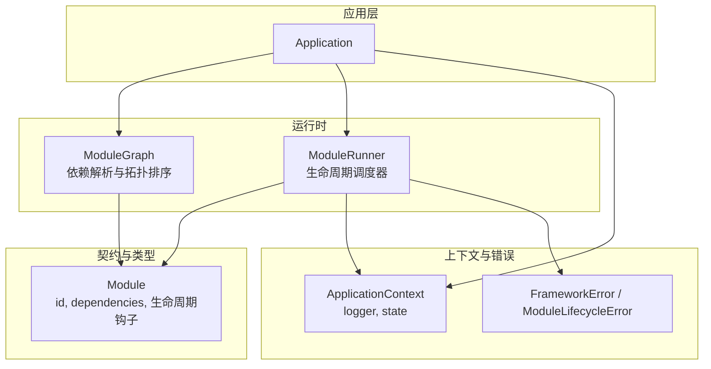
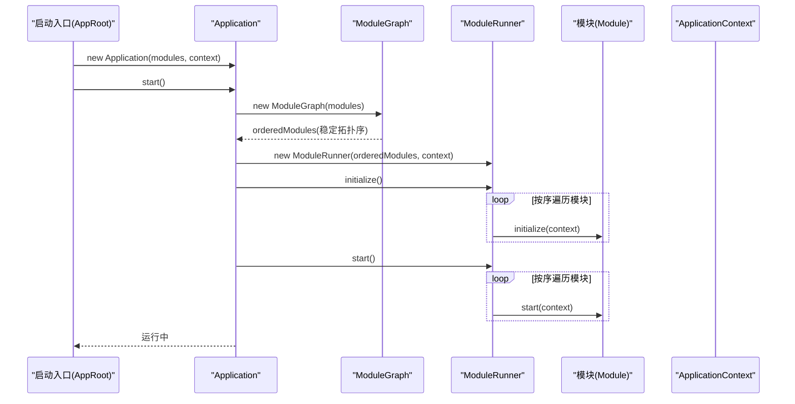
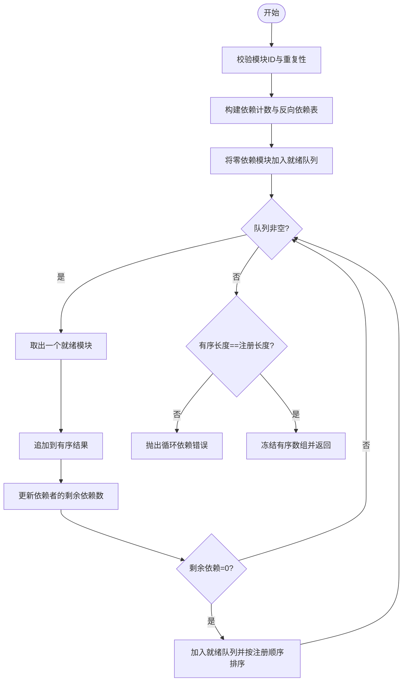
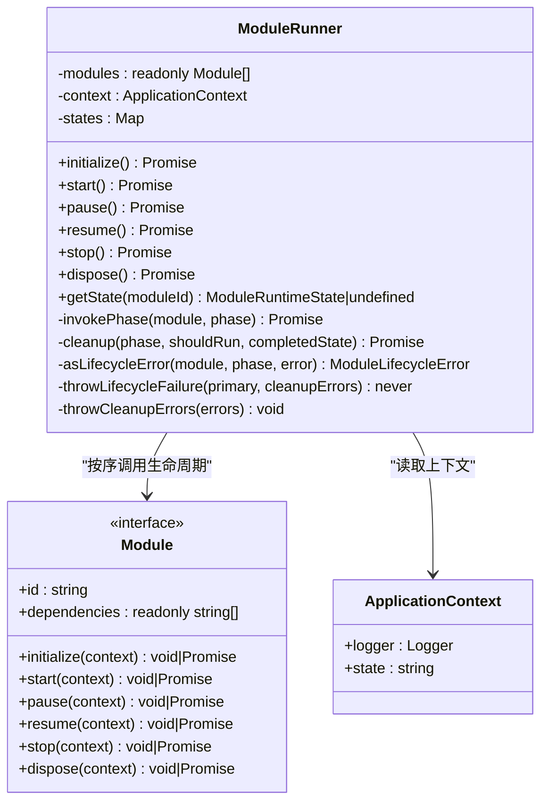
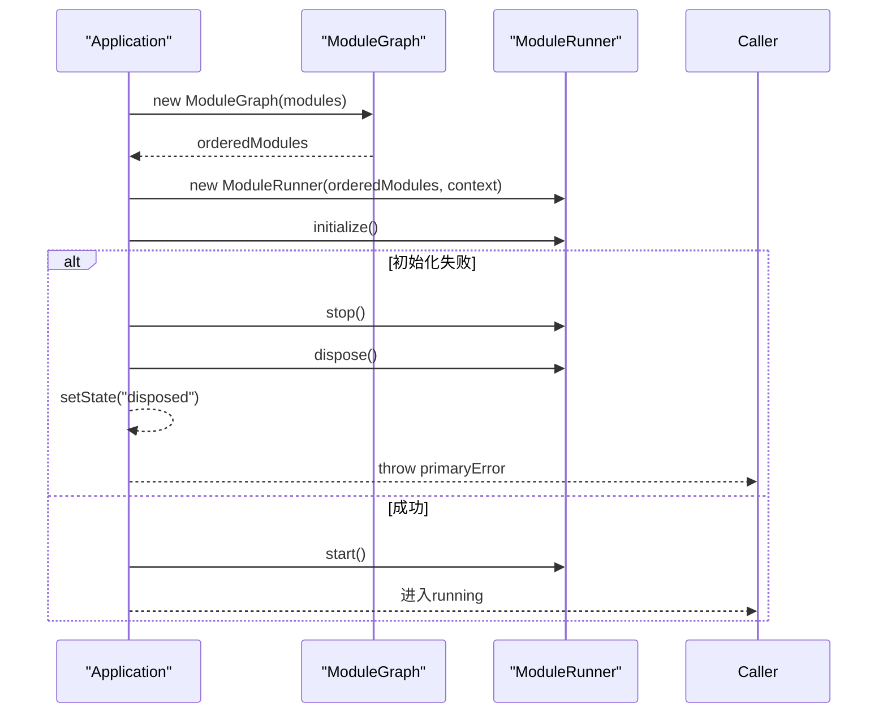
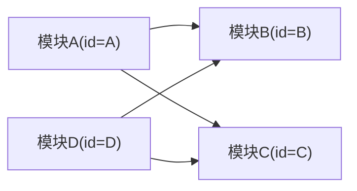

# 依赖注入机制

<cite>
**本文引用的文件**
- [ModuleGraph.ts](file://assets/framework/application/ModuleGraph.ts)
- [ModuleRunner.ts](file://assets/framework/application/ModuleRunner.ts)
- [Application.ts](file://assets/framework/application/Application.ts)
- [ApplicationContext.ts](file://assets/framework/application/ApplicationContext.ts)
- [ModuleLifecycleError.ts](file://assets/framework/application/ModuleLifecycleError.ts)
- [Module.ts](file://assets/framework/contracts/module/Module.ts)
- [FrameworkError.ts](file://assets/framework/core/errors/FrameworkError.ts)
- [index.ts](file://assets/framework/index.ts)
- [AppRoot.ts](file://assets/boot/AppRoot.ts)
- [module-graph.test.ts](file://tests/framework/foundation/module-graph.test.ts)
- [module-graph-validation.test.ts](file://tests/framework/foundation/module-graph-validation.test.ts)
- [module-runner.test.ts](file://tests/framework/foundation/module-runner.test.ts)
</cite>

## 目录
1. [简介](#简介)
2. [项目结构](#项目结构)
3. [核心组件](#核心组件)
4. [架构总览](#架构总览)
5. [详细组件分析](#详细组件分析)
6. [依赖关系分析](#依赖关系分析)
7. [性能与复杂度](#性能与复杂度)
8. [故障排查指南](#故障排查指南)
9. [结论](#结论)
10. [附录：最佳实践与示例](#附录最佳实践与示例)

## 简介
本文件围绕框架的依赖注入机制展开，重点解释 ModuleGraph 如何实现依赖解析与拓扑排序，确保模块按正确顺序初始化；说明依赖声明语法、循环依赖检测与错误处理；并通过测试用例展示如何声明模块依赖、处理复杂依赖关系与解决冲突。同时总结依赖注入的优势、松耦合设计原则以及常见问题的诊断与解决方案。

## 项目结构
与依赖注入相关的核心代码位于 assets/framework/application 与 contracts/module，配合 Application 作为入口编排生命周期，ModuleRunner 负责阶段化执行，ModuleGraph 负责依赖图构建与排序。

图表来源
- [Application.ts:10-67](file://assets/framework/application/Application.ts#L10-L67)
- [ModuleGraph.ts:3-85](file://assets/framework/application/ModuleGraph.ts#L3-L85)
- [ModuleRunner.ts:26-153](file://assets/framework/application/ModuleRunner.ts#L26-L153)
- [Module.ts:19-29](file://assets/framework/contracts/module/Module.ts#L19-L29)
- [ApplicationContext.ts:4-13](file://assets/framework/application/ApplicationContext.ts#L4-L13)
- [FrameworkError.ts:16-31](file://assets/framework/core/errors/FrameworkError.ts#L16-L31)
- [ModuleLifecycleError.ts:4-21](file://assets/framework/application/ModuleLifecycleError.ts#L4-L21)

章节来源
- [Application.ts:10-67](file://assets/framework/application/Application.ts#L10-L67)
- [ModuleGraph.ts:3-85](file://assets/framework/application/ModuleGraph.ts#L3-L85)
- [ModuleRunner.ts:26-153](file://assets/framework/application/ModuleRunner.ts#L26-L153)
- [Module.ts:19-29](file://assets/framework/contracts/module/Module.ts#L19-L29)
- [ApplicationContext.ts:4-13](file://assets/framework/application/ApplicationContext.ts#L4-L13)
- [FrameworkError.ts:16-31](file://assets/framework/core/errors/FrameworkError.ts#L16-L31)
- [ModuleLifecycleError.ts:4-21](file://assets/framework/application/ModuleLifecycleError.ts#L4-L21)

## 核心组件
- ModuleGraph：对模块集合进行注册校验、依赖计数、反向依赖构建与稳定拓扑排序，输出不可变有序数组 orderedModules。
- ModuleRunner：基于 ModuleGraph 输出的顺序，依次调用各模块的生命周期阶段（initialize/start/pause/resume/stop/dispose），并维护每个模块的运行时状态。
- Application：对外暴露 start/pause/resume/dispose 等应用级操作，内部组合 ModuleGraph 与 ModuleRunner，保证启动失败时的回滚与清理。
- ApplicationContext：为模块提供只读上下文（如 logger、state），不包含服务定位器，避免隐式耦合。
- Module：模块契约，包含 id、dependencies 与可选生命周期钩子。

章节来源
- [ModuleGraph.ts:3-85](file://assets/framework/application/ModuleGraph.ts#L3-L85)
- [ModuleRunner.ts:26-153](file://assets/framework/application/ModuleRunner.ts#L26-L153)
- [Application.ts:10-67](file://assets/framework/application/Application.ts#L10-L67)
- [ApplicationContext.ts:4-13](file://assets/framework/application/ApplicationContext.ts#L4-L13)
- [Module.ts:19-29](file://assets/framework/contracts/module/Module.ts#L19-L29)

## 架构总览
Application 在启动时创建 ModuleGraph，依据依赖关系生成稳定拓扑序，再交由 ModuleRunner 按序执行生命周期。ApplicationContext 贯穿整个流程，提供日志与只读状态。错误通过 FrameworkError 体系上报，模块级异常封装为 ModuleLifecycleError。

图表来源
- [Application.ts:28-67](file://assets/framework/application/Application.ts#L28-L67)
- [ModuleGraph.ts:3-85](file://assets/framework/application/ModuleGraph.ts#L3-L85)
- [ModuleRunner.ts:47-105](file://assets/framework/application/ModuleRunner.ts#L47-L105)
- [Module.ts:19-29](file://assets/framework/contracts/module/Module.ts#L19-L29)
- [ApplicationContext.ts:4-13](file://assets/framework/application/ApplicationContext.ts#L4-L13)

## 详细组件分析

### ModuleGraph：依赖解析与拓扑排序
- 输入校验：拒绝空 id、重复 id、缺失依赖。
- 依赖计数与反向依赖表：统计每个模块的未满足依赖数，并记录其依赖者列表。
- 稳定拓扑排序：使用队列收集“零依赖”模块，每次出队后减少依赖者的剩余依赖数；当剩余依赖数为 0 时入队，并按注册顺序排序以保证稳定性。
- 循环检测：若最终有序模块数量小于注册数量，则存在环。
- 输出：冻结 orderedModules，防止外部篡改。

图表来源
- [ModuleGraph.ts:6-84](file://assets/framework/application/ModuleGraph.ts#L6-L84)

章节来源
- [ModuleGraph.ts:6-84](file://assets/framework/application/ModuleGraph.ts#L6-L84)

### ModuleRunner：生命周期调度与清理
- 状态机：维护每个模块的运行态（registered/initialized/started/paused/stopped/disposed）。
- 阶段执行：按 ModuleGraph 的顺序调用 initialize、start；暂停/恢复按逆序/正序调用 pause/resume；停止/销毁按逆序调用 stop/dispose。
- 错误隔离：单个模块阶段失败会触发已运行阶段的逆向清理，并聚合清理错误，抛出 ModuleCleanupError 或 ModuleLifecycleError。
- 幂等性：跳过已完成阶段的再次调用。

图表来源
- [ModuleRunner.ts:26-241](file://assets/framework/application/ModuleRunner.ts#L26-L241)
- [Module.ts:19-29](file://assets/framework/contracts/module/Module.ts#L19-L29)
- [ApplicationContext.ts:4-13](file://assets/framework/application/ApplicationContext.ts#L4-L13)

章节来源
- [ModuleRunner.ts:26-241](file://assets/framework/application/ModuleRunner.ts#L26-L241)

### Application：编排与回滚
- 启动流程：构造 ModuleGraph -> 构造 ModuleRunner -> 依次 initialize/start -> 进入 running。
- 失败回滚：启动阶段捕获异常，调用 runner.stop()/runner.dispose() 进行清理，然后置为 disposed 并抛出主异常。
- 生命周期保护：通过状态检查与队列串行化，避免并发与非法状态转换。

图表来源
- [Application.ts:28-67](file://assets/framework/application/Application.ts#L28-L67)
- [Application.ts:99-132](file://assets/framework/application/Application.ts#L99-L132)

章节来源
- [Application.ts:28-67](file://assets/framework/application/Application.ts#L28-L67)
- [Application.ts:99-132](file://assets/framework/application/Application.ts#L99-L132)

### ApplicationContext：只读上下文
- 仅提供 logger 与只读 state，不暴露服务定位器或应用实例引用，强制通过依赖声明获取所需能力，降低隐式耦合。

章节来源
- [ApplicationContext.ts:4-13](file://assets/framework/application/ApplicationContext.ts#L4-L13)

### Module：依赖声明语法
- id：模块唯一标识，不能为空且必须全局唯一。
- dependencies：字符串数组，表示该模块依赖的其他模块 id。
- 生命周期钩子：可选实现 initialize/start/pause/resume/stop/dispose，由 ModuleRunner 按序调用。

章节来源
- [Module.ts:19-29](file://assets/framework/contracts/module/Module.ts#L19-L29)

## 依赖关系分析
- 低耦合：模块之间仅通过 id 声明依赖，不直接引用彼此实现，便于替换与测试。
- 可组合：通过 createModules 组装模块集合，Application 统一编排。
- 可扩展：新增模块只需声明依赖，无需修改其他模块。

[此图为概念示意，不映射具体源码]

章节来源
- [AppRoot.ts:19-27](file://assets/boot/AppRoot.ts#L19-L27)
- [index.ts:14-18](file://assets/framework/index.ts#L14-L18)

## 性能与复杂度
- 时间复杂度：
  - 依赖计数与反向依赖构建：O(N + E)，N 为模块数，E 为依赖边数。
  - 拓扑排序：O(N + E)，每个模块与依赖边访问一次。
  - 稳定排序：在每轮就绪模块入队时按注册索引排序，最坏 O(N log N)。
- 空间复杂度：O(N + E)，存储 modulesById、dependencyCount、dependents、registrationIndex 等。
- 稳定性：通过 registrationIndex 保证无依赖关系的模块保持注册顺序，提升确定性。

章节来源
- [ModuleGraph.ts:11-77](file://assets/framework/application/ModuleGraph.ts#L11-L77)

## 故障排查指南
- 空 id 或重复 id：
  - 现象：构造 ModuleGraph 即抛错。
  - 排查：检查模块 id 是否唯一且非空。
  - 参考：[ModuleGraph.ts:12-22](file://assets/framework/application/ModuleGraph.ts#L12-L22)
- 缺失依赖：
  - 现象：构造 ModuleGraph 抛错，提示缺少某模块 id。
  - 排查：确认被依赖模块已注册。
  - 参考：[ModuleGraph.ts:32-46](file://assets/framework/application/ModuleGraph.ts#L32-L46)
- 循环依赖：
  - 现象：构造 ModuleGraph 抛错，提示存在环。
  - 排查：梳理依赖链，拆分职责或使用事件/接口解耦。
  - 参考：[ModuleGraph.ts:79-81](file://assets/framework/application/ModuleGraph.ts#L79-L81)
- 生命周期阶段失败：
  - 现象：ModuleRunner 抛出 ModuleLifecycleError 或 ModuleCleanupError。
  - 排查：查看对应模块的阶段实现与日志；注意清理阶段可能产生多个错误。
  - 参考：[ModuleRunner.ts:155-186](file://assets/framework/application/ModuleRunner.ts#L155-L186), [ModuleLifecycleError.ts:4-21](file://assets/framework/application/ModuleLifecycleError.ts#L4-L21)
- 启动失败回滚：
  - 现象：Application.start 失败后进入 stopped/disposed 状态。
  - 排查：检查 initialize/start 阶段错误与清理日志。
  - 参考：[Application.ts:49-54](file://assets/framework/application/Application.ts#L49-L54)

章节来源
- [ModuleGraph.ts:12-22](file://assets/framework/application/ModuleGraph.ts#L12-L22)
- [ModuleGraph.ts:32-46](file://assets/framework/application/ModuleGraph.ts#L32-L46)
- [ModuleGraph.ts:79-81](file://assets/framework/application/ModuleGraph.ts#L79-L81)
- [ModuleRunner.ts:155-186](file://assets/framework/application/ModuleRunner.ts#L155-L186)
- [ModuleLifecycleError.ts:4-21](file://assets/framework/application/ModuleLifecycleError.ts#L4-L21)
- [Application.ts:49-54](file://assets/framework/application/Application.ts#L49-L54)

## 结论
该依赖注入机制以 ModuleGraph 的稳定拓扑排序为核心，结合 ModuleRunner 的严格生命周期调度，实现了高内聚、低耦合的模块化架构。通过严格的依赖声明与错误处理，系统具备可预测的初始化顺序与健壮的错误恢复能力。遵循“显式依赖、最小上下文、逆序清理”的原则，可有效避免循环依赖与服务定位器反模式，提升可测试性与可维护性。

## 附录：最佳实践与示例

- 依赖声明语法
  - 每个模块需提供唯一 id 与 dependencies 数组。
  - 示例路径：[module-graph.test.ts:26-31](file://tests/framework/foundation/module-graph.test.ts#L26-L31)
- 复杂依赖关系
  - 分支依赖与多依赖场景下，ModuleGraph 保证依赖先于依赖者初始化，并保持注册顺序的稳定性。
  - 示例路径：[module-graph.test.ts:66-102](file://tests/framework/foundation/module-graph.test.ts#L66-L102)
- 依赖冲突与循环检测
  - 空 id、重复 id、缺失依赖、自依赖与多模块环均会被拒绝。
  - 示例路径：[module-graph-validation.test.ts:40-75](file://tests/framework/foundation/module-graph-validation.test.ts#L40-L75)
- 生命周期顺序验证
  - initialize/start 按依赖顺序执行；stop/dispose 按逆序执行；幂等调用不会重复执行。
  - 示例路径：[module-runner.test.ts:69-145](file://tests/framework/foundation/module-runner.test.ts#L69-L145)
- 松耦合设计建议
  - 通过 Module.dependencies 显式声明依赖，避免在模块间直接引用实现。
  - 使用 ApplicationContext 提供的 logger 等能力，而非全局单例或服务定位器。
  - 将易变逻辑抽象为接口，通过依赖注入替换实现，便于测试与扩展。
- 常见依赖问题诊断
  - 若出现“模块依赖缺失”，检查是否遗漏注册被依赖模块。
  - 若出现“循环依赖”，考虑拆分模块或引入事件通道解耦。
  - 若生命周期失败，优先查看对应模块的阶段实现与日志，关注清理阶段是否产生连锁错误。

章节来源
- [module-graph.test.ts:26-31](file://tests/framework/foundation/module-graph.test.ts#L26-L31)
- [module-graph.test.ts:66-102](file://tests/framework/foundation/module-graph.test.ts#L66-L102)
- [module-graph-validation.test.ts:40-75](file://tests/framework/foundation/module-graph-validation.test.ts#L40-L75)
- [module-runner.test.ts:69-145](file://tests/framework/foundation/module-runner.test.ts#L69-L145)
- [AppRoot.ts:19-27](file://assets/boot/AppRoot.ts#L19-L27)
- [index.ts:14-18](file://assets/framework/index.ts#L14-L18)