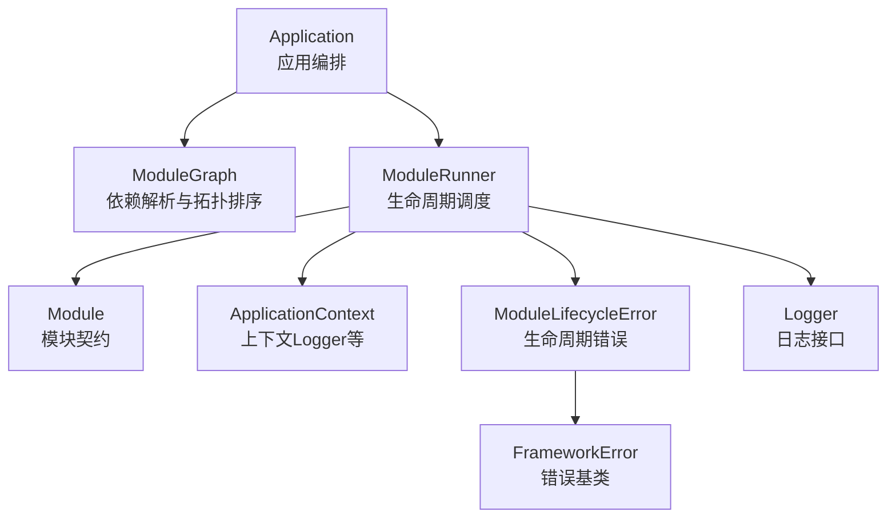
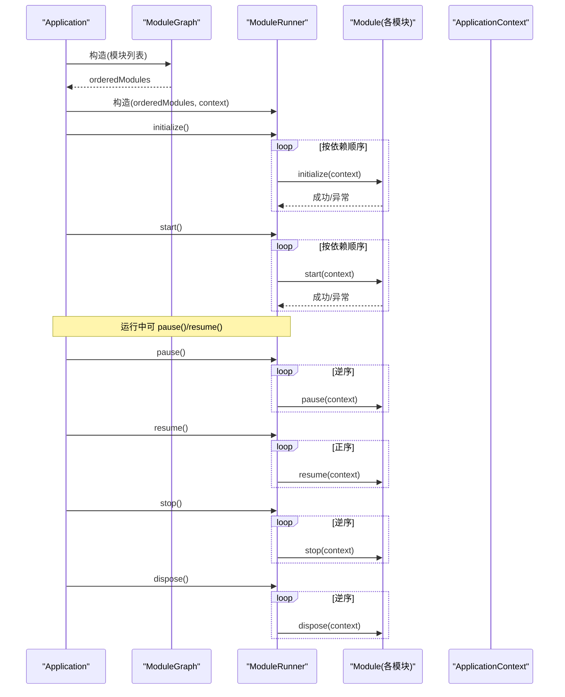
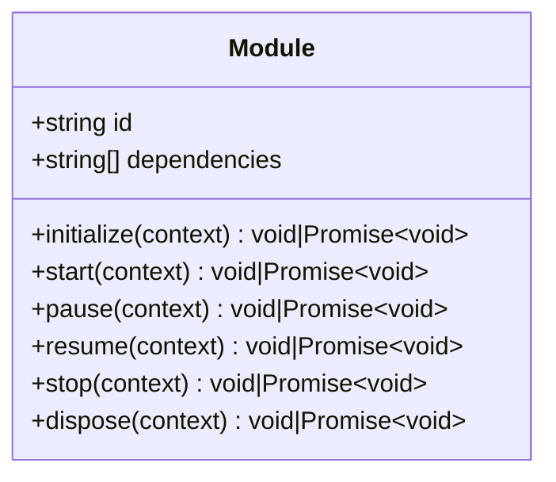
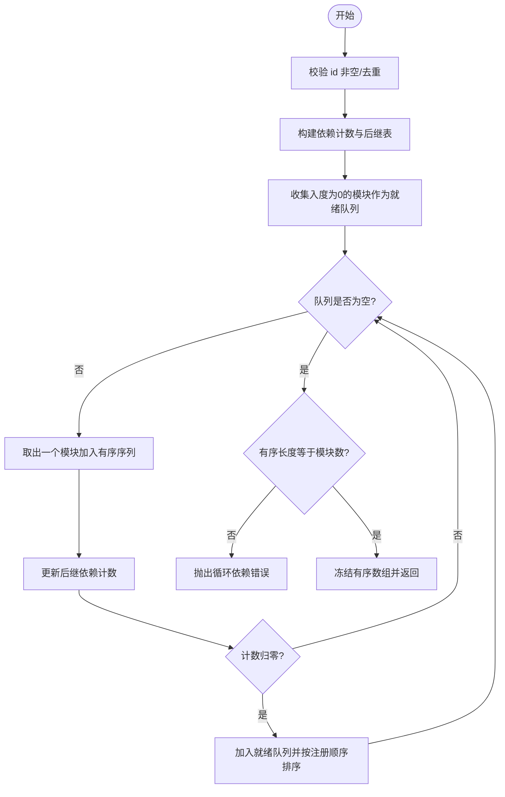
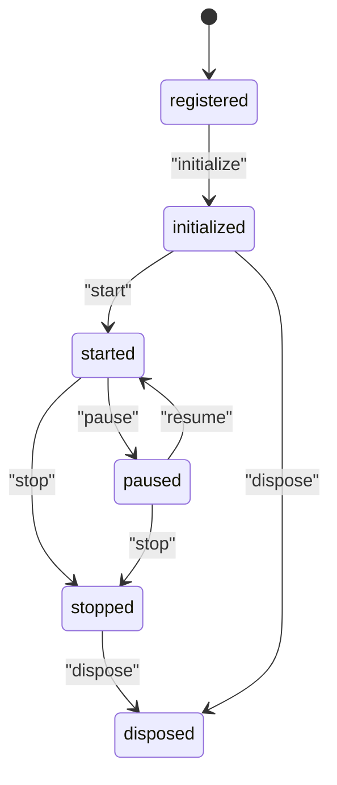
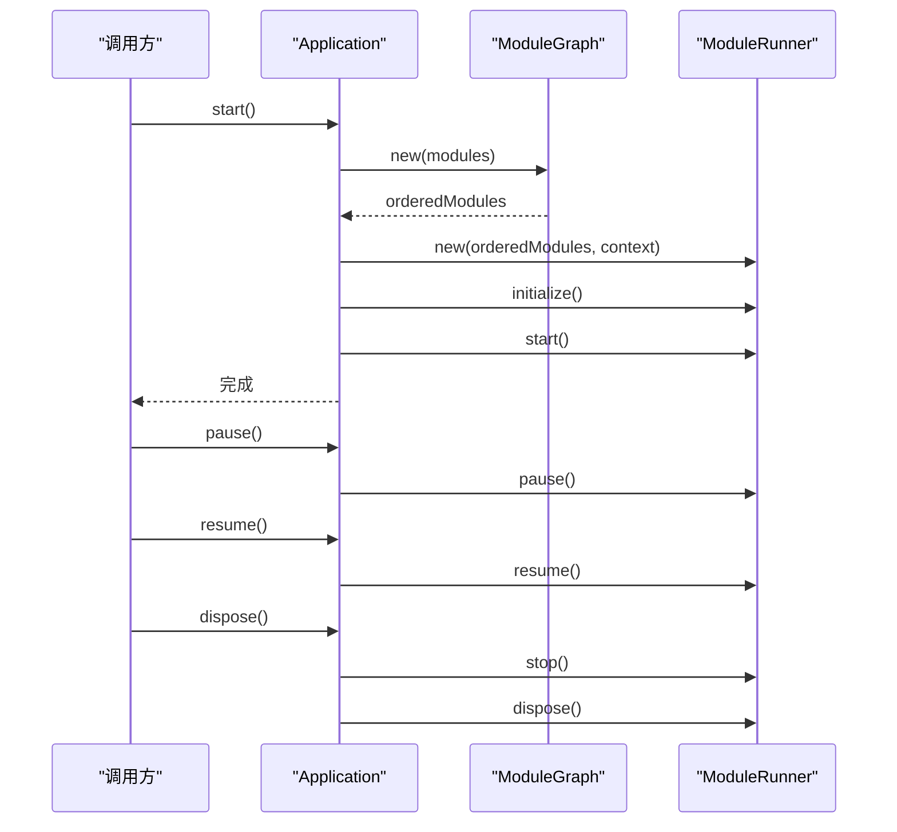
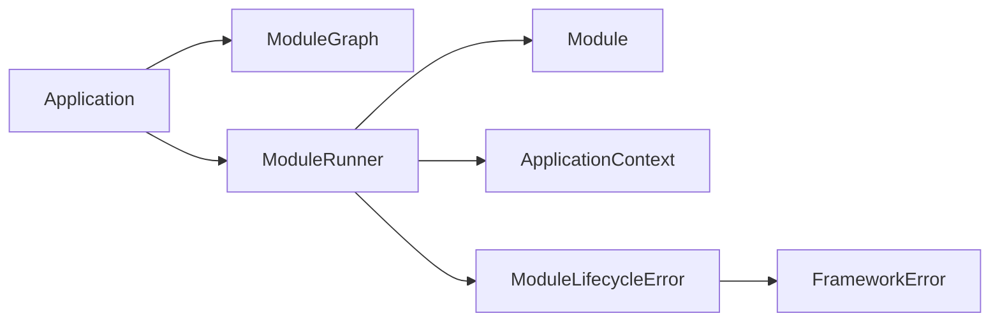

# 模块化架构

<cite>
**本文引用的文件**   
- [Module.ts](file://assets/framework/contracts/module/Module.ts)
- [ModuleGraph.ts](file://assets/framework/application/ModuleGraph.ts)
- [ModuleRunner.ts](file://assets/framework/application/ModuleRunner.ts)
- [Application.ts](file://assets/framework/application/Application.ts)
- [ApplicationContext.ts](file://assets/framework/application/ApplicationContext.ts)
- [ModuleLifecycleError.ts](file://assets/framework/application/ModuleLifecycleError.ts)
- [FrameworkError.ts](file://assets/framework/core/errors/FrameworkError.ts)
- [Logger.ts](file://assets/framework/contracts/logging/Logger.ts)
- [index.ts](file://assets/framework/index.ts)
- [module-contract.test.ts](file://tests/framework/foundation/module-contract.test.ts)
- [module-graph.test.ts](file://tests/framework/foundation/module-graph.test.ts)
- [module-runner.test.ts](file://tests/framework/foundation/module-runner.test.ts)
- [module-runner-start-failure.test.ts](file://tests/framework/foundation/module-runner-start-failure.test.ts)
- [application-lifecycle.test.ts](file://tests/framework/foundation/application-lifecycle.test.ts)
</cite>

## 目录
1. [引言](#引言)
2. [项目结构](#项目结构)
3. [核心组件](#核心组件)
4. [架构总览](#架构总览)
5. [详细组件分析](#详细组件分析)
6. [依赖关系分析](#依赖关系分析)
7. [性能考量](#性能考量)
8. [故障排查指南](#故障排查指南)
9. [结论](#结论)
10. [附录](#附录)

## 引言
本文件系统化阐述 AI Game Kit 的模块化架构，重点围绕 Module 接口、模块生命周期阶段（initialize、start、pause、resume、stop、dispose）、运行时状态管理、依赖注入与解析（ModuleGraph 拓扑排序），以及执行协调器（ModuleRunner）的工作原理。文档从基础使用到高级特性逐步展开，并配合图示与测试用例路径，帮助读者快速掌握如何定义模块、声明依赖、实现生命周期方法，以及在实际项目中遵循最佳实践。

## 项目结构
框架采用“契约优先”的设计：模块通过纯类型契约（interface）进行组合，而非继承或单例。应用层由 Application 编排 ModuleGraph 与 ModuleRunner，完成依赖解析与生命周期调度。关键目录与职责如下：
- contracts/module: 模块契约（Module、ModulePhase、ModuleRuntimeState）
- application: 应用编排（Application）、依赖图（ModuleGraph）、运行器（ModuleRunner）、错误封装（ModuleLifecycleError）
- core/errors: 统一错误基类（FrameworkError）
- contracts/logging: 日志抽象（Logger）
- index.ts: 对外暴露的类型与类

图表来源
- [Application.ts](file://assets/framework/application/Application.ts)
- [ModuleGraph.ts](file://assets/framework/application/ModuleGraph.ts)
- [ModuleRunner.ts](file://assets/framework/application/ModuleRunner.ts)
- [Module.ts](file://assets/framework/contracts/module/Module.ts)
- [ApplicationContext.ts](file://assets/framework/application/ApplicationContext.ts)
- [ModuleLifecycleError.ts](file://assets/framework/application/ModuleLifecycleError.ts)
- [FrameworkError.ts](file://assets/framework/core/errors/FrameworkError.ts)
- [Logger.ts](file://assets/framework/contracts/logging/Logger.ts)

章节来源
- [index.ts](file://assets/framework/index.ts)

## 核心组件
- Module 接口：以 id 唯一标识模块，dependencies 声明字符串依赖；生命周期钩子可选且支持同步/异步。
- ModuleGraph：对模块集合进行依赖校验、去重、环检测，输出稳定拓扑序。
- ModuleRunner：按依赖顺序调用 initialize/start，按逆序调用 stop/dispose；维护每个模块的运行时状态；失败时执行回滚清理。
- Application：对外入口，负责状态机转换（created→initializing→running→paused→stopping→disposed），串联 ModuleGraph 与 ModuleRunner。
- ApplicationContext：向模块注入只读上下文（如 Logger）。
- 错误体系：ModuleLifecycleError、ModuleCleanupError、FrameworkError 提供结构化错误信息。

章节来源
- [Module.ts](file://assets/framework/contracts/module/Module.ts)
- [ModuleGraph.ts](file://assets/framework/application/ModuleGraph.ts)
- [ModuleRunner.ts](file://assets/framework/application/ModuleRunner.ts)
- [Application.ts](file://assets/framework/application/Application.ts)
- [ApplicationContext.ts](file://assets/framework/application/ApplicationContext.ts)
- [ModuleLifecycleError.ts](file://assets/framework/application/ModuleLifecycleError.ts)
- [FrameworkError.ts](file://assets/framework/core/errors/FrameworkError.ts)

## 架构总览
下图展示从 Application 启动到模块生命周期调用的整体流程，包括依赖解析、正向初始化、启动、暂停/恢复、停止/销毁及错误回滚。

图表来源
- [Application.ts](file://assets/framework/application/Application.ts)
- [ModuleGraph.ts](file://assets/framework/application/ModuleGraph.ts)
- [ModuleRunner.ts](file://assets/framework/application/ModuleRunner.ts)
- [Module.ts](file://assets/framework/contracts/module/Module.ts)
- [ApplicationContext.ts](file://assets/framework/application/ApplicationContext.ts)

## 详细组件分析

### Module 接口与生命周期
- id：模块唯一标识（字符串）
- dependencies：依赖的模块 id 列表
- 生命周期钩子：initialize、start、pause、resume、stop、dispose，均接收 ApplicationContext，返回 void 或 Promise<void]
- 设计要点：
  - 所有钩子可选，便于最小化实现
  - 支持同步与异步，统一由 Runner await
  - 仅通过类型契约组合，无运行时侵入

章节来源
- [Module.ts](file://assets/framework/contracts/module/Module.ts)
- [module-contract.test.ts](file://tests/framework/foundation/module-contract.test.ts)

#### 类图（Module 相关）

图表来源
- [Module.ts](file://assets/framework/contracts/module/Module.ts)

### ModuleGraph：依赖解析与拓扑排序
- 输入：模块数组（含 id 与 dependencies）
- 处理：
  - 校验 id 非空、无重复
  - 校验依赖存在性
  - 构建依赖计数与后继表
  - 基于入度为 0 的队列进行拓扑排序，保持注册顺序稳定性
  - 若有序结果数量不等于模块数，判定存在环并抛出错误
- 输出：orderedModules（冻结数组）

图表来源
- [ModuleGraph.ts](file://assets/framework/application/ModuleGraph.ts)

章节来源
- [ModuleGraph.ts](file://assets/framework/application/ModuleGraph.ts)
- [module-graph.test.ts](file://tests/framework/foundation/module-graph.test.ts)

### ModuleRunner：生命周期调度与状态管理
- 状态机：registered → initialized → started → paused → stopped → disposed
- 正向阶段：
  - initialize：按依赖顺序调用，成功后置状态为 initialized
  - start：按依赖顺序调用，成功后置状态为 started
- 反向清理：
  - stop：逆序调用已处于 started/paused 的模块
  - dispose：逆序调用已处于 initialized/started/paused/stopped 的模块
- 错误与回滚：
  - 任一阶段抛错会记录 ModuleLifecycleError
  - start 失败时先 stop 已启动模块，再 dispose 已初始化模块
  - 聚合清理错误为 ModuleCleanupError
- 并发安全：
  - 同一阶段不会重复执行已完成状态的模块

图表来源
- [ModuleRunner.ts](file://assets/framework/application/ModuleRunner.ts)

章节来源
- [ModuleRunner.ts](file://assets/framework/application/ModuleRunner.ts)
- [module-runner.test.ts](file://tests/framework/foundation/module-runner.test.ts)
- [module-runner-start-failure.test.ts](file://tests/framework/foundation/module-runner-start-failure.test.ts)

### Application：应用编排与状态机
- 对外状态：created → initializing → running → paused → stopping → disposed
- 启动流程：
  - 构造 ModuleGraph 获取 orderedModules
  - 构造 ModuleRunner 并依次调用 initialize/start
  - 失败时进入 stopping 并执行 rollback（stop/dispose）
- 运行期：
  - pause/resume 分别触发逆序/正序的生命周期钩子
- 退出：
  - dispose 调用 runner.stop 与 runner.dispose，捕获并上报清理错误

图表来源
- [Application.ts](file://assets/framework/application/Application.ts)
- [ModuleGraph.ts](file://assets/framework/application/ModuleGraph.ts)
- [ModuleRunner.ts](file://assets/framework/application/ModuleRunner.ts)

章节来源
- [Application.ts](file://assets/framework/application/Application.ts)
- [application-lifecycle.test.ts](file://tests/framework/foundation/application-lifecycle.test.ts)

### ApplicationContext：上下文注入
- 当前实现提供 logger 与 state 字段（只读）
- 模块通过该上下文访问日志能力，避免直接耦合平台细节

章节来源
- [ApplicationContext.ts](file://assets/framework/application/ApplicationContext.ts)
- [Logger.ts](file://assets/framework/contracts/logging/Logger.ts)

### 错误体系
- FrameworkError：统一错误基类，支持 cause、moduleId、phase、component、recoverable 等元数据
- ModuleLifecycleError：封装模块生命周期阶段的失败，包含 moduleId 与 phase
- ModuleCleanupError：聚合多个清理阶段的失败，保留主因与全部清理错误

章节来源
- [FrameworkError.ts](file://assets/framework/core/errors/FrameworkError.ts)
- [ModuleLifecycleError.ts](file://assets/framework/application/ModuleLifecycleError.ts)
- [ModuleRunner.ts](file://assets/framework/application/ModuleRunner.ts)

## 依赖关系分析
- Application 依赖 ModuleGraph 与 ModuleRunner
- ModuleRunner 依赖 Module 契约与 ApplicationContext
- ModuleGraph 仅依赖 Module 契约
- 错误体系贯穿 ModuleRunner 与 Application

图表来源
- [Application.ts](file://assets/framework/application/Application.ts)
- [ModuleGraph.ts](file://assets/framework/application/ModuleGraph.ts)
- [ModuleRunner.ts](file://assets/framework/application/ModuleRunner.ts)
- [Module.ts](file://assets/framework/contracts/module/Module.ts)
- [ApplicationContext.ts](file://assets/framework/application/ApplicationContext.ts)
- [ModuleLifecycleError.ts](file://assets/framework/application/ModuleLifecycleError.ts)
- [FrameworkError.ts](file://assets/framework/core/errors/FrameworkError.ts)

章节来源
- [index.ts](file://assets/framework/index.ts)

## 性能考量
- 拓扑排序时间复杂度 O(V+E)，V 为模块数，E 为依赖边数；空间复杂度 O(V+E)
- 生命周期调用均为线性遍历，避免不必要的对象创建
- 冻结有序数组减少意外修改开销
- 建议：
  - 合理拆分模块粒度，避免过深依赖链
  - 将 I/O 密集操作放入异步钩子，避免阻塞主线程
  - 在 initialize 中做轻量准备，重型资源加载可在 start 中按需延迟

[本节为通用指导，不直接分析具体文件]

## 故障排查指南
- 常见错误
  - 循环依赖：ModuleGraph 构造时抛出循环依赖错误
  - 缺失依赖：ModuleGraph 构造时检查依赖是否存在
  - 生命周期失败：ModuleLifecycleError 携带 moduleId 与 phase
  - 清理失败：ModuleCleanupError 聚合多个清理错误
- 定位步骤
  - 查看日志输出（context.logger.error/info）
  - 检查模块 id 是否唯一且依赖声明正确
  - 确认生命周期钩子是否抛出未捕获异常
  - 在 start 失败场景下，关注 stop/dispose 的回滚顺序与错误聚合

章节来源
- [ModuleGraph.ts](file://assets/framework/application/ModuleGraph.ts)
- [ModuleRunner.ts](file://assets/framework/application/ModuleRunner.ts)
- [ModuleLifecycleError.ts](file://assets/framework/application/ModuleLifecycleError.ts)
- [FrameworkError.ts](file://assets/framework/core/errors/FrameworkError.ts)
- [module-runner-start-failure.test.ts](file://tests/framework/foundation/module-runner-start-failure.test.ts)

## 结论
AI Game Kit 的模块化架构以契约为核心，通过 ModuleGraph 的稳定拓扑排序与 ModuleRunner 的状态机驱动，实现了高内聚、低耦合的可插拔系统。Application 作为编排者，确保生命周期一致性与错误回滚语义。该设计既满足游戏引擎对性能与可控性的要求，也为扩展与维护提供了清晰的边界与约定。

[本节为总结，不直接分析具体文件]

## 附录

### 如何定义模块与声明依赖（示例路径）
- 最小模块（仅元数据）：参考测试中的“metadata-only”模块
- 同步生命周期模块：参考测试中的“synchronous”模块
- 异步生命周期模块：参考测试中的“asynchronous”模块
- 依赖链与分支依赖：参考 module-graph.test.ts 中的用例

章节来源
- [module-contract.test.ts](file://tests/framework/foundation/module-contract.test.ts)
- [module-graph.test.ts](file://tests/framework/foundation/module-graph.test.ts)

### 最佳实践
- 使用稳定的字符串 id 标识模块，避免运行时反射
- 仅在 dependencies 中声明必要依赖，保持依赖图清晰
- 将副作用与 I/O 放在异步钩子中，保证可预测的执行顺序
- 在 initialize 中完成不可逆的资源分配前，做好失败回滚准备
- 利用 ApplicationContext.logger 输出结构化日志，便于问题定位

[本节为通用指导，不直接分析具体文件]