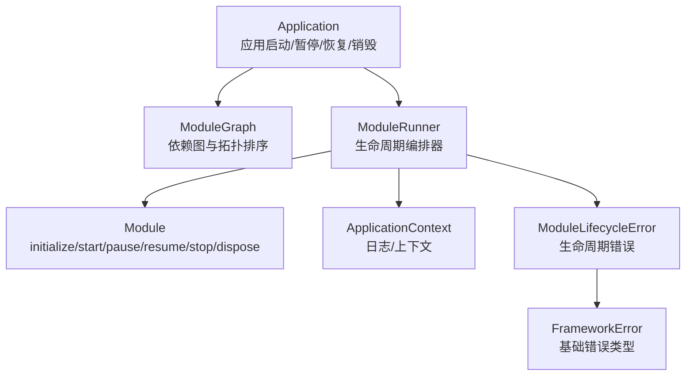
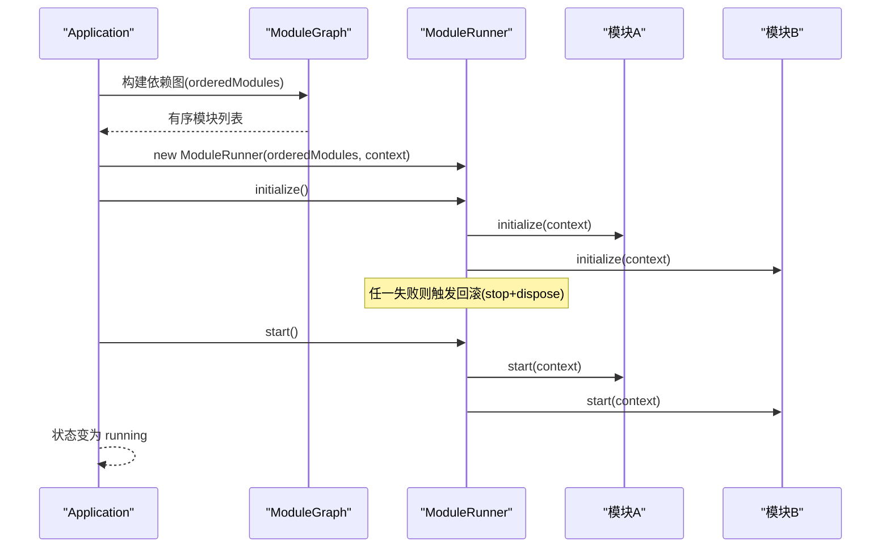
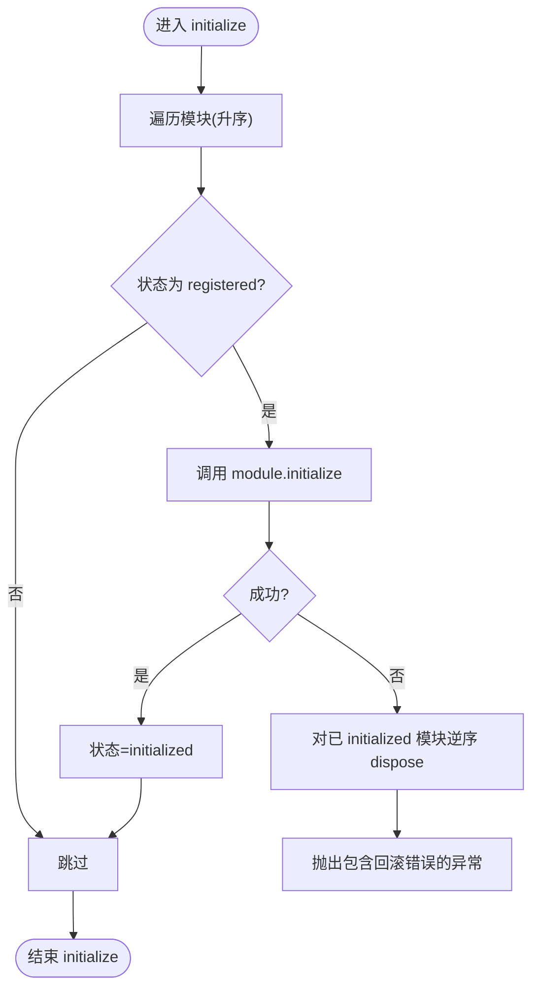
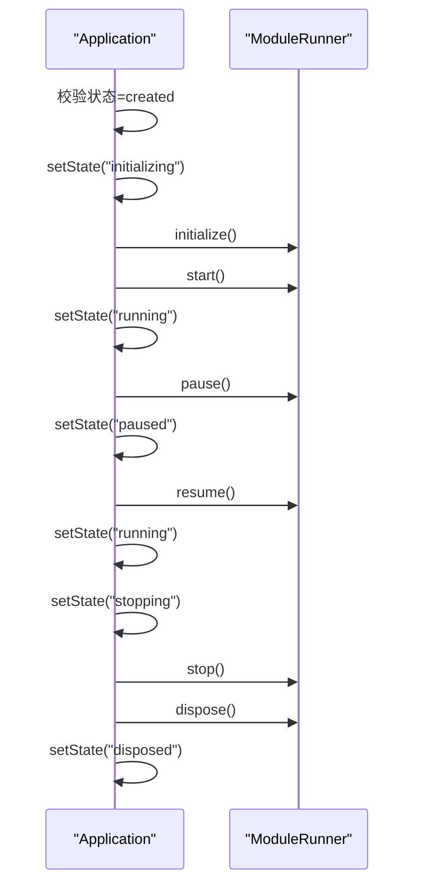
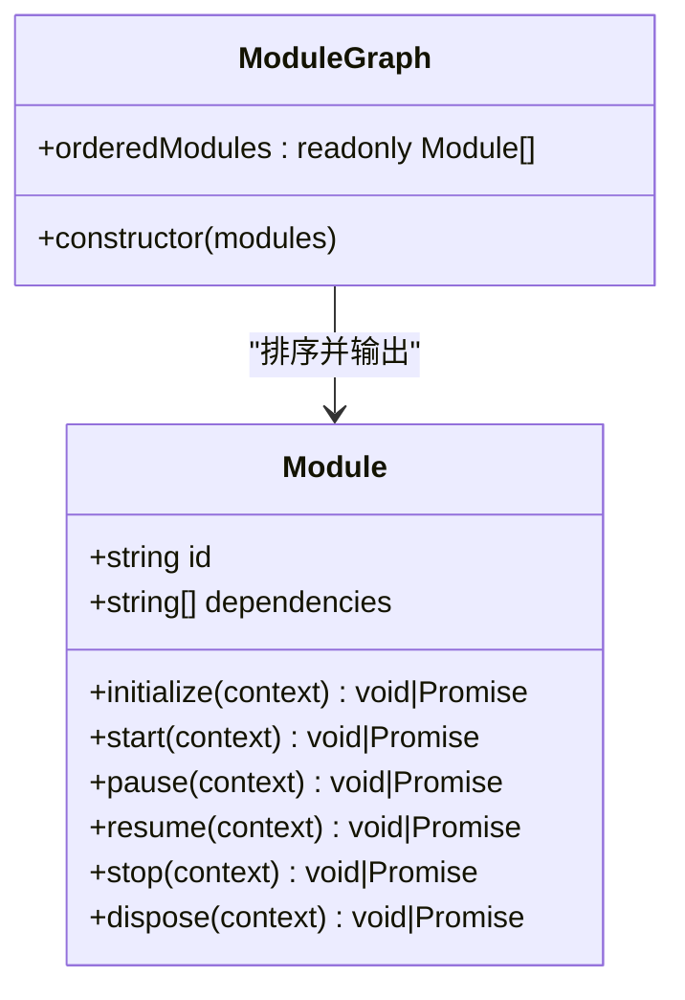
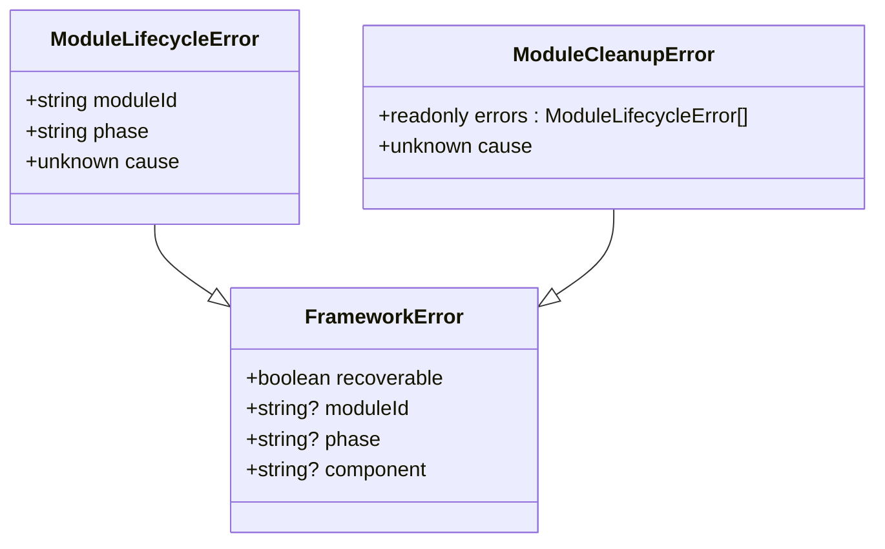
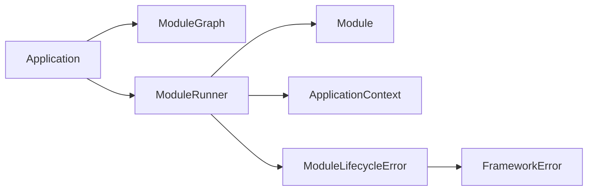

# 模块生命周期管理

<cite>
**本文引用的文件**   
- [ModuleRunner.ts](file://assets/framework/application/ModuleRunner.ts)
- [Module.ts](file://assets/framework/contracts/module/Module.ts)
- [Application.ts](file://assets/framework/application/Application.ts)
- [ModuleLifecycleError.ts](file://assets/framework/application/ModuleLifecycleError.ts)
- [FrameworkError.ts](file://assets/framework/core/errors/FrameworkError.ts)
- [ModuleGraph.ts](file://assets/framework/application/ModuleGraph.ts)
- [ApplicationContext.ts](file://assets/framework/application/ApplicationContext.ts)
- [module-runner.test.ts](file://tests/framework/foundation/module-runner.test.ts)
- [application-lifecycle.test.ts](file://tests/framework/foundation/application-lifecycle.test.ts)
- [module-runner-pause-resume.test.ts](file://tests/framework/foundation/module-runner-pause-resume.test.ts)
- [module-runner-initialize-failure.test.ts](file://tests/framework/foundation/module-runner-initialize-failure.test.ts)
- [module-runner-start-failure.test.ts](file://tests/framework/foundation/module-runner-start-failure.test.ts)
- [module-runner-cleanup-failure.test.ts](file://tests/framework/foundation/module-runner-cleanup-failure.test.ts)
</cite>

## 目录
1. [简介](#简介)
2. [项目结构](#项目结构)
3. [核心组件](#核心组件)
4. [架构总览](#架构总览)
5. [详细组件分析](#详细组件分析)
6. [依赖关系分析](#依赖关系分析)
7. [性能考量](#性能考量)
8. [故障排查指南](#故障排查指南)
9. [结论](#结论)
10. [附录：最佳实践与常见问题](#附录最佳实践与常见问题)

## 简介
本文件围绕框架的模块生命周期管理机制展开，重点解释 ModuleRunner 如何协调各模块在 initialize、start、pause、resume、stop、dispose 等阶段的执行时机与状态转换。文档同时覆盖错误处理、状态回滚、资源泄漏防护机制，并给出在不同阶段进行初始化、资源管理与清理操作的最佳实践和常见问题解决方案。

## 项目结构
与模块生命周期相关的核心代码位于 assets/framework/application 与 contracts/module 目录下，测试用例位于 tests/framework/foundation。关键文件包括：
- ModuleRunner：生命周期编排器，负责按依赖顺序调用模块钩子、维护运行时状态、异常回滚与清理。
- Module：模块契约，定义 id、dependencies 与各生命周期钩子。
- Application：应用级入口，负责构建依赖图、创建 ModuleRunner、编排 start/pause/resume/dispose 流程与全局状态切换。
- ModuleGraph：依赖图构建与拓扑排序，确保初始化顺序与循环依赖检测。
- ModuleLifecycleError / FrameworkError：统一错误模型，便于诊断与恢复策略判断。
- ApplicationContext：注入到模块钩子的上下文（如日志）。

**图表来源** 
- [Application.ts:10-67](file://assets/framework/application/Application.ts#L10-L67)
- [ModuleGraph.ts:3-84](file://assets/framework/application/ModuleGraph.ts#L3-L84)
- [ModuleRunner.ts:26-153](file://assets/framework/application/ModuleRunner.ts#L26-L153)
- [Module.ts:19-29](file://assets/framework/contracts/module/Module.ts#L19-L29)
- [ModuleLifecycleError.ts:4-21](file://assets/framework/application/ModuleLifecycleError.ts#L4-L21)
- [FrameworkError.ts:16-31](file://assets/framework/core/errors/FrameworkError.ts#L16-L31)

**章节来源**
- [Application.ts:10-168](file://assets/framework/application/Application.ts#L10-L168)
- [ModuleRunner.ts:26-242](file://assets/framework/application/ModuleRunner.ts#L26-L242)
- [Module.ts:1-30](file://assets/framework/contracts/module/Module.ts#L1-L30)
- [ModuleGraph.ts:1-86](file://assets/framework/application/ModuleGraph.ts#L1-L86)

## 核心组件
- ModuleRunner
  - 职责：按依赖顺序调用模块生命周期钩子；维护每个模块的运行态；失败时执行安全回滚与清理；统一记录与抛出生命周期错误。
  - 关键点：
    - 状态机：registered → initialized → started → paused → stopped → disposed
    - 正向流程：initialize（升序）→ start（升序）
    - 反向清理：stop（降序）→ dispose（降序）
    - 暂停/恢复：pause（降序）→ resume（升序）
    - 异常路径：在 initialize/start 失败时分别触发 stop + dispose 回滚，保证已运行模块被正确释放。
- Module
  - 职责：声明 id、dependencies 以及可选的生命周期钩子。
  - 关键点：钩子可返回 Promise，支持异步初始化与资源准备。
- Application
  - 职责：构建依赖图、创建 ModuleRunner、编排应用级生命周期（start/pause/resume/dispose），并在失败时执行回滚。
- ModuleGraph
  - 职责：校验模块 id 唯一性、依赖存在性、检测循环依赖，输出拓扑有序模块列表。
- 错误体系
  - ModuleLifecycleError：携带 moduleId、phase、cause，用于定位具体模块与阶段。
  - FrameworkError：基础错误基类，提供 recoverable 标记与结构化字段。

**章节来源**
- [ModuleRunner.ts:26-242](file://assets/framework/application/ModuleRunner.ts#L26-L242)
- [Module.ts:19-29](file://assets/framework/contracts/module/Module.ts#L19-L29)
- [Application.ts:28-132](file://assets/framework/application/Application.ts#L28-L132)
- [ModuleGraph.ts:6-84](file://assets/framework/application/ModuleGraph.ts#L6-L84)
- [ModuleLifecycleError.ts:4-21](file://assets/framework/application/ModuleLifecycleError.ts#L4-L21)
- [FrameworkError.ts:16-41](file://assets/framework/core/errors/FrameworkError.ts#L16-L41)

## 架构总览
下图展示了从 Application 启动到模块生命周期执行的完整序列，包括依赖图构建、ModuleRunner 实例化、初始化与启动流程，以及失败时的回滚路径。

**图表来源** 
- [Application.ts:37-67](file://assets/framework/application/Application.ts#L37-L67)
- [ModuleGraph.ts:6-84](file://assets/framework/application/ModuleGraph.ts#L6-L84)
- [ModuleRunner.ts:47-105](file://assets/framework/application/ModuleRunner.ts#L47-L105)

**章节来源**
- [Application.ts:28-67](file://assets/framework/application/Application.ts#L28-L67)
- [ModuleRunner.ts:47-105](file://assets/framework/application/ModuleRunner.ts#L47-L105)

## 详细组件分析

### ModuleRunner 生命周期编排
- 状态管理
  - 内部 Map 维护每个模块的状态，初始为 registered。
  - getState 暴露查询能力，供外部诊断或测试断言。
- 正向阶段
  - initialize：按依赖顺序调用模块.initialize，成功后置为 initialized；失败则对已 initialized 的模块执行 dispose 回滚。
  - start：按依赖顺序调用模块.start，成功后置为 started；失败则先对已 started 的模块执行 stop，再对所有已运行过的模块执行 dispose。
- 暂停/恢复
  - pause：逆依赖顺序调用模块.pause，将 started 模块置为 paused。
  - resume：正依赖顺序调用模块.resume，将 paused 模块置回 started。
- 清理阶段
  - stop：逆依赖顺序调用模块.stop，仅对 started 或 paused 的模块执行。
  - dispose：逆依赖顺序调用模块.dispose，对 initialized/started/paused/stopped 的模块执行。
- 异常与回滚
  - invokePhase 捕获异常并包装为 ModuleLifecycleError，记录日志后抛出。
  - cleanup 收集所有清理阶段的错误，最终通过 throwCleanupErrors 或 throwLifecycleFailure 抛出 ModuleCleanupError，保留原始 cause 与全部 errors。

**图表来源** 
- [ModuleRunner.ts:47-71](file://assets/framework/application/ModuleRunner.ts#L47-L71)
- [ModuleRunner.ts:188-211](file://assets/framework/application/ModuleRunner.ts#L188-L211)
- [ModuleRunner.ts:223-232](file://assets/framework/application/ModuleRunner.ts#L223-L232)

**章节来源**
- [ModuleRunner.ts:26-242](file://assets/framework/application/ModuleRunner.ts#L26-L242)

### Application 应用级生命周期
- start：校验当前状态为 created，构建依赖图，创建 ModuleRunner，依次调用 initialize 与 start；失败时进入 stopping 状态并执行 rollback（stop + dispose），最后置为 disposed。
- pause/resume：仅在 running/paused 之间切换，调用 runner.pause()/runner.resume()。
- dispose：在 stopping 状态下依次尝试 runner.stop() 与 runner.dispose()，收集清理错误并报告，最终置为 disposed。

**图表来源** 
- [Application.ts:28-132](file://assets/framework/application/Application.ts#L28-L132)

**章节来源**
- [Application.ts:28-132](file://assets/framework/application/Application.ts#L28-L132)

### Module 契约与依赖图
- Module 接口定义了 id、dependencies 与六个可选钩子，钩子接收 ApplicationContext。
- ModuleGraph 负责：
  - 校验 id 非空且唯一
  - 校验依赖存在
  - 拓扑排序生成 orderedModules
  - 检测循环依赖并抛出错误

**图表来源** 
- [Module.ts:19-29](file://assets/framework/contracts/module/Module.ts#L19-L29)
- [ModuleGraph.ts:3-84](file://assets/framework/application/ModuleGraph.ts#L3-L84)

**章节来源**
- [Module.ts:1-30](file://assets/framework/contracts/module/Module.ts#L1-L30)
- [ModuleGraph.ts:1-86](file://assets/framework/application/ModuleGraph.ts#L1-L86)

### 错误与清理
- ModuleLifecycleError：封装 moduleId、phase、cause，便于定位问题。
- ModuleCleanupError：当清理阶段出现多个错误时聚合 errors，并以 primaryError 作为 cause。
- FrameworkError：基础错误类型，支持 recoverable 标记与结构化字段。

**图表来源** 
- [FrameworkError.ts:16-31](file://assets/framework/core/errors/FrameworkError.ts#L16-L31)
- [ModuleLifecycleError.ts:4-21](file://assets/framework/application/ModuleLifecycleError.ts#L4-L21)
- [ModuleRunner.ts:12-24](file://assets/framework/application/ModuleRunner.ts#L12-L24)

**章节来源**
- [ModuleLifecycleError.ts:1-22](file://assets/framework/application/ModuleLifecycleError.ts#L1-L22)
- [FrameworkError.ts:1-42](file://assets/framework/core/errors/FrameworkError.ts#L1-L42)
- [ModuleRunner.ts:12-24](file://assets/framework/application/ModuleRunner.ts#L12-L24)

## 依赖关系分析
- Application 依赖 ModuleGraph 与 ModuleRunner。
- ModuleRunner 依赖 Module 契约与 ApplicationContext。
- 错误体系由 FrameworkError 派生，ModuleLifecycleError 与 ModuleCleanupError 用于细化错误信息。
- 测试用例验证了依赖顺序、反向清理、暂停/恢复、失败回滚与清理失败场景。

**图表来源** 
- [Application.ts:10-67](file://assets/framework/application/Application.ts#L10-L67)
- [ModuleRunner.ts:26-153](file://assets/framework/application/ModuleRunner.ts#L26-L153)
- [Module.ts:19-29](file://assets/framework/contracts/module/Module.ts#L19-L29)
- [ModuleLifecycleError.ts:4-21](file://assets/framework/application/ModuleLifecycleError.ts#L4-L21)
- [FrameworkError.ts:16-31](file://assets/framework/core/errors/FrameworkError.ts#L16-L31)

**章节来源**
- [Application.ts:10-67](file://assets/framework/application/Application.ts#L10-L67)
- [ModuleRunner.ts:26-153](file://assets/framework/application/ModuleRunner.ts#L26-L153)

## 性能考量
- 依赖图构建复杂度：O(V+E)，V 为模块数，E 为依赖边数；拓扑排序使用队列与计数，线性时间完成。
- 生命周期调用：initialize/start 为 O(V)，pause/resume/stop/dispose 均为 O(V)。
- 异常回滚：在最坏情况下会触发多次清理，但每个模块最多一次 stop 与一次 dispose，整体仍为 O(V)。
- 建议：
  - 尽量将耗时初始化拆分为异步任务，避免阻塞主线程。
  - 在 dispose 中避免同步阻塞 I/O，必要时使用调度器或事件驱动清理。
  - 合理划分模块粒度，减少不必要的依赖边以降低排序与调用开销。

[本节为通用指导，不直接分析具体文件]

## 故障排查指南
- 常见错误类型
  - ModuleLifecycleError：某模块在某阶段抛错，检查 moduleId 与 phase。
  - ModuleCleanupError：清理阶段出现多个错误，查看 errors 数组与 cause。
- 典型问题定位
  - initialize 失败：确认依赖模块是否已初始化成功；检查回滚是否触发了已初始化模块的 dispose。
  - start 失败：确认依赖模块是否已启动；检查 stop 与 dispose 回滚顺序是否正确。
  - pause/resume 未生效：确认模块是否实现了相应钩子；检查模块当前状态是否为 started/paused。
  - 循环依赖：ModuleGraph 会抛出循环依赖错误，检查 dependencies 配置。
- 调试技巧
  - 使用 ApplicationContext.logger 记录关键阶段日志。
  - 通过 runner.getState(moduleId) 观察模块状态变化。
  - 在测试中构造失败场景，验证回滚与错误聚合行为。

**章节来源**
- [ModuleLifecycleError.ts:4-21](file://assets/framework/application/ModuleLifecycleError.ts#L4-L21)
- [ModuleRunner.ts:155-186](file://assets/framework/application/ModuleRunner.ts#L155-L186)
- [module-runner-initialize-failure.test.ts:57-97](file://tests/framework/foundation/module-runner-initialize-failure.test.ts#L57-L97)
- [module-runner-start-failure.test.ts:60-109](file://tests/framework/foundation/module-runner-start-failure.test.ts#L60-L109)
- [module-runner-cleanup-failure.test.ts:134-302](file://tests/framework/foundation/module-runner-cleanup-failure.test.ts#L134-L302)

## 结论
ModuleRunner 以严格的状态机与依赖顺序保障模块生命周期的正确性与健壮性。Application 在应用层编排生命周期并处理回滚，ModuleGraph 确保依赖图的合法性。统一的错误体系使问题定位与恢复策略更加清晰。遵循本文的最佳实践与排查指南，可有效避免资源泄漏与状态不一致问题。

[本节为总结，不直接分析具体文件]

## 附录：最佳实践与常见问题
- 最佳实践
  - 在 initialize 中准备不可变配置与只读资源，避免在 start 中进行重型初始化。
  - 在 start 中注册事件监听、定时器或网络请求，并确保在 stop 中取消。
  - 在 dispose 中释放所有句柄、关闭连接、移除监听，避免内存泄漏。
  - 对于可能失败的清理逻辑，尽量幂等设计，确保多次调用不会引发副作用。
  - 使用 ApplicationContext.logger 记录关键路径与异常堆栈，便于线上诊断。
- 常见问题与解决
  - 重复调用生命周期方法：ModuleRunner 会基于状态跳过已完成阶段，无需额外守卫。
  - 清理失败导致状态不一致：ModuleCleanupError 会聚合所有清理错误，优先修复 cause 指向的原发错误。
  - 模块未实现 pause/resume：ModuleRunner 会安全跳过缺失钩子，不影响其他模块。
  - 依赖缺失或循环依赖：ModuleGraph 会在构建阶段抛出明确错误，修正 dependencies 配置即可。

**章节来源**
- [module-runner.test.ts:68-170](file://tests/framework/foundation/module-runner.test.ts#L68-L170)
- [module-runner-pause-resume.test.ts:62-151](file://tests/framework/foundation/module-runner-pause-resume.test.ts#L62-L151)
- [application-lifecycle.test.ts:70-161](file://tests/framework/foundation/application-lifecycle.test.ts#L70-L161)
- [module-runner-cleanup-failure.test.ts:134-302](file://tests/framework/foundation/module-runner-cleanup-failure.test.ts#L134-L302)