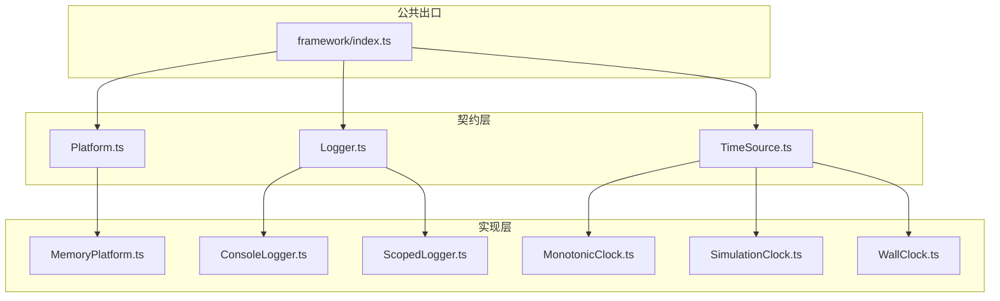
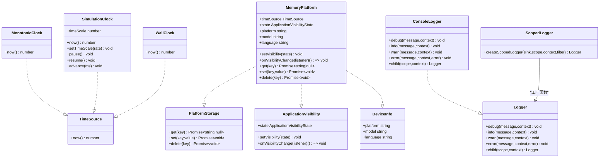
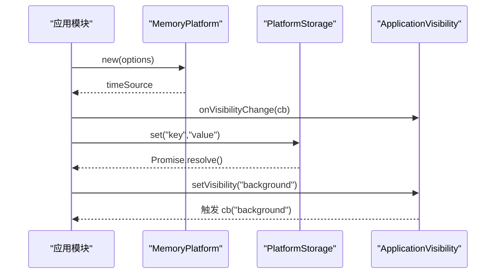
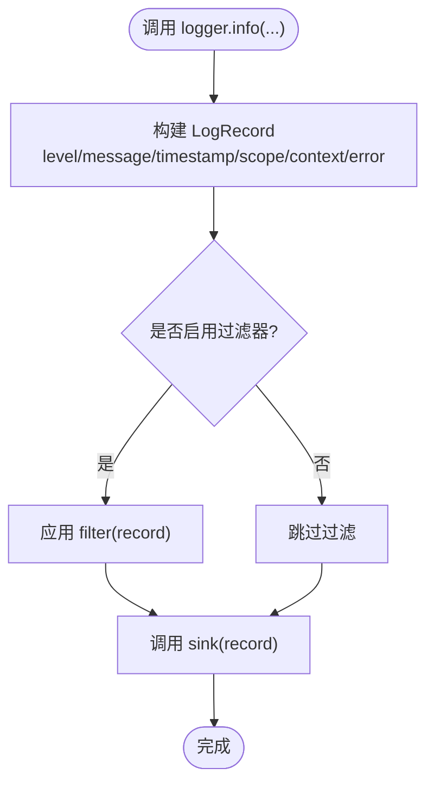
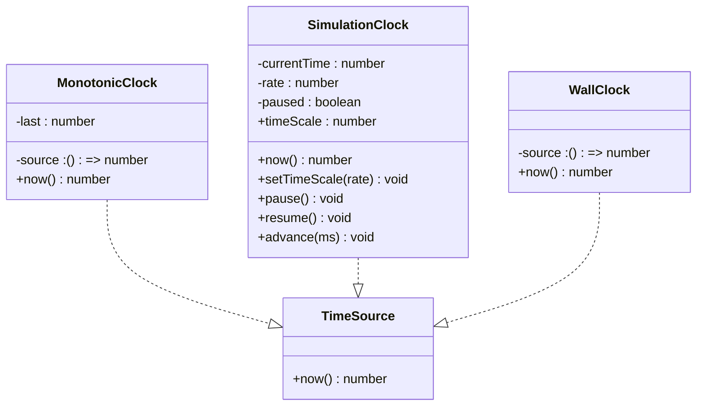
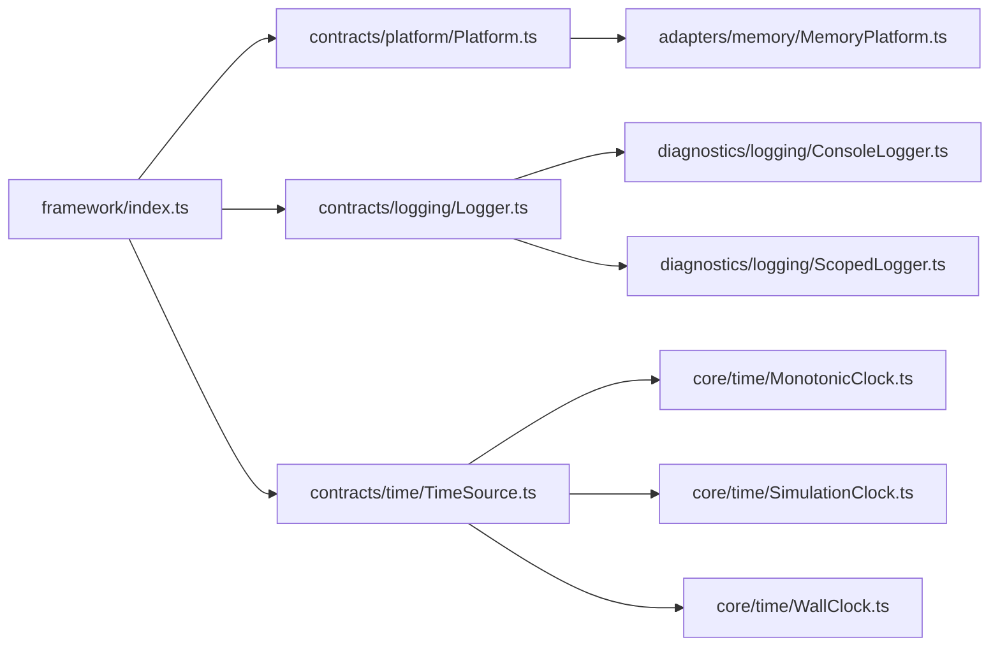

# 扩展点

<cite>
**本文引用的文件**   
- [Platform.ts](file://assets/framework/contracts/platform/Platform.ts)
- [Logger.ts](file://assets/framework/contracts/logging/Logger.ts)
- [TimeSource.ts](file://assets/framework/contracts/time/TimeSource.ts)
- [MemoryPlatform.ts](file://assets/framework/adapters/memory/MemoryPlatform.ts)
- [ConsoleLogger.ts](file://assets/framework/diagnostics/logging/ConsoleLogger.ts)
- [ScopedLogger.ts](file://assets/framework/diagnostics/logging/ScopedLogger.ts)
- [MonotonicClock.ts](file://assets/framework/core/time/MonotonicClock.ts)
- [SimulationClock.ts](file://assets/framework/core/time/SimulationClock.ts)
- [WallClock.ts](file://assets/framework/core/time/WallClock.ts)
- [index.ts](file://assets/framework/index.ts)
- [memory-platform.test.ts](file://tests/framework/foundation/memory-platform.test.ts)
- [logger-contract.test.ts](file://tests/framework/foundation/logger-contract.test.ts)
- [platform-contract.test.ts](file://tests/framework/foundation/platform-contract.test.ts)
- [MemoryLogger.ts](file://tests/framework/support/MemoryLogger.ts)
</cite>

## 目录
1. [简介](#简介)
2. [项目结构](#项目结构)
3. [核心扩展点](#核心扩展点)
4. [架构总览](#架构总览)
5. [详细组件分析](#详细组件分析)
6. [依赖关系分析](#依赖关系分析)
7. [性能与可测试性考量](#性能与可测试性考量)
8. [故障排查指南](#故障排查指南)
9. [结论](#结论)
10. [附录：扩展开发清单与最佳实践](#附录扩展开发清单与最佳实践)

## 简介
本文件面向 AI Game Kit 的扩展开发者，系统性说明框架提供的扩展机制与契约接口，重点覆盖：
- 平台适配器（Platform）：应用可见性、持久化存储、设备信息抽象
- 日志系统（Logger）：结构化日志、作用域与上下文、子 Logger 继承
- 时间源（TimeSource）：单调时钟、模拟时钟、墙钟等实现

文档提供完整的扩展开发指南，包括接口要求、实现要点、集成步骤、常见陷阱与优化建议，并附带基于仓库现有实现的参考路径。

## 项目结构
AI Game Kit 将“契约”与“实现”解耦：
- contracts：纯类型契约，不依赖运行时或引擎，确保可替换性与跨平台能力
- adapters：平台适配层，提供具体平台的实现（如内存平台）
- core：通用核心能力（时间、调度、事件、错误等）
- diagnostics：诊断与日志基础设施（控制台输出、作用域日志）
- framework/index.ts：对外暴露的类型与入口

图表来源
- [Platform.ts:1-22](file://assets/framework/contracts/platform/Platform.ts#L1-L22)
- [Logger.ts:1-21](file://assets/framework/contracts/logging/Logger.ts#L1-L21)
- [TimeSource.ts:1-4](file://assets/framework/contracts/time/TimeSource.ts#L1-L4)
- [MemoryPlatform.ts:1-94](file://assets/framework/adapters/memory/MemoryPlatform.ts#L1-L94)
- [ConsoleLogger.ts:1-56](file://assets/framework/diagnostics/logging/ConsoleLogger.ts#L1-L56)
- [ScopedLogger.ts:1-63](file://assets/framework/diagnostics/logging/ScopedLogger.ts#L1-L63)
- [MonotonicClock.ts:1-21](file://assets/framework/core/time/MonotonicClock.ts#L1-L21)
- [SimulationClock.ts:1-63](file://assets/framework/core/time/SimulationClock.ts#L1-L63)
- [WallClock.ts:1-14](file://assets/framework/core/time/WallClock.ts#L1-L14)
- [index.ts:1-44](file://assets/framework/index.ts#L1-L44)

章节来源
- [Platform.ts:1-22](file://assets/framework/contracts/platform/Platform.ts#L1-L22)
- [Logger.ts:1-21](file://assets/framework/contracts/logging/Logger.ts#L1-L21)
- [TimeSource.ts:1-4](file://assets/framework/contracts/time/TimeSource.ts#L1-L4)
- [index.ts:1-44](file://assets/framework/index.ts#L1-L44)

## 核心扩展点
- 平台适配器（Platform）
  - ApplicationVisibility：应用前台/后台状态与变更监听
  - PlatformStorage：键值对异步存储（get/set/delete）
  - DeviceInfo：平台、型号、语言等只读设备信息
- 日志系统（Logger）
  - 级别：debug/info/warn/error
  - 记录结构：level/message/timestamp/scope/context/error
  - child(scope, context)：创建带作用域与上下文的子 Logger
- 时间源（TimeSource）
  - now(): number：返回当前时间（毫秒级数值）

章节来源
- [Platform.ts:1-22](file://assets/framework/contracts/platform/Platform.ts#L1-L22)
- [Logger.ts:1-21](file://assets/framework/contracts/logging/Logger.ts#L1-L21)
- [TimeSource.ts:1-4](file://assets/framework/contracts/time/TimeSource.ts#L1-L4)

## 架构总览
下图展示契约与实现的解耦关系，以及框架对外暴露的边界。

图表来源
- [TimeSource.ts:1-4](file://assets/framework/contracts/time/TimeSource.ts#L1-L4)
- [MonotonicClock.ts:1-21](file://assets/framework/core/time/MonotonicClock.ts#L1-L21)
- [SimulationClock.ts:1-63](file://assets/framework/core/time/SimulationClock.ts#L1-L63)
- [WallClock.ts:1-14](file://assets/framework/core/time/WallClock.ts#L1-L14)
- [Platform.ts:1-22](file://assets/framework/contracts/platform/Platform.ts#L1-L22)
- [MemoryPlatform.ts:1-94](file://assets/framework/adapters/memory/MemoryPlatform.ts#L1-L94)
- [Logger.ts:1-21](file://assets/framework/contracts/logging/Logger.ts#L1-L21)
- [ConsoleLogger.ts:1-56](file://assets/framework/diagnostics/logging/ConsoleLogger.ts#L1-L56)
- [ScopedLogger.ts:1-63](file://assets/framework/diagnostics/logging/ScopedLogger.ts#L1-L63)

## 详细组件分析

### 平台适配器（Platform）
- 契约要点
  - ApplicationVisibility：读取 state、设置 setVisibility、订阅 onVisibilityChange
  - PlatformStorage：异步 get/set/delete
  - DeviceInfo：只读 platform/model/language
- 参考实现（MemoryPlatform）
  - 默认前台状态、内存 Map 存储、设备信息注入
  - 可见性变更通知：支持多监听器、异常隔离、去重与释放句柄
  - 时间源：通过 options.now 注入 TimeSource
- 自定义实现要求
  - 严格遵循契约方法签名与语义
  - 保持异步稳定性（Promise 成功/失败）
  - 避免副作用泄漏（如共享可变对象）
  - 保证线程安全（若运行在多线程环境）
- 集成步骤
  - 在应用启动时注入 Platform 实例到容器
  - 使用 PlatformStorage 进行配置/用户数据存取
  - 订阅可见性变化以处理生命周期相关逻辑
- 常见陷阱
  - 未处理 listener 抛错导致后续监听器不执行（应隔离异常）
  - 重复调用相同状态不触发回调（需按契约行为）
  - 存储键冲突或并发写入竞态（需加锁或队列）

图表来源
- [MemoryPlatform.ts:1-94](file://assets/framework/adapters/memory/MemoryPlatform.ts#L1-L94)
- [Platform.ts:1-22](file://assets/framework/contracts/platform/Platform.ts#L1-L22)

章节来源
- [Platform.ts:1-22](file://assets/framework/contracts/platform/Platform.ts#L1-L22)
- [MemoryPlatform.ts:1-94](file://assets/framework/adapters/memory/MemoryPlatform.ts#L1-L94)
- [memory-platform.test.ts:1-156](file://tests/framework/foundation/memory-platform.test.ts#L1-L156)

### 日志系统（Logger）
- 契约要点
  - 四个级别：debug/info/warn/error
  - 记录结构：level/message/timestamp/scope/context/error
  - child(scope, context)：创建继承父级 scope/context 的子 Logger
- 参考实现（ConsoleLogger + ScopedLogger）
  - ConsoleLogger 委托给 createScopedLogger，统一格式化与过滤
  - ScopedLogger 负责作用域拼接、上下文合并、时间戳生成、错误透传
- 自定义实现要求
  - 必须实现 child 并保持作用域与上下文不可变合并
  - error 方法需保留 Error 的 name/message/stack/cause
  - 输出 sink 需幂等且稳定（避免重复/丢失）
- 集成步骤
  - 使用 createScopedLogger 快速构建 Logger 实例
  - 通过 child 划分模块/子系统作用域
  - 在顶层注入全局 Logger 供各模块消费
- 常见陷阱
  - 子 Logger 修改了父级 context（应保持不可变合并）
  - 未传递 error 或破坏其 cause 链
  - 时间戳非单调或精度不足（建议使用框架时间源）

图表来源
- [Logger.ts:1-21](file://assets/framework/contracts/logging/Logger.ts#L1-L21)
- [ConsoleLogger.ts:1-56](file://assets/framework/diagnostics/logging/ConsoleLogger.ts#L1-L56)
- [ScopedLogger.ts:1-63](file://assets/framework/diagnostics/logging/ScopedLogger.ts#L1-L63)

章节来源
- [Logger.ts:1-21](file://assets/framework/contracts/logging/Logger.ts#L1-L21)
- [ConsoleLogger.ts:1-56](file://assets/framework/diagnostics/logging/ConsoleLogger.ts#L1-L56)
- [ScopedLogger.ts:1-63](file://assets/framework/diagnostics/logging/ScopedLogger.ts#L1-L63)
- [logger-contract.test.ts:1-178](file://tests/framework/foundation/logger-contract.test.ts#L1-L178)
- [MemoryLogger.ts:1-44](file://tests/framework/support/MemoryLogger.ts#L1-L44)

### 时间源（TimeSource）
- 契约要点
  - now(): number：返回当前时间（毫秒数）
- 内置实现
  - MonotonicClock：单调递增，防止回拨
  - SimulationClock：可暂停/加速/推进，适合测试与回放
  - WallClock：直接代理外部时间源（如 Date.now）
- 自定义实现要求
  - 返回值应为有限数字（NaN/Infinity 会导致污染）
  - 单调性由上层保障（如需单调，优先使用 MonotonicClock）
  - 线程安全（若适用）
- 集成步骤
  - 在应用初始化时注入 TimeSource（例如通过 Platform.timeSource）
  - 所有计时逻辑通过 TimeSource.now() 获取时间
- 常见陷阱
  - 直接使用 Date.now() 导致无法模拟时间
  - 未处理负数/零时间导致的死循环或逻辑错误
  - 时间缩放因子非法（SimulationClock 会校验）

图表来源
- [TimeSource.ts:1-4](file://assets/framework/contracts/time/TimeSource.ts#L1-L4)
- [MonotonicClock.ts:1-21](file://assets/framework/core/time/MonotonicClock.ts#L1-L21)
- [SimulationClock.ts:1-63](file://assets/framework/core/time/SimulationClock.ts#L1-L63)
- [WallClock.ts:1-14](file://assets/framework/core/time/WallClock.ts#L1-L14)

章节来源
- [TimeSource.ts:1-4](file://assets/framework/contracts/time/TimeSource.ts#L1-L4)
- [MonotonicClock.ts:1-21](file://assets/framework/core/time/MonotonicClock.ts#L1-L21)
- [SimulationClock.ts:1-63](file://assets/framework/core/time/SimulationClock.ts#L1-L63)
- [WallClock.ts:1-14](file://assets/framework/core/time/WallClock.ts#L1-L14)

## 依赖关系分析
- 契约层独立于运行时与引擎，确保可替换性
- 实现层依赖契约层，不反向依赖
- 框架 index.ts 仅导出类型与必要入口，降低耦合

图表来源
- [index.ts:1-44](file://assets/framework/index.ts#L1-L44)
- [Platform.ts:1-22](file://assets/framework/contracts/platform/Platform.ts#L1-L22)
- [Logger.ts:1-21](file://assets/framework/contracts/logging/Logger.ts#L1-L21)
- [TimeSource.ts:1-4](file://assets/framework/contracts/time/TimeSource.ts#L1-L4)
- [MemoryPlatform.ts:1-94](file://assets/framework/adapters/memory/MemoryPlatform.ts#L1-L94)
- [ConsoleLogger.ts:1-56](file://assets/framework/diagnostics/logging/ConsoleLogger.ts#L1-L56)
- [ScopedLogger.ts:1-63](file://assets/framework/diagnostics/logging/ScopedLogger.ts#L1-L63)
- [MonotonicClock.ts:1-21](file://assets/framework/core/time/MonotonicClock.ts#L1-L21)
- [SimulationClock.ts:1-63](file://assets/framework/core/time/SimulationClock.ts#L1-L63)
- [WallClock.ts:1-14](file://assets/framework/core/time/WallClock.ts#L1-L14)

章节来源
- [index.ts:1-44](file://assets/framework/index.ts#L1-L44)
- [platform-contract.test.ts:1-50](file://tests/framework/foundation/platform-contract.test.ts#L1-L50)

## 性能与可测试性考量
- 日志
  - 使用 createScopedLogger 减少重复构造开销
  - 通过 filter 控制敏感字段脱敏，避免序列化成本过高
  - 批量写入 sink 可降低 I/O 压力
- 平台存储
  - 使用内存映射或批处理提交策略提升吞吐
  - 读写分离与缓存热点键
- 时间源
  - 使用 MonotonicClock 避免时钟回拨引发的重试风暴
  - SimulationClock 用于确定性测试，避免真实时间抖动
- 可测试性
  - 通过 MemoryPlatform 与 MemoryLogger 进行无外部依赖测试
  - 注入 TimeSource 以固定时间基准

[本节为通用指导，无需代码引用]

## 故障排查指南
- 平台可见性
  - 现象：切换状态后监听器未触发
  - 排查：检查是否重复设置同一状态；确认监听器是否正确注册与释放
- 日志
  - 现象：子 Logger 继承了错误的上下文
  - 排查：确认 child 调用时传入的 context 是否被意外修改；验证作用域拼接规则
  - 现象：error 丢失 cause
  - 排查：确保 error 方法透传原始 Error 对象及其 cause
- 时间源
  - 现象：单调性被破坏
  - 排查：检查底层 source 是否返回递减值；改用 MonotonicClock
  - 现象：SimulationClock 推进无效
  - 排查：确认未被 pause；检查 timeScale 是否为正有限数

章节来源
- [memory-platform.test.ts:1-156](file://tests/framework/foundation/memory-platform.test.ts#L1-L156)
- [logger-contract.test.ts:1-178](file://tests/framework/foundation/logger-contract.test.ts#L1-L178)
- [platform-contract.test.ts:1-50](file://tests/framework/foundation/platform-contract.test.ts#L1-L50)

## 结论
AI Game Kit 通过清晰的契约与实现分离，提供了可扩展的平台适配、日志与时间源机制。借助这些扩展点，开发者可以：
- 轻松接入新平台（实现 Platform 契约）
- 定制日志输出（实现 Logger 契约或使用 ScopedLogger）
- 精确控制时间（实现 TimeSource 或使用内置时钟）

遵循本文档的实现要求与最佳实践，可显著提升系统的可移植性、可测试性与可维护性。

## 附录：扩展开发清单与最佳实践
- 平台适配器
  - 实现 ApplicationVisibility、PlatformStorage、DeviceInfo
  - 正确处理可见性变更通知（异常隔离、去重、释放句柄）
  - 提供可注入的 TimeSource
  - 单元测试覆盖：初始状态、变更通知、存储 CRUD、设备信息注入、时间源注入
- 日志系统
  - 实现 Logger 契约，确保 child 的作用域与上下文不可变合并
  - 透传 Error 的 name/message/stack/cause
  - 使用 createScopedLogger 简化实现
  - 单元测试覆盖：级别、记录结构、子 Logger 继承、错误透传
- 时间源
  - 实现 TimeSource.now()，保证有限数值
  - 需要单调性时使用 MonotonicClock
  - 测试场景使用 SimulationClock（pause/resume/advance/timeScale）
  - 单元测试覆盖：单调性、非法参数校验、时间推进
- 集成步骤
  - 在应用启动阶段注入 Platform、Logger、TimeSource
  - 通过 framework/index.ts 导出的类型约束实现
  - 在各模块中通过 child 划分日志作用域，通过 PlatformStorage 存取数据
- 常见陷阱
  - 契约违反（方法签名不一致、语义不符）
  - 副作用泄漏（共享可变对象、未释放监听器）
  - 时间源非单调或非有限值
  - 日志上下文被意外修改

章节来源
- [Platform.ts:1-22](file://assets/framework/contracts/platform/Platform.ts#L1-L22)
- [Logger.ts:1-21](file://assets/framework/contracts/logging/Logger.ts#L1-L21)
- [TimeSource.ts:1-4](file://assets/framework/contracts/time/TimeSource.ts#L1-L4)
- [MemoryPlatform.ts:1-94](file://assets/framework/adapters/memory/MemoryPlatform.ts#L1-L94)
- [ConsoleLogger.ts:1-56](file://assets/framework/diagnostics/logging/ConsoleLogger.ts#L1-L56)
- [ScopedLogger.ts:1-63](file://assets/framework/diagnostics/logging/ScopedLogger.ts#L1-L63)
- [MonotonicClock.ts:1-21](file://assets/framework/core/time/MonotonicClock.ts#L1-L21)
- [SimulationClock.ts:1-63](file://assets/framework/core/time/SimulationClock.ts#L1-L63)
- [WallClock.ts:1-14](file://assets/framework/core/time/WallClock.ts#L1-L14)
- [index.ts:1-44](file://assets/framework/index.ts#L1-L44)
- [memory-platform.test.ts:1-156](file://tests/framework/foundation/memory-platform.test.ts#L1-L156)
- [logger-contract.test.ts:1-178](file://tests/framework/foundation/logger-contract.test.ts#L1-L178)
- [platform-contract.test.ts:1-50](file://tests/framework/foundation/platform-contract.test.ts#L1-L50)
- [MemoryLogger.ts:1-44](file://tests/framework/support/MemoryLogger.ts#L1-L44)