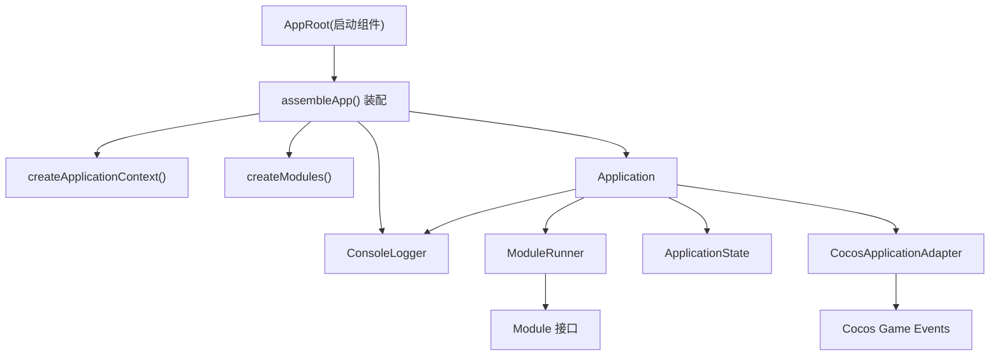
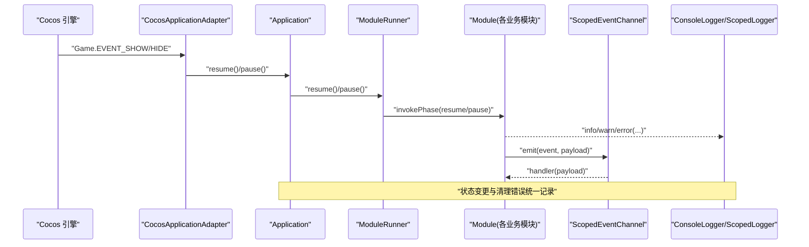
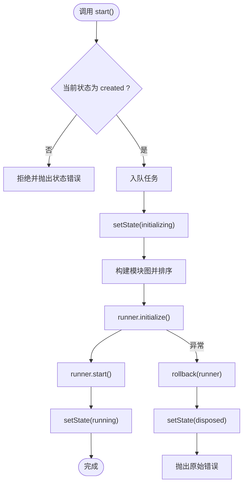
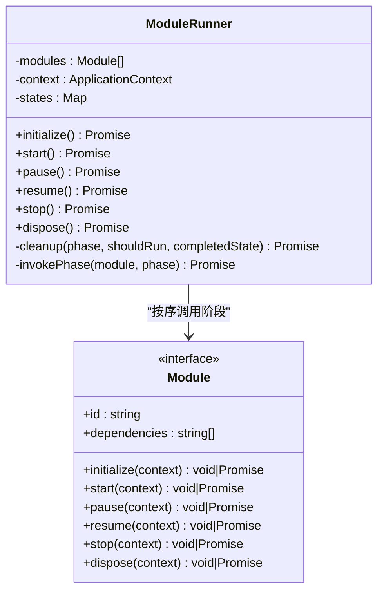
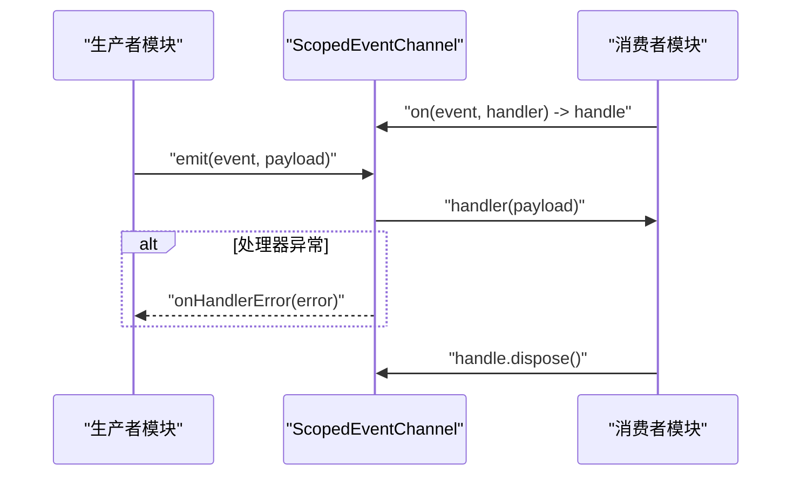
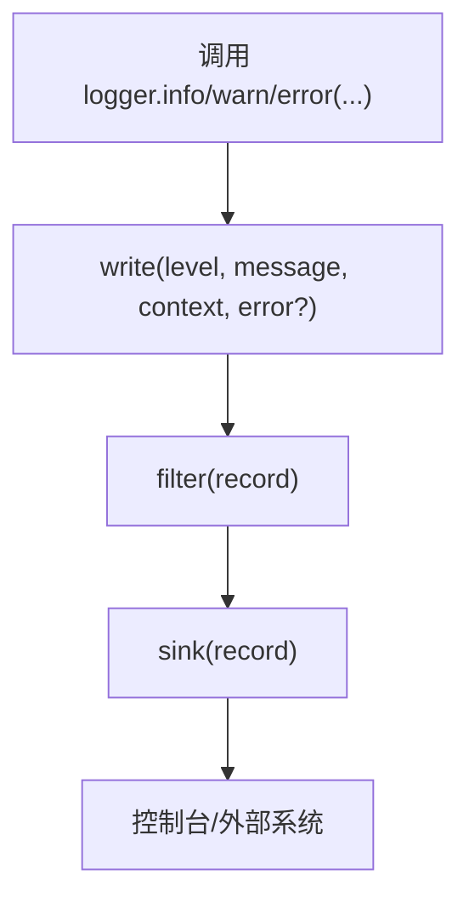
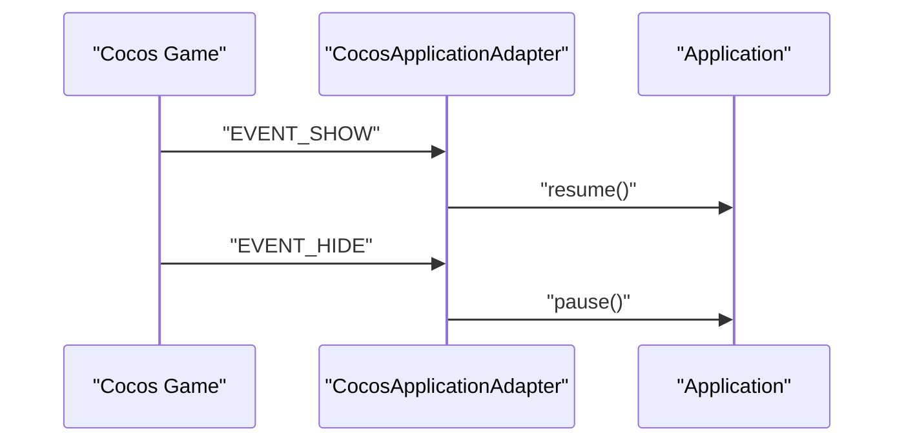
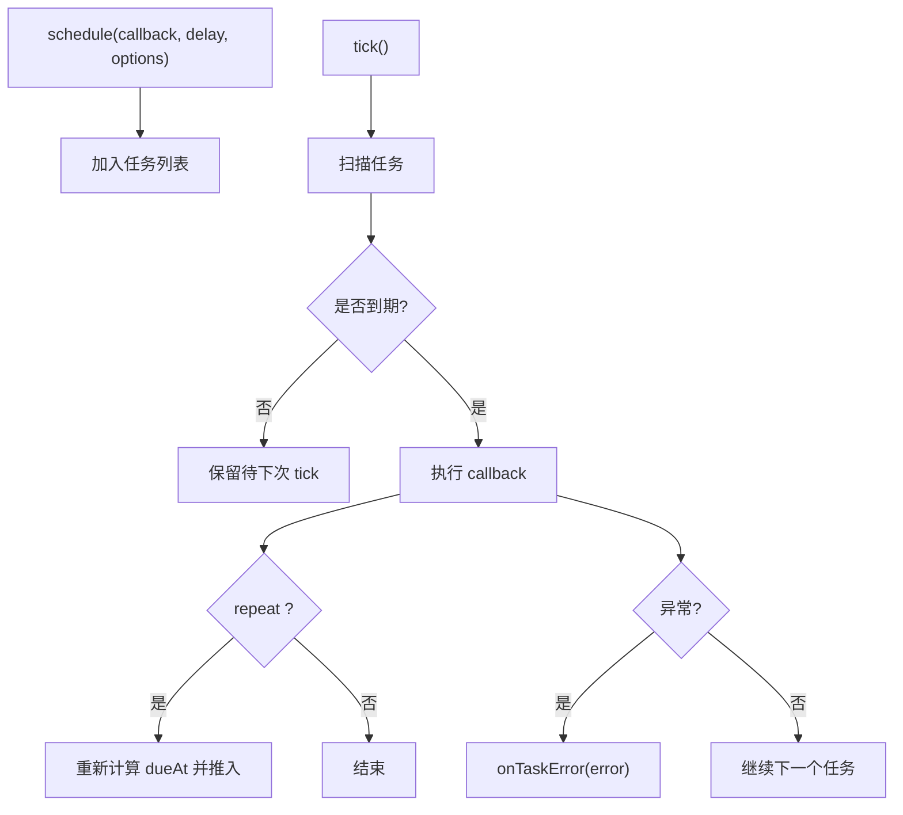
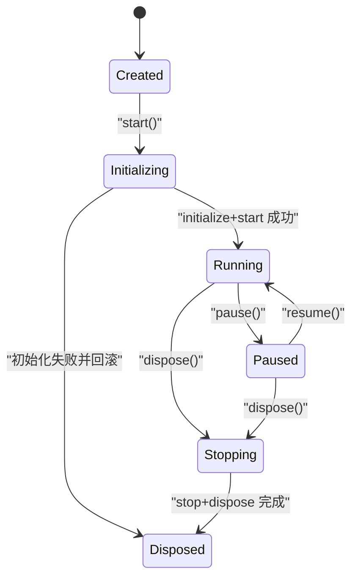
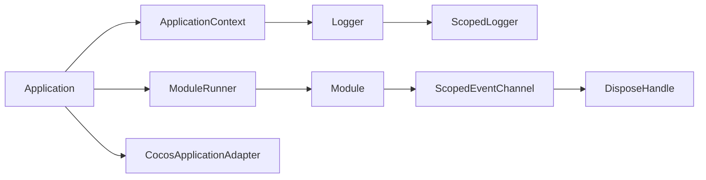

# 数据流设计

<cite>
**本文引用的文件**   
- [assets/boot/AppRoot.ts](file://assets/boot/AppRoot.ts)
- [assets/framework/index.ts](file://assets/framework/index.ts)
- [assets/framework/application/Application.ts](file://assets/framework/application/Application.ts)
- [assets/framework/application/ApplicationContext.ts](file://assets/framework/application/ApplicationContext.ts)
- [assets/framework/application/ModuleRunner.ts](file://assets/framework/application/ModuleRunner.ts)
- [assets/framework/contracts/application/ApplicationContext.ts](file://assets/framework/contracts/application/ApplicationContext.ts)
- [assets/framework/contracts/module/Module.ts](file://assets/framework/contracts/module/Module.ts)
- [assets/framework/core/events/ScopedEventChannel.ts](file://assets/framework/core/events/ScopedEventChannel.ts)
- [assets/framework/diagnostics/logging/ConsoleLogger.ts](file://assets/framework/diagnostics/logging/ConsoleLogger.ts)
- [assets/framework/diagnostics/logging/ScopedLogger.ts](file://assets/framework/diagnostics/logging/ScopedLogger.ts)
- [assets/framework/contracts/logging/Logger.ts](file://assets/framework/contracts/logging/Logger.ts)
- [assets/framework/adapters/cocos/application/CocosApplicationAdapter.ts](file://assets/framework/adapters/cocos/application/CocosApplicationAdapter.ts)
- [assets/framework/core/scheduling/PassiveScheduler.ts](file://assets/framework/core/scheduling/PassiveScheduler.ts)
- [assets/framework/core/scheduling/DisposeHandle.ts](file://assets/framework/core/scheduling/DisposeHandle.ts)
</cite>

## 目录
1. [引言](#引言)
2. [项目结构](#项目结构)
3. [核心组件](#核心组件)
4. [架构总览](#架构总览)
5. [详细组件分析](#详细组件分析)
6. [依赖关系分析](#依赖关系分析)
7. [性能考量](#性能考量)
8. [故障排查指南](#故障排查指南)
9. [结论](#结论)
10. [附录](#附录)

## 引言
本文件面向 AI Game Kit 的数据流设计，系统性阐述应用内数据的单向流动、事件驱动传播、日志记录流转与应用状态变化流程。文档强调：
- 单向数据流确保一致性与可预测性；
- 事件通道与调度器解耦异步操作；
- 生命周期与清理阶段严格有序；
- 错误在边界处被捕获并上报，避免污染主流程。

## 项目结构
框架以“应用容器 + 模块生命周期 + 事件通道 + 日志子系统 + 平台适配器”为核心分层。启动入口通过 Cocos 引擎的 AppRoot 组件装配 Application、Context、Logger 与 Adapter，随后进入统一的生命周期管理。

图示来源 
- [assets/boot/AppRoot.ts:19-27](file://assets/boot/AppRoot.ts#L19-L27)
- [assets/framework/application/Application.ts:10-22](file://assets/framework/application/Application.ts#L10-L22)
- [assets/framework/application/ModuleRunner.ts:26-41](file://assets/framework/application/ModuleRunner.ts#L26-L41)
- [assets/framework/contracts/module/Module.ts:19-29](file://assets/framework/contracts/module/Module.ts#L19-L29)
- [assets/framework/adapters/cocos/application/CocosApplicationAdapter.ts:9-17](file://assets/framework/adapters/cocos/application/CocosApplicationAdapter.ts#L9-L17)

章节来源
- [assets/boot/AppRoot.ts:1-55](file://assets/boot/AppRoot.ts#L1-L55)
- [assets/framework/index.ts:1-44](file://assets/framework/index.ts#L1-L44)

## 核心组件
- Application：应用级状态机与任务队列，负责模块编排、生命周期推进与错误回滚。
- ModuleRunner：按依赖顺序执行模块各阶段（initialize/start/pause/resume/stop/dispose），维护模块运行时状态。
- ScopedEventChannel：类型安全的事件总线，支持订阅/发布、句柄释放与处理器异常隔离。
- ConsoleLogger/ScopedLogger：结构化日志输出，支持作用域、上下文与过滤脱敏。
- CocosApplicationAdapter：桥接 Cocos 引擎可见性事件到 Application 的 pause/resume。
- PassiveScheduler：被动调度器，基于时间源定时触发任务，支持重复与取消。

章节来源
- [assets/framework/application/Application.ts:10-168](file://assets/framework/application/Application.ts#L10-L168)
- [assets/framework/application/ModuleRunner.ts:26-242](file://assets/framework/application/ModuleRunner.ts#L26-L242)
- [assets/framework/core/events/ScopedEventChannel.ts:1-129](file://assets/framework/core/events/ScopedEventChannel.ts#L1-L129)
- [assets/framework/diagnostics/logging/ConsoleLogger.ts:19-56](file://assets/framework/diagnostics/logging/ConsoleLogger.ts#L19-L56)
- [assets/framework/diagnostics/logging/ScopedLogger.ts:24-63](file://assets/framework/diagnostics/logging/ScopedLogger.ts#L24-L63)
- [assets/framework/adapters/cocos/application/CocosApplicationAdapter.ts:9-53](file://assets/framework/adapters/cocos/application/CocosApplicationAdapter.ts#L9-L53)
- [assets/framework/core/scheduling/PassiveScheduler.ts:20-116](file://assets/framework/core/scheduling/PassiveScheduler.ts#L20-L116)

## 架构总览
下图展示从引擎事件到应用状态、模块生命周期、事件通道与日志记录的完整数据流路径。所有变更均通过受控入口（Application）与单向管道（事件/日志/调度）进行传播。

图示来源 
- [assets/framework/adapters/cocos/application/CocosApplicationAdapter.ts:39-51](file://assets/framework/adapters/cocos/application/CocosApplicationAdapter.ts#L39-L51)
- [assets/framework/application/Application.ts:69-97](file://assets/framework/application/Application.ts#L69-L97)
- [assets/framework/application/ModuleRunner.ts:107-129](file://assets/framework/application/ModuleRunner.ts#L107-L129)
- [assets/framework/core/events/ScopedEventChannel.ts:79-111](file://assets/framework/core/events/ScopedEventChannel.ts#L79-L111)
- [assets/framework/diagnostics/logging/ConsoleLogger.ts:36-50](file://assets/framework/diagnostics/logging/ConsoleLogger.ts#L36-L50)

## 详细组件分析

### Application：应用状态机与任务队列
- 状态机：created → initializing → running → paused → stopping → disposed，任何非法转换抛出状态错误。
- 任务队列：内部 Promise 链式队列保证 start/pause/resume/dispose 串行执行，避免竞态。
- 错误处理：初始化失败时回滚已启动模块，统一记录清理错误并抛出首个错误。
- 对外接口：state、start、pause、resume、dispose。

图示来源 
- [assets/framework/application/Application.ts:28-67](file://assets/framework/application/Application.ts#L28-L67)
- [assets/framework/application/Application.ts:134-156](file://assets/framework/application/Application.ts#L134-L156)

章节来源
- [assets/framework/application/Application.ts:10-168](file://assets/framework/application/Application.ts#L10-L168)

### ModuleRunner：模块生命周期编排
- 阶段：initialize → start → pause → resume → stop → dispose，按依赖顺序执行。
- 状态跟踪：每个模块维护运行时状态，确保仅在合法状态下执行对应阶段。
- 清理策略：任一阶段失败，按逆序执行 stop/dispose，收集清理错误并聚合抛出。
- 日志记录：成功/失败均记录结构化日志，便于追踪。

图示来源 
- [assets/framework/application/ModuleRunner.ts:26-41](file://assets/framework/application/ModuleRunner.ts#L26-L41)
- [assets/framework/contracts/module/Module.ts:19-29](file://assets/framework/contracts/module/Module.ts#L19-L29)

章节来源
- [assets/framework/application/ModuleRunner.ts:47-153](file://assets/framework/application/ModuleRunner.ts#L47-L153)
- [assets/framework/contracts/module/Module.ts:1-30](file://assets/framework/contracts/module/Module.ts#L1-L30)

### ScopedEventChannel：事件驱动数据传播
- 类型安全：通过泛型 EventMap 约束事件名与载荷类型。
- 订阅/发布：on 返回 DisposeHandle，emit 遍历处理器并隔离异常。
- 资源管理：dispose 清空订阅，pruneEntries 清理已取消项。
- 错误传播：处理器抛错由 onHandlerError 上报，不会中断其他处理器。

图示来源 
- [assets/framework/core/events/ScopedEventChannel.ts:28-117](file://assets/framework/core/events/ScopedEventChannel.ts#L28-L117)

章节来源
- [assets/framework/core/events/ScopedEventChannel.ts:1-129](file://assets/framework/core/events/ScopedEventChannel.ts#L1-L129)

### ConsoleLogger/ScopedLogger：日志数据流
- 结构化记录：level、message、timestamp、scope、context、error。
- 作用域与上下文：child 创建子 logger，合并基础上下文。
- 过滤与脱敏：filter 对记录预处理（如 redact）。
- 输出：委托给 sink（如 console.*），实现可插拔后端。

图示来源 
- [assets/framework/diagnostics/logging/ConsoleLogger.ts:22-34](file://assets/framework/diagnostics/logging/ConsoleLogger.ts#L22-L34)
- [assets/framework/diagnostics/logging/ScopedLogger.ts:24-63](file://assets/framework/diagnostics/logging/ScopedLogger.ts#L24-L63)
- [assets/framework/contracts/logging/Logger.ts:1-21](file://assets/framework/contracts/logging/Logger.ts#L1-L21)

章节来源
- [assets/framework/diagnostics/logging/ConsoleLogger.ts:19-56](file://assets/framework/diagnostics/logging/ConsoleLogger.ts#L19-L56)
- [assets/framework/diagnostics/logging/ScopedLogger.ts:1-63](file://assets/framework/diagnostics/logging/ScopedLogger.ts#L1-L63)
- [assets/framework/contracts/logging/Logger.ts:1-21](file://assets/framework/contracts/logging/Logger.ts#L1-L21)

### CocosApplicationAdapter：平台事件到应用状态
- 绑定/解绑：监听引擎显示/隐藏事件，映射到 Application.resume/pause。
- 错误隔离：状态不匹配导致 reject 时，Adapter 不吞异常，交由 Application 内部管理。

图示来源 
- [assets/framework/adapters/cocos/application/CocosApplicationAdapter.ts:19-51](file://assets/framework/adapters/cocos/application/CocosApplicationAdapter.ts#L19-L51)

章节来源
- [assets/framework/adapters/cocos/application/CocosApplicationAdapter.ts:1-53](file://assets/framework/adapters/cocos/application/CocosApplicationAdapter.ts#L1-L53)

### PassiveScheduler：异步任务调度
- 任务模型：延迟、重复、到期时间、取消标记。
- 执行模型：tick 扫描到期任务，按到期时间排序执行，异常由 onTaskError 上报。
- 资源管理：dispose 清空任务并标记不可再调度。

图示来源 
- [assets/framework/core/scheduling/PassiveScheduler.ts:34-116](file://assets/framework/core/scheduling/PassiveScheduler.ts#L34-L116)

章节来源
- [assets/framework/core/scheduling/PassiveScheduler.ts:1-116](file://assets/framework/core/scheduling/PassiveScheduler.ts#L1-L116)
- [assets/framework/core/scheduling/DisposeHandle.ts:1-4](file://assets/framework/core/scheduling/DisposeHandle.ts#L1-L4)

### 应用状态转换图

图示来源 
- [assets/framework/contracts/application/ApplicationContext.ts:3-9](file://assets/framework/contracts/application/ApplicationContext.ts#L3-L9)
- [assets/framework/application/Application.ts:28-132](file://assets/framework/application/Application.ts#L28-L132)

## 依赖关系分析
- Application 依赖 ModuleRunner、ApplicationContext（含 Logger）、ModuleGraph（内部使用）。
- ModuleRunner 依赖 Module 接口与 ApplicationContext。
- ScopedEventChannel 依赖 DisposeHandle 用于订阅句柄。
- ConsoleLogger 依赖 ScopedLogger 与 Logger 契约。
- CocosApplicationAdapter 依赖 Application 与 Cocos 引擎事件。
- PassiveScheduler 依赖 TimeSource 契约（未在本节展开）。

图示来源 
- [assets/framework/application/Application.ts:10-22](file://assets/framework/application/Application.ts#L10-L22)
- [assets/framework/application/ModuleRunner.ts:26-41](file://assets/framework/application/ModuleRunner.ts#L26-L41)
- [assets/framework/contracts/module/Module.ts:19-29](file://assets/framework/contracts/module/Module.ts#L19-L29)
- [assets/framework/diagnostics/logging/ConsoleLogger.ts:22-34](file://assets/framework/diagnostics/logging/ConsoleLogger.ts#L22-L34)
- [assets/framework/core/events/ScopedEventChannel.ts:1-21](file://assets/framework/core/events/ScopedEventChannel.ts#L1-L21)
- [assets/framework/adapters/cocos/application/CocosApplicationAdapter.ts:9-17](file://assets/framework/adapters/cocos/application/CocosApplicationAdapter.ts#L9-L17)

章节来源
- [assets/framework/index.ts:1-44](file://assets/framework/index.ts#L1-L44)

## 性能考量
- 事件通道：emit 遍历处理器时使用副本迭代，避免并发修改；及时清理已取消订阅，降低内存占用。
- 调度器：tick 将任务分为到期与待处理两类，排序后执行，减少无效检查；支持 repeat 自动重排 dueAt。
- 日志：ScopedLogger 合并上下文与过滤，避免重复对象创建；ConsoleLogger 直接委托 sink，开销可控。
- 应用队列：Promise 链式队列串行化关键操作，避免锁竞争与状态不一致。

[本节为通用指导，无需代码引用]

## 故障排查指南
- 状态错误：Application 在非期望状态调用会抛出状态错误，检查调用时序与状态机转换。
- 模块生命周期失败：ModuleRunner 记录失败详情并聚合清理错误，定位 moduleId 与 phase。
- 事件处理器异常：ScopedEventChannel 的 onHandlerError 上报，检查处理器逻辑与上下文。
- 调度异常：PassiveScheduler 的 onTaskError 上报，检查回调与时间源。
- 日志脱敏：确认 filter 配置是否正确，避免敏感信息泄露或误删必要字段。

章节来源
- [assets/framework/application/Application.ts:145-156](file://assets/framework/application/Application.ts#L145-L156)
- [assets/framework/application/ModuleRunner.ts:155-186](file://assets/framework/application/ModuleRunner.ts#L155-L186)
- [assets/framework/core/events/ScopedEventChannel.ts:99-108](file://assets/framework/core/events/ScopedEventChannel.ts#L99-L108)
- [assets/framework/core/scheduling/PassiveScheduler.ts:98-102](file://assets/framework/core/scheduling/PassiveScheduler.ts#L98-L102)
- [assets/framework/diagnostics/logging/ConsoleLogger.ts:22-34](file://assets/framework/diagnostics/logging/ConsoleLogger.ts#L22-L34)

## 结论
AI Game Kit 的数据流设计以单向流为核心，通过 Application 的状态机与 ModuleRunner 的生命周期编排，确保数据与状态变更的可预测性。事件通道与调度器提供解耦的异步机制，日志子系统贯穿全链路，错误在各边界被捕获与上报。该设计兼顾可扩展性与可观测性，适合复杂游戏应用的模块化与跨平台适配。

[本节为总结，无需代码引用]

## 附录

### 实际数据处理示例（步骤说明）
- 事件驱动更新 UI 状态
  1) 业务模块在收到网络响应后，通过 ScopedEventChannel.emit("userUpdated", payload)。
  2) UI 层订阅该事件，在 handler 中读取 payload 并更新视图。
  3) 若 handler 抛错，由 onHandlerError 上报，不影响其他订阅者。
  参考路径：[ScopedEventChannel 定义与 emit/on:28-117](file://assets/framework/core/events/ScopedEventChannel.ts#L28-L117)

- 日志记录数据流转
  1) 模块调用 logger.info("加载完成", { sceneId })。
  2) ScopedLogger 合并 scope 与上下文，经 filter 处理后写入 sink。
  3) ConsoleLogger 委托 console.* 输出，便于调试与采集。
  参考路径：[ConsoleLogger 与 ScopedLogger:22-34](file://assets/framework/diagnostics/logging/ConsoleLogger.ts#L22-L34), [ScopedLogger 实现:24-63](file://assets/framework/diagnostics/logging/ScopedLogger.ts#L24-L63)

- 应用状态变化流程
  1) AppRoot 组装 Application 与 Adapter，调用 app.start()。
  2) Application 入队任务，构建模块图，依次执行 initialize/start。
  3) 成功后 setState("running")；失败则回滚并 setState("disposed")。
  参考路径：[Application 启动流程:28-67](file://assets/framework/application/Application.ts#L28-L67)

- 异步任务调度
  1) 模块通过 PassiveScheduler.schedule(callback, delay, { repeat: true }) 注册任务。
  2) 每帧 tick 扫描到期任务并执行，异常由 onTaskError 上报。
  3) 使用返回的 DisposeHandle 取消任务，避免泄漏。
  参考路径：[PassiveScheduler 调度:34-116](file://assets/framework/core/scheduling/PassiveScheduler.ts#L34-L116)