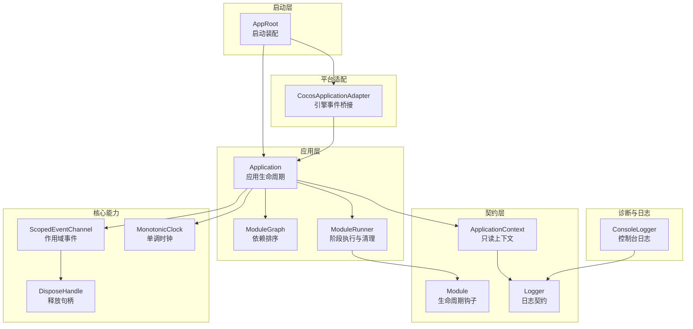
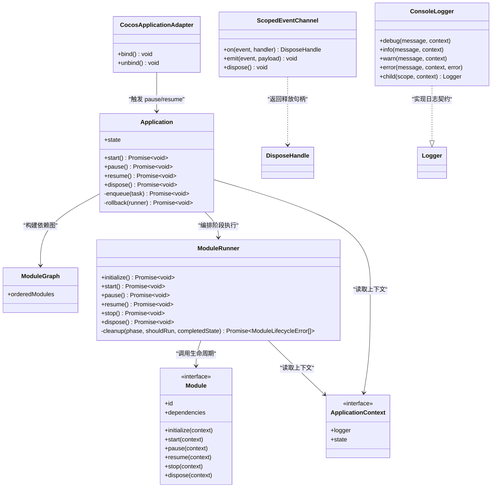
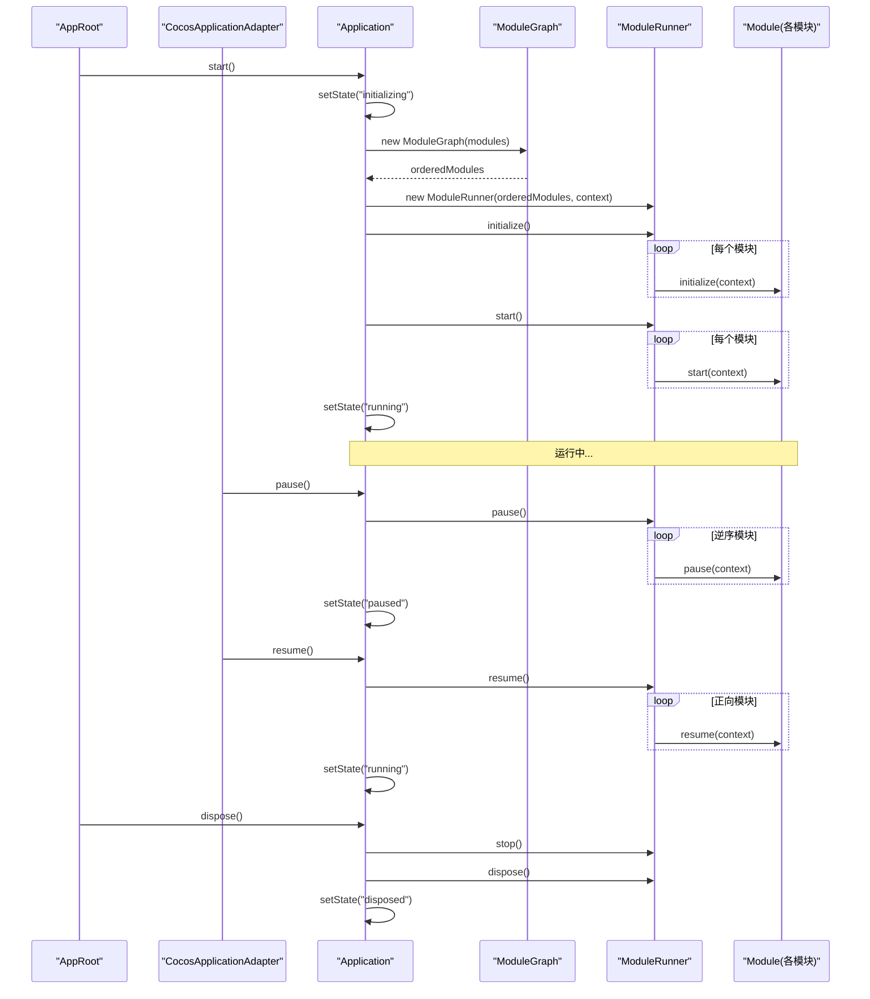
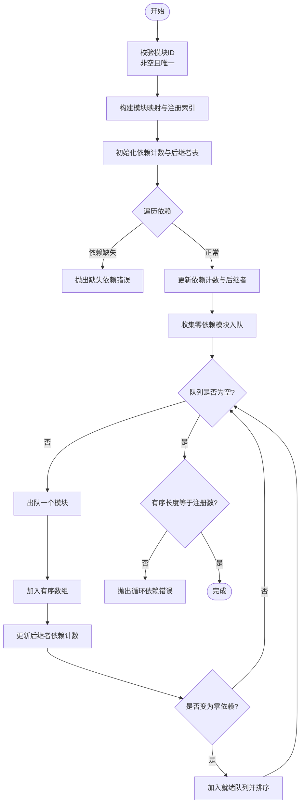
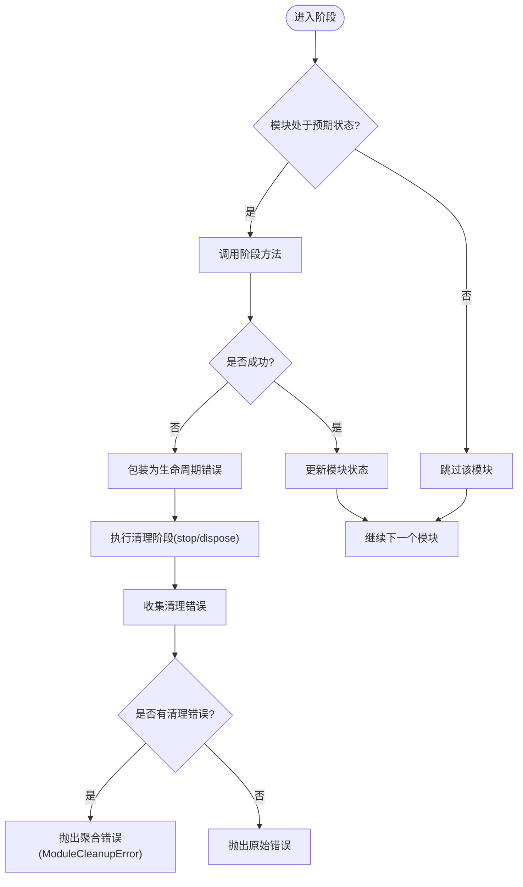
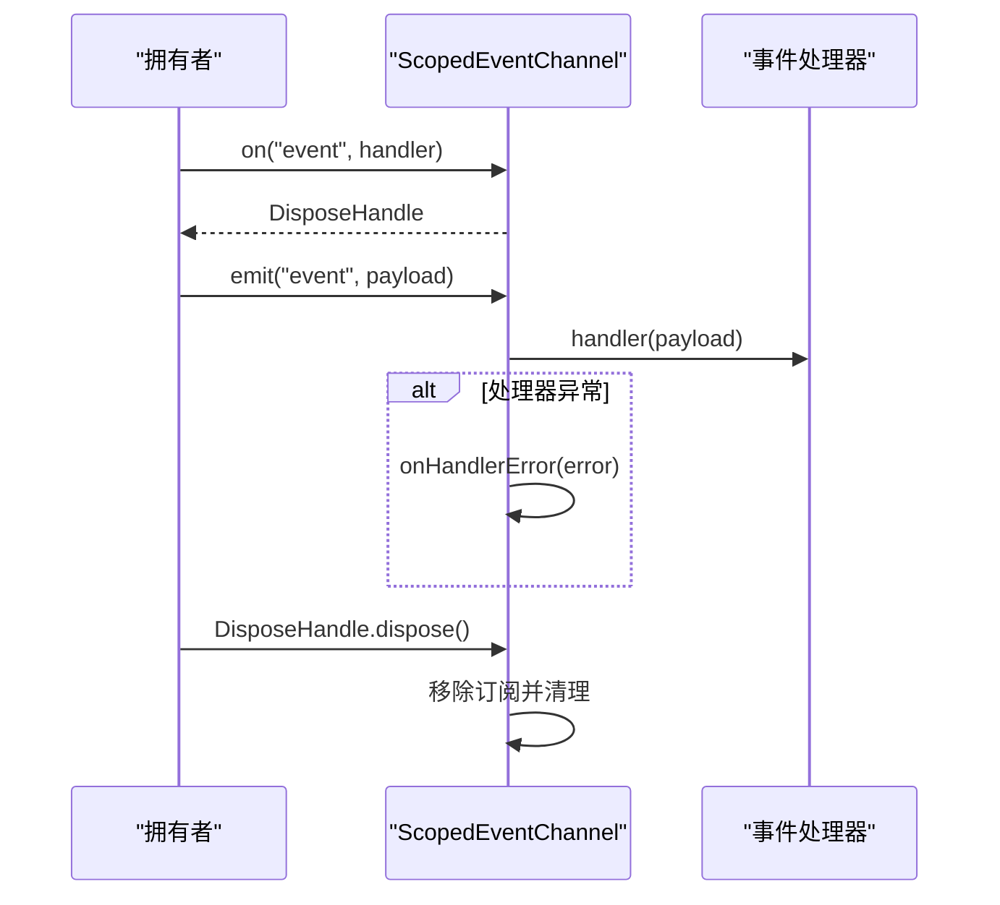
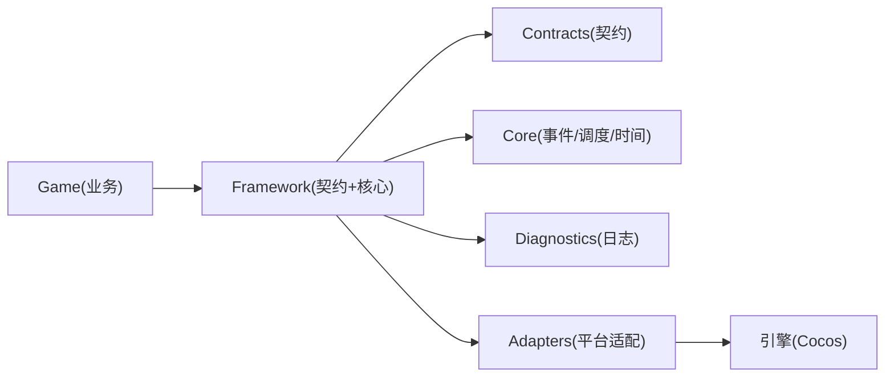

# 架构概览

<cite>
**本文引用的文件**
- [assets/framework/index.ts](file://assets/framework/index.ts)
- [assets/framework/application/Application.ts](file://assets/framework/application/Application.ts)
- [assets/framework/application/ApplicationContext.ts](file://assets/framework/application/ApplicationContext.ts)
- [assets/framework/application/ModuleGraph.ts](file://assets/framework/application/ModuleGraph.ts)
- [assets/framework/application/ModuleRunner.ts](file://assets/framework/application/ModuleRunner.ts)
- [assets/framework/contracts/application/ApplicationContext.ts](file://assets/framework/contracts/application/ApplicationContext.ts)
- [assets/framework/contracts/module/Module.ts](file://assets/framework/contracts/module/Module.ts)
- [assets/framework/contracts/logging/Logger.ts](file://assets/framework/contracts/logging/Logger.ts)
- [assets/framework/adapters/cocos/application/CocosApplicationAdapter.ts](file://assets/framework/adapters/cocos/application/CocosApplicationAdapter.ts)
- [assets/framework/core/events/ScopedEventChannel.ts](file://assets/framework/core/events/ScopedEventChannel.ts)
- [assets/framework/diagnostics/logging/ConsoleLogger.ts](file://assets/framework/diagnostics/logging/ConsoleLogger.ts)
- [assets/framework/core/scheduling/DisposeHandle.ts](file://assets/framework/core/scheduling/DisposeHandle.ts)
- [assets/framework/core/time/MonotonicClock.ts](file://assets/framework/core/time/MonotonicClock.ts)
- [assets/boot/AppRoot.ts](file://assets/boot/AppRoot.ts)
- [doc/decisions/ADR-005-framework-game-boundary.md](file://doc/decisions/ADR-005-framework-game-boundary.md)
- [doc/decisions/ADR-007-typed-errors-and-scoped-events.md](file://doc/decisions/ADR-007-typed-errors-and-scoped-events.md)
</cite>

## 目录
1. [引言](#引言)
2. [项目结构](#项目结构)
3. [核心组件](#核心组件)
4. [架构总览](#架构总览)
5. [详细组件分析](#详细组件分析)
6. [依赖关系分析](#依赖关系分析)
7. [性能考量](#性能考量)
8. [故障排查指南](#故障排查指南)
9. [结论](#结论)
10. [附录](#附录)

## 引言
本概览面向希望快速理解 AI Game Kit 框架整体设计理念与运行方式的开发者。框架采用分层、契约驱动与模块化设计，通过依赖注入、作用域事件与类型化错误体系，提供稳定可扩展的基础能力，同时严格隔离“框架”与“游戏业务”的边界，确保框架稳定、业务灵活演进。

## 项目结构
- 入口装配：启动场景中的 AppRoot 负责组装日志、应用上下文、模块列表与应用实例，并绑定平台适配器。
- 应用层：Application 管理生命周期（创建/初始化/运行/暂停/恢复/停止/销毁），协调 ModuleGraph 与 ModuleRunner。
- 契约层：定义 Application、Module、Logger、Platform、TimeSource 等接口，作为框架对外公开的稳定边界。
- 核心能力：事件通道（ScopedEventChannel）、调度句柄（DisposeHandle）、时间源（MonotonicClock）等。
- 诊断与日志：ConsoleLogger 实现结构化日志输出，支持作用域与敏感字段过滤。
- 平台适配：CocosApplicationAdapter 将引擎事件映射为框架的生命周期操作。

图表来源
- [assets/boot/AppRoot.ts:19-27](file://assets/boot/AppRoot.ts#L19-L27)
- [assets/framework/application/Application.ts:10-22](file://assets/framework/application/Application.ts#L10-L22)
- [assets/framework/application/ModuleGraph.ts:3-8](file://assets/framework/application/ModuleGraph.ts#L3-L8)
- [assets/framework/application/ModuleRunner.ts:26-41](file://assets/framework/application/ModuleRunner.ts#L26-L41)
- [assets/framework/contracts/application/ApplicationContext.ts:15-17](file://assets/framework/contracts/application/ApplicationContext.ts#L15-L17)
- [assets/framework/contracts/module/Module.ts:19-29](file://assets/framework/contracts/module/Module.ts#L19-L29)
- [assets/framework/contracts/logging/Logger.ts:14-20](file://assets/framework/contracts/logging/Logger.ts#L14-L20)
- [assets/framework/core/events/ScopedEventChannel.ts:28-36](file://assets/framework/core/events/ScopedEventChannel.ts#L28-L36)
- [assets/framework/core/scheduling/DisposeHandle.ts:1-4](file://assets/framework/core/scheduling/DisposeHandle.ts#L1-L4)
- [assets/framework/core/time/MonotonicClock.ts:6-13](file://assets/framework/core/time/MonotonicClock.ts#L6-L13)
- [assets/framework/diagnostics/logging/ConsoleLogger.ts:19-34](file://assets/framework/diagnostics/logging/ConsoleLogger.ts#L19-L34)
- [assets/framework/adapters/cocos/application/CocosApplicationAdapter.ts:9-17](file://assets/framework/adapters/cocos/application/CocosApplicationAdapter.ts#L9-L17)

章节来源
- [assets/boot/AppRoot.ts:19-27](file://assets/boot/AppRoot.ts#L19-L27)
- [assets/framework/index.ts:1-44](file://assets/framework/index.ts#L1-L44)

## 核心组件
- Application：应用主控制器，维护状态机与任务队列，编排模块初始化、启动、暂停/恢复、停止与销毁流程，并在失败时进行回滚与资源清理。
- ModuleGraph：对模块依赖图进行拓扑排序，检测缺失依赖与循环依赖，保证确定性的执行顺序。
- ModuleRunner：按阶段调用模块生命周期方法，维护模块运行时状态，处理异常与反向清理，聚合清理错误。
- ApplicationContext：向模块暴露只读的上下文（如 logger），不暴露状态变更方法，避免外部破坏状态机。
- ScopedEventChannel：类型化的作用域事件通道，订阅返回可释放句柄，处理器异常被隔离上报，支持 dispose 关闭作用域。
- ConsoleLogger：基于 ScopedLogger 的结构化日志实现，支持作用域、上下文与敏感字段过滤。
- CocosApplicationAdapter：将引擎的显示/隐藏事件映射为应用的 pause/resume，屏蔽引擎细节。
- MonotonicClock：单调时间源，保证时间不可回退，用于测试与模拟。

章节来源
- [assets/framework/application/Application.ts:10-22](file://assets/framework/application/Application.ts#L10-L22)
- [assets/framework/application/ModuleGraph.ts:3-8](file://assets/framework/application/ModuleGraph.ts#L3-L8)
- [assets/framework/application/ModuleRunner.ts:26-41](file://assets/framework/application/ModuleRunner.ts#L26-L41)
- [assets/framework/contracts/application/ApplicationContext.ts:15-17](file://assets/framework/contracts/application/ApplicationContext.ts#L15-L17)
- [assets/framework/core/events/ScopedEventChannel.ts:28-36](file://assets/framework/core/events/ScopedEventChannel.ts#L28-L36)
- [assets/framework/diagnostics/logging/ConsoleLogger.ts:19-34](file://assets/framework/diagnostics/logging/ConsoleLogger.ts#L19-L34)
- [assets/framework/adapters/cocos/application/CocosApplicationAdapter.ts:9-17](file://assets/framework/adapters/cocos/application/CocosApplicationAdapter.ts#L9-L17)
- [assets/framework/core/time/MonotonicClock.ts:6-13](file://assets/framework/core/time/MonotonicClock.ts#L6-L13)

## 架构总览
框架遵循“契约优先、分层解耦、模块化编排、作用域事件、类型化错误”的设计原则。Application 作为唯一入口编排生命周期；ModuleGraph 与 ModuleRunner 负责模块依赖与阶段执行；所有跨层交互通过 contracts 定义；平台差异由 adapters 隔离；诊断与事件在 core 中提供通用能力。

图表来源
- [assets/framework/application/Application.ts:10-22](file://assets/framework/application/Application.ts#L10-L22)
- [assets/framework/application/ModuleGraph.ts:3-8](file://assets/framework/application/ModuleGraph.ts#L3-L8)
- [assets/framework/application/ModuleRunner.ts:26-41](file://assets/framework/application/ModuleRunner.ts#L26-L41)
- [assets/framework/contracts/module/Module.ts:19-29](file://assets/framework/contracts/module/Module.ts#L19-L29)
- [assets/framework/contracts/application/ApplicationContext.ts:15-17](file://assets/framework/contracts/application/ApplicationContext.ts#L15-L17)
- [assets/framework/adapters/cocos/application/CocosApplicationAdapter.ts:9-17](file://assets/framework/adapters/cocos/application/CocosApplicationAdapter.ts#L9-L17)
- [assets/framework/core/events/ScopedEventChannel.ts:28-36](file://assets/framework/core/events/ScopedEventChannel.ts#L28-L36)
- [assets/framework/diagnostics/logging/ConsoleLogger.ts:19-34](file://assets/framework/diagnostics/logging/ConsoleLogger.ts#L19-L34)

## 详细组件分析

### Application 与生命周期编排
- 状态机：created → initializing → running → paused → stopping → disposed。
- 启动流程：构造 ModuleGraph 获取有序模块，交由 ModuleRunner 依次执行 initialize/start，失败则回滚 stop/dispose 并抛出异常。
- 暂停/恢复：仅允许从 running→paused 与 paused→running 转换，内部委托 runner 执行对应阶段。
- 销毁流程：串行执行 stop 与 dispose，收集清理错误并通过 logger 报告。
- 并发控制：使用 Promise 队列与 inFlightStart/inFlightDispose 防止重复启动与竞态。

图表来源
- [assets/boot/AppRoot.ts:34-46](file://assets/boot/AppRoot.ts#L34-L46)
- [assets/framework/application/Application.ts:28-67](file://assets/framework/application/Application.ts#L28-L67)
- [assets/framework/application/ModuleGraph.ts:3-8](file://assets/framework/application/ModuleGraph.ts#L3-L8)
- [assets/framework/application/ModuleRunner.ts:47-105](file://assets/framework/application/ModuleRunner.ts#L47-L105)
- [assets/framework/adapters/cocos/application/CocosApplicationAdapter.ts:39-51](file://assets/framework/adapters/cocos/application/CocosApplicationAdapter.ts#L39-L51)

章节来源
- [assets/framework/application/Application.ts:28-132](file://assets/framework/application/Application.ts#L28-L132)
- [assets/framework/application/ModuleRunner.ts:47-153](file://assets/framework/application/ModuleRunner.ts#L47-L153)

### ModuleGraph 依赖排序与校验
- 输入校验：模块 id 非空、无重复 id。
- 依赖检查：依赖必须存在，统计依赖计数与后继者。
- 拓扑排序：BFS 生成有序模块数组，保持注册顺序稳定性。
- 环检测：若有序结果数量不等于注册数量，说明存在循环依赖。

图表来源
- [assets/framework/application/ModuleGraph.ts:6-84](file://assets/framework/application/ModuleGraph.ts#L6-L84)

章节来源
- [assets/framework/application/ModuleGraph.ts:6-84](file://assets/framework/application/ModuleGraph.ts#L6-L84)

### ModuleRunner 阶段执行与清理策略
- 阶段执行：按模块顺序调用 initialize/start，失败时记录并抛出带 cause 的生命周期错误。
- 清理策略：根据当前状态选择需要执行的清理阶段（stop/dispose），逆序执行以保证析构顺序。
- 错误聚合：当清理阶段出现多个错误时，包装为 ModuleCleanupError 并保留原始错误链。
- 日志记录：每个阶段成功或失败均通过 context.logger 记录结构化日志。

图表来源
- [assets/framework/application/ModuleRunner.ts:47-105](file://assets/framework/application/ModuleRunner.ts#L47-L105)
- [assets/framework/application/ModuleRunner.ts:188-211](file://assets/framework/application/ModuleRunner.ts#L188-L211)
- [assets/framework/application/ModuleRunner.ts:223-240](file://assets/framework/application/ModuleRunner.ts#L223-L240)

章节来源
- [assets/framework/application/ModuleRunner.ts:47-153](file://assets/framework/application/ModuleRunner.ts#L47-L153)
- [assets/framework/application/ModuleRunner.ts:188-240](file://assets/framework/application/ModuleRunner.ts#L188-L240)

### 作用域事件通道与释放句柄
- 类型安全：通过泛型 EventMap 约束事件名与载荷类型。
- 订阅与取消：on 返回 DisposeHandle，调用 dispose 可取消订阅并从集合移除。
- 异常隔离：单个处理器抛错不会中断其他处理器，错误经 onHandlerError 回调上报。
- 作用域关闭：dispose 清空所有事件与订阅，防止内存泄漏。

图表来源
- [assets/framework/core/events/ScopedEventChannel.ts:28-117](file://assets/framework/core/events/ScopedEventChannel.ts#L28-L117)
- [assets/framework/core/scheduling/DisposeHandle.ts:1-4](file://assets/framework/core/scheduling/DisposeHandle.ts#L1-L4)

章节来源
- [assets/framework/core/events/ScopedEventChannel.ts:28-129](file://assets/framework/core/events/ScopedEventChannel.ts#L28-L129)
- [assets/framework/core/scheduling/DisposeHandle.ts:1-4](file://assets/framework/core/scheduling/DisposeHandle.ts#L1-L4)

### 日志与诊断
- ConsoleLogger 基于 ScopedLogger 实现，支持作用域与上下文，默认使用 redact 过滤敏感字段。
- 日志级别：debug/info/warn/error，error 支持携带 Error 对象。
- child 方法：创建子日志器，继承父级作用域与上下文。

章节来源
- [assets/framework/diagnostics/logging/ConsoleLogger.ts:19-55](file://assets/framework/diagnostics/logging/ConsoleLogger.ts#L19-L55)
- [assets/framework/contracts/logging/Logger.ts:1-21](file://assets/framework/contracts/logging/Logger.ts#L1-L21)

### 平台适配（Cocos）
- CocosApplicationAdapter 监听引擎的显示/隐藏事件，调用 Application.pause/resume。
- bind/unbind 幂等控制，避免重复绑定与内存泄漏。
- 错误处理：状态不匹配导致的拒绝由 Application 内部管理，适配器不捕获。

章节来源
- [assets/framework/adapters/cocos/application/CocosApplicationAdapter.ts:9-53](file://assets/framework/adapters/cocos/application/CocosApplicationAdapter.ts#L9-L53)

### 启动装配（AppRoot）
- assembleApp 组装 ConsoleLogger、ApplicationContext、模块列表与 Application，并创建 CocosApplicationAdapter。
- AppRoot 组件在 onLoad 中持久化节点，start 中绑定适配器并启动应用，onDestroy 中解绑并销毁应用。

章节来源
- [assets/boot/AppRoot.ts:19-54](file://assets/boot/AppRoot.ts#L19-L54)

## 依赖关系分析
- 框架与游戏边界：框架禁止依赖游戏，游戏可依赖框架，确保框架稳定、业务灵活。
- 契约优先：所有跨层交互通过 contracts 定义，降低耦合度。
- 适配器模式：平台差异通过 adapters 隔离，便于替换与扩展。
- 事件驱动：通过 ScopedEventChannel 实现模块内/模块间通信，避免全局总线。
- 错误体系：统一 FrameworkError 基类与显式可恢复性分类，便于上层决策。

图表来源
- [doc/decisions/ADR-005-framework-game-boundary.md:24-54](file://doc/decisions/ADR-005-framework-game-boundary.md#L24-L54)
- [assets/framework/index.ts:1-44](file://assets/framework/index.ts#L1-L44)

章节来源
- [doc/decisions/ADR-005-framework-game-boundary.md:24-54](file://doc/decisions/ADR-005-framework-game-boundary.md#L24-L54)
- [assets/framework/index.ts:1-44](file://assets/framework/index.ts#L1-L44)

## 性能考量
- 模块执行顺序确定性：ModuleGraph 拓扑排序保证 O(n+m) 复杂度，避免运行时重排。
- 清理逆序执行：减少资源持有时间，提高析构效率。
- 事件处理器隔离：单处理器异常不影响其他处理器，提升鲁棒性。
- 日志写入点收敛：敏感字段过滤集中在 redact，避免重复开销。
- 单调时钟：避免时间回退导致的不一致，适合测试与回放。

[本节为通用指导，无需引用具体文件]

## 故障排查指南
- 启动失败：检查 ModuleGraph 的依赖是否存在、是否循环依赖；查看 ModuleRunner 的阶段日志定位失败模块。
- 清理失败：关注 ModuleCleanupError 的错误集合，逐个排查 stop/dispose 阶段的异常。
- 事件异常：确认 onHandlerError 回调是否被调用，检查处理器逻辑与订阅生命周期。
- 日志问题：验证 ConsoleLogger 的作用域与上下文是否正确设置，检查 redact 配置是否误过滤关键信息。
- 平台事件：确认 CocosApplicationAdapter 的 bind/unbind 是否成对调用，避免重复绑定或遗漏解绑。

章节来源
- [assets/framework/application/ModuleRunner.ts:188-240](file://assets/framework/application/ModuleRunner.ts#L188-L240)
- [assets/framework/core/events/ScopedEventChannel.ts:99-108](file://assets/framework/core/events/ScopedEventChannel.ts#L99-L108)
- [assets/framework/diagnostics/logging/ConsoleLogger.ts:19-55](file://assets/framework/diagnostics/logging/ConsoleLogger.ts#L19-L55)
- [assets/framework/adapters/cocos/application/CocosApplicationAdapter.ts:19-37](file://assets/framework/adapters/cocos/application/CocosApplicationAdapter.ts#L19-L37)

## 结论
AI Game Kit 框架以契约为核心、模块化编排为基础，结合作用域事件与类型化错误体系，提供了稳定、可扩展、易调试的应用骨架。通过严格的框架-游戏边界与适配器模式，框架能够无缝集成不同引擎与平台，同时保持自身稳定与可演进性。

[本节为总结性内容，无需引用具体文件]

## 附录
- 设计决策参考：
  - 框架与游戏边界：明确职责划分与依赖方向。
  - 类型化错误与作用域事件：统一错误体系与事件模型，避免全局状态与字符串事件。

章节来源
- [doc/decisions/ADR-005-framework-game-boundary.md:24-54](file://doc/decisions/ADR-005-framework-game-boundary.md#L24-L54)
- [doc/decisions/ADR-007-typed-errors-and-scoped-events.md:17-31](file://doc/decisions/ADR-007-typed-errors-and-scoped-events.md#L17-L31)