# 框架架构

<cite>
**本文引用的文件**
- [index.ts](file://assets/framework/index.ts)
- [Application.ts](file://assets/framework/application/Application.ts)
- [ApplicationContext.ts](file://assets/framework/application/ApplicationContext.ts)
- [ModuleRunner.ts](file://assets/framework/application/ModuleRunner.ts)
- [ModuleGraph.ts](file://assets/framework/application/ModuleGraph.ts)
- [Module.ts](file://assets/framework/contracts/module/Module.ts)
- [ApplicationContext.ts](file://assets/framework/contracts/application/ApplicationContext.ts)
- [CocosApplicationAdapter.ts](file://assets/framework/adapters/cocos/application/CocosApplicationAdapter.ts)
- [ScopedEventChannel.ts](file://assets/framework/core/events/ScopedEventChannel.ts)
- [PassiveScheduler.ts](file://assets/framework/core/scheduling/PassiveScheduler.ts)
- [FrameworkError.ts](file://assets/framework/core/errors/FrameworkError.ts)
- [ConsoleLogger.ts](file://assets/framework/diagnostics/logging/ConsoleLogger.ts)
- [StateMachine.ts](file://assets/framework/core/fsm/StateMachine.ts)
- [AppRoot.ts](file://assets/boot/AppRoot.ts)
- [ResourceProvider.ts](file://assets/framework/core/resource/ResourceProvider.ts)
- [SceneFlow.ts](file://assets/framework/core/scene/SceneFlow.ts)
- [UiNavigator.ts](file://assets/framework/core/ui/UiNavigator.ts)
- [Resource.ts](file://assets/framework/contracts/resource/Resource.ts)
- [ResourceProvider.ts](file://assets/framework/contracts/resource/ResourceProvider.ts)
- [Navigation.ts](file://assets/framework/contracts/ui/Navigation.ts)
- [LoadCoordinator.ts](file://assets/framework/core/resource/LoadCoordinator.ts)
- [package.json](file://package.json)
- [ADR-003-hybrid-architecture.md](file://doc/decisions/ADR-003-hybrid-architecture.md)
- [ADR-005-framework-game-boundary.md](file://doc/decisions/ADR-005-framework-game-boundary.md)
- [ADR-007-typed-errors-and-scoped-events.md](file://doc/decisions/ADR-007-typed-errors-and-scoped-events.md)
</cite>

## 更新摘要
**所做更改**
- 新增了资源管理子系统的详细文档，包括资源提供器、加载协调器和作用域管理
- 新增了场景流子系统的详细文档，包括场景切换流程、状态管理和资源复用
- 新增了UI导航子系统的详细文档，包括页面栈管理、层级系统和重复打开策略
- 更新了核心组件部分，包含新增的三大子系统说明
- 更新了架构总览图，展示新增子系统在整体架构中的位置
- 添加了各子系统的详细分析章节和流程图
- 更新了依赖关系分析，体现新子系统与现有组件的关系

## 目录
1. [简介](#简介)
2. [项目结构](#项目结构)
3. [核心组件](#核心组件)
4. [架构总览](#架构总览)
5. [详细组件分析](#详细组件分析)
6. [依赖关系分析](#依赖关系分析)
7. [性能考量](#性能考量)
8. [故障排查指南](#故障排查指南)
9. [结论](#结论)
10. [附录](#附录)

## 简介
本架构文档面向 AI Game Kit 框架，聚焦高层设计、架构模式与系统边界。框架采用"应用-模块"生命周期管理为核心，通过契约化接口解耦平台适配、事件与调度等横切能力，并以类型化错误与作用域事件通道保障可维护性与稳定性。**框架现已扩展为完整的游戏开发框架**，新增了资源管理、场景流、UI导航等多个核心子系统，形成了更完整的架构体系。框架不强制统一玩法模型，允许业务层按特性选择 OOP/ECS/状态机/命令/行为树等实现方式；同时严格划分框架与游戏的职责边界，确保框架稳定、游戏快速演进。

## 项目结构
- 入口与装配：启动场景中的 AppRoot 负责组装日志、上下文、模块与应用实例，并绑定平台适配器。
- 应用与模块：Application 管理全局生命周期与模块编排；ModuleRunner 驱动各模块的阶段执行与清理；ModuleGraph 负责依赖拓扑排序与环检测。
- 资源管理系统：提供统一的资源加载、缓存、作用域管理和卸载机制。
- 场景流系统：管理场景切换流程，支持预加载、进度上报和状态转换。
- UI导航系统：基于页面栈的UI导航，支持七层层级和多种重复打开策略。
- 契约与抽象：contracts 定义 Application、Module、Platform、TimeSource、Logger、Resource、Navigation 等核心契约。
- 基础设施：core 提供事件通道、调度器、时间源、错误基类、有限状态机等通用能力。
- 诊断：diagnostics/logging 提供结构化日志与脱敏过滤。
- 平台适配：adapters/cocos 将引擎事件映射为框架的 pause/resume。

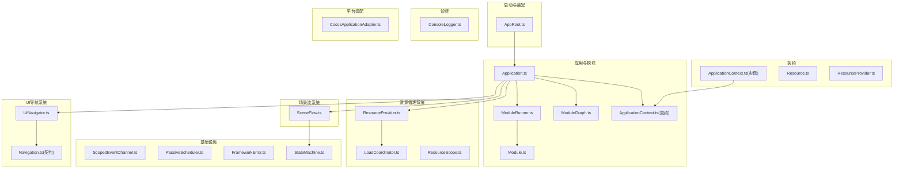

**更新** 架构图已添加资源管理、场景流和UI导航三大核心子系统，展示了完整的框架架构。

图表来源
- [AppRoot.ts:1-55](file://assets/boot/AppRoot.ts#L1-L55)
- [Application.ts:1-168](file://assets/framework/application/Application.ts#L1-L168)
- [ModuleRunner.ts:1-248](file://assets/framework/application/ModuleRunner.ts#L1-L248)
- [ModuleGraph.ts:1-86](file://assets/framework/application/ModuleGraph.ts#L1-L86)
- [ResourceProvider.ts:1-67](file://assets/framework/core/resource/ResourceProvider.ts#L1-L67)
- [SceneFlow.ts:1-397](file://assets/framework/core/scene/SceneFlow.ts#L1-L397)
- [UiNavigator.ts:1-206](file://assets/framework/core/ui/UiNavigator.ts#L1-206)
- [LoadCoordinator.ts:1-196](file://assets/framework/core/resource/LoadCoordinator.ts#L1-196)

## 核心组件
- 应用(Application)：维护创建→初始化→运行→暂停→停止→销毁的状态机，串行化操作队列，保证并发安全与幂等。
- 模块(Module)：以 id 标识，声明依赖集合，可选实现 initialize/start/pause/resume/stop/dispose 阶段钩子。
- 模块运行器(ModuleRunner)：按依赖顺序调用模块阶段方法，失败时进行反向清理，聚合清理异常并上报。
- 模块图(ModuleGraph)：基于注册顺序与依赖关系进行拓扑排序，校验重复 id、缺失依赖与循环依赖。
- 应用上下文(ApplicationContext)：暴露 logger 与当前状态，内部提供 _setState 供框架更新。
- **资源提供器(ResourceProvider)**：统一的资源加载入口，支持资源去重、作用域管理和批量卸载。
- **加载协调器(LoadCoordinator)**：实现资源加载的并发去重和结果共享，支持取消和失效机制。
- **场景流(SceneFlow)**：管理场景切换的完整流程，包括预加载、激活和所有权转移。
- **UI导航器(UiNavigator)**：基于页面栈的UI导航系统，支持七层层级和模态控制。
- 事件通道(ScopedEventChannel)：类型化 on/emit，订阅返回 DisposeHandle，支持作用域内 dispose 清理。
- 调度器(PassiveScheduler)：基于 TimeSource.now() 的延迟/周期任务调度，支持取消与错误隔离回调。
- 有限状态机(StateMachine)：类型安全的状态转换引擎，支持状态钩子、错误恢复和重入保护。
- 错误体系(FrameworkError)：统一错误基类，携带 cause、来源上下文与 recoverable 标记，提供 isRecoverableError 工具。
- 日志(ConsoleLogger)：基于 ScopedLogger 的结构化日志输出，默认包含敏感字段过滤。

**新增** 资源管理、场景流和UI导航三大子系统为框架提供了完整的游戏开发能力，包括资源生命周期管理、场景切换流程和UI界面导航。

章节来源
- [Application.ts:1-168](file://assets/framework/application/Application.ts#L1-L168)
- [ModuleRunner.ts:1-248](file://assets/framework/application/ModuleRunner.ts#L1-L248)
- [ModuleGraph.ts:1-86](file://assets/framework/application/ModuleGraph.ts#L1-L86)
- [ResourceProvider.ts:1-67](file://assets/framework/core/resource/ResourceProvider.ts#L1-67)
- [SceneFlow.ts:1-397](file://assets/framework/core/scene/SceneFlow.ts#L1-397)
- [UiNavigator.ts:1-206](file://assets/framework/core/ui/UiNavigator.ts#L1-206)
- [LoadCoordinator.ts:1-196](file://assets/framework/core/resource/LoadCoordinator.ts#L1-196)

## 架构总览
框架采用分层与契约化设计：
- 表现与接入层：AppRoot 作为 Cocos Creator 组件，完成装配与生命周期桥接。
- 应用管理层：Application 管理全局状态与模块编排，ModuleRunner 驱动模块阶段。
- 资源管理层：ResourceProvider 统一管理资源加载、缓存和作用域，LoadCoordinator 处理并发去重。
- 场景管理层：SceneFlow 编排场景切换流程，使用FSM管理状态转换。
- UI管理层：UiNavigator 管理页面栈和导航逻辑，支持多层级UI系统。
- 契约抽象层：contracts 定义跨层契约，避免实现耦合。
- 基础设施层：core 提供事件、调度、时间、错误、有限状态机等通用能力。
- 诊断层：diagnostics/logging 提供可插拔日志与脱敏。
- 平台适配层：adapters 将引擎事件映射到框架语义。

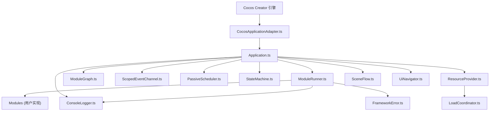

**更新** 架构图已添加资源管理、场景流和UI导航子系统，展示了完整的框架架构层次。

图表来源
- [CocosApplicationAdapter.ts:1-53](file://assets/framework/adapters/cocos/application/CocosApplicationAdapter.ts#L1-53)
- [Application.ts:1-168](file://assets/framework/application/Application.ts#L1-168)
- [ModuleRunner.ts:1-248](file://assets/framework/application/ModuleRunner.ts#L1-248)
- [ModuleGraph.ts:1-86](file://assets/framework/application/ModuleGraph.ts#L1-86)
- [ResourceProvider.ts:1-67](file://assets/framework/core/resource/ResourceProvider.ts#L1-67)
- [LoadCoordinator.ts:1-196](file://assets/framework/core/resource/LoadCoordinator.ts#L1-196)
- [SceneFlow.ts:1-397](file://assets/framework/core/scene/SceneFlow.ts#L1-397)
- [UiNavigator.ts:1-206](file://assets/framework/core/ui/UiNavigator.ts#L1-206)

## 详细组件分析

### 应用(Application)与生命周期
- 状态机：created → initializing → running → paused → stopping → disposed。
- 并发控制：通过 Promise 队列串行化 start/pause/resume/dispose，防止重入与竞态。
- 启动流程：构建有序模块列表，依次执行 initialize/start，失败则回滚 stop/dispose 并进入 disposed。
- 清理策略：stop 与 dispose 分别对已启动/已初始化的模块执行反向清理，收集异常并上报。

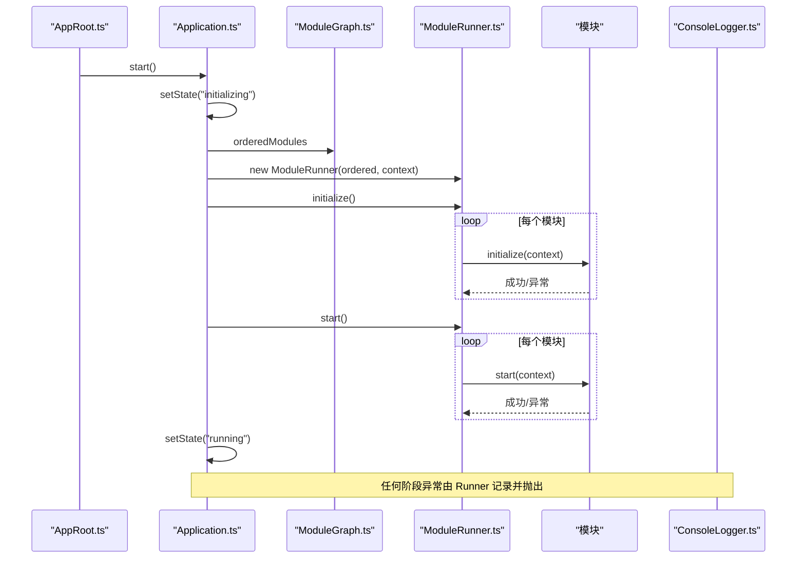

图表来源
- [Application.ts:1-168](file://assets/framework/application/Application.ts#L1-168)
- [ModuleRunner.ts:1-248](file://assets/framework/application/ModuleRunner.ts#L1-248)
- [ModuleGraph.ts:1-86](file://assets/framework/application/ModuleGraph.ts#L1-86)
- [ConsoleLogger.ts:1-56](file://assets/framework/diagnostics/logging/ConsoleLogger.ts#L1-56)

章节来源
- [Application.ts:1-168](file://assets/framework/application/Application.ts#L1-168)
- [ModuleRunner.ts:1-248](file://assets/framework/application/ModuleRunner.ts#L1-248)

### 资源管理系统
**新增** 资源管理系统提供统一的资源加载、缓存和作用域管理能力：

- **资源提供器(ResourceProvider)**：统一的资源加载入口，封装加载协调器和作用域注册表。
- **加载协调器(LoadCoordinator)**：实现资源加载的并发去重，同一资源的多个请求共享一次底层加载。
- **作用域管理**：通过 ResourceScope 管理资源的引用计数和自动释放。
- **资源类型支持**：支持普通资源和FairyGUI包两种资源类型。
- **失效机制**：支持资源终态缓存的失效，用于重试或重新加载场景。

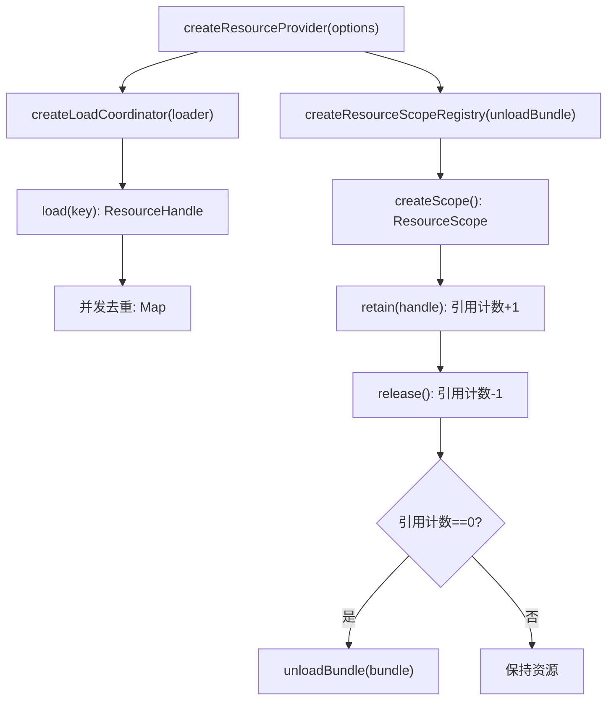

**图表来源**
- [ResourceProvider.ts:1-67](file://assets/framework/core/resource/ResourceProvider.ts#L1-67)
- [LoadCoordinator.ts:1-196](file://assets/framework/core/resource/LoadCoordinator.ts#L1-196)

**章节来源**
- [ResourceProvider.ts:1-67](file://assets/framework/core/resource/ResourceProvider.ts#L1-67)
- [LoadCoordinator.ts:1-196](file://assets/framework/core/resource/LoadCoordinator.ts#L1-196)
- [Resource.ts:1-35](file://assets/framework/contracts/resource/Resource.ts#L1-35)
- [ResourceProvider.ts:1-62](file://assets/framework/contracts/resource/ResourceProvider.ts#L1-62)

### 场景流系统
**新增** 场景流系统管理场景切换的完整流程，基于有限状态机确保状态一致性：

- **状态管理**：idle → preloading → transitioning → active → failed，使用FSM确保确定性转换。
- **预加载机制**：支持后台预加载目标场景资源，不立即切换当前场景。
- **资源复用**：智能复用已预加载的资源，避免重复加载开销。
- **进度上报**：单调不减的进度回调，从0到1表示加载完成。
- **错误处理**：切换失败保留当前场景，支持重试机制。
- **所有权转移**：安全的资源所有权转移，避免中间状态的资源泄漏。

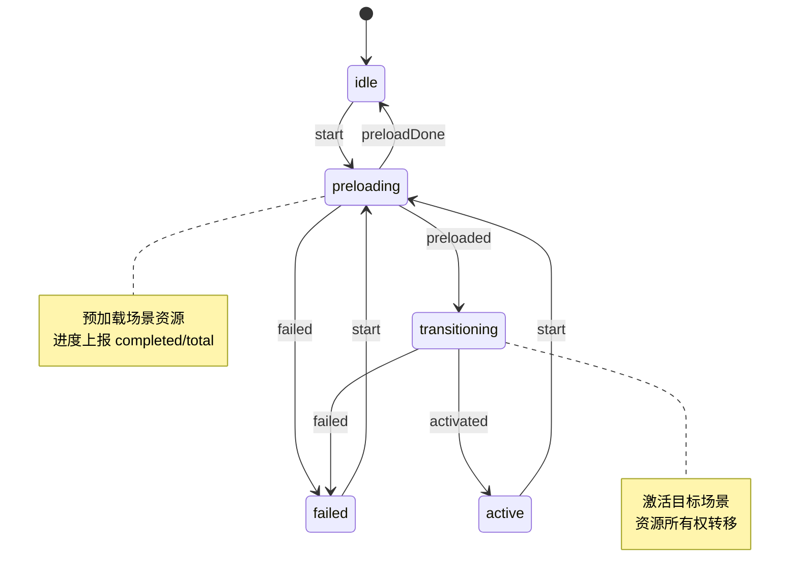

**图表来源**
- [SceneFlow.ts:1-397](file://assets/framework/core/scene/SceneFlow.ts#L1-397)

**章节来源**
- [SceneFlow.ts:1-397](file://assets/framework/core/scene/SceneFlow.ts#L1-397)

### UI导航系统
**新增** UI导航系统提供基于页面栈的界面导航能力：

- **页面栈管理**：支持页面的打开、关闭和返回操作，维护页面栈的正确性。
- **七层层级**：scene < normal < popup < guide < toast < loading < system，确保正确的显示顺序。
- **重复打开策略**：支持 reject（拒绝）、focus-existing（聚焦已有）、allow-stack（允许堆叠）三种策略。
- **模态控制**：支持阻断式页面，成为栈顶时导航进入模态状态。
- **作用域管理**：每个页面持有独立作用域，关闭时逆序释放所有登记资源。
- **错误隔离**：页面释放失败被隔离并上报，不中断其他页面的释放。

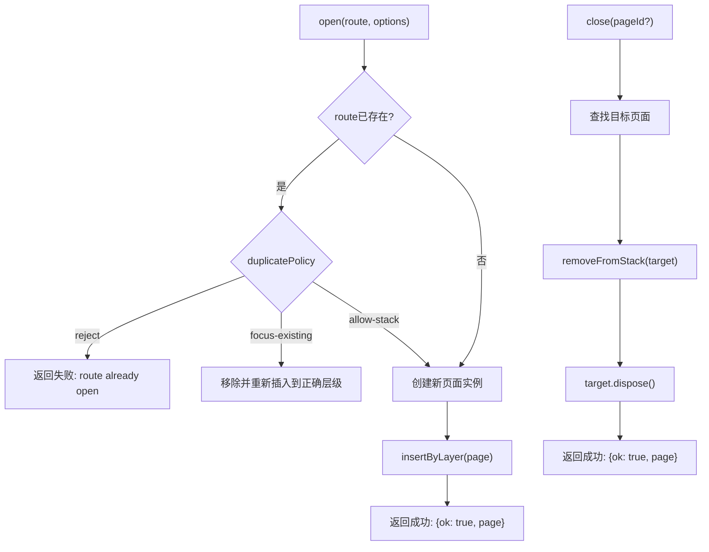

**图表来源**
- [UiNavigator.ts:1-206](file://assets/framework/core/ui/UiNavigator.ts#L1-206)

**章节来源**
- [UiNavigator.ts:1-206](file://assets/framework/core/ui/UiNavigator.ts#L1-206)
- [Navigation.ts:1-59](file://assets/framework/contracts/ui/Navigation.ts#L1-59)

### 模块运行器(ModuleRunner)与清理
- 阶段执行：按序调用 initialize/start/pause/resume/stop/dispose，失败包装为 ModuleLifecycleError 并记录。
- 清理策略：根据当前状态决定 stop/dispose 的执行范围，逆序清理，收集所有清理异常并聚合抛出。
- 状态跟踪：Map 维护模块运行时状态，确保幂等与正确性。

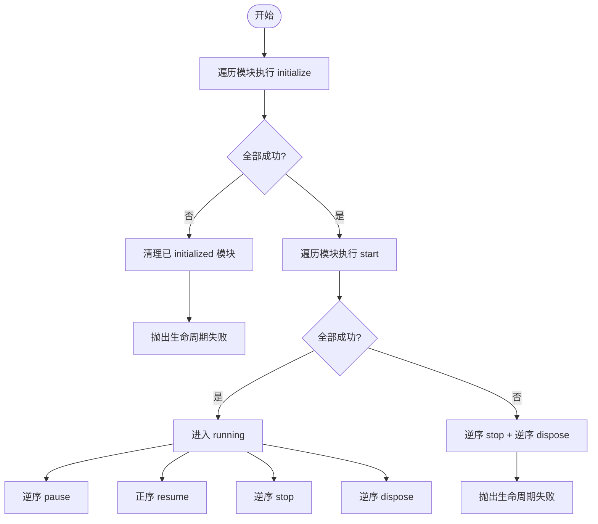

图表来源
- [ModuleRunner.ts:1-248](file://assets/framework/application/ModuleRunner.ts#L1-248)

章节来源
- [ModuleRunner.ts:1-248](file://assets/framework/application/ModuleRunner.ts#L1-248)

### 模块图(ModuleGraph)与依赖拓扑
- 输入校验：禁止空 id、重复 id、缺失依赖。
- 拓扑排序：基于依赖计数与注册顺序，生成稳定有序的模块序列。
- 环检测：若排序结果数量不足，说明存在循环依赖，抛出异常。

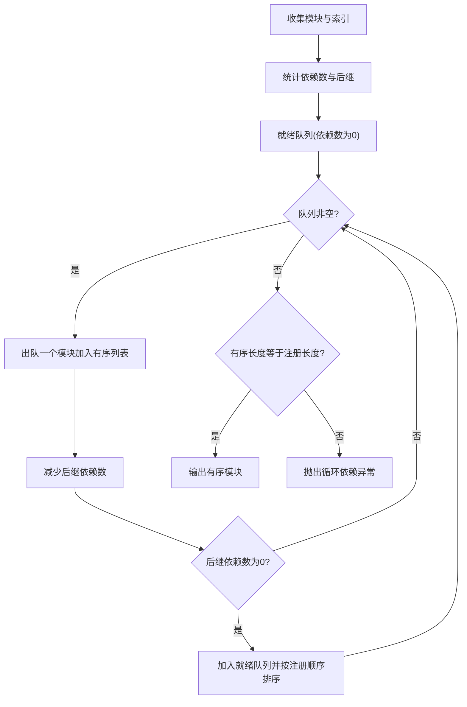

图表来源
- [ModuleGraph.ts:1-86](file://assets/framework/application/ModuleGraph.ts#L1-86)

章节来源
- [ModuleGraph.ts:1-86](file://assets/framework/application/ModuleGraph.ts#L1-86)

### 事件通道(ScopedEventChannel)
- 类型化：泛型 EventMap 约束事件名与载荷类型。
- 订阅/发布：on 返回 DisposeHandle，dispose 取消订阅；emit 同步触发，处理器异常经 onHandlerError 隔离。
- 作用域：dispose 清空所有订阅，避免内存泄漏。

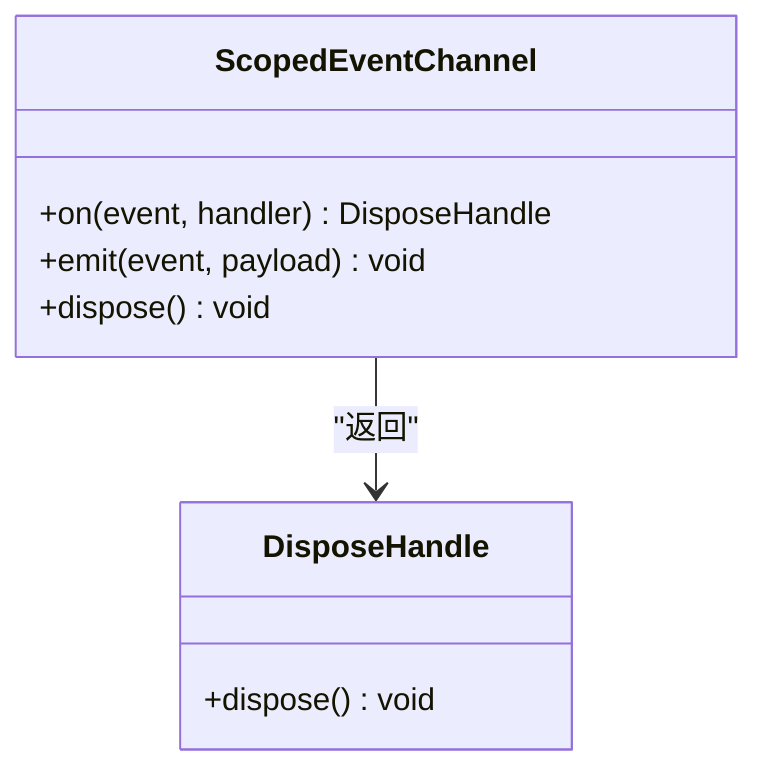

图表来源
- [ScopedEventChannel.ts:1-129](file://assets/framework/core/events/ScopedEventChannel.ts#L1-129)

章节来源
- [ScopedEventChannel.ts:1-129](file://assets/framework/core/events/ScopedEventChannel.ts#L1-129)

### 调度器(PassiveScheduler)
- 任务模型：延迟/周期任务，基于 TimeSource.now() 计算到期时间。
- 执行模型：tick 分片处理到期任务，支持取消与错误隔离回调。
- 资源释放：dispose 清空任务并标记不可再调度。

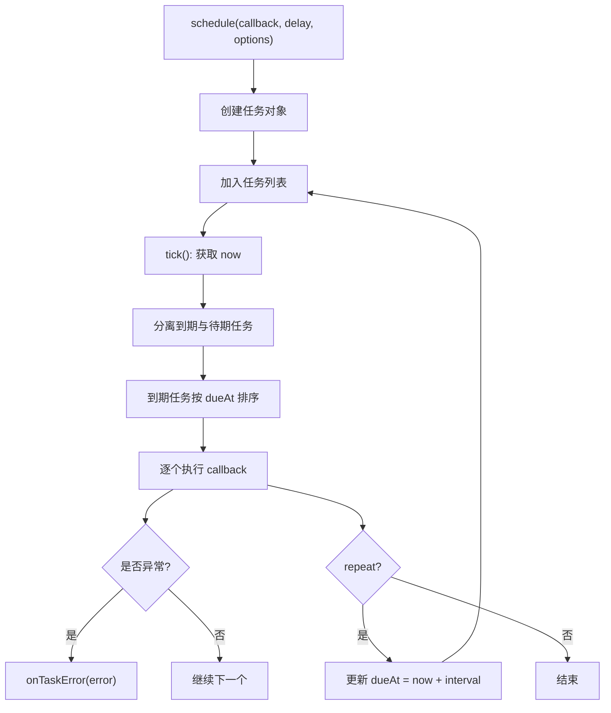

图表来源
- [PassiveScheduler.ts:1-116](file://assets/framework/core/scheduling/PassiveScheduler.ts#L1-116)

章节来源
- [PassiveScheduler.ts:1-116](file://assets/framework/core/scheduling/PassiveScheduler.ts#L1-116)

### 有限状态机(StateMachine)
- 类型安全：通过 TypeScript 泛型确保状态和事件的类型安全，编译时检查状态转换的有效性。
- 状态转换表：使用声明式的状态转换表定义所有可能的状态转换规则。
- 钩子函数：支持 onExit 和 onEnter 钩子，在状态切换前后执行自定义逻辑。
- 错误处理：内置错误处理机制，支持 onTransitionError 回调处理转换失败。
- 重入保护：防止递归调用导致的无限循环，确保状态一致性。
- 资源管理：实现 DisposeHandle 接口，支持资源清理和生命周期管理。

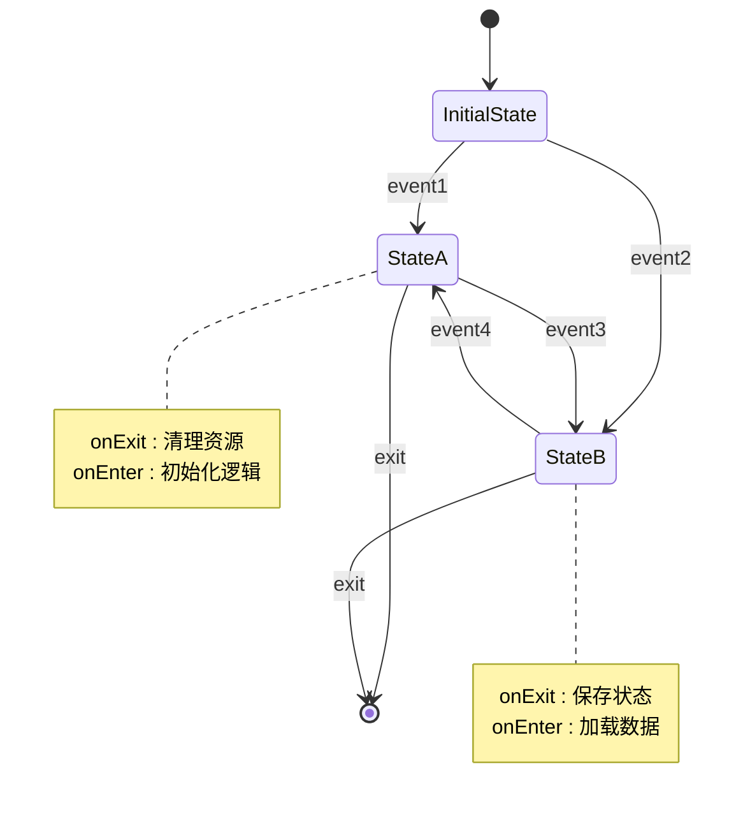

**图表来源**
- [StateMachine.ts:1-143](file://assets/framework/core/fsm/StateMachine.ts#L1-143)

**章节来源**
- [StateMachine.ts:1-143](file://assets/framework/core/fsm/StateMachine.ts#L1-143)

### 错误体系(FrameworkError)
- 统一基类：承载 cause、moduleId/phase/component 上下文与 recoverable 标记。
- 可恢复性：isRecoverableError 工具函数用于上层决策（重试/降级）。
- 兼容迁移：现有 ApplicationStateError、ModuleLifecycleError 保持构造签名与字段兼容。

章节来源
- [FrameworkError.ts:1-36](file://assets/framework/core/errors/FrameworkError.ts#L1-36)

### 日志(ConsoleLogger)
- 结构化：基于 LogRecord 与 LogContext，支持 child 作用域扩展。
- 脱敏：默认 redactRecord 过滤敏感键，sink 注入式无全局状态。
- 输出：对接 console.debug/info/warn/error。

章节来源
- [ConsoleLogger.ts:1-56](file://assets/framework/diagnostics/logging/ConsoleLogger.ts#L1-56)

### 平台适配(CocosApplicationAdapter)
- 事件映射：监听引擎显示/隐藏事件，调用 app.pause()/resume()。
- 错误隔离：状态不匹配导致的拒绝被忽略，日志由 Application 内部管理。

章节来源
- [CocosApplicationAdapter.ts:1-53](file://assets/framework/adapters/cocos/application/CocosApplicationAdapter.ts#L1-53)

### 启动装配(AppRoot)
- 装配顺序：创建 ConsoleLogger → createApplicationContext → 组装 modules → new Application → new CocosApplicationAdapter。
- 生命周期：onLoad 持久化节点，start 绑定适配器并启动应用，onDestroy 解绑并释放。

章节来源
- [AppRoot.ts:1-55](file://assets/boot/AppRoot.ts#L1-55)

## 依赖关系分析
- 框架与游戏边界：框架不依赖游戏，游戏可依赖框架；框架仅提供基础能力（生命周期、UI、资源、场景、存档、配置、日志、状态机）。
- 混合玩法架构：不强制统一 Gameplay 模型，允许按特性选择合适范式。
- 公开 API：根入口 index.ts 平铺导出契约与关键符号，便于外部导入与测试白名单校验。
- 子系统依赖：资源管理、场景流、UI导航都依赖核心基础设施（FSM、事件、调度、错误处理）。

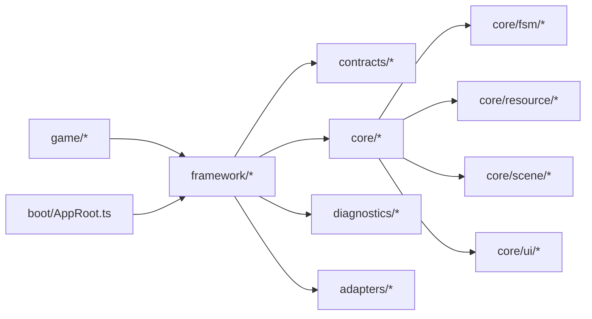

**更新** 依赖关系图已添加资源管理、场景流和UI导航子系统，展示了完整的框架依赖结构。

图表来源
- [index.ts:1-104](file://assets/framework/index.ts#L1-104)
- [ADR-005-framework-game-boundary.md:1-61](file://doc/decisions/ADR-005-framework-game-boundary.md#L1-61)
- [ADR-003-hybrid-architecture.md:1-75](file://doc/decisions/ADR-003-hybrid-architecture.md#L1-75)

章节来源
- [ADR-005-framework-game-boundary.md:1-61](file://doc/decisions/ADR-005-framework-game-boundary.md#L1-61)
- [ADR-003-hybrid-architecture.md:1-75](file://doc/decisions/ADR-003-hybrid-architecture.md#L1-75)
- [index.ts:1-104](file://assets/framework/index.ts#L1-104)

## 性能考量
- 模块执行顺序：拓扑排序保证最小依赖先行，降低初始化阻塞。
- 清理逆序：stop/dispose 逆序执行，避免资源未释放导致的二次清理开销。
- 事件与调度：事件处理器异常隔离，避免单点失败扩散；调度器 tick 批量处理，减少频繁唤醒。
- 状态机性能：FSM使用O(1)状态查找，钩子函数按需执行，错误处理零开销。
- 日志写入：结构化日志与脱敏在写入点收敛，避免业务侧重复处理。
- **资源加载优化**：加载协调器实现并发去重，避免重复加载相同资源。
- **场景切换优化**：支持资源复用，避免重复预加载已加载的场景资源。
- **UI导航优化**：页面栈操作为O(n)复杂度，层级插入使用二分查找优化。

**新增** 三大子系统都经过精心设计，确保高性能和低内存占用：
- 资源管理系统使用哈希表实现O(1)查找，支持并发去重
- 场景流系统使用FSM确保状态转换的确定性，避免不必要的状态检查
- UI导航系统使用数组存储页面栈，操作复杂度可控

[本节为通用指导，不直接分析具体文件]

## 故障排查指南
- 启动失败：检查模块依赖是否完整、是否存在循环依赖；查看 ModuleRunner 记录的 lifecycle 失败日志。
- 清理失败：关注 ModuleCleanupError 聚合的多个清理异常，定位首个 cause 对应的模块与阶段。
- 事件异常：确认 onHandlerError 是否被覆盖，避免静默失败；检查订阅是否在 dispose 后仍被触发。
- 调度异常：核对 delayMilliseconds 合法性与 TimeSource 一致性；检查 onTaskError 是否打印堆栈。
- 状态机异常：检查状态转换表定义是否正确，确认 onTransitionError 回调是否处理了异常情况。
- 错误分类：使用 isRecoverableError 判断是否可恢复，结合 moduleId/phase/component 定位来源。
- **资源加载失败**：检查资源路径是否正确，确认 bundle 名称和路径格式；查看 LoadCoordinator 的错误信息。
- **场景切换失败**：检查场景资源清单是否正确，确认 activateScene 回调是否正常；查看 SceneFlow 的状态变化。
- **UI导航异常**：检查页面路由是否正确，确认重复打开策略是否符合预期；查看页面栈的状态。

**新增** 三大子系统的故障排查要点：
- 资源加载：确认资源键格式正确，检查并发去重是否正常工作，验证作用域释放是否及时
- 场景切换：检查FSM状态转换是否正确，确认资源复用逻辑是否生效，验证错误恢复机制
- UI导航：确认页面层级设置正确，检查重复打开策略配置，验证页面作用域释放顺序

章节来源
- [ModuleRunner.ts:1-248](file://assets/framework/application/ModuleRunner.ts#L1-248)
- [FrameworkError.ts:1-36](file://assets/framework/core/errors/FrameworkError.ts#L1-36)
- [ScopedEventChannel.ts:1-129](file://assets/framework/core/events/ScopedEventChannel.ts#L1-129)
- [PassiveScheduler.ts:1-116](file://assets/framework/core/scheduling/PassiveScheduler.ts#L1-116)
- [StateMachine.ts:1-143](file://assets/framework/core/fsm/StateMachine.ts#L1-143)
- [ResourceProvider.ts:1-67](file://assets/framework/core/resource/ResourceProvider.ts#L1-67)
- [SceneFlow.ts:1-397](file://assets/framework/core/scene/SceneFlow.ts#L1-397)
- [UiNavigator.ts:1-206](file://assets/framework/core/ui/UiNavigator.ts#L1-206)

## 结论
AI Game Kit 框架以"应用-模块"生命周期为核心，通过契约化接口与类型化错误、作用域事件通道、有限状态机等横切能力，构建了高内聚、低耦合的可扩展架构。**框架现已发展为完整的游戏开发框架**，新增了资源管理、场景流、UI导航等多个核心子系统，形成了更完整的架构体系。框架与游戏边界清晰，混合玩法架构灵活适配多类型游戏。通过严格的依赖拓扑、幂等状态机与完善的诊断体系，框架在保证稳定性的同时，为业务快速迭代提供了坚实基础。

**更新** 资源管理、场景流和UI导航三大子系统的加入，使框架具备了完整的游戏开发能力，包括资源生命周期管理、场景切换流程和UI界面导航，为复杂游戏应用的开发提供了强大的基础设施支持。

[本节为总结性内容，不直接分析具体文件]

## 附录

### 技术栈与依赖
- 引擎：Cocos Creator（版本见 package.json）
- 语言：TypeScript
- 测试：bun test（foundation 单元测试与类型契约检查）

章节来源
- [package.json:1-12](file://package.json#L1-12)

### 部署拓扑与基础设施要求
- 运行环境：Cocos Creator 项目结构，assets/framework 与 assets/boot 为框架与启动入口。
- 平台适配：通过 CocosApplicationAdapter 桥接引擎事件，无需额外中间件。
- 可扩展性：新增模块仅需实现 Module 契约并声明依赖；新增平台能力遵循 contracts 平铺导出约定。
- 资源管理：需要实现 IResourceProvider 接口，提供 loader 和 unloadBundle 回调。
- 场景管理：需要实现 activateScene 回调，映射到引擎的场景加载API。
- UI系统：需要实现页面渲染逻辑，与具体的UI框架（如FairyGUI）集成。

**新增** 三大子系统的部署要求：
- 资源管理系统：需要配置资源提供器，实现引擎特定的资源加载和卸载逻辑
- 场景流系统：需要配置场景激活回调，处理引擎特定的场景切换逻辑
- UI导航系统：需要配置页面渲染器，处理具体的UI框架集成

章节来源
- [AppRoot.ts:1-55](file://assets/boot/AppRoot.ts#L1-55)
- [CocosApplicationAdapter.ts:1-53](file://assets/framework/adapters/cocos/application/CocosApplicationAdapter.ts#L1-53)
- [index.ts:1-104](file://assets/framework/index.ts#L1-104)
- [ResourceProvider.ts:1-67](file://assets/framework/core/resource/ResourceProvider.ts#L1-67)
- [SceneFlow.ts:1-397](file://assets/framework/core/scene/SceneFlow.ts#L1-397)
- [UiNavigator.ts:1-206](file://assets/framework/core/ui/UiNavigator.ts#L1-206)

### 系统上下文图
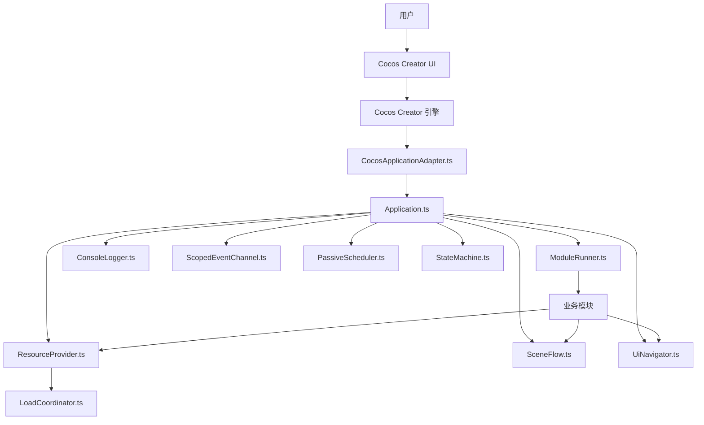

**更新** 系统上下文图已添加资源管理、场景流和UI导航子系统，展示了完整的系统交互关系。

图表来源
- [CocosApplicationAdapter.ts:1-53](file://assets/framework/adapters/cocos/application/CocosApplicationAdapter.ts#L1-53)
- [Application.ts:1-168](file://assets/framework/application/Application.ts#L1-168)
- [ModuleRunner.ts:1-248](file://assets/framework/application/ModuleRunner.ts#L1-248)
- [ConsoleLogger.ts:1-56](file://assets/framework/diagnostics/logging/ConsoleLogger.ts#L1-56)
- [ScopedEventChannel.ts:1-129](file://assets/framework/core/events/ScopedEventChannel.ts#L1-129)
- [PassiveScheduler.ts:1-116](file://assets/framework/core/scheduling/PassiveScheduler.ts#L1-116)
- [StateMachine.ts:1-143](file://assets/framework/core/fsm/StateMachine.ts#L1-143)
- [ResourceProvider.ts:1-67](file://assets/framework/core/resource/ResourceProvider.ts#L1-67)
- [SceneFlow.ts:1-397](file://assets/framework/core/scene/SceneFlow.ts#L1-397)
- [UiNavigator.ts:1-206](file://assets/framework/core/ui/UiNavigator.ts#L1-206)
- [LoadCoordinator.ts:1-196](file://assets/framework/core/resource/LoadCoordinator.ts#L1-196)