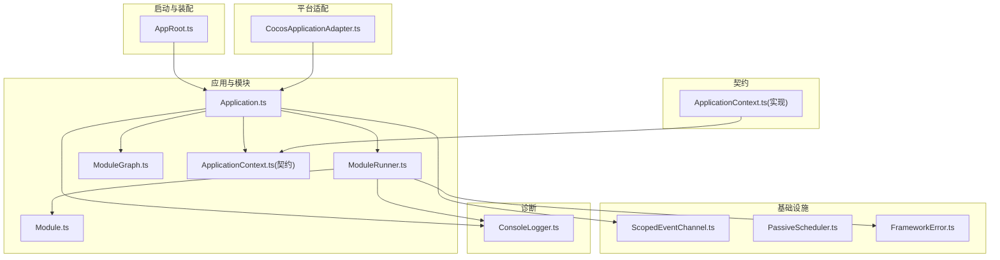
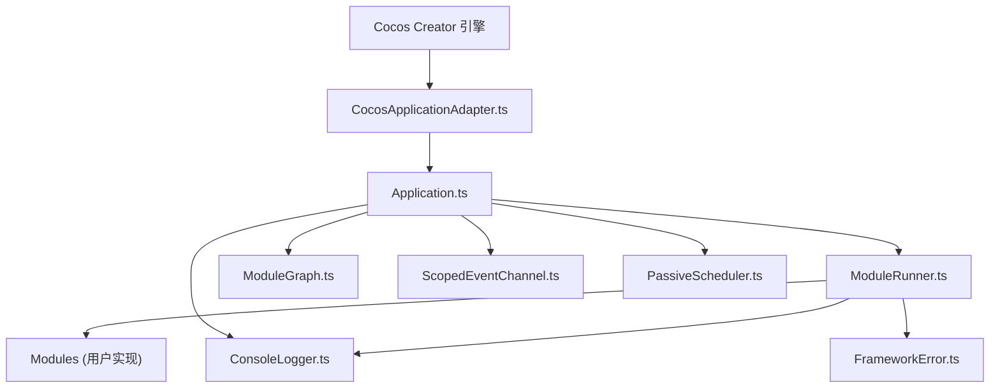
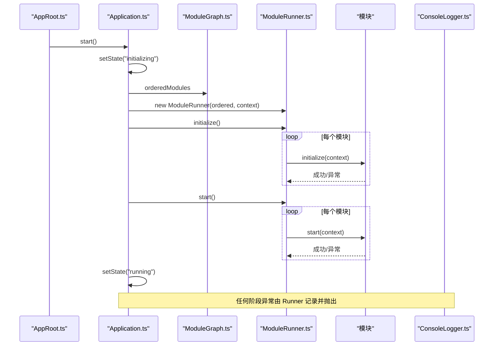
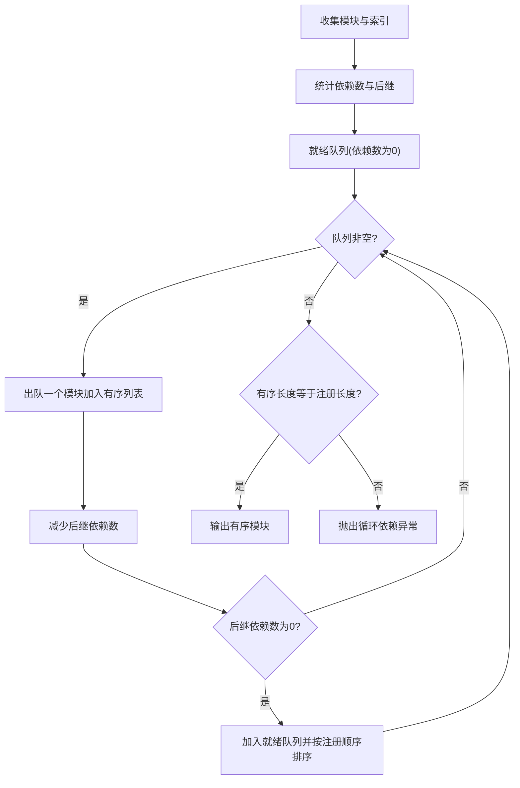
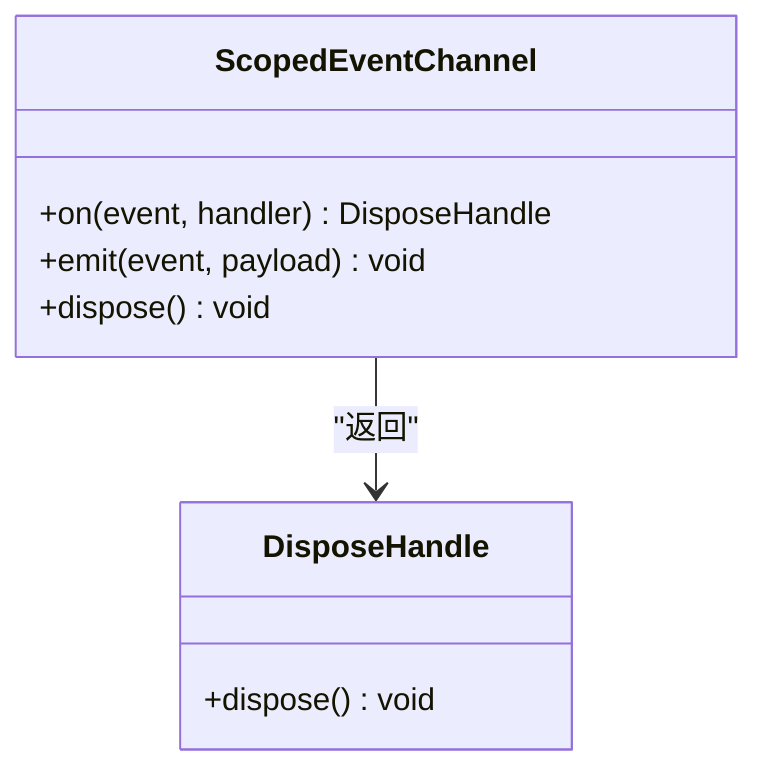
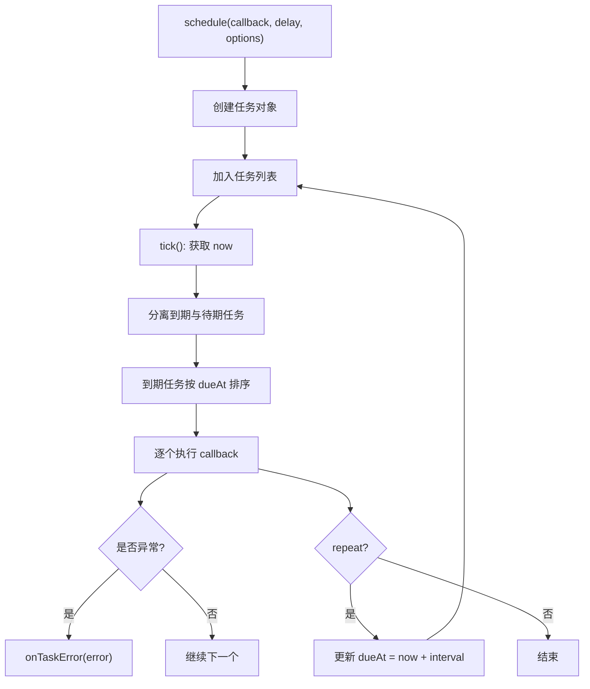
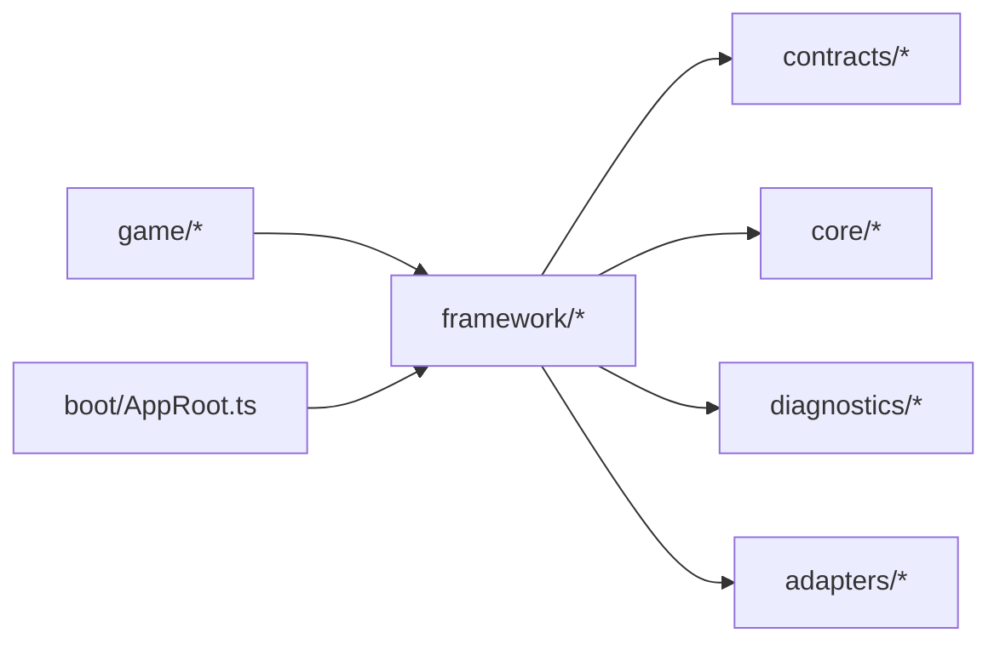
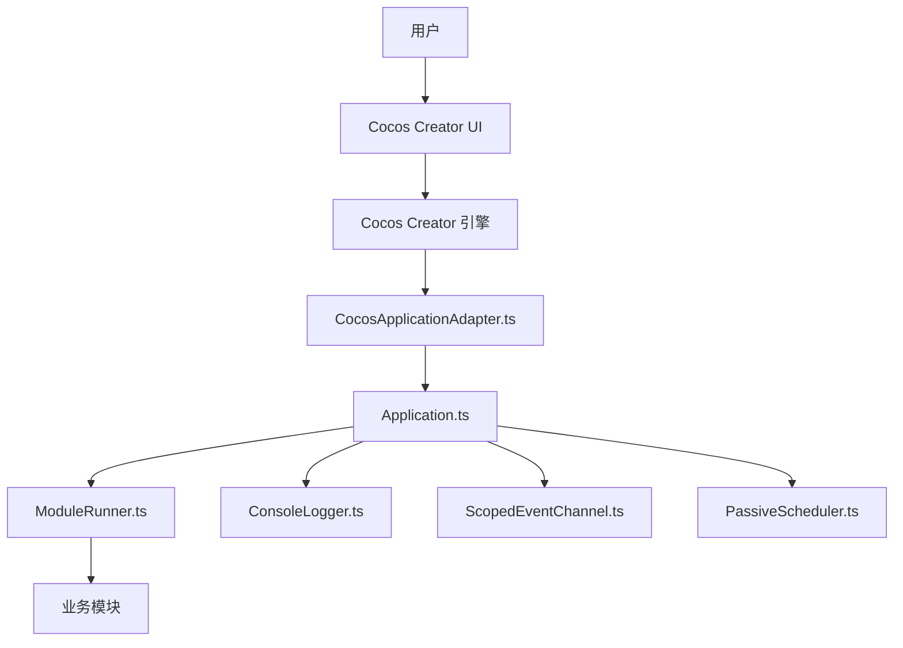

# 框架架构

<cite>
**本文引用的文件**
- [index.ts](file://assets/framework/index.ts)
- [Application.ts](file://assets/framework/application/Application.ts)
- [ApplicationContext.ts](file://assets/framework/application/ApplicationContext.ts)
- [ModuleRunner.ts](file://assets/framework/application/ModuleRunner.ts)
- [ModuleGraph.ts](file://assets/framework/application/ModuleGraph.ts)
- [Module.ts](file://assets/framework/contracts/module/Module.ts)
- [ApplicationContext.ts](file://assets/framework/contracts/application/ApplicationContext.ts)
- [CocosApplicationAdapter.ts](file://assets/framework/adapters/cocos/application/CocosApplicationAdapter.ts)
- [ScopedEventChannel.ts](file://assets/framework/core/events/ScopedEventChannel.ts)
- [PassiveScheduler.ts](file://assets/framework/core/scheduling/PassiveScheduler.ts)
- [FrameworkError.ts](file://assets/framework/core/errors/FrameworkError.ts)
- [ConsoleLogger.ts](file://assets/framework/diagnostics/logging/ConsoleLogger.ts)
- [AppRoot.ts](file://assets/boot/AppRoot.ts)
- [package.json](file://package.json)
- [ADR-003-hybrid-architecture.md](file://doc/decisions/ADR-003-hybrid-architecture.md)
- [ADR-005-framework-game-boundary.md](file://doc/decisions/ADR-005-framework-game-boundary.md)
- [ADR-007-typed-errors-and-scoped-events.md](file://doc/decisions/ADR-007-typed-errors-and-scoped-events.md)
</cite>

## 目录
1. [简介](#简介)
2. [项目结构](#项目结构)
3. [核心组件](#核心组件)
4. [架构总览](#架构总览)
5. [详细组件分析](#详细组件分析)
6. [依赖关系分析](#依赖关系分析)
7. [性能考量](#性能考量)
8. [故障排查指南](#故障排查指南)
9. [结论](#结论)
10. [附录](#附录)

## 简介
本架构文档面向 AI Game Kit 框架，聚焦高层设计、架构模式与系统边界。框架采用“应用-模块”生命周期管理为核心，通过契约化接口解耦平台适配、事件与调度等横切能力，并以类型化错误与作用域事件通道保障可维护性与稳定性。框架不强制统一玩法模型，允许业务层按特性选择 OOP/ECS/状态机/命令/行为树等实现方式；同时严格划分框架与游戏的职责边界，确保框架稳定、游戏快速演进。

## 项目结构
- 入口与装配：启动场景中的 AppRoot 负责组装日志、上下文、模块与应用实例，并绑定平台适配器。
- 应用与模块：Application 管理全局生命周期与模块编排；ModuleRunner 驱动各模块的阶段执行与清理；ModuleGraph 负责依赖拓扑排序与环检测。
- 契约与抽象：contracts 定义 Application、Module、Platform、TimeSource、Logger 等核心契约。
- 基础设施：core 提供事件通道、调度器、时间源、错误基类等通用能力。
- 诊断：diagnostics/logging 提供结构化日志与脱敏过滤。
- 平台适配：adapters/cocos 将引擎事件映射为框架的 pause/resume。

图表来源
- [AppRoot.ts:1-55](file://assets/boot/AppRoot.ts#L1-L55)
- [Application.ts:1-168](file://assets/framework/application/Application.ts#L1-L168)
- [ModuleRunner.ts:1-248](file://assets/framework/application/ModuleRunner.ts#L1-L248)
- [ModuleGraph.ts:1-86](file://assets/framework/application/ModuleGraph.ts#L1-L86)
- [Module.ts:1-30](file://assets/framework/contracts/module/Module.ts#L1-L30)
- [ApplicationContext.ts(契约):1-18](file://assets/framework/contracts/application/ApplicationContext.ts#L1-L18)
- [ApplicationContext.ts(实现):1-26](file://assets/framework/application/ApplicationContext.ts#L1-L26)
- [ScopedEventChannel.ts:1-129](file://assets/framework/core/events/ScopedEventChannel.ts#L1-L129)
- [PassiveScheduler.ts:1-116](file://assets/framework/core/scheduling/PassiveScheduler.ts#L1-L116)
- [FrameworkError.ts:1-36](file://assets/framework/core/errors/FrameworkError.ts#L1-L36)
- [ConsoleLogger.ts:1-56](file://assets/framework/diagnostics/logging/ConsoleLogger.ts#L1-L56)
- [CocosApplicationAdapter.ts:1-53](file://assets/framework/adapters/cocos/application/CocosApplicationAdapter.ts#L1-L53)

章节来源
- [AppRoot.ts:1-55](file://assets/boot/AppRoot.ts#L1-L55)
- [index.ts:1-44](file://assets/framework/index.ts#L1-L44)

## 核心组件
- 应用(Application)：维护创建→初始化→运行→暂停→停止→销毁的状态机，串行化操作队列，保证并发安全与幂等。
- 模块(Module)：以 id 标识，声明依赖集合，可选实现 initialize/start/pause/resume/stop/dispose 阶段钩子。
- 模块运行器(ModuleRunner)：按依赖顺序调用模块阶段方法，失败时进行反向清理，聚合清理异常并上报。
- 模块图(ModuleGraph)：基于注册顺序与依赖关系进行拓扑排序，校验重复 id、缺失依赖与循环依赖。
- 应用上下文(ApplicationContext)：暴露 logger 与当前状态，内部提供 _setState 供框架更新。
- 事件通道(ScopedEventChannel)：类型化 on/emit，订阅返回 DisposeHandle，支持作用域内 dispose 清理。
- 调度器(PassiveScheduler)：基于 TimeSource.now() 的延迟/周期任务调度，支持取消与错误隔离回调。
- 错误体系(FrameworkError)：统一错误基类，携带 cause、来源上下文与 recoverable 标记，提供 isRecoverableError 工具。
- 日志(ConsoleLogger)：基于 ScopedLogger 的结构化日志输出，默认包含敏感字段过滤。

章节来源
- [Application.ts:1-168](file://assets/framework/application/Application.ts#L1-L168)
- [ModuleRunner.ts:1-248](file://assets/framework/application/ModuleRunner.ts#L1-L248)
- [ModuleGraph.ts:1-86](file://assets/framework/application/ModuleGraph.ts#L1-L86)
- [Module.ts:1-30](file://assets/framework/contracts/module/Module.ts#L1-L30)
- [ApplicationContext.ts(契约):1-18](file://assets/framework/contracts/application/ApplicationContext.ts#L1-L18)
- [ApplicationContext.ts(实现):1-26](file://assets/framework/application/ApplicationContext.ts#L1-L26)
- [ScopedEventChannel.ts:1-129](file://assets/framework/core/events/ScopedEventChannel.ts#L1-L129)
- [PassiveScheduler.ts:1-116](file://assets/framework/core/scheduling/PassiveScheduler.ts#L1-L116)
- [FrameworkError.ts:1-36](file://assets/framework/core/errors/FrameworkError.ts#L1-L36)
- [ConsoleLogger.ts:1-56](file://assets/framework/diagnostics/logging/ConsoleLogger.ts#L1-L56)

## 架构总览
框架采用分层与契约化设计：
- 表现与接入层：AppRoot 作为 Cocos Creator 组件，完成装配与生命周期桥接。
- 应用管理层：Application 管理全局状态与模块编排，ModuleRunner 驱动模块阶段。
- 契约抽象层：contracts 定义跨层契约，避免实现耦合。
- 基础设施层：core 提供事件、调度、时间、错误等通用能力。
- 诊断层：diagnostics/logging 提供可插拔日志与脱敏。
- 平台适配层：adapters 将引擎事件映射到框架语义。

图表来源
- [CocosApplicationAdapter.ts:1-53](file://assets/framework/adapters/cocos/application/CocosApplicationAdapter.ts#L1-L53)
- [Application.ts:1-168](file://assets/framework/application/Application.ts#L1-L168)
- [ModuleRunner.ts:1-248](file://assets/framework/application/ModuleRunner.ts#L1-L248)
- [ModuleGraph.ts:1-86](file://assets/framework/application/ModuleGraph.ts#L1-L86)
- [ConsoleLogger.ts:1-56](file://assets/framework/diagnostics/logging/ConsoleLogger.ts#L1-L56)
- [ScopedEventChannel.ts:1-129](file://assets/framework/core/events/ScopedEventChannel.ts#L1-L129)
- [PassiveScheduler.ts:1-116](file://assets/framework/core/scheduling/PassiveScheduler.ts#L1-L116)
- [FrameworkError.ts:1-36](file://assets/framework/core/errors/FrameworkError.ts#L1-L36)

## 详细组件分析

### 应用(Application)与生命周期
- 状态机：created → initializing → running → paused → stopping → disposed。
- 并发控制：通过 Promise 队列串行化 start/pause/resume/dispose，防止重入与竞态。
- 启动流程：构建有序模块列表，依次执行 initialize/start，失败则回滚 stop/dispose 并进入 disposed。
- 清理策略：stop 与 dispose 分别对已启动/已初始化的模块执行反向清理，收集异常并上报。

图表来源
- [Application.ts:1-168](file://assets/framework/application/Application.ts#L1-L168)
- [ModuleRunner.ts:1-248](file://assets/framework/application/ModuleRunner.ts#L1-L248)
- [ModuleGraph.ts:1-86](file://assets/framework/application/ModuleGraph.ts#L1-L86)
- [ConsoleLogger.ts:1-56](file://assets/framework/diagnostics/logging/ConsoleLogger.ts#L1-L56)

章节来源
- [Application.ts:1-168](file://assets/framework/application/Application.ts#L1-L168)
- [ModuleRunner.ts:1-248](file://assets/framework/application/ModuleRunner.ts#L1-L248)

### 模块运行器(ModuleRunner)与清理
- 阶段执行：按序调用 initialize/start/pause/resume/stop/dispose，失败包装为 ModuleLifecycleError 并记录。
- 清理策略：根据当前状态决定 stop/dispose 的执行范围，逆序清理，收集所有清理异常并聚合抛出。
- 状态跟踪：Map 维护模块运行时状态，确保幂等与正确性。

图表来源
- [ModuleRunner.ts:1-248](file://assets/framework/application/ModuleRunner.ts#L1-L248)

章节来源
- [ModuleRunner.ts:1-248](file://assets/framework/application/ModuleRunner.ts#L1-L248)

### 模块图(ModuleGraph)与依赖拓扑
- 输入校验：禁止空 id、重复 id、缺失依赖。
- 拓扑排序：基于依赖计数与注册顺序，生成稳定有序的模块序列。
- 环检测：若排序结果数量不足，说明存在循环依赖，抛出异常。

图表来源
- [ModuleGraph.ts:1-86](file://assets/framework/application/ModuleGraph.ts#L1-L86)

章节来源
- [ModuleGraph.ts:1-86](file://assets/framework/application/ModuleGraph.ts#L1-L86)

### 事件通道(ScopedEventChannel)
- 类型化：泛型 EventMap 约束事件名与载荷类型。
- 订阅/发布：on 返回 DisposeHandle，dispose 取消订阅；emit 同步触发，处理器异常经 onHandlerError 隔离。
- 作用域：dispose 清空所有订阅，避免内存泄漏。

图表来源
- [ScopedEventChannel.ts:1-129](file://assets/framework/core/events/ScopedEventChannel.ts#L1-L129)

章节来源
- [ScopedEventChannel.ts:1-129](file://assets/framework/core/events/ScopedEventChannel.ts#L1-L129)

### 调度器(PassiveScheduler)
- 任务模型：延迟/周期任务，基于 TimeSource.now() 计算到期时间。
- 执行模型：tick 分片处理到期任务，支持取消与错误隔离回调。
- 资源释放：dispose 清空任务并标记不可再调度。

图表来源
- [PassiveScheduler.ts:1-116](file://assets/framework/core/scheduling/PassiveScheduler.ts#L1-L116)

章节来源
- [PassiveScheduler.ts:1-116](file://assets/framework/core/scheduling/PassiveScheduler.ts#L1-L116)

### 错误体系(FrameworkError)
- 统一基类：承载 cause、moduleId/phase/component 上下文与 recoverable 标记。
- 可恢复性：isRecoverableError 工具函数用于上层决策（重试/降级）。
- 兼容迁移：现有 ApplicationStateError、ModuleLifecycleError 保持构造签名与字段兼容。

章节来源
- [FrameworkError.ts:1-36](file://assets/framework/core/errors/FrameworkError.ts#L1-L36)
- [ADR-007-typed-errors-and-scoped-events.md:1-60](file://doc/decisions/ADR-007-typed-errors-and-scoped-events.md#L1-L60)

### 日志(ConsoleLogger)
- 结构化：基于 LogRecord 与 LogContext，支持 child 作用域扩展。
- 脱敏：默认 redactRecord 过滤敏感键，sink 注入式无全局状态。
- 输出：对接 console.debug/info/warn/error。

章节来源
- [ConsoleLogger.ts:1-56](file://assets/framework/diagnostics/logging/ConsoleLogger.ts#L1-L56)

### 平台适配(CocosApplicationAdapter)
- 事件映射：监听引擎显示/隐藏事件，调用 app.pause()/resume()。
- 错误隔离：状态不匹配导致的拒绝被忽略，日志由 Application 内部管理。

章节来源
- [CocosApplicationAdapter.ts:1-53](file://assets/framework/adapters/cocos/application/CocosApplicationAdapter.ts#L1-L53)

### 启动装配(AppRoot)
- 装配顺序：创建 ConsoleLogger → createApplicationContext → 组装 modules → new Application → new CocosApplicationAdapter。
- 生命周期：onLoad 持久化节点，start 绑定适配器并启动应用，onDestroy 解绑并释放。

章节来源
- [AppRoot.ts:1-55](file://assets/boot/AppRoot.ts#L1-L55)

## 依赖关系分析
- 框架与游戏边界：框架不依赖游戏，游戏可依赖框架；框架仅提供基础能力（生命周期、UI、资源、场景、存档、配置、日志）。
- 混合玩法架构：不强制统一 Gameplay 模型，允许按特性选择合适范式。
- 公开 API：根入口 index.ts 平铺导出契约与关键符号，便于外部导入与测试白名单校验。

图表来源
- [index.ts:1-44](file://assets/framework/index.ts#L1-L44)
- [ADR-005-framework-game-boundary.md:1-61](file://doc/decisions/ADR-005-framework-game-boundary.md#L1-L61)
- [ADR-003-hybrid-architecture.md:1-75](file://doc/decisions/ADR-003-hybrid-architecture.md#L1-L75)

章节来源
- [ADR-005-framework-game-boundary.md:1-61](file://doc/decisions/ADR-005-framework-game-boundary.md#L1-L61)
- [ADR-003-hybrid-architecture.md:1-75](file://doc/decisions/ADR-003-hybrid-architecture.md#L1-L75)
- [index.ts:1-44](file://assets/framework/index.ts#L1-L44)

## 性能考量
- 模块执行顺序：拓扑排序保证最小依赖先行，降低初始化阻塞。
- 清理逆序：stop/dispose 逆序执行，避免资源未释放导致的二次清理开销。
- 事件与调度：事件处理器异常隔离，避免单点失败扩散；调度器 tick 批量处理，减少频繁唤醒。
- 日志写入：结构化日志与脱敏在写入点收敛，避免业务侧重复处理。

[本节为通用指导，不直接分析具体文件]

## 故障排查指南
- 启动失败：检查模块依赖是否完整、是否存在循环依赖；查看 ModuleRunner 记录的 lifecycle 失败日志。
- 清理失败：关注 ModuleCleanupError 聚合的多个清理异常，定位首个 cause 对应的模块与阶段。
- 事件异常：确认 onHandlerError 是否被覆盖，避免静默失败；检查订阅是否在 dispose 后仍被触发。
- 调度异常：核对 delayMilliseconds 合法性与 TimeSource 一致性；检查 onTaskError 是否打印堆栈。
- 错误分类：使用 isRecoverableError 判断是否可恢复，结合 moduleId/phase/component 定位来源。

章节来源
- [ModuleRunner.ts:1-248](file://assets/framework/application/ModuleRunner.ts#L1-L248)
- [FrameworkError.ts:1-36](file://assets/framework/core/errors/FrameworkError.ts#L1-L36)
- [ScopedEventChannel.ts:1-129](file://assets/framework/core/events/ScopedEventChannel.ts#L1-L129)
- [PassiveScheduler.ts:1-116](file://assets/framework/core/scheduling/PassiveScheduler.ts#L1-L116)

## 结论
AI Game Kit 框架以“应用-模块”生命周期为核心，通过契约化接口与类型化错误、作用域事件通道等横切能力，构建了高内聚、低耦合的可扩展架构。框架与游戏边界清晰，混合玩法架构灵活适配多类型游戏。通过严格的依赖拓扑、幂等状态机与完善的诊断体系，框架在保证稳定性的同时，为业务快速迭代提供了坚实基础。

[本节为总结性内容，不直接分析具体文件]

## 附录

### 技术栈与依赖
- 引擎：Cocos Creator（版本见 package.json）
- 语言：TypeScript
- 测试：bun test（foundation 单元测试与类型契约检查）

章节来源
- [package.json:1-12](file://package.json#L1-L12)

### 部署拓扑与基础设施要求
- 运行环境：Cocos Creator 项目结构，assets/framework 与 assets/boot 为框架与启动入口。
- 平台适配：通过 CocosApplicationAdapter 桥接引擎事件，无需额外中间件。
- 可扩展性：新增模块仅需实现 Module 契约并声明依赖；新增平台能力遵循 contracts 平铺导出约定。

章节来源
- [AppRoot.ts:1-55](file://assets/boot/AppRoot.ts#L1-L55)
- [CocosApplicationAdapter.ts:1-53](file://assets/framework/adapters/cocos/application/CocosApplicationAdapter.ts#L1-L53)
- [index.ts:1-44](file://assets/framework/index.ts#L1-L44)

### 系统上下文图

图表来源
- [CocosApplicationAdapter.ts:1-53](file://assets/framework/adapters/cocos/application/CocosApplicationAdapter.ts#L1-L53)
- [Application.ts:1-168](file://assets/framework/application/Application.ts#L1-L168)
- [ModuleRunner.ts:1-248](file://assets/framework/application/ModuleRunner.ts#L1-L248)
- [ConsoleLogger.ts:1-56](file://assets/framework/diagnostics/logging/ConsoleLogger.ts#L1-L56)
- [ScopedEventChannel.ts:1-129](file://assets/framework/core/events/ScopedEventChannel.ts#L1-L129)
- [PassiveScheduler.ts:1-116](file://assets/framework/core/scheduling/PassiveScheduler.ts#L1-L116)