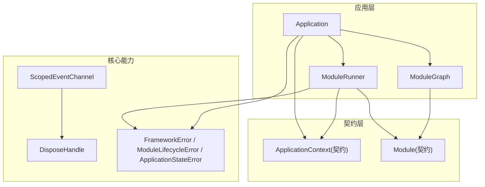
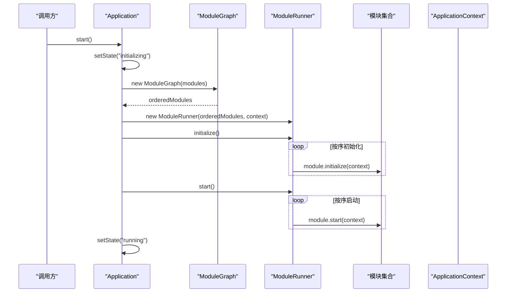
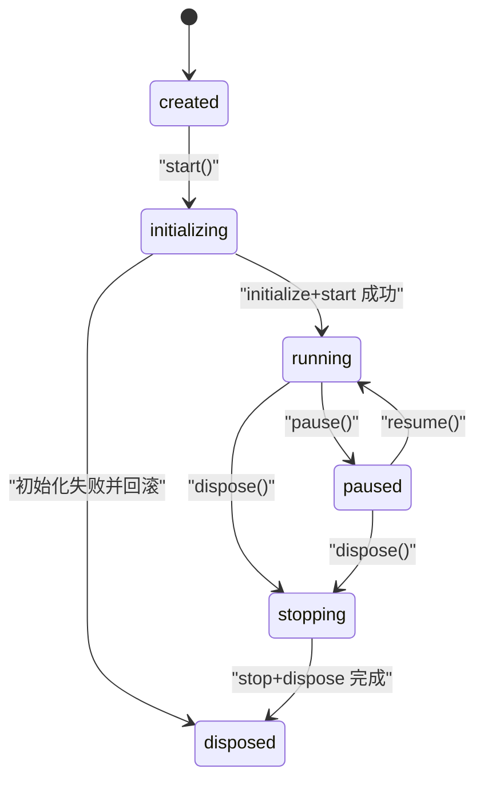
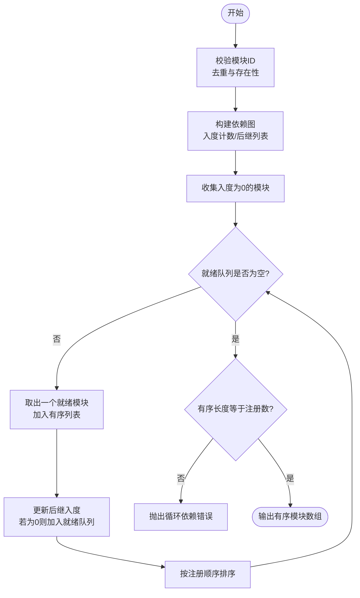
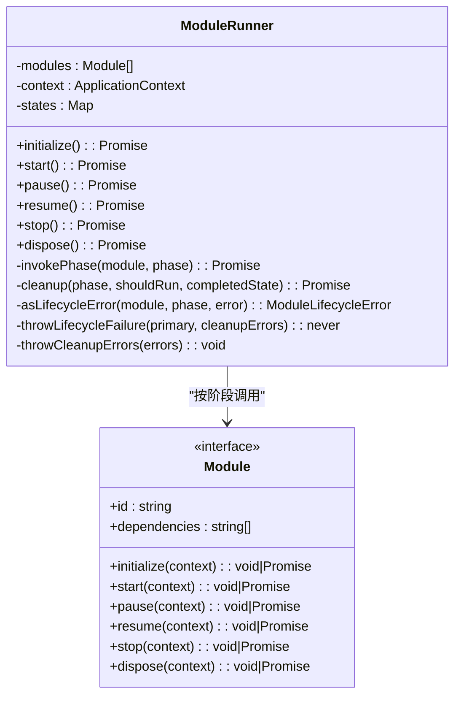
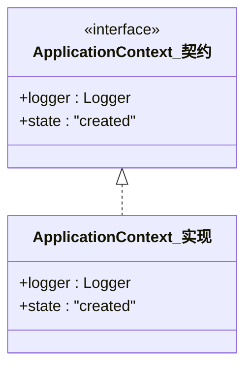
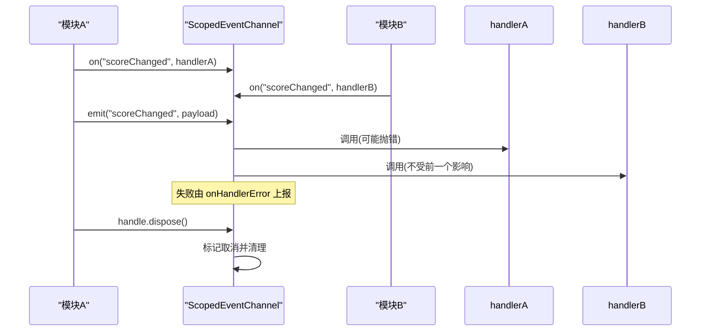
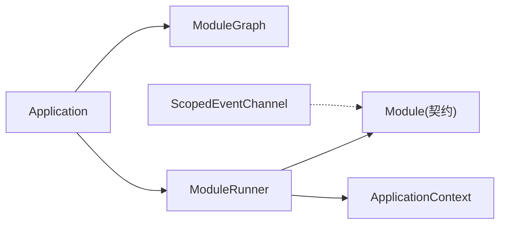

# 组件交互

<cite>
**本文引用的文件**   
- [Application.ts](file://assets/framework/application/Application.ts)
- [ModuleRunner.ts](file://assets/framework/application/ModuleRunner.ts)
- [ModuleGraph.ts](file://assets/framework/application/ModuleGraph.ts)
- [ApplicationContext.ts（实现）](file://assets/framework/application/ApplicationContext.ts)
- [ScopedEventChannel.ts](file://assets/framework/core/events/ScopedEventChannel.ts)
- [ApplicationContext.ts（契约）](file://assets/framework/contracts/application/ApplicationContext.ts)
- [Module.ts（契约）](file://assets/framework/contracts/module/Module.ts)
- [DisposeHandle.ts](file://assets/framework/core/scheduling/DisposeHandle.ts)
- [ApplicationStateError.ts](file://assets/framework/application/ApplicationStateError.ts)
- [ModuleLifecycleError.ts](file://assets/framework/application/ModuleLifecycleError.ts)
- [index.ts（框架导出）](file://assets/framework/index.ts)
- [application-lifecycle.test.ts](file://tests/framework/foundation/application-lifecycle.test.ts)
- [module-runner.test.ts](file://tests/framework/foundation/module-runner.test.ts)
- [scoped-event-channel.test.ts](file://tests/framework/foundation/scoped-event-channel.test.ts)
</cite>

## 目录
1. [简介](#简介)
2. [项目结构](#项目结构)
3. [核心组件](#核心组件)
4. [架构总览](#架构总览)
5. [详细组件分析](#详细组件分析)
6. [依赖关系分析](#依赖关系分析)
7. [性能考量](#性能考量)
8. [故障排查指南](#故障排查指南)
9. [结论](#结论)
10. [附录：调用示例与最佳实践](#附录调用示例与最佳实践)

## 简介
本文件聚焦 AI Game Kit 的组件交互机制，围绕 Application、ModuleRunner、ModuleGraph 三大核心组件展开，解释它们如何协作完成模块生命周期管理、依赖解析与执行顺序控制。同时，文档详述事件系统 ScopedEventChannel 在组件间的作用模式，以及 ApplicationContext 作为依赖注入与服务提供容器的职责边界。文中包含序列图与状态转换图，帮助读者从高层到代码级全面理解系统行为。

## 项目结构
框架采用“契约 + 实现”的分层组织方式：
- contracts：定义模块、应用上下文、平台等接口类型，保证稳定边界
- application：Application、ModuleRunner、ModuleGraph 的实现与错误类型
- core：事件、调度、时间源、错误基类等通用能力
- framework/index.ts：统一对外导出类型与构造器

图表来源
- [Application.ts:1-168](file://assets/framework/application/Application.ts#L1-L168)
- [ModuleRunner.ts:1-242](file://assets/framework/application/ModuleRunner.ts#L1-L242)
- [ModuleGraph.ts:1-86](file://assets/framework/application/ModuleGraph.ts#L1-L86)
- [ApplicationContext.ts（契约）:1-18](file://assets/framework/contracts/application/ApplicationContext.ts#L1-L18)
- [Module.ts（契约）:1-30](file://assets/framework/contracts/module/Module.ts#L1-L30)
- [ScopedEventChannel.ts:1-129](file://assets/framework/core/events/ScopedEventChannel.ts#L1-L129)
- [DisposeHandle.ts:1-4](file://assets/framework/core/scheduling/DisposeHandle.ts#L1-L4)
- [ApplicationStateError.ts:1-15](file://assets/framework/application/ApplicationStateError.ts#L1-L15)
- [ModuleLifecycleError.ts:1-22](file://assets/framework/application/ModuleLifecycleError.ts#L1-L22)

章节来源
- [index.ts（框架导出）:1-44](file://assets/framework/index.ts#L1-L44)

## 核心组件
- Application：应用入口，负责状态机推进、操作排队、启动/暂停/恢复/销毁流程编排，并协调 ModuleGraph 与 ModuleRunner。
- ModuleGraph：对模块进行依赖拓扑排序，确保初始化与启动顺序满足依赖约束，检测循环依赖与缺失依赖。
- ModuleRunner：按阶段驱动模块生命周期（initialize → start → pause/resume → stop → dispose），维护每个模块的运行态，处理异常与清理。
- ApplicationContext：应用上下文容器，当前仅提供 Logger 与只读状态，用于向模块注入服务。
- ScopedEventChannel：类型安全的事件通道，支持订阅/发布、句柄释放、作用域隔离与失败隔离。

章节来源
- [Application.ts:1-168](file://assets/framework/application/Application.ts#L1-L168)
- [ModuleGraph.ts:1-86](file://assets/framework/application/ModuleGraph.ts#L1-L86)
- [ModuleRunner.ts:1-242](file://assets/framework/application/ModuleRunner.ts#L1-L242)
- [ApplicationContext.ts（实现）:1-14](file://assets/framework/application/ApplicationContext.ts#L1-L14)
- [ScopedEventChannel.ts:1-129](file://assets/framework/core/events/ScopedEventChannel.ts#L1-L129)

## 架构总览
Application 通过 ModuleGraph 计算模块顺序，再交由 ModuleRunner 分阶段执行。ApplicationContext 贯穿整个生命周期，为模块提供日志等服务。事件系统以 ScopedEventChannel 为载体，在各模块之间解耦通信。

图表来源
- [Application.ts:28-67](file://assets/framework/application/Application.ts#L28-L67)
- [ModuleGraph.ts:6-84](file://assets/framework/application/ModuleGraph.ts#L6-L84)
- [ModuleRunner.ts:47-105](file://assets/framework/application/ModuleRunner.ts#L47-L105)
- [ApplicationContext.ts（契约）:15-18](file://assets/framework/contracts/application/ApplicationContext.ts#L15-L18)

## 详细组件分析

### Application：应用状态机与编排
- 状态机：created → initializing → running → paused → stopping → disposed，所有状态变更由内部 setState 控制。
- 操作队列：使用 Promise 链式队列 enqueue 串行化 start/pause/resume/dispose，避免并发冲突。
- 启动流程：构建 ModuleGraph，创建 ModuleRunner，依次调用 initialize/start，成功后进入 running；任一阶段失败则回滚 stop/dispose 并进入 disposed。
- 暂停/恢复：仅允许在运行/暂停状态下切换，内部委托给 runner 的对应方法。
- 销毁流程：先 stop 后 dispose，收集清理错误并通过 logger 上报，最终进入 disposed。

图表来源
- [Application.ts:28-132](file://assets/framework/application/Application.ts#L28-L132)
- [ApplicationStateError.ts:1-15](file://assets/framework/application/ApplicationStateError.ts#L1-L15)

章节来源
- [Application.ts:1-168](file://assets/framework/application/Application.ts#L1-L168)
- [application-lifecycle.test.ts:70-161](file://tests/framework/foundation/application-lifecycle.test.ts#L70-L161)

### ModuleGraph：依赖解析与拓扑排序
- 输入校验：模块 id 非空、无重复 id。
- 依赖检查：若声明依赖不存在，抛出错误。
- 拓扑排序：基于入度计数与就绪队列，优先选择注册顺序靠前的模块，保证确定性。
- 环检测：若排序结果数量小于注册数量，说明存在循环依赖。

图表来源
- [ModuleGraph.ts:6-84](file://assets/framework/application/ModuleGraph.ts#L6-L84)

章节来源
- [ModuleGraph.ts:1-86](file://assets/framework/application/ModuleGraph.ts#L1-L86)

### ModuleRunner：模块生命周期驱动
- 阶段定义：initialize、start、pause、resume、stop、dispose。
- 状态跟踪：Map 记录每个模块的运行时状态，防止重复执行已完成阶段。
- 正向执行：按 ModuleGraph 的顺序执行 initialize 与 start。
- 反向清理：stop 与 dispose 逆序执行，确保依赖正确释放。
- 异常处理：将原始错误包装为 ModuleLifecycleError，必要时聚合为 ModuleCleanupError；记录日志并向上抛出。

图表来源
- [ModuleRunner.ts:26-241](file://assets/framework/application/ModuleRunner.ts#L26-L241)
- [Module.ts（契约）:19-29](file://assets/framework/contracts/module/Module.ts#L19-L29)

章节来源
- [ModuleRunner.ts:1-242](file://assets/framework/application/ModuleRunner.ts#L1-L242)
- [module-runner.test.ts:68-170](file://tests/framework/foundation/module-runner.test.ts#L68-L170)

### ApplicationContext：依赖注入与服务提供
- 当前实现仅提供 Logger 与只读 state="created"，不暴露可变状态，避免模块篡改应用上下文。
- 扩展建议：可在后续版本中增加服务注册表（如 get(key)/set(key)），但需保持不可变性与线程安全。

图表来源
- [ApplicationContext.ts（契约）:15-18](file://assets/framework/contracts/application/ApplicationContext.ts#L15-L18)
- [ApplicationContext.ts（实现）:4-13](file://assets/framework/application/ApplicationContext.ts#L4-L13)

章节来源
- [ApplicationContext.ts（契约）:1-18](file://assets/framework/contracts/application/ApplicationContext.ts#L1-L18)
- [ApplicationContext.ts（实现）:1-14](file://assets/framework/application/ApplicationContext.ts#L1-L14)

### ScopedEventChannel：事件系统与使用模式
- 类型安全：通过泛型 EventMap 限定事件名与载荷类型。
- 订阅/发布：on 返回 DisposeHandle，emit 触发已注册且未取消的处理器。
- 失败隔离：单个处理器抛错不影响同批次其他处理器，错误经 onHandlerError 上报。
- 作用域隔离：channel.dispose 后禁止再次订阅，后续 emit 被忽略；同一批内可中途 dispose 停止后续分发。
- 内存友好：及时清理已取消条目，避免闭包泄漏。

图表来源
- [ScopedEventChannel.ts:28-128](file://assets/framework/core/events/ScopedEventChannel.ts#L28-L128)
- [DisposeHandle.ts:1-4](file://assets/framework/core/scheduling/DisposeHandle.ts#L1-L4)

章节来源
- [ScopedEventChannel.ts:1-129](file://assets/framework/core/events/ScopedEventChannel.ts#L1-L129)
- [scoped-event-channel.test.ts:16-248](file://tests/framework/foundation/scoped-event-channel.test.ts#L16-L248)

## 依赖关系分析
- Application 依赖 ModuleGraph 与 ModuleRunner，二者共同决定模块加载与执行顺序。
- ModuleRunner 依赖 Module 契约与 ApplicationContext，通过上下文注入 Logger 等服务。
- ScopedEventChannel 独立于生命周期，适合跨模块解耦通信，但不替代依赖注入。

图表来源
- [Application.ts:1-168](file://assets/framework/application/Application.ts#L1-L168)
- [ModuleRunner.ts:1-242](file://assets/framework/application/ModuleRunner.ts#L1-L242)
- [Module.ts（契约）:1-30](file://assets/framework/contracts/module/Module.ts#L1-L30)
- [ApplicationContext.ts（契约）:15-18](file://assets/framework/contracts/application/ApplicationContext.ts#L15-L18)
- [ScopedEventChannel.ts:1-129](file://assets/framework/core/events/ScopedEventChannel.ts#L1-L129)

章节来源
- [index.ts（框架导出）:1-44](file://assets/framework/index.ts#L1-L44)

## 性能考量
- 拓扑排序复杂度：O(V+E)，V 为模块数，E 为依赖边数；排序过程稳定，按注册顺序确定平级模块的执行次序。
- 生命周期调用：initialize/start 正序，stop/dispose 逆序，减少资源竞争与锁开销。
- 事件分发：批量遍历处理器数组，失败隔离避免长尾阻塞；及时清理已取消条目降低内存占用。
- 状态检查：Map 查找 O(1)，避免重复执行已完成阶段。

[本节为通用指导，无需特定文件引用]

## 故障排查指南
- Application 状态错误：在非期望状态调用 start/pause/resume/dispose 会抛出 ApplicationStateError，检查当前状态与调用时机。
- 模块生命周期失败：ModuleRunner 将错误包装为 ModuleLifecycleError，并在失败时尝试清理；若清理也失败，抛出 ModuleCleanupError 并附带多个清理错误。
- 依赖问题：ModuleGraph 会在依赖缺失或循环依赖时抛出错误，检查模块 id 与 dependencies 声明。
- 事件处理器异常：ScopedEventChannel 的 onHandlerError 回调可用于捕获与上报，确保单处理器失败不影响整体。

章节来源
- [ApplicationStateError.ts:1-15](file://assets/framework/application/ApplicationStateError.ts#L1-L15)
- [ModuleLifecycleError.ts:1-22](file://assets/framework/application/ModuleLifecycleError.ts#L1-L22)
- [ModuleRunner.ts:155-241](file://assets/framework/application/ModuleRunner.ts#L155-L241)
- [ModuleGraph.ts:12-81](file://assets/framework/application/ModuleGraph.ts#L12-L81)
- [ScopedEventChannel.ts:31-111](file://assets/framework/core/events/ScopedEventChannel.ts#L31-L111)

## 结论
AI Game Kit 的组件交互以 Application 为核心编排者，ModuleGraph 保障依赖顺序，ModuleRunner 驱动生命周期，ApplicationContext 提供不可变的服务注入点，ScopedEventChannel 实现类型安全的事件解耦。该设计清晰分离关注点，具备强鲁棒性与可扩展性，适合复杂游戏框架的模块化开发。

[本节为总结，无需特定文件引用]

## 附录：调用示例与最佳实践
- 模块生命周期调用流程（参考测试用例）
  - 初始化与启动顺序：logging → inventory → gameplay（依赖链）
  - 停止与销毁顺序：gameplay → inventory → logging（逆序）
  - 多次调用幂等：重复调用已完成的阶段不会重复执行

- 事件系统使用模式
  - 在模块初始化时订阅事件，保存 DisposeHandle 以便在模块销毁时释放
  - 使用 onHandlerError 集中处理异常，避免静默失败
  - 在 emit 过程中不要修改订阅集合，避免迭代期间变更

- 依赖注入建议
  - 通过 ApplicationContext.logger 记录关键路径信息
  - 如需扩展服务，保持只读与不可变性，避免模块间共享可变全局状态

章节来源
- [module-runner.test.ts:68-170](file://tests/framework/foundation/module-runner.test.ts#L68-L170)
- [scoped-event-channel.test.ts:16-248](file://tests/framework/foundation/scoped-event-channel.test.ts#L16-L248)
- [application-lifecycle.test.ts:70-161](file://tests/framework/foundation/application-lifecycle.test.ts#L70-L161)