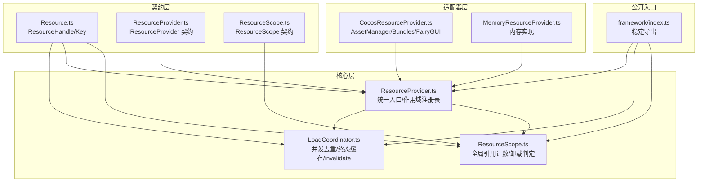
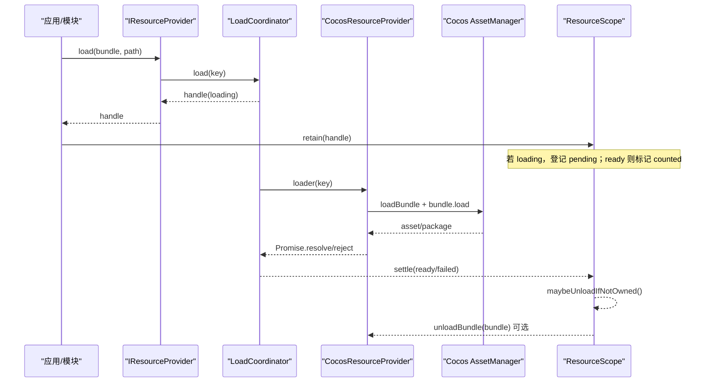
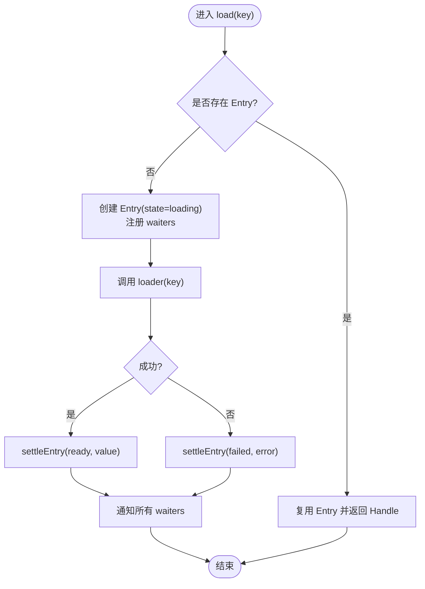
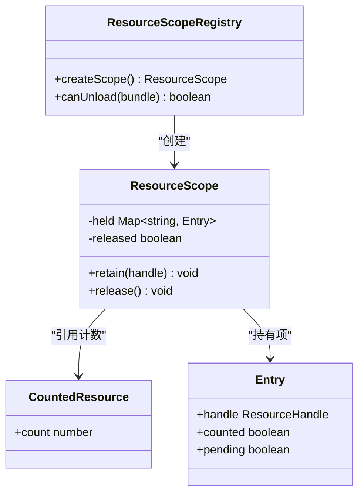
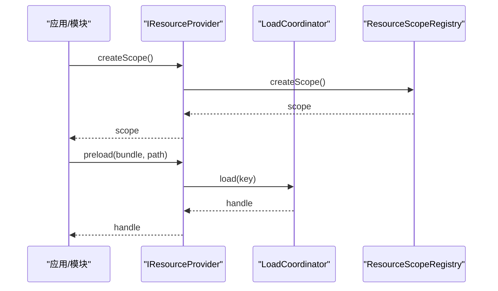
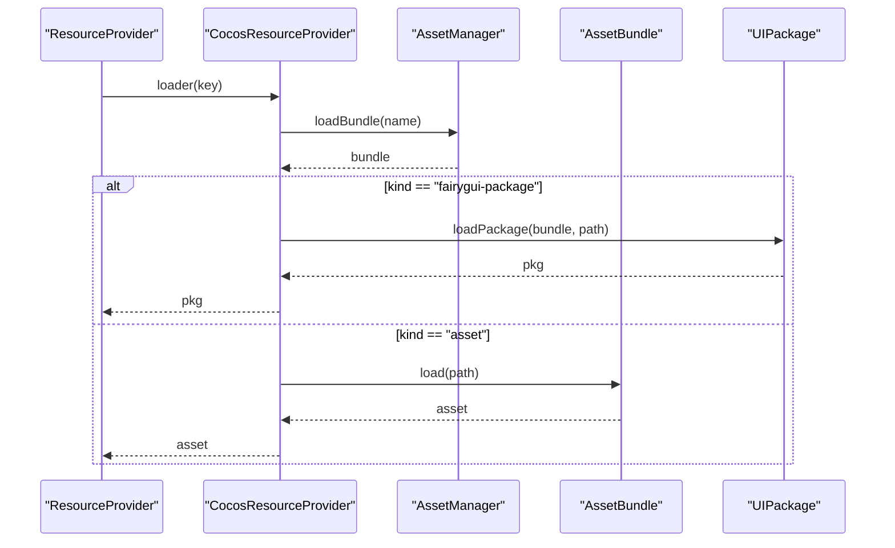
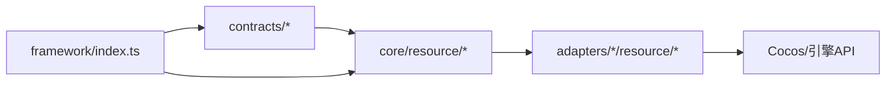

# 资源管理系统

<cite>
**本文引用的文件**   
- [Resource.ts](file://assets/framework/contracts/resource/Resource.ts)
- [ResourceProvider.ts（契约）](file://assets/framework/contracts/resource/ResourceProvider.ts)
- [ResourceScope.ts（契约）](file://assets/framework/contracts/resource/ResourceScope.ts)
- [LoadCoordinator.ts](file://assets/framework/core/resource/LoadCoordinator.ts)
- [ResourceProvider.ts（核心实现）](file://assets/framework/core/resource/ResourceProvider.ts)
- [ResourceScope.ts（核心实现）](file://assets/framework/core/resource/ResourceScope.ts)
- [CocosResourceProvider.ts](file://assets/framework/adapters/cocos/resource/CocosResourceProvider.ts)
- [MemoryResourceProvider.ts](file://assets/framework/adapters/memory/MemoryResourceProvider.ts)
- [index.ts（框架公开入口）](file://assets/framework/index.ts)
- [spec.md（资源管理规范）](file://openspec/specs/resource-management/spec.md)
- [ADR-004 资源策略](file://doc/decisions/ADR-004-resource-strategy.md)
- [ADR-009 资源所有权与场景流转](file://doc/decisions/ADR-009-resource-ownership-and-scene-flow.md)
- [resource-provider.test.ts](file://tests/framework/foundation/resource-provider.test.ts)
- [load-coordinator.test.ts](file://tests/framework/foundation/load-coordinator.test.ts)
</cite>

## 目录
1. [引言](#引言)
2. [项目结构](#项目结构)
3. [核心组件](#核心组件)
4. [架构总览](#架构总览)
5. [详细组件分析](#详细组件分析)
6. [依赖关系分析](#依赖关系分析)
7. [性能考量](#性能考量)
8. [故障排查指南](#故障排查指南)
9. [结论](#结论)
10. [附录](#附录)

## 引言
本资源管理系统为游戏框架提供引擎无关的资源所有权与加载协调边界，统一通过 IResourceProvider 访问 Bundle 与资源，支持并发去重、失败传播、作用域逆序释放与 Bundle 可卸载判断，避免业务直接操作引擎 API 造成泄漏或过早释放。系统以“Bundle First”策略组织资源，将启动资源最小化放入 resources，通用资源、UI、音频与游戏内容通过独立 Bundle 划分，并通过 Cocos 适配器桥接到底层 AssetManager/Bundles。

## 项目结构
资源管理系统按“契约—核心—适配器”分层组织：
- 契约层（contracts）：定义 ResourceHandle、ResourceKey、IResourceProvider、ResourceScope 等稳定接口与类型。
- 核心层（core）：实现 LoadCoordinator（加载协调）、ResourceProvider（统一入口）、ResourceScope（作用域与引用计数）。
- 适配器层（adapters）：Cocos 适配器对接 AssetManager/Bundles/FairyGUI；内存适配器用于测试与无引擎环境。
- 公开入口（framework/index.ts）：对外暴露稳定符号，屏蔽内部实现细节。

**图表来源** 
- [Resource.ts:1-35](file://assets/framework/contracts/resource/Resource.ts#L1-L35)
- [ResourceProvider.ts（契约）:1-62](file://assets/framework/contracts/resource/ResourceProvider.ts#L1-L62)
- [ResourceScope.ts（契约）:1-235](file://assets/framework/contracts/resource/ResourceScope.ts#L1-L235)
- [LoadCoordinator.ts:1-196](file://assets/framework/core/resource/LoadCoordinator.ts#L1-L196)
- [ResourceProvider.ts（核心实现）:1-67](file://assets/framework/core/resource/ResourceProvider.ts#L1-L67)
- [ResourceScope.ts（核心实现）:1-235](file://assets/framework/core/resource/ResourceScope.ts#L1-L235)
- [CocosResourceProvider.ts:1-170](file://assets/framework/adapters/cocos/resource/CocosResourceProvider.ts#L1-L170)
- [MemoryResourceProvider.ts:1-26](file://assets/framework/adapters/memory/MemoryResourceProvider.ts#L1-L26)
- [index.ts（框架公开入口）:1-104](file://assets/framework/index.ts#L1-L104)

**章节来源**
- [spec.md（资源管理规范）:1-80](file://openspec/specs/resource-management/spec.md#L1-L80)
- [ADR-004 资源策略:1-76](file://doc/decisions/ADR-004-resource-strategy.md#L1-L76)
- [ADR-009 资源所有权与场景流转:1-88](file://doc/decisions/ADR-009-resource-ownership-and-scene-flow.md#L1-L88)

## 核心组件
- 资源键与句柄（Resource.ts）：定义 ResourceKind、ResourceKey、ResourceHandle，约定 handle 携带 key、state、resource、error、done 与 cancel，永不 reject，读取 state/error 判断结果。
- 加载协调器（LoadCoordinator.ts）：按 ResourceKey 维度维护共享加载期，并发请求合并一次底层加载；失败广播给全部等待者并保留 cause 与资源标识；已落定的终态（ready/failed）缓存于实例生命周期内，可通过 invalidate 驱逐终态以触发新加载。
- 资源提供器（ResourceProvider.ts）：组合 LoadCoordinator 与 ResourceScopeRegistry，暴露 createScope/load/preload/canUnload/invalidate/invalidatePackage/dispose，作为业务唯一入口。
- 作用域与引用计数（ResourceScope.ts）：维护每个底层资源/Bundle 的全局引用计数与进行中加载计数；当 Bundle 不再被任何作用域持有且无进行中加载时，调用注入的 unloadBundle 执行引擎级卸载；作用域按逆序释放自身持有项，失败隔离不阻断整体释放流程。
- Cocos 适配器（CocosResourceProvider.ts）：将 loader/unloadBundle 映射到 cc.assetManager.loadBundle/bundle.load/releaseAll/removeBundle，FairyGUI package 走 UIPackage 注册表，卸载时先清理注册表再 releaseAll + removeBundle。
- 内存适配器（MemoryResourceProvider.ts）：用内存加载器与无操作卸载实现 IResourceProvider，供纯 TypeScript 测试使用。

**章节来源**
- [Resource.ts:1-35](file://assets/framework/contracts/resource/Resource.ts#L1-L35)
- [LoadCoordinator.ts:1-196](file://assets/framework/core/resource/LoadCoordinator.ts#L1-L196)
- [ResourceProvider.ts（核心实现）:1-67](file://assets/framework/core/resource/ResourceProvider.ts#L1-L67)
- [ResourceScope.ts（核心实现）:1-235](file://assets/framework/core/resource/ResourceScope.ts#L1-L235)
- [CocosResourceProvider.ts:1-170](file://assets/framework/adapters/cocos/resource/CocosResourceProvider.ts#L1-L170)
- [MemoryResourceProvider.ts:1-26](file://assets/framework/adapters/memory/MemoryResourceProvider.ts#L1-L26)

## 架构总览
资源系统采用“契约—核心—适配器”三层解耦设计，业务仅依赖契约与核心工厂，引擎差异由适配器注入。关键流程包括：
- 加载路径：业务通过 IResourceProvider.load/preload → LoadCoordinator 去重与缓存 → 适配器 loader 执行真实加载 → 返回 ResourceHandle。
- 作用域路径：createScope → retain(handle) → 引用计数更新 → 异步 settle 后可能触发 canUnload 判定与 unloadBundle。
- 卸载路径：作用域 release 逆序释放 → 引用计数归零且无 pending → 调用 unloadBundle → 适配器执行引擎级释放。

**图表来源** 
- [ResourceProvider.ts（核心实现）:1-67](file://assets/framework/core/resource/ResourceProvider.ts#L1-L67)
- [LoadCoordinator.ts:1-196](file://assets/framework/core/resource/LoadCoordinator.ts#L1-L196)
- [CocosResourceProvider.ts:1-170](file://assets/framework/adapters/cocos/resource/CocosResourceProvider.ts#L1-L170)
- [ResourceScope.ts（核心实现）:1-235](file://assets/framework/core/resource/ResourceScope.ts#L1-L235)

## 详细组件分析

### 加载协调器（LoadCoordinator）
- 并发去重：同一 ResourceKey 的请求共享一个 LoadEntry，首个请求触发 loader，其余等待者从共享结果中落定。
- 失败传播：loader 抛出或拒绝的错误会被包装为含 cause 与资源标识的失败，所有等待者均收到相同错误对象。
- 取消语义：handle.cancel() 仅 detach 当前等待者，不影响其他等待者与共享加载。
- 终态缓存与失效：ready/failed 的 entry 在协调器实例生命周期内缓存；invalidate(key) 只驱逐终态 entry，loading 中的共享加载不被破坏。

**图表来源** 
- [LoadCoordinator.ts:1-196](file://assets/framework/core/resource/LoadCoordinator.ts#L1-L196)

**章节来源**
- [LoadCoordinator.ts:1-196](file://assets/framework/core/resource/LoadCoordinator.ts#L1-L196)
- [load-coordinator.test.ts:1-200](file://tests/framework/foundation/load-coordinator.test.ts#L1-L200)

### 资源作用域与引用计数（ResourceScope）
- 持有列表：每个作用域记录自身持有的 handle，区分 counted（已就绪并计入引用）与 pending（加载中）。
- 全局引用计数：对每个 keyId 维护 count；bundleKeys 记录某 Bundle 下所有 keyId；pendingCounts 记录进行中加载数量。
- 卸载判定：isBundleOwned = hasReference || hasPending；当两者均为 false 时调用 unloadBundle。
- 逆序释放：release 按持有顺序逆序释放，失败隔离（首个错误暂存最后抛出），保证释放过程不被单次异常中断。

**图表来源** 
- [ResourceScope.ts（核心实现）:1-235](file://assets/framework/core/resource/ResourceScope.ts#L1-L235)

**章节来源**
- [ResourceScope.ts（核心实现）:1-235](file://assets/framework/core/resource/ResourceScope.ts#L1-L235)
- [resource-provider.test.ts:1-200](file://tests/framework/foundation/resource-provider.test.ts#L1-L200)

### 资源提供器（ResourceProvider）
- 统一入口：封装 LoadCoordinator 与 ResourceScopeRegistry，暴露 createScope/load/preload/canUnload/invalidate/invalidatePackage/dispose。
- 预加载语义：preload 与 load 同形，消费与释放语义由上层 SceneFlow 定义。
- 作用域管理：Provider 跟踪其创建的全部 scope，dispose 时统一 release。

**图表来源** 
- [ResourceProvider.ts（核心实现）:1-67](file://assets/framework/core/resource/ResourceProvider.ts#L1-L67)

**章节来源**
- [ResourceProvider.ts（核心实现）:1-67](file://assets/framework/core/resource/ResourceProvider.ts#L1-L67)
- [resource-provider.test.ts:1-200](file://tests/framework/foundation/resource-provider.test.ts#L1-L200)

### Cocos 适配器（CocosResourceProvider）
- 加载路径：adapter.loader 通过 assetManager.loadBundle 获取 Bundle，再根据 kind 分派到 bundle.load（asset）或 UIPackage.loadPackage（fairygui-package）。
- 卸载路径：unloadBundle 先移除该 Bundle 下注册的 FairyGUI package（逆序），再调用 bundle.releaseAll 与 manager.removeBundle。
- 错误处理：保留底层错误原因与资源标识，便于诊断定位。

**图表来源** 
- [CocosResourceProvider.ts:1-170](file://assets/framework/adapters/cocos/resource/CocosResourceProvider.ts#L1-L170)

**章节来源**
- [CocosResourceProvider.ts:1-170](file://assets/framework/adapters/cocos/resource/CocosResourceProvider.ts#L1-L170)

### 内存适配器（MemoryResourceProvider）
- 用途：纯 TypeScript 测试与无需引擎的场景，默认 loader 返回键字面量对象，unloadBundle 为无操作。
- 适配方式：直接传入 createResourceProvider，注入自定义 loader 与 unloadBundle。

**章节来源**
- [MemoryResourceProvider.ts:1-26](file://assets/framework/adapters/memory/MemoryResourceProvider.ts#L1-L26)

## 依赖关系分析
- 契约层不依赖 core 与 adapters，确保跨模块协作仅依赖 handle 与标识。
- core 层依赖 contracts 与内部工具（FrameworkError、ObjectPool 等），不依赖具体引擎。
- adapters 层依赖 core 与引擎 API（cc、fairygui-cc），完成引擎语义映射。
- 公开入口 index.ts 仅 re-export 稳定契约与工厂，屏蔽内部实现。

**图表来源** 
- [index.ts（框架公开入口）:1-104](file://assets/framework/index.ts#L1-L104)
- [ResourceProvider.ts（契约）:1-62](file://assets/framework/contracts/resource/ResourceProvider.ts#L1-L62)
- [ResourceProvider.ts（核心实现）:1-67](file://assets/framework/core/resource/ResourceProvider.ts#L1-L67)
- [CocosResourceProvider.ts:1-170](file://assets/framework/adapters/cocos/resource/CocosResourceProvider.ts#L1-L170)

**章节来源**
- [index.ts（框架公开入口）:1-104](file://assets/framework/index.ts#L1-L104)

## 性能考量
- 并发去重：同一 key 的多次请求共享一次底层加载，减少重复下载与解析开销。
- 终态缓存：ready/failed 的 entry 在协调器实例生命周期内缓存，晚加入等待者立即获得结果，降低等待时间。
- 作用域逆序释放：避免依赖顺序问题，确保资源释放与依赖卸载一致。
- Bundle 卸载时机：仅在引用归零且无进行中加载时卸载，避免频繁加载/卸载抖动。
- 构建兼容性：代码中使用 Array.from 替代展开运算符，规避 Creator 构建转译导致的迭代器行为差异。

[本节为通用指导，不直接分析具体文件]

## 故障排查指南
- 加载失败诊断：检查 handle.state 与 handle.error，错误包含原始 cause 与资源标识（bundle/path/kind），便于定位缺失或损坏资源。
- 并发冲突：确认是否对同一 key 发起多次并发请求；如预期共享加载，应检查 loader 实现与错误传播。
- 作用域泄漏：确认作用域是否正确 release；未释放的作用域会导致引用计数无法归零，Bundle 无法卸载。
- 预加载与切换：SceneFlow 中 preload 结果可跨 switchTo 复用；如需强制重载，先 invalidate 再 load。
- Cocos 适配器异常：检查 assetManager.getBundle 是否为 null；FairyGUI package 卸载需先清理注册表。

**章节来源**
- [load-coordinator.test.ts:1-200](file://tests/framework/foundation/load-coordinator.test.ts#L1-L200)
- [resource-provider.test.ts:1-200](file://tests/framework/foundation/resource-provider.test.ts#L1-L200)
- [CocosResourceProvider.ts:1-170](file://assets/framework/adapters/cocos/resource/CocosResourceProvider.ts#L1-L170)

## 结论
资源管理系统通过清晰的契约与分层架构，实现了引擎无关的资源加载、作用域所有权管理与 Bundle 卸载判定。并发去重、失败传播、逆序释放与可卸载判断共同保障了资源使用的正确性与性能。后续扩展（LRU/驱逐、优先级、跨场景状态迁移）可在现有契约与核心基础上平滑演进。

[本节为总结性内容，不直接分析具体文件]

## 附录
- 规范参考：openspec/specs/resource-management/spec.md 定义了资源系统的核心需求与场景。
- 决策参考：ADR-004 确立 Bundle First 策略与唯一入口；ADR-009 明确资源所有权模型、加载协调语义与 SceneFlow 编排。

**章节来源**
- [spec.md（资源管理规范）:1-80](file://openspec/specs/resource-management/spec.md#L1-L80)
- [ADR-004 资源策略:1-76](file://doc/decisions/ADR-004-resource-strategy.md#L1-L76)
- [ADR-009 资源所有权与场景流转:1-88](file://doc/decisions/ADR-009-resource-ownership-and-scene-flow.md#L1-L88)