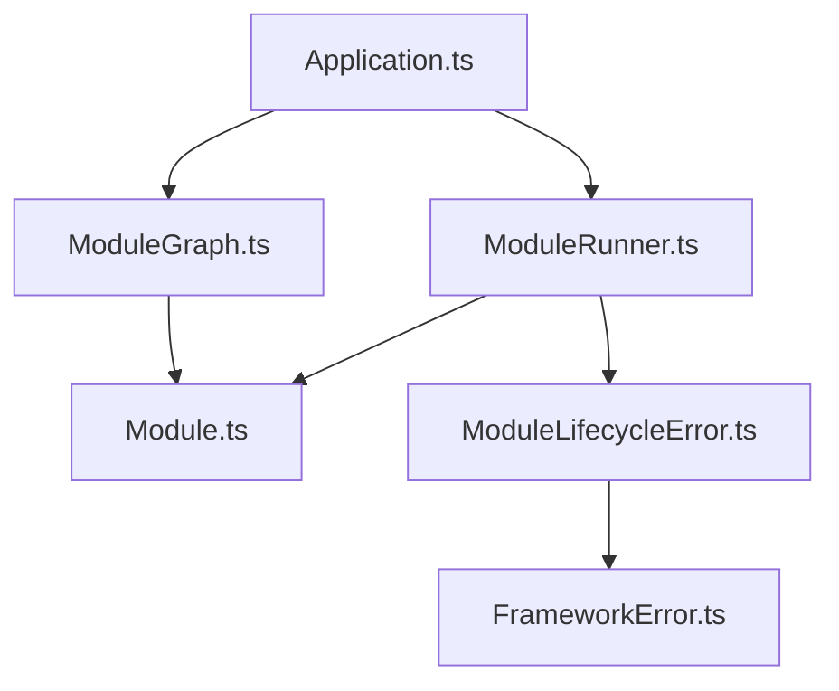
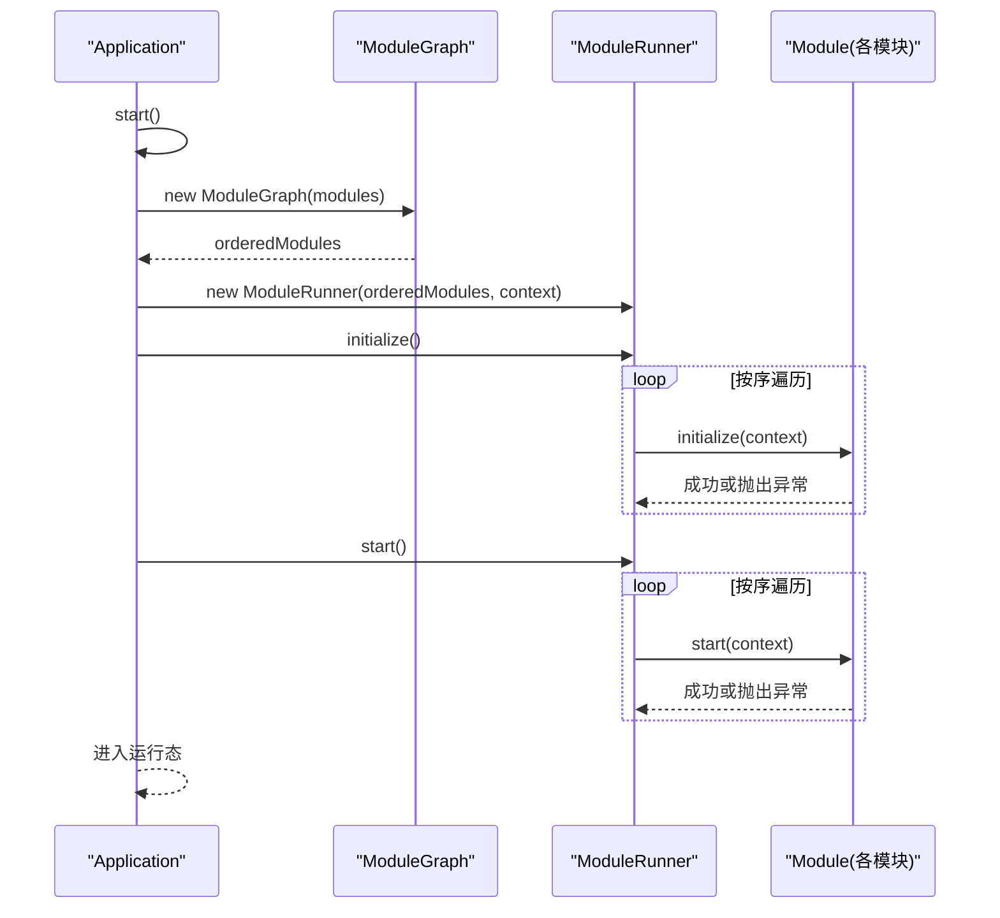
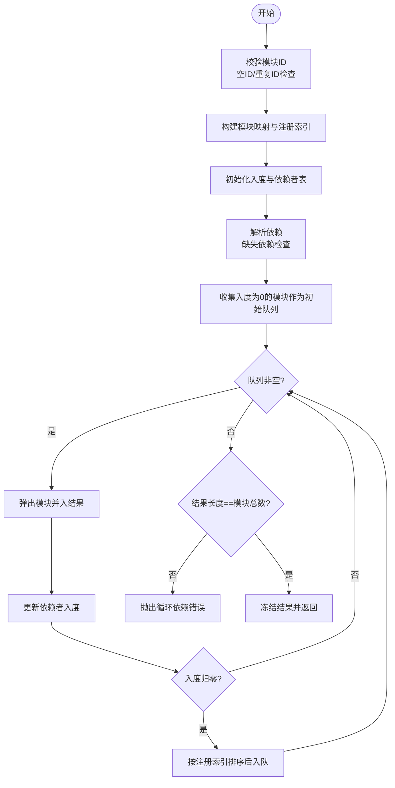
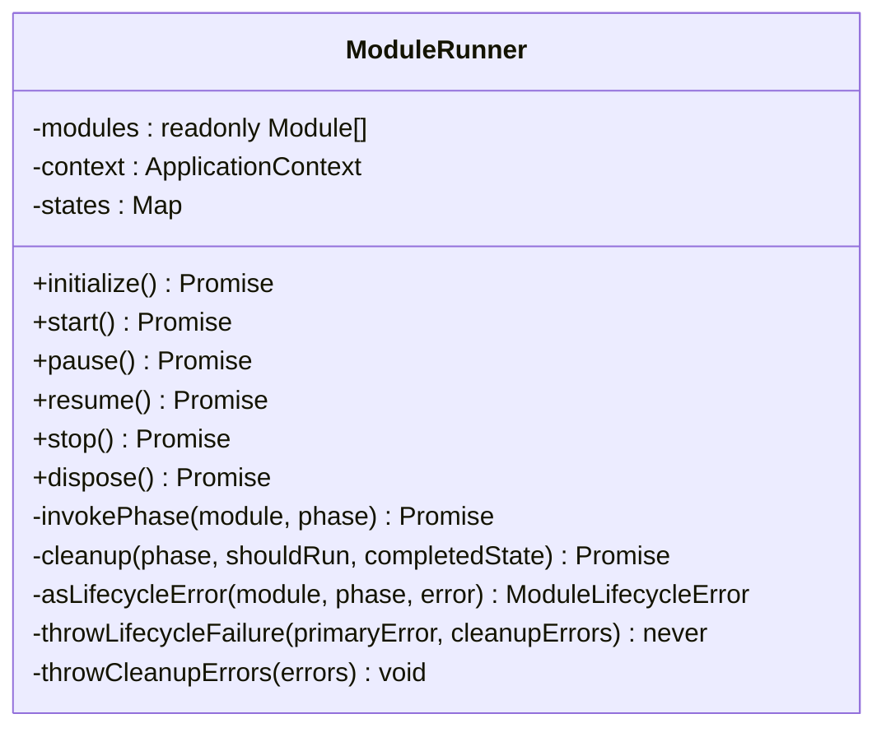
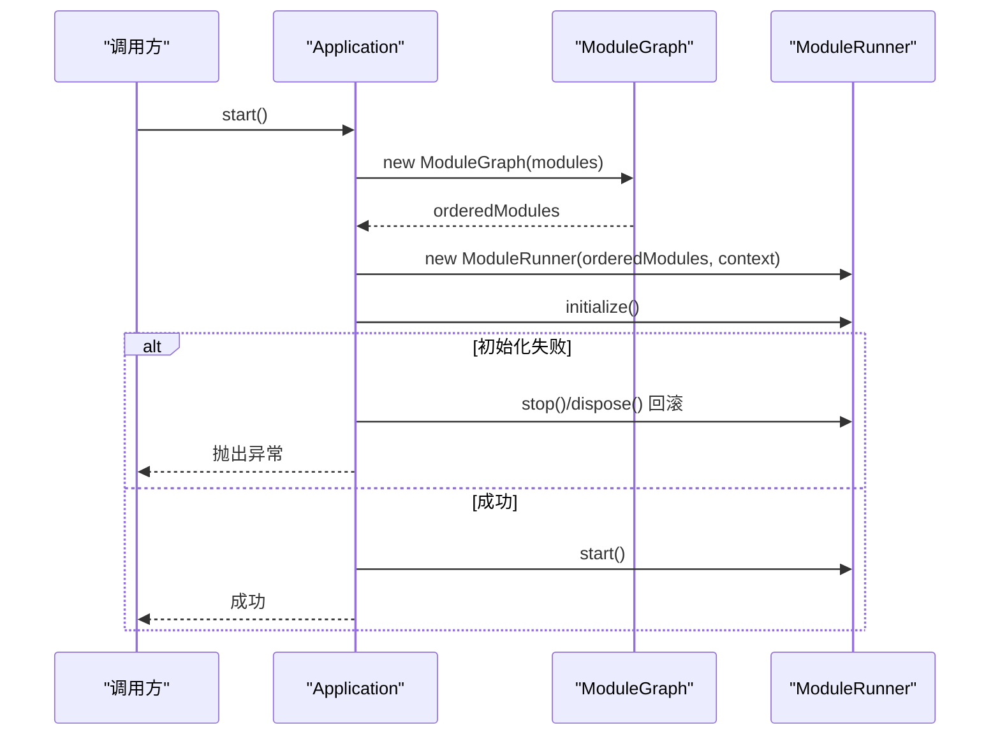
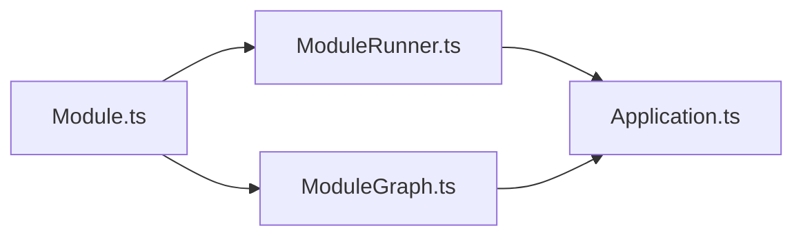

# 模块依赖图

<cite>
**本文引用的文件**   
- [ModuleGraph.ts](file://assets/framework/application/ModuleGraph.ts)
- [ModuleRunner.ts](file://assets/framework/application/ModuleRunner.ts)
- [Application.ts](file://assets/framework/application/Application.ts)
- [Module.ts](file://assets/framework/contracts/module/Module.ts)
- [ModuleLifecycleError.ts](file://assets/framework/application/ModuleLifecycleError.ts)
- [FrameworkError.ts](file://assets/framework/core/errors/FrameworkError.ts)
- [module-graph.test.ts](file://tests/framework/foundation/module-graph.test.ts)
- [module-graph-validation.test.ts](file://tests/framework/foundation/module-graph-validation.test.ts)
</cite>

## 目录
1. [简介](#简介)
2. [项目结构](#项目结构)
3. [核心组件](#核心组件)
4. [架构总览](#架构总览)
5. [详细组件分析](#详细组件分析)
6. [依赖关系分析](#依赖关系分析)
7. [性能考量](#性能考量)
8. [故障排查指南](#故障排查指南)
9. [结论](#结论)
10. [附录：最佳实践与常见问题](#附录最佳实践与常见问题)

## 简介
本文件围绕“模块依赖图”展开，系统性解析 ModuleGraph 的依赖图构建算法、依赖验证机制、循环依赖检测与拓扑排序实现，并说明其在 Application 启动流程中的集成方式。文档同时给出依赖冲突解决思路、图结构优化策略、动态依赖添加与变更检测的实践建议，以及基于测试用例的构建、查询与验证示例路径，帮助读者全面掌握该子系统的核心算法与实现细节。

## 项目结构
与模块依赖图相关的代码主要位于 assets/framework/application 与 contracts/module 两个层次：
- contracts/module/Module.ts：定义模块接口（id、dependencies、生命周期钩子）
- application/ModuleGraph.ts：依赖图构建与拓扑排序
- application/ModuleRunner.ts：按序执行模块生命周期
- application/Application.ts：应用入口，组合 ModuleGraph 与 ModuleRunner
- core/errors/FrameworkError.ts 与 application/ModuleLifecycleError.ts：错误模型与包装

图表来源
- [Application.ts:1-168](file://assets/framework/application/Application.ts#L1-L168)
- [ModuleGraph.ts:1-86](file://assets/framework/application/ModuleGraph.ts#L1-L86)
- [ModuleRunner.ts:1-242](file://assets/framework/application/ModuleRunner.ts#L1-L242)
- [Module.ts:1-30](file://assets/framework/contracts/module/Module.ts#L1-L30)
- [ModuleLifecycleError.ts:1-22](file://assets/framework/application/ModuleLifecycleError.ts#L1-L22)
- [FrameworkError.ts:1-42](file://assets/framework/core/errors/FrameworkError.ts#L1-L42)

章节来源
- [Application.ts:1-168](file://assets/framework/application/Application.ts#L1-L168)
- [ModuleGraph.ts:1-86](file://assets/framework/application/ModuleGraph.ts#L1-L86)
- [ModuleRunner.ts:1-242](file://assets/framework/application/ModuleRunner.ts#L1-L242)
- [Module.ts:1-30](file://assets/framework/contracts/module/Module.ts#L1-L30)

## 核心组件
- ModuleGraph：负责将输入的模块集合转换为无环的有序数组，保证依赖先于被依赖者出现；在构造阶段完成依赖校验与循环检测。
- ModuleRunner：维护模块运行时状态，按 ModuleGraph 提供的顺序执行 initialize/start/pause/resume/stop/dispose 等生命周期阶段，并在失败时进行回滚清理。
- Application：编排 ModuleGraph 与 ModuleRunner，封装启动、暂停、恢复、停止与销毁流程，统一错误上报与状态管理。
- Module：模块契约，包含 id、dependencies 与可选的生命周期方法。

章节来源
- [ModuleGraph.ts:1-86](file://assets/framework/application/ModuleGraph.ts#L1-L86)
- [ModuleRunner.ts:1-242](file://assets/framework/application/ModuleRunner.ts#L1-L242)
- [Application.ts:1-168](file://assets/framework/application/Application.ts#L1-L168)
- [Module.ts:1-30](file://assets/framework/contracts/module/Module.ts#L1-L30)

## 架构总览
下图展示了从 Application 启动到模块生命周期执行的完整调用链，以及 ModuleGraph 在其中承担的职责。

图表来源
- [Application.ts:28-67](file://assets/framework/application/Application.ts#L28-L67)
- [ModuleGraph.ts:6-84](file://assets/framework/application/ModuleGraph.ts#L6-L84)
- [ModuleRunner.ts:47-105](file://assets/framework/application/ModuleRunner.ts#L47-L105)

## 详细组件分析

### ModuleGraph：依赖图构建与拓扑排序
- 输入：只读模块数组 modules
- 输出：orderedModules 只读数组，满足“所有依赖先于被依赖者”的稳定拓扑序

关键步骤
1) 注册与去重校验
   - 使用 Map 记录每个模块 id 与其实例，同时记录注册索引，用于稳定排序
   - 空 id 与重复 id 直接抛错

2) 依赖解析与入度计算
   - 为每个模块初始化依赖计数（入度）和依赖者列表
   - 遍历每个模块的 dependencies，若依赖 id 不存在则抛错
   - 累加入度，并将当前模块加入其依赖者的依赖者列表中

3) 拓扑排序（Kahn 算法）
   - 初始队列：入度为 0 的模块
   - 每次取出一个模块加入结果序列，并将其依赖者的入度减一
   - 当某依赖者入度归零时，将其加入队列并按注册索引稳定排序

4) 循环依赖检测
   - 若最终结果长度小于模块总数，说明存在环，抛错

复杂度分析
- 时间复杂度：O(N + E)，N 为模块数，E 为依赖边数
- 空间复杂度：O(N + E)，存储映射、入度表与依赖者列表

稳定性与确定性
- 对入度归零的候选模块按注册索引排序，确保相同依赖层级下的相对顺序与注册顺序一致

图表来源
- [ModuleGraph.ts:6-84](file://assets/framework/application/ModuleGraph.ts#L6-L84)

章节来源
- [ModuleGraph.ts:1-86](file://assets/framework/application/ModuleGraph.ts#L1-L86)

### ModuleRunner：生命周期执行与回滚清理
- 维护每个模块的运行状态（registered/initialized/started/paused/stopped/disposed）
- 按 ModuleGraph 的顺序依次执行 initialize 与 start
- 任一阶段失败时，根据已到达的状态反向执行 stop 与 dispose 进行清理，并聚合错误信息

要点
- 错误包装：将原始异常包装为 ModuleLifecycleError，便于定位模块与阶段
- 清理聚合：多个清理阶段的错误汇总为 ModuleCleanupError，保留主因与全部清理错误
- 状态机约束：仅在合法状态下执行对应阶段，避免非法迁移

图表来源
- [ModuleRunner.ts:26-241](file://assets/framework/application/ModuleRunner.ts#L26-L241)

章节来源
- [ModuleRunner.ts:1-242](file://assets/framework/application/ModuleRunner.ts#L1-L242)

### Application：编排与状态管理
- 在 start() 中创建 ModuleGraph，获取 orderedModules，再创建 ModuleRunner 并执行 initialize/start
- 失败时执行 rollback（stop/dispose），并统一记录清理错误
- 提供 pause/resume/stop/dispose 等状态受控操作

图表来源
- [Application.ts:28-67](file://assets/framework/application/Application.ts#L28-L67)
- [ModuleGraph.ts:6-84](file://assets/framework/application/ModuleGraph.ts#L6-L84)
- [ModuleRunner.ts:47-105](file://assets/framework/application/ModuleRunner.ts#L47-L105)

章节来源
- [Application.ts:1-168](file://assets/framework/application/Application.ts#L1-L168)

### Module 契约与错误模型
- Module 接口定义了 id、dependencies 与可选的生命周期方法
- FrameworkError 提供可恢复性标记与上下文字段（moduleId、phase、component）
- ModuleLifecycleError 继承 FrameworkError，携带 moduleId 与 phase，便于诊断

章节来源
- [Module.ts:1-30](file://assets/framework/contracts/module/Module.ts#L1-L30)
- [FrameworkError.ts:1-42](file://assets/framework/core/errors/FrameworkError.ts#L1-L42)
- [ModuleLifecycleError.ts:1-22](file://assets/framework/application/ModuleLifecycleError.ts#L1-L22)

## 依赖关系分析
- ModuleGraph 仅依赖 Module 契约，不感知具体实现，解耦良好
- ModuleRunner 依赖 Module 契约与 ApplicationContext，通过 ModuleGraph 的输出获得执行顺序
- Application 组合 ModuleGraph 与 ModuleRunner，形成清晰的装配边界

图表来源
- [Module.ts:1-30](file://assets/framework/contracts/module/Module.ts#L1-L30)
- [ModuleGraph.ts:1-86](file://assets/framework/application/ModuleGraph.ts#L1-L86)
- [ModuleRunner.ts:1-242](file://assets/framework/application/ModuleRunner.ts#L1-L242)
- [Application.ts:1-168](file://assets/framework/application/Application.ts#L1-L168)

章节来源
- [ModuleGraph.ts:1-86](file://assets/framework/application/ModuleGraph.ts#L1-L86)
- [ModuleRunner.ts:1-242](file://assets/framework/application/ModuleRunner.ts#L1-L242)
- [Application.ts:1-168](file://assets/framework/application/Application.ts#L1-L168)

## 性能考量
- 构建阶段 O(N+E) 的时间与空间开销，适合中等规模模块集
- 稳定排序采用插入式比较，整体仍在线性扫描+常数级排序内，不会引入额外阶次
- 建议在模块数量较大时保持依赖稀疏化，减少 E 的增长
- 冻结 orderedModules 避免后续误修改，提升安全性与一致性

[本节为通用指导，无需源码引用]

## 故障排查指南
常见错误与定位
- 空模块ID：构造时立即抛错，检查模块声明
- 重复模块ID：构造时抛错，确保唯一标识
- 缺失依赖：构造时抛错，确认依赖模块已注册
- 循环依赖：构造时抛错，需重构依赖方向或引入抽象层
- 生命周期失败：ModuleRunner 会包装为 ModuleLifecycleError，结合日志中的 moduleId 与 phase 定位

调试建议
- 打印 orderedModules 以验证拓扑顺序是否符合预期
- 在 initialize/start 阶段增加结构化日志，记录关键中间状态
- 使用 isRecoverableError 判断是否可恢复，以便上层做差异化处理

章节来源
- [ModuleGraph.ts:6-84](file://assets/framework/application/ModuleGraph.ts#L6-L84)
- [ModuleRunner.ts:155-241](file://assets/framework/application/ModuleRunner.ts#L155-L241)
- [FrameworkError.ts:16-41](file://assets/framework/core/errors/FrameworkError.ts#L16-L41)

## 结论
ModuleGraph 以 Kahn 算法为核心实现了高效、稳定的依赖拓扑排序，并在构造阶段完成严格的依赖校验与循环检测。ModuleRunner 在此基础上提供了健壮的生命周期执行与回滚清理机制。Application 将二者组合，形成清晰、可扩展的模块系统。通过合理的依赖设计与错误处理策略，可在复杂依赖网络中保持系统的可维护性与稳定性。

[本节为总结性内容，无需源码引用]

## 附录：最佳实践与常见问题

### 依赖设计最佳实践
- 明确分层：基础能力（如 logging、time）置于底层，业务模块依赖基础能力，避免反向依赖
- 最小依赖：模块仅声明必要依赖，降低耦合度
- 单向依赖：避免环形依赖，必要时引入接口或事件总线解耦
- 稳定顺序：利用注册顺序保证同层模块的确定性，便于测试与调试

### 动态依赖添加与变更检测
- 静态构建期：推荐在应用启动前集中构建 ModuleGraph，避免运行期频繁重建
- 增量更新：如需运行期新增模块，应重新构建 ModuleGraph 并对比 orderedModules 变化，仅对差异模块执行相应生命周期
- 变更检测：比较新旧 orderedModules 的 id 序列，识别新增、移除与顺序变化，触发最小化调整

### 依赖冲突解决
- 版本冲突：通过 id 命名约定区分不同版本（如 module-v1、module-v2），由上层选择加载
- 多实现冲突：使用适配器模式或工厂选择具体实现，ModuleGraph 仅依赖抽象 id
- 循环依赖化解：提取公共逻辑至新模块，或将双向依赖改为事件驱动

### 构建、查询与验证示例（基于测试用例的路径）
- 构建有序依赖图：参考测试中对 ModuleGraph 的动态导入与 orderModules 封装
  - 路径：[module-graph.test.ts:45-51](file://tests/framework/foundation/module-graph.test.ts#L45-L51)
- 验证空集合与单模块：参考测试用例中对空数组与单一模块的处理
  - 路径：[module-graph.test.ts:54-64](file://tests/framework/foundation/module-graph.test.ts#L54-L64)
- 验证依赖链与分支依赖：参考测试中对线性与分支依赖的排序断言
  - 路径：[module-graph.test.ts:66-102](file://tests/framework/foundation/module-graph.test.ts#L66-L102)
- 验证独立模块注册顺序稳定性：参考测试中对无依赖模块顺序的断言
  - 路径：[module-graph.test.ts:104-112](file://tests/framework/foundation/module-graph.test.ts#L104-L112)
- 验证无效图拒绝行为：包括空ID、重复ID、缺失依赖、自依赖与多模块环
  - 路径：[module-graph-validation.test.ts:39-75](file://tests/framework/foundation/module-graph-validation.test.ts#L39-L75)
- 验证无效图不触发生命周期钩子：确保构造阶段失败不会执行任何生命周期方法
  - 路径：[module-graph-validation.test.ts:77-93](file://tests/framework/foundation/module-graph-validation.test.ts#L77-L93)

章节来源
- [module-graph.test.ts:1-114](file://tests/framework/foundation/module-graph.test.ts#L1-L114)
- [module-graph-validation.test.ts:1-95](file://tests/framework/foundation/module-graph-validation.test.ts#L1-L95)