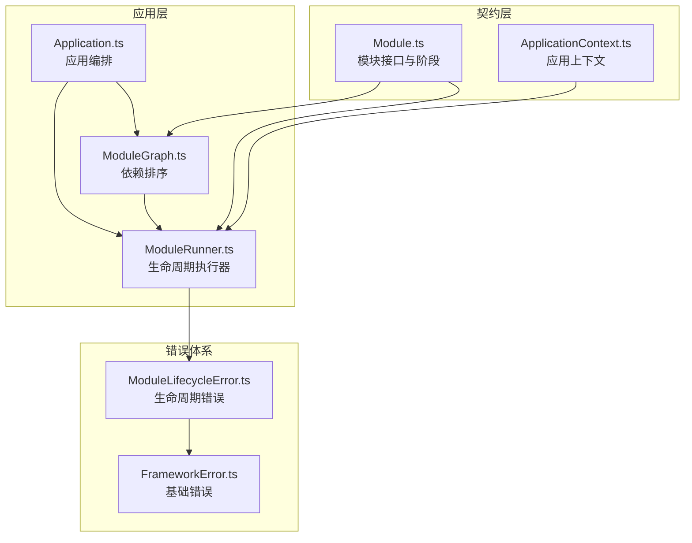
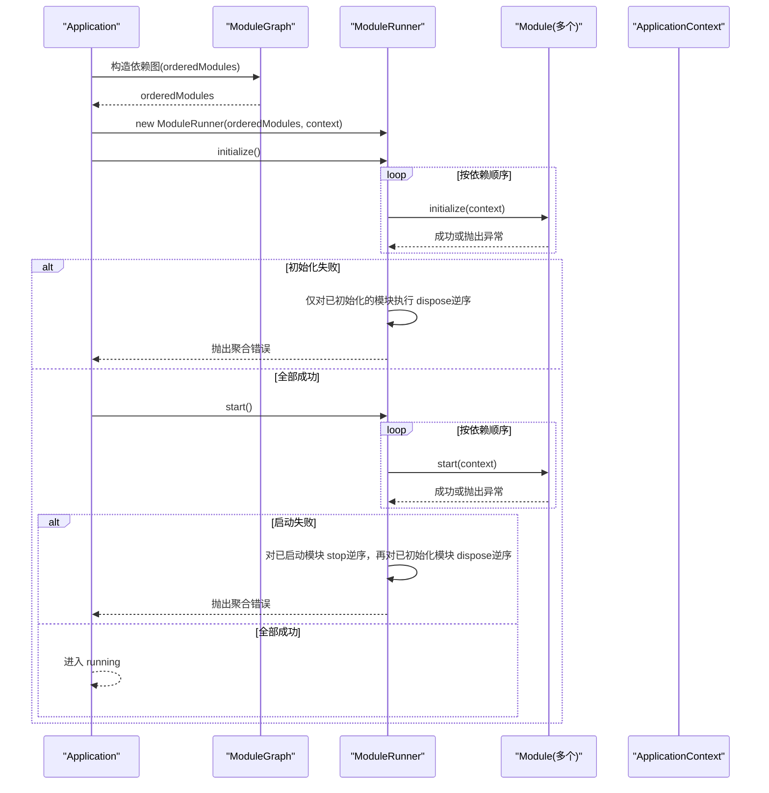
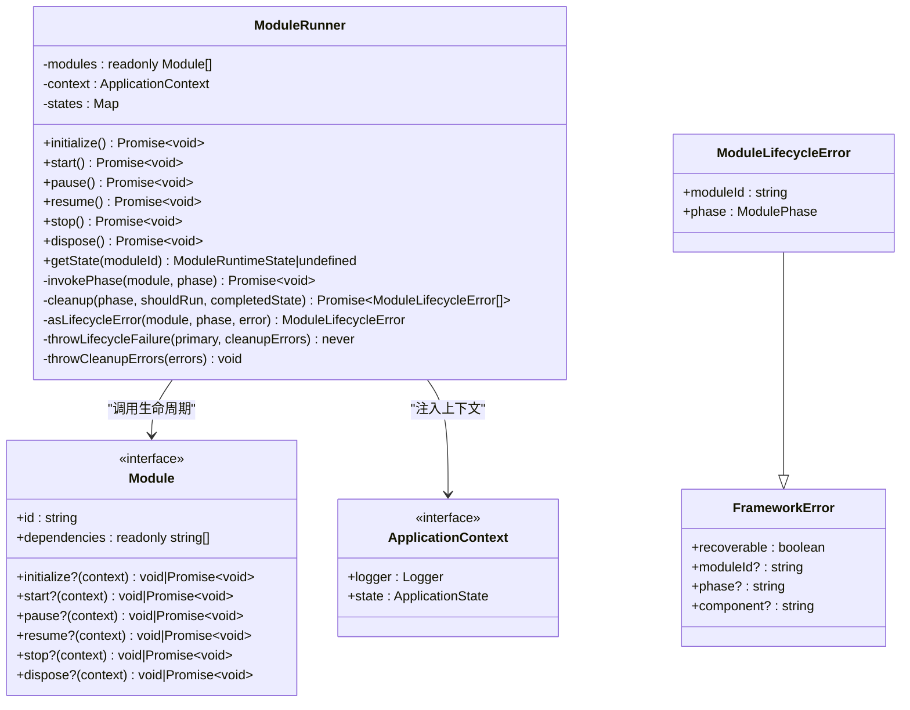
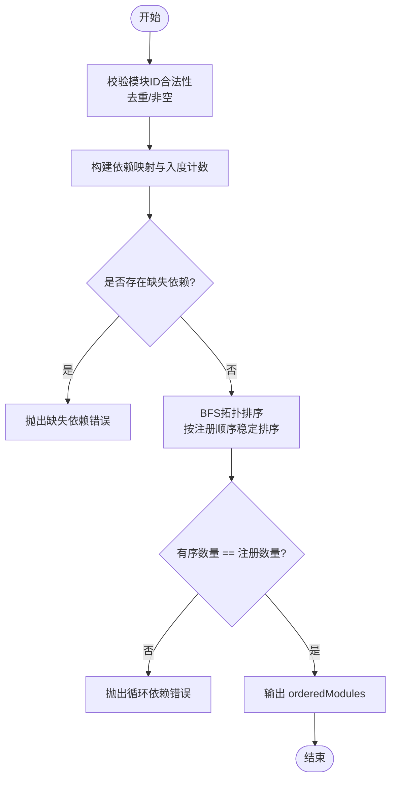
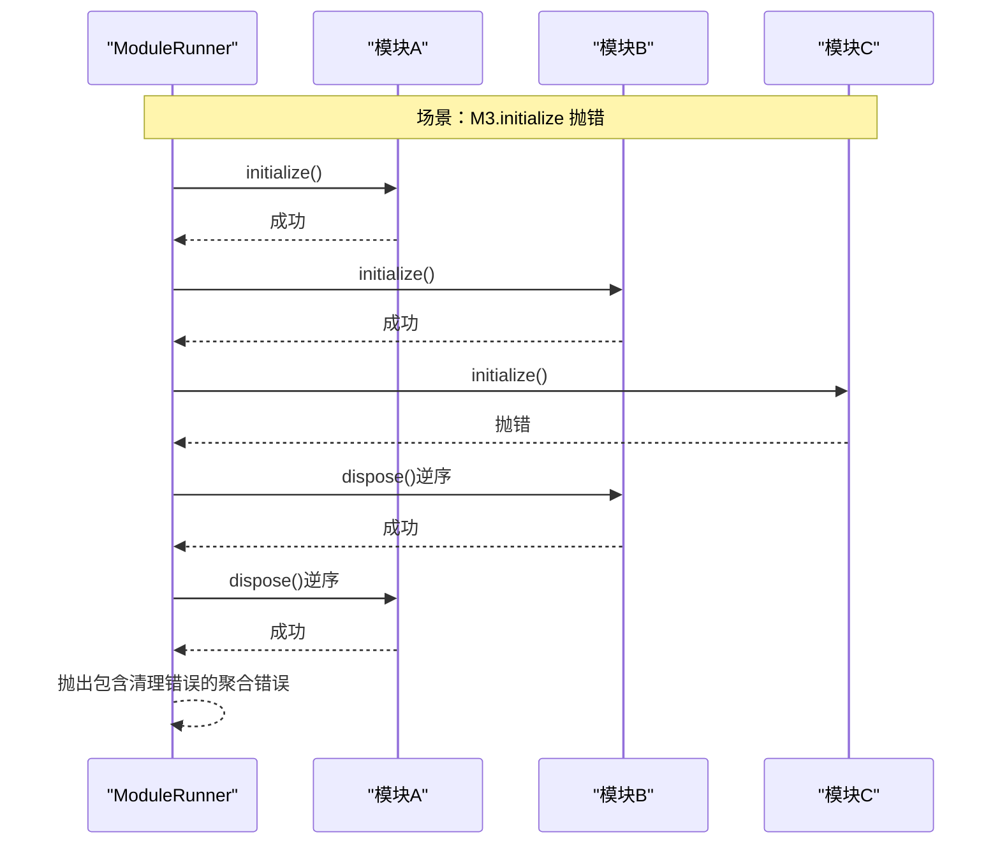
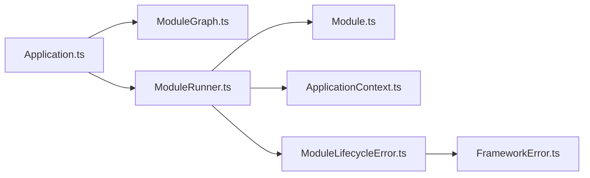

# 模块执行器

<cite>
**本文引用的文件**   
- [ModuleRunner.ts](file://assets/framework/application/ModuleRunner.ts)
- [Module.ts](file://assets/framework/contracts/module/Module.ts)
- [ModuleGraph.ts](file://assets/framework/application/ModuleGraph.ts)
- [Application.ts](file://assets/framework/application/Application.ts)
- [ModuleLifecycleError.ts](file://assets/framework/application/ModuleLifecycleError.ts)
- [FrameworkError.ts](file://assets/framework/core/errors/FrameworkError.ts)
- [ApplicationContext.ts](file://assets/framework/contracts/application/ApplicationContext.ts)
- [module-runner.test.ts](file://tests/framework/foundation/module-runner.test.ts)
- [module-runner-initialize-failure.test.ts](file://tests/framework/foundation/module-runner-initialize-failure.test.ts)
- [module-runner-start-failure.test.ts](file://tests/framework/foundation/module-runner-start-failure.test.ts)
- [module-runner-cleanup-failure.test.ts](file://tests/framework/foundation/module-runner-cleanup-failure.test.ts)
- [module-runner-pause-resume.test.ts](file://tests/framework/foundation/module-runner-pause-resume.test.ts)
- [module-runner-logging.test.ts](file://tests/framework/foundation/module-runner-logging.test.ts)
</cite>

## 目录
1. [简介](#简介)
2. [项目结构](#项目结构)
3. [核心组件](#核心组件)
4. [架构总览](#架构总览)
5. [详细组件分析](#详细组件分析)
6. [依赖分析](#依赖分析)
7. [性能考虑](#性能考虑)
8. [故障排查指南](#故障排查指南)
9. [结论](#结论)
10. [附录](#附录)

## 简介
本文件围绕模块执行器 ModuleRunner 的工作原理进行系统化说明，涵盖模块实例化、生命周期阶段调度、依赖解析与启动顺序控制、错误隔离与回滚清理、暂停/恢复机制以及资源释放策略。同时给出配置与使用方式、性能优化建议与调试技巧，帮助读者全面掌握模块执行的完整生命周期管理。

## 项目结构
与模块执行器相关的代码主要分布在应用层与契约层：
- 契约定义：模块接口、运行时状态、生命周期阶段与应用上下文
- 依赖图构建：基于模块声明的依赖关系生成安全的执行顺序
- 执行器：按依赖顺序调用模块生命周期钩子，并负责错误隔离与清理
- 应用编排：在 Application 中组合 ModuleGraph 与 ModuleRunner，统一入口与状态机

**图示来源** 
- [Module.ts:1-30](file://assets/framework/contracts/module/Module.ts#L1-L30)
- [ApplicationContext.ts:1-18](file://assets/framework/contracts/application/ApplicationContext.ts#L1-L18)
- [ModuleGraph.ts:1-86](file://assets/framework/application/ModuleGraph.ts#L1-L86)
- [ModuleRunner.ts:1-242](file://assets/framework/application/ModuleRunner.ts#L1-L242)
- [Application.ts:1-168](file://assets/framework/application/Application.ts#L1-L168)
- [FrameworkError.ts:1-42](file://assets/framework/core/errors/FrameworkError.ts#L1-L42)
- [ModuleLifecycleError.ts:1-22](file://assets/framework/application/ModuleLifecycleError.ts#L1-L22)

**章节来源**
- [Module.ts:1-30](file://assets/framework/contracts/module/Module.ts#L1-L30)
- [ApplicationContext.ts:1-18](file://assets/framework/contracts/application/ApplicationContext.ts#L1-L18)
- [ModuleGraph.ts:1-86](file://assets/framework/application/ModuleGraph.ts#L1-L86)
- [ModuleRunner.ts:1-242](file://assets/framework/application/ModuleRunner.ts#L1-L242)
- [Application.ts:1-168](file://assets/framework/application/Application.ts#L1-L168)
- [FrameworkError.ts:1-42](file://assets/framework/core/errors/FrameworkError.ts#L1-L42)
- [ModuleLifecycleError.ts:1-22](file://assets/framework/application/ModuleLifecycleError.ts#L1-L22)

## 核心组件
- 模块契约 Module：定义 id、dependencies 及可选的生命周期方法 initialize/start/pause/resume/stop/dispose
- 依赖图 ModuleGraph：校验重复/缺失依赖、检测环，输出稳定拓扑序
- 执行器 ModuleRunner：维护模块运行态，按序执行生命周期，失败时隔离并回滚清理
- 应用编排 Application：创建依赖图与执行器，封装 start/pause/resume/dispose，保证幂等与并发安全
- 错误体系 FrameworkError/ModuleLifecycleError：结构化错误信息，便于诊断与分类处理

**章节来源**
- [Module.ts:1-30](file://assets/framework/contracts/module/Module.ts#L1-L30)
- [ModuleGraph.ts:1-86](file://assets/framework/application/ModuleGraph.ts#L1-L86)
- [ModuleRunner.ts:1-242](file://assets/framework/application/ModuleRunner.ts#L1-L242)
- [Application.ts:1-168](file://assets/framework/application/Application.ts#L1-L168)
- [FrameworkError.ts:1-42](file://assets/framework/core/errors/FrameworkError.ts#L1-L42)
- [ModuleLifecycleError.ts:1-22](file://assets/framework/application/ModuleLifecycleError.ts#L1-L22)

## 架构总览
模块执行的整体流程由 Application 驱动，先通过 ModuleGraph 计算依赖顺序，再交由 ModuleRunner 依次执行各阶段的钩子函数。任何阶段失败都会触发相应的回滚清理，确保系统处于一致状态。

**图示来源** 
- [Application.ts:28-67](file://assets/framework/application/Application.ts#L28-L67)
- [ModuleGraph.ts:1-86](file://assets/framework/application/ModuleGraph.ts#L1-L86)
- [ModuleRunner.ts:47-105](file://assets/framework/application/ModuleRunner.ts#L47-L105)

**章节来源**
- [Application.ts:28-67](file://assets/framework/application/Application.ts#L28-L67)
- [ModuleRunner.ts:47-105](file://assets/framework/application/ModuleRunner.ts#L47-L105)

## 详细组件分析

### ModuleRunner 工作原理
- 模块实例化与状态管理
  - 构造函数接收已排序的模块数组与应用上下文，内部维护每个模块的运行态（registered/initialized/started/paused/stopped/disposed）
- 依赖注入机制
  - 通过 ApplicationContext 向模块提供日志、状态等能力；模块间依赖由 ModuleGraph 保障顺序，无需显式注入实例
- 生命周期执行流程
  - initialize：按依赖顺序调用，任一失败则对已初始化模块逆序执行 dispose 后抛出聚合错误
  - start：按依赖顺序调用，任一失败则对已启动模块逆序执行 stop，再对已初始化模块逆序执行 dispose，最后抛出聚合错误
  - pause/resume：分别以逆序/正序调用对应钩子，支持模块省略这些钩子
  - stop/dispose：统一走清理路径，收集所有清理错误并聚合抛出
- 错误隔离与清理策略
  - 使用 ModuleLifecycleError 包装原始错误，保留 moduleId 与 phase
  - 清理阶段不中断其他模块的清理，最终将全部清理错误封装为 ModuleCleanupError 抛出，主错误作为 cause 链保存
- 幂等性与跳过逻辑
  - 根据当前状态跳过未就绪的阶段，避免重复执行

**图示来源** 
- [ModuleRunner.ts:26-242](file://assets/framework/application/ModuleRunner.ts#L26-L242)
- [Module.ts:19-29](file://assets/framework/contracts/module/Module.ts#L19-L29)
- [ApplicationContext.ts:15-18](file://assets/framework/contracts/application/ApplicationContext.ts#L15-L18)
- [ModuleLifecycleError.ts:4-21](file://assets/framework/application/ModuleLifecycleError.ts#L4-L21)
- [FrameworkError.ts:16-31](file://assets/framework/core/errors/FrameworkError.ts#L16-L31)

**章节来源**
- [ModuleRunner.ts:26-242](file://assets/framework/application/ModuleRunner.ts#L26-L242)
- [Module.ts:19-29](file://assets/framework/contracts/module/Module.ts#L19-L29)
- [ApplicationContext.ts:15-18](file://assets/framework/contracts/application/ApplicationContext.ts#L15-L18)
- [ModuleLifecycleError.ts:4-21](file://assets/framework/application/ModuleLifecycleError.ts#L4-L21)
- [FrameworkError.ts:16-31](file://assets/framework/core/errors/FrameworkError.ts#L16-L31)

### 依赖解析与启动顺序控制（ModuleGraph）
- 输入校验：禁止空 id、重复 id
- 依赖检查：缺失依赖直接报错
- 拓扑排序：统计入度，逐步产出有序模块列表，保证依赖优先
- 环检测：若有序结果数量不足，判定存在环并抛出错误

**图示来源** 
- [ModuleGraph.ts:1-86](file://assets/framework/application/ModuleGraph.ts#L1-L86)

**章节来源**
- [ModuleGraph.ts:1-86](file://assets/framework/application/ModuleGraph.ts#L1-L86)

### 生命周期与错误处理流程（关键序列）
- 初始化失败回滚
- 启动失败回滚（先 stop 已启动，再 dispose 已初始化）
- 清理阶段失败聚合

**图示来源** 
- [ModuleRunner.ts:47-71](file://assets/framework/application/ModuleRunner.ts#L47-L71)
- [ModuleRunner.ts:188-211](file://assets/framework/application/ModuleRunner.ts#L188-L211)

**章节来源**
- [ModuleRunner.ts:47-71](file://assets/framework/application/ModuleRunner.ts#L47-L71)
- [ModuleRunner.ts:188-211](file://assets/framework/application/ModuleRunner.ts#L188-L211)

### 暂停与恢复
- pause：从后向前调用已启动模块的 pause，状态置为 paused
- resume：从前向后调用已暂停模块的 resume，状态置为 started
- 允许模块不实现 pause/resume，执行器会安全跳过

**章节来源**
- [ModuleRunner.ts:107-129](file://assets/framework/application/ModuleRunner.ts#L107-L129)

### 应用编排（Application）
- 在 start 中构建依赖图与执行器，依次调用 initialize/start，失败时统一 rollback（stop+dispose）
- pause/resume/dispose 均通过队列串行化，避免并发冲突
- 状态机约束：仅在合法状态下执行操作，否则抛出状态错误

**章节来源**
- [Application.ts:28-67](file://assets/framework/application/Application.ts#L28-L67)
- [Application.ts:69-97](file://assets/framework/application/Application.ts#L69-L97)
- [Application.ts:99-132](file://assets/framework/application/Application.ts#L99-L132)
- [Application.ts:134-143](file://assets/framework/application/Application.ts#L134-L143)

## 依赖分析
- 耦合关系
  - ModuleRunner 强依赖 Module 契约与 ApplicationContext
  - ModuleGraph 仅依赖 Module 契约，无副作用
  - Application 组合 ModuleGraph 与 ModuleRunner，承担外部编排职责
- 外部依赖
  - 日志通过 ApplicationContext.logger 注入，便于替换与测试
- 潜在循环依赖
  - 由 ModuleGraph 在构建期检测并阻止

**图示来源** 
- [Application.ts:1-168](file://assets/framework/application/Application.ts#L1-L168)
- [ModuleGraph.ts:1-86](file://assets/framework/application/ModuleGraph.ts#L1-L86)
- [ModuleRunner.ts:1-242](file://assets/framework/application/ModuleRunner.ts#L1-L242)
- [Module.ts:1-30](file://assets/framework/contracts/module/Module.ts#L1-L30)
- [ApplicationContext.ts:1-18](file://assets/framework/contracts/application/ApplicationContext.ts#L1-L18)
- [ModuleLifecycleError.ts:1-22](file://assets/framework/application/ModuleLifecycleError.ts#L1-L22)
- [FrameworkError.ts:1-42](file://assets/framework/core/errors/FrameworkError.ts#L1-L42)

**章节来源**
- [Application.ts:1-168](file://assets/framework/application/Application.ts#L1-L168)
- [ModuleGraph.ts:1-86](file://assets/framework/application/ModuleGraph.ts#L1-L86)
- [ModuleRunner.ts:1-242](file://assets/framework/application/ModuleRunner.ts#L1-L242)

## 性能考虑
- 依赖排序复杂度
  - 构建依赖映射 O(N)，拓扑排序 O(V+E)，整体线性到近似线性，适合中等规模模块集合
- 生命周期调用开销
  - 每个阶段均为同步/异步钩子调用，避免在钩子中进行阻塞 I/O；必要时使用被动调度器
- 清理阶段批量性
  - 清理过程尽量轻量，避免在 dispose 中做重型任务，必要时拆分异步任务
- 幂等与跳过
  - 利用状态判断跳过已完成阶段，减少重复工作
- 日志与诊断
  - 合理控制日志级别与频率，避免高频日志影响吞吐

[本节为通用指导，不直接分析具体文件]

## 故障排查指南
- 常见问题定位
  - 依赖缺失/重复/循环：查看 ModuleGraph 构建时的错误信息
  - 初始化失败：检查第一个失败的模块及其依赖是否已正确初始化
  - 启动失败：确认依赖模块已成功 start，并检查 stop/dispose 是否正确实现
  - 清理失败：关注聚合错误中的 errors 列表，逐项排查
- 错误类型与含义
  - ModuleLifecycleError：单个模块在某个生命周期阶段失败
  - ModuleCleanupError：清理阶段出现一个或多个失败，errors 字段冻结且不可变
  - FrameworkError：基础错误类型，支持 recoverable 标记与上下文字段
- 调试技巧
  - 使用 MemoryLogger 捕获日志记录，验证每个阶段的 success/failure 日志
  - 通过 getState 查询模块运行态，辅助定位卡住或跳过的阶段
  - 在测试中模拟特定阶段失败，验证回滚路径是否符合预期

**章节来源**
- [ModuleLifecycleError.ts:4-21](file://assets/framework/application/ModuleLifecycleError.ts#L4-L21)
- [FrameworkError.ts:16-42](file://assets/framework/core/errors/FrameworkError.ts#L16-L42)
- [module-runner-logging.test.ts:46-163](file://tests/framework/foundation/module-runner-logging.test.ts#L46-L163)
- [module-runner-cleanup-failure.test.ts:134-303](file://tests/framework/foundation/module-runner-cleanup-failure.test.ts#L134-L303)

## 结论
ModuleRunner 提供了健壮、可预测的模块生命周期执行框架：通过依赖图保证启动顺序，通过状态机确保幂等执行，通过错误隔离与回滚清理保障系统一致性。配合 Application 的统一编排，可实现高内聚、低耦合的模块化架构。遵循本文的性能与调试建议，可在复杂系统中获得更好的稳定性与可观测性。

[本节为总结性内容，不直接分析具体文件]

## 附录

### 配置与使用示例（基于测试用例）
- 定义模块
  - 为每个模块提供 id、dependencies，并实现需要的生命周期方法
- 构建执行器
  - 使用 ModuleGraph 获取 orderedModules，再传入 ModuleRunner
- 执行生命周期
  - 调用 initialize/start/pause/resume/stop/dispose，按需处理错误
- 参考测试用例
  - 基本生命周期与顺序：[module-runner.test.ts:68-171](file://tests/framework/foundation/module-runner.test.ts#L68-L171)
  - 初始化失败回滚：[module-runner-initialize-failure.test.ts:57-98](file://tests/framework/foundation/module-runner-initialize-failure.test.ts#L57-L98)
  - 启动失败回滚：[module-runner-start-failure.test.ts:60-110](file://tests/framework/foundation/module-runner-start-failure.test.ts#L60-L110)
  - 清理失败聚合：[module-runner-cleanup-failure.test.ts:134-303](file://tests/framework/foundation/module-runner-cleanup-failure.test.ts#L134-L303)
  - 暂停/恢复行为：[module-runner-pause-resume.test.ts:62-152](file://tests/framework/foundation/module-runner-pause-resume.test.ts#L62-L152)
  - 日志记录验证：[module-runner-logging.test.ts:46-163](file://tests/framework/foundation/module-runner-logging.test.ts#L46-L163)

**章节来源**
- [module-runner.test.ts:68-171](file://tests/framework/foundation/module-runner.test.ts#L68-L171)
- [module-runner-initialize-failure.test.ts:57-98](file://tests/framework/foundation/module-runner-initialize-failure.test.ts#L57-L98)
- [module-runner-start-failure.test.ts:60-110](file://tests/framework/foundation/module-runner-start-failure.test.ts#L60-L110)
- [module-runner-cleanup-failure.test.ts:134-303](file://tests/framework/foundation/module-runner-cleanup-failure.test.ts#L134-L303)
- [module-runner-pause-resume.test.ts:62-152](file://tests/framework/foundation/module-runner-pause-resume.test.ts#L62-L152)
- [module-runner-logging.test.ts:46-163](file://tests/framework/foundation/module-runner-logging.test.ts#L46-L163)