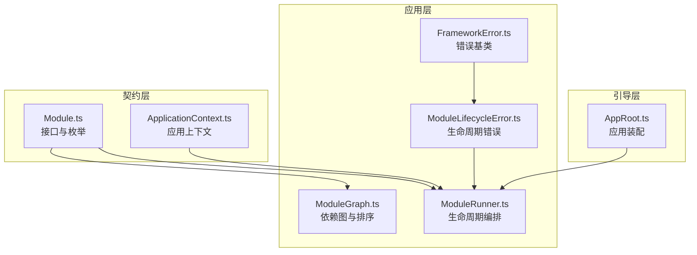
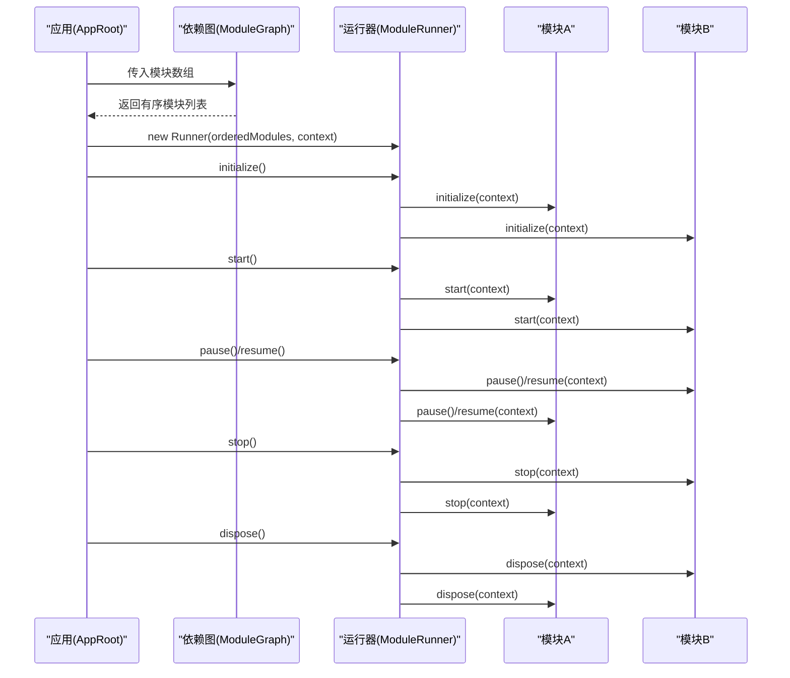
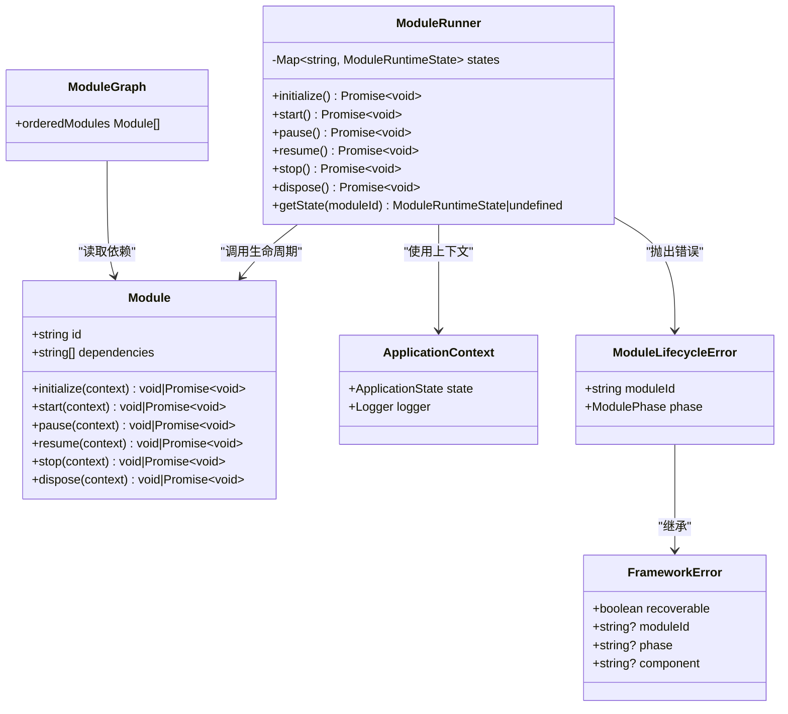

# 模块接口定义

<cite>
**本文引用的文件**   
- [Module.ts](file://assets/framework/contracts/module/Module.ts)
- [ModuleRunner.ts](file://assets/framework/application/ModuleRunner.ts)
- [ModuleGraph.ts](file://assets/framework/application/ModuleGraph.ts)
- [ModuleLifecycleError.ts](file://assets/framework/application/ModuleLifecycleError.ts)
- [FrameworkError.ts](file://assets/framework/core/errors/FrameworkError.ts)
- [ApplicationContext.ts](file://assets/framework/contracts/application/ApplicationContext.ts)
- [module-contract.test.ts](file://tests/framework/foundation/module-contract.test.ts)
- [module-runner.test.ts](file://tests/framework/foundation/module-runner.test.ts)
- [AppRoot.ts](file://assets/boot/AppRoot.ts)
</cite>

## 目录
1. [简介](#简介)
2. [项目结构](#项目结构)
3. [核心组件](#核心组件)
4. [架构总览](#架构总览)
5. [详细组件分析](#详细组件分析)
6. [依赖关系分析](#依赖关系分析)
7. [性能考量](#性能考量)
8. [故障排查指南](#故障排查指南)
9. [结论](#结论)
10. [附录：完整实现示例与最佳实践](#附录完整实现示例与最佳实践)

## 简介
本文件围绕“模块接口”进行系统化说明，面向初学者与有经验的开发者。内容涵盖 Module 接口的属性与方法、生命周期阶段、运行时状态、依赖解析与执行顺序、异步处理与错误处理策略，并提供可操作的实现指南与示例路径，帮助读者快速掌握如何在框架中正确实现一个完整的模块。

## 项目结构
与模块接口相关的核心代码位于 assets/framework 下，其中：
- contracts/module/Module.ts：定义 Module 接口及枚举类型（ModulePhase、ModuleRuntimeState）。
- application/ModuleRunner.ts：负责模块生命周期的编排与调度。
- application/ModuleGraph.ts：负责模块依赖图的构建与拓扑排序。
- application/ModuleLifecycleError.ts：生命周期异常封装。
- core/errors/FrameworkError.ts：框架错误基类。
- contracts/application/ApplicationContext.ts：模块运行时的上下文契约。
- tests/framework/foundation/*：测试用例，展示接口使用方式与行为约束。
- assets/boot/AppRoot.ts：应用装配入口，演示如何创建并启动模块集合。

图表来源
- [Module.ts:1-30](file://assets/framework/contracts/module/Module.ts#L1-L30)
- [ApplicationContext.ts:1-18](file://assets/framework/contracts/application/ApplicationContext.ts#L1-L18)
- [ModuleGraph.ts:1-86](file://assets/framework/application/ModuleGraph.ts#L1-L86)
- [ModuleRunner.ts:1-242](file://assets/framework/application/ModuleRunner.ts#L1-L242)
- [ModuleLifecycleError.ts:1-22](file://assets/framework/application/ModuleLifecycleError.ts#L1-L22)
- [FrameworkError.ts:1-42](file://assets/framework/core/errors/FrameworkError.ts#L1-L42)
- [AppRoot.ts:1-55](file://assets/boot/AppRoot.ts#L1-L55)

章节来源
- [Module.ts:1-30](file://assets/framework/contracts/module/Module.ts#L1-L30)
- [ModuleRunner.ts:1-242](file://assets/framework/application/ModuleRunner.ts#L1-L242)
- [ModuleGraph.ts:1-86](file://assets/framework/application/ModuleGraph.ts#L1-L86)
- [ModuleLifecycleError.ts:1-22](file://assets/framework/application/ModuleLifecycleError.ts#L1-L22)
- [FrameworkError.ts:1-42](file://assets/framework/core/errors/FrameworkError.ts#L1-L42)
- [ApplicationContext.ts:1-18](file://assets/framework/contracts/application/ApplicationContext.ts#L1-L18)
- [AppRoot.ts:1-55](file://assets/boot/AppRoot.ts#L1-L55)

## 核心组件
- Module 接口：声明模块标识 id、依赖 dependencies，以及可选的生命周期方法 initialize、start、pause、resume、stop、dispose。所有生命周期方法均可省略；支持同步或异步实现。
- ModulePhase：生命周期阶段的字符串枚举，用于描述当前调用的阶段。
- ModuleRuntimeState：模块运行时状态的字符串枚举，由运行器维护，表示模块的当前状态。
- ApplicationContext：模块在生命周期方法中接收到的上下文对象，包含日志记录器 logger 与应用状态 state。
- ModuleRunner：编排模块生命周期，按依赖顺序调用各阶段方法，并在失败时进行清理。
- ModuleGraph：对模块依赖进行校验与拓扑排序，确保无环依赖并按注册顺序稳定输出。
- ModuleLifecycleError：封装模块生命周期失败的错误信息，包含 moduleId 与 phase。
- FrameworkError：框架错误基类，提供 recoverable 等扩展字段。

章节来源
- [Module.ts:1-30](file://assets/framework/contracts/module/Module.ts#L1-L30)
- [ApplicationContext.ts:1-18](file://assets/framework/contracts/application/ApplicationContext.ts#L1-L18)
- [ModuleRunner.ts:1-242](file://assets/framework/application/ModuleRunner.ts#L1-L242)
- [ModuleGraph.ts:1-86](file://assets/framework/application/ModuleGraph.ts#L1-L86)
- [ModuleLifecycleError.ts:1-22](file://assets/framework/application/ModuleLifecycleError.ts#L1-L22)
- [FrameworkError.ts:1-42](file://assets/framework/core/errors/FrameworkError.ts#L1-L42)

## 架构总览
下图展示了模块从定义到运行的整体流程：应用装配创建模块数组与上下文，ModuleGraph 校验并排序依赖，ModuleRunner 依次调用生命周期方法，并在异常时进行清理与错误聚合。

图表来源
- [AppRoot.ts:1-55](file://assets/boot/AppRoot.ts#L1-L55)
- [ModuleGraph.ts:1-86](file://assets/framework/application/ModuleGraph.ts#L1-L86)
- [ModuleRunner.ts:1-242](file://assets/framework/application/ModuleRunner.ts#L1-L242)

## 详细组件分析

### Module 接口与枚举
- id：模块唯一标识符，必须为非空字符串，且全局唯一。
- dependencies：依赖声明数组，元素为其他模块的 id 字符串。
- 生命周期方法：
  - initialize(context)：初始化资源、订阅事件、准备数据等。
  - start(context)：启动业务逻辑、开始循环或监听。
  - pause(context)：暂停运行时任务（如停止定时器、释放渲染帧）。
  - resume(context)：恢复之前暂停的任务。
  - stop(context)：停止业务逻辑、取消监听、释放运行时资源。
  - dispose(context)：彻底销毁模块，释放所有资源，解除引用。
- 每个生命周期方法都是可选的，且支持同步或异步实现（返回 void 或 Promise<void>）。

章节来源
- [Module.ts:1-30](file://assets/framework/contracts/module/Module.ts#L1-L30)
- [module-contract.test.ts:73-102](file://tests/framework/foundation/module-contract.test.ts#L73-L102)
- [module-contract.test.ts:146-196](file://tests/framework/foundation/module-contract.test.ts#L146-L196)

### ModulePhase 与 ModuleRuntimeState
- ModulePhase：生命周期阶段枚举，包括 initialize、start、pause、resume、stop、dispose。用于错误信息与日志中标识当前阶段。
- ModuleRuntimeState：模块运行时状态枚举，包括 registered、initialized、started、paused、stopped、disposed。由运行器维护，保证状态机一致性。

章节来源
- [Module.ts:1-30](file://assets/framework/contracts/module/Module.ts#L1-L30)
- [ModuleRunner.ts:26-41](file://assets/framework/application/ModuleRunner.ts#L26-L41)

### ApplicationContext 上下文
- state：应用当前状态（created、initializing、running、paused、stopping、disposed），供模块读取但不建议修改。
- logger：日志记录器，模块应在生命周期失败时通过 logger.error 记录详细信息。

章节来源
- [ApplicationContext.ts:1-18](file://assets/framework/contracts/application/ApplicationContext.ts#L1-L18)

### ModuleGraph 依赖图与拓扑排序
- 校验 id 非空与重复。
- 校验依赖是否存在于已注册模块集合。
- 检测环依赖并抛出错误。
- 基于注册顺序进行稳定排序，输出 orderedModules。

章节来源
- [ModuleGraph.ts:1-86](file://assets/framework/application/ModuleGraph.ts#L1-L86)

### ModuleRunner 生命周期编排
- 维护每个模块的状态 Map，初始化为 registered。
- initialize：按依赖顺序调用 initialize，成功后状态置为 initialized；失败则触发清理（已初始化的模块执行 dispose）。
- start：按依赖顺序调用 start，成功后状态置为 started；失败则先调用已启动模块的 stop，再对已初始化/启动/暂停/停止的模块执行 dispose。
- pause：逆序调用已启动模块的 pause，状态置为 paused。
- resume：正序调用已暂停模块的 resume，状态置为 started。
- stop：逆序调用处于 started/paused 的模块的 stop，状态置为 stopped。
- dispose：逆序调用处于 initialized/started/paused/stopped 的模块的 dispose，状态置为 disposed。
- 错误处理：将原始错误包装为 ModuleLifecycleError，并通过 logger 记录；若清理阶段也失败，聚合为 ModuleCleanupError 抛出。

章节来源
- [ModuleRunner.ts:1-242](file://assets/framework/application/ModuleRunner.ts#L1-L242)
- [ModuleLifecycleError.ts:1-22](file://assets/framework/application/ModuleLifecycleError.ts#L1-L22)
- [FrameworkError.ts:1-42](file://assets/framework/core/errors/FrameworkError.ts#L1-L42)

### 应用装配与入口
- AppRoot 负责创建 Logger、ApplicationContext、模块数组，并组装 Application 与适配器。
- 在 onLoad/start 中绑定平台事件并启动应用，在 onDestroy 中解绑并释放资源。

章节来源
- [AppRoot.ts:1-55](file://assets/boot/AppRoot.ts#L1-L55)

## 依赖关系分析
- Module 接口是契约层的核心，被 ModuleRunner 与 ModuleGraph 引用。
- ModuleRunner 依赖 ApplicationContext、ModuleLifecycleError、FrameworkError。
- ModuleGraph 仅依赖 Module 接口，不引入运行时实现。
- AppRoot 作为装配入口，组合 Application、Adapter 与模块集合。

图表来源
- [Module.ts:1-30](file://assets/framework/contracts/module/Module.ts#L1-L30)
- [ApplicationContext.ts:1-18](file://assets/framework/contracts/application/ApplicationContext.ts#L1-L18)
- [ModuleRunner.ts:1-242](file://assets/framework/application/ModuleRunner.ts#L1-L242)
- [ModuleGraph.ts:1-86](file://assets/framework/application/ModuleGraph.ts#L1-L86)
- [ModuleLifecycleError.ts:1-22](file://assets/framework/application/ModuleLifecycleError.ts#L1-L22)
- [FrameworkError.ts:1-42](file://assets/framework/core/errors/FrameworkError.ts#L1-L42)

章节来源
- [ModuleRunner.ts:1-242](file://assets/framework/application/ModuleRunner.ts#L1-L242)
- [ModuleGraph.ts:1-86](file://assets/framework/application/ModuleGraph.ts#L1-L86)

## 性能考量
- 依赖排序：ModuleGraph 使用线性扫描与队列完成拓扑排序，时间复杂度 O(n + m)，n 为模块数，m 为依赖边数。
- 生命周期调用：ModuleRunner 按顺序调用，避免并发竞争；清理阶段逆序执行，确保资源释放顺序正确。
- 状态检查：通过 Map 存储状态，查询与更新均为 O(1)。
- 错误聚合：清理阶段收集多个错误后统一抛出，减少多次抛错带来的开销。

[本节为通用指导，无需具体文件引用]

## 故障排查指南
- 常见错误类型：
  - ModuleLifecycleError：模块生命周期阶段抛出异常，包含 moduleId 与 phase。
  - ModuleCleanupError：清理阶段出现多个错误时聚合抛出，errors 字段包含所有子错误。
- 定位步骤：
  - 查看 logger.error 输出，确认失败的 moduleId 与 phase。
  - 检查依赖声明是否正确，确保依赖模块已注册且 id 一致。
  - 检查生命周期方法是否实现了必要的异步操作（如 await 网络请求、资源加载）。
  - 对于清理失败，检查 stop/dispose 中的资源释放逻辑是否幂等与安全。
- 调试技巧：
  - 在 initialize/start 中加入 logger.info 打印关键步骤。
  - 使用 getState 验证模块状态是否符合预期。
  - 在测试中构造最小化模块集合复现问题。

章节来源
- [ModuleLifecycleError.ts:1-22](file://assets/framework/application/ModuleLifecycleError.ts#L1-L22)
- [ModuleRunner.ts:155-186](file://assets/framework/application/ModuleRunner.ts#L155-L186)
- [FrameworkError.ts:1-42](file://assets/framework/core/errors/FrameworkError.ts#L1-L42)

## 结论
Module 接口以简洁的契约定义了模块的职责边界与生命周期，配合 ModuleGraph 与 ModuleRunner 实现了强一致性的依赖管理与状态机控制。通过统一的错误封装与日志记录，开发者可以可靠地构建可扩展、可维护的游戏框架模块。遵循本文的指南与最佳实践，能够快速实现健壮的业务模块。

[本节为总结性内容，无需具体文件引用]

## 附录：完整实现示例与最佳实践

### 如何实现一个完整的模块
- 基本结构：
  - 提供 id 与 dependencies。
  - 按需实现生命周期方法，支持同步或异步。
  - 在 initialize 中准备资源，在 start 中启动逻辑，在 pause/resume 中管理运行时任务，在 stop 中停止逻辑，在 dispose 中释放资源。
- 参考示例路径：
  - 同步模块示例：[module-contract.test.ts:78-89](file://tests/framework/foundation/module-contract.test.ts#L78-L89)
  - 异步模块示例：[module-contract.test.ts:91-102](file://tests/framework/foundation/module-contract.test.ts#L91-L102)
  - 简单模块构造器：[module-runner.test.ts:41-54](file://tests/framework/foundation/module-runner.test.ts#L41-L54)

章节来源
- [module-contract.test.ts:73-102](file://tests/framework/foundation/module-contract.test.ts#L73-L102)
- [module-runner.test.ts:41-54](file://tests/framework/foundation/module-runner.test.ts#L41-L54)

### 异步生命周期方法的处理方式
- 所有生命周期方法均支持返回 Promise<void>，运行器会 await 其完成。
- 建议在异步操作中捕获内部异常并转换为合适的错误类型，以便统一处理。
- 参考调用序列：[module-runner.test.ts:68-104](file://tests/framework/foundation/module-runner.test.ts#L68-L104)

章节来源
- [module-runner.test.ts:68-104](file://tests/framework/foundation/module-runner.test.ts#L68-L104)

### 错误处理最佳实践
- 在生命周期方法中抛出异常会被运行器捕获并包装为 ModuleLifecycleError。
- 清理阶段（stop/dispose）的错误会被聚合为 ModuleCleanupError。
- 使用 ApplicationContext.logger 记录详细的失败信息，便于定位问题。
- 参考错误封装与日志记录：[ModuleRunner.ts:155-186](file://assets/framework/application/ModuleRunner.ts#L155-L186)、[ModuleLifecycleError.ts:1-22](file://assets/framework/application/ModuleLifecycleError.ts#L1-L22)

章节来源
- [ModuleRunner.ts:155-186](file://assets/framework/application/ModuleRunner.ts#L155-L186)
- [ModuleLifecycleError.ts:1-22](file://assets/framework/application/ModuleLifecycleError.ts#L1-L22)

### 依赖声明与顺序控制
- 依赖声明为字符串数组，需确保依赖模块已注册且 id 唯一。
- ModuleGraph 会校验依赖存在性与环依赖，并输出稳定的有序模块列表。
- 参考依赖校验与排序：[ModuleGraph.ts:1-86](file://assets/framework/application/ModuleGraph.ts#L1-L86)

章节来源
- [ModuleGraph.ts:1-86](file://assets/framework/application/ModuleGraph.ts#L1-L86)

### 应用装配与启动流程
- 在 AppRoot 中创建 Logger、ApplicationContext、模块数组，并组装 Application 与适配器。
- 在 onLoad/start 中绑定平台事件并启动应用，在 onDestroy 中解绑并释放资源。
- 参考装配入口：[AppRoot.ts:1-55](file://assets/boot/AppRoot.ts#L1-L55)

章节来源
- [AppRoot.ts:1-55](file://assets/boot/AppRoot.ts#L1-L55)