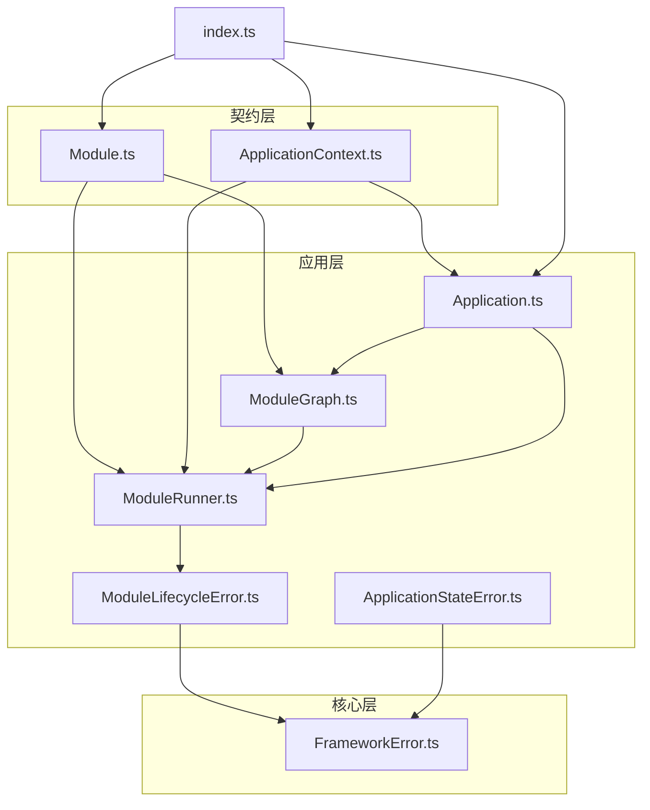
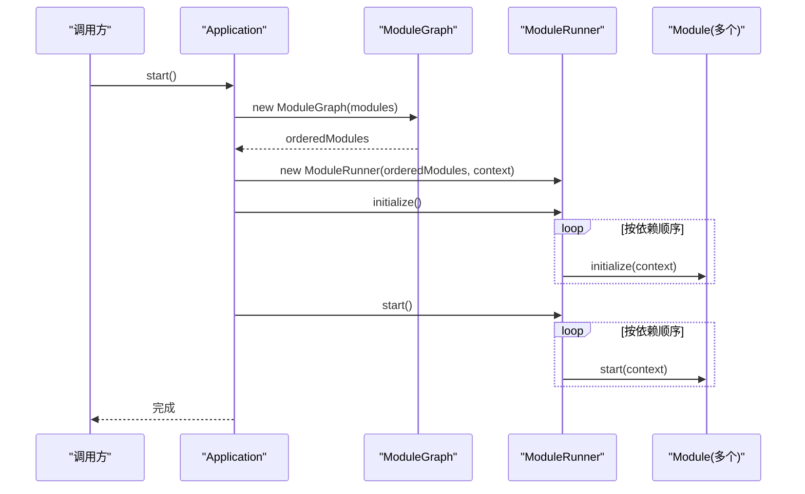
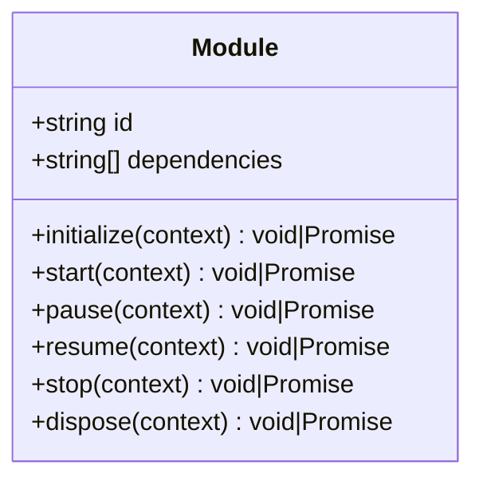
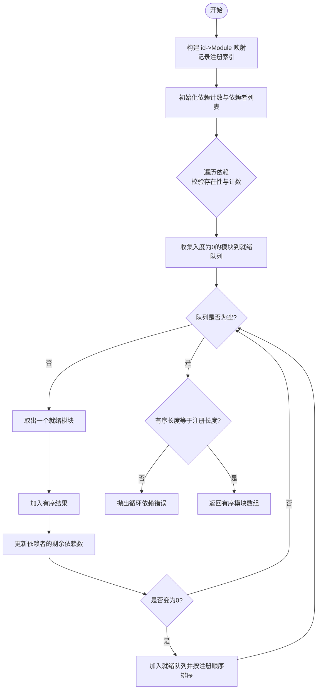
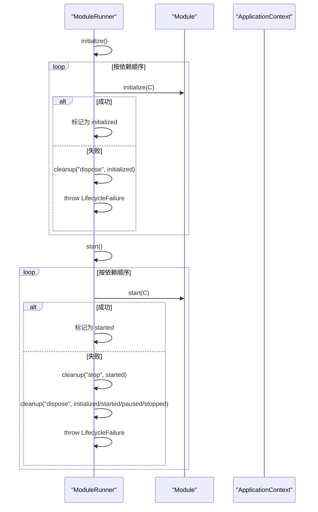
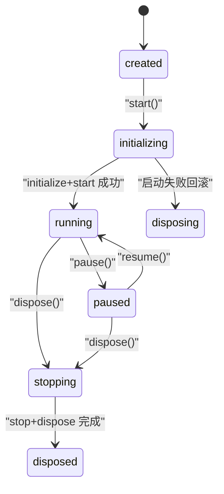
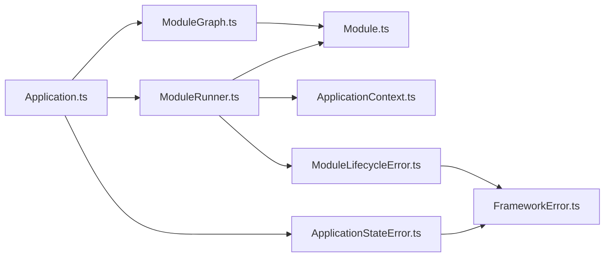

# 模块系统

<cite>
**本文引用的文件**   
- [Module.ts](file://assets/framework/contracts/module/Module.ts)
- [ModuleRunner.ts](file://assets/framework/application/ModuleRunner.ts)
- [ModuleGraph.ts](file://assets/framework/application/ModuleGraph.ts)
- [Application.ts](file://assets/framework/application/Application.ts)
- [ApplicationContext.ts](file://assets/framework/application/ApplicationContext.ts)
- [ModuleLifecycleError.ts](file://assets/framework/application/ModuleLifecycleError.ts)
- [ApplicationStateError.ts](file://assets/framework/application/ApplicationStateError.ts)
- [FrameworkError.ts](file://assets/framework/core/errors/FrameworkError.ts)
- [index.ts](file://assets/framework/index.ts)
- [module-runner.test.ts](file://tests/framework/foundation/module-runner.test.ts)
- [module-graph.test.ts](file://tests/framework/foundation/module-graph.test.ts)
- [application-lifecycle.test.ts](file://tests/framework/foundation/application-lifecycle.test.ts)
</cite>

## 目录
1. [简介](#简介)
2. [项目结构](#项目结构)
3. [核心组件](#核心组件)
4. [架构总览](#架构总览)
5. [详细组件分析](#详细组件分析)
6. [依赖关系分析](#依赖关系分析)
7. [性能考量](#性能考量)
8. [故障排查指南](#故障排查指南)
9. [结论](#结论)
10. [附录：使用示例与最佳实践](#附录使用示例与最佳实践)

## 简介
本模块系统为应用提供声明式、可组合的模块生命周期管理。通过 Module 接口定义模块能力，ModuleGraph 负责构建依赖图并进行拓扑排序，ModuleRunner 驱动模块实例化、依赖注入与生命周期执行，Application 作为编排入口协调整体启动、暂停、恢复与销毁流程。该设计强调：
- 以字符串 ID 标识模块与依赖，避免运行时耦合
- 支持同步与异步生命周期钩子
- 严格的错误封装与清理回滚机制
- 稳定且可预测的拓扑顺序，便于调试与测试

## 项目结构
模块系统相关文件集中在 assets/framework 下，按职责分层：
- contracts：契约与类型（Module、ApplicationContext 等）
- application：应用编排与运行（Application、ModuleRunner、ModuleGraph、错误类型）
- core：基础能力（错误基类、事件、调度、时间源等）
- index.ts：对外暴露的类型与类

**图表来源** 
- [Module.ts:1-30](file://assets/framework/contracts/module/Module.ts#L1-L30)
- [ApplicationContext.ts:1-26](file://assets/framework/application/ApplicationContext.ts#L1-L26)
- [Application.ts:1-168](file://assets/framework/application/Application.ts#L1-L168)
- [ModuleRunner.ts:1-248](file://assets/framework/application/ModuleRunner.ts#L1-L248)
- [ModuleGraph.ts:1-86](file://assets/framework/application/ModuleGraph.ts#L1-L86)
- [ModuleLifecycleError.ts:1-22](file://assets/framework/application/ModuleLifecycleError.ts#L1-L22)
- [ApplicationStateError.ts:1-14](file://assets/framework/application/ApplicationStateError.ts#L1-L14)
- [FrameworkError.ts:1-36](file://assets/framework/core/errors/FrameworkError.ts#L1-L36)
- [index.ts:1-44](file://assets/framework/index.ts#L1-L44)

**章节来源**
- [index.ts:1-44](file://assets/framework/index.ts#L1-L44)

## 核心组件
- Module：模块契约，包含 id、dependencies 以及可选的生命周期钩子 initialize/start/pause/resume/stop/dispose，参数为 ApplicationContext。
- ModuleGraph：基于注册顺序与依赖关系进行拓扑排序，输出稳定的 orderedModules。
- ModuleRunner：维护每个模块的运行状态，按阶段调用生命周期方法，并处理异常与清理。
- Application：应用编排器，负责状态机流转、任务队列串行化、失败回滚与资源释放。
- ApplicationContext：提供给模块的上下文（如日志、应用状态），由框架创建并注入。

**章节来源**
- [Module.ts:1-30](file://assets/framework/contracts/module/Module.ts#L1-L30)
- [ModuleGraph.ts:1-86](file://assets/framework/application/ModuleGraph.ts#L1-L86)
- [ModuleRunner.ts:1-248](file://assets/framework/application/ModuleRunner.ts#L1-L248)
- [Application.ts:1-168](file://assets/framework/application/Application.ts#L1-L168)
- [ApplicationContext.ts:1-26](file://assets/framework/application/ApplicationContext.ts#L1-L26)

## 架构总览
模块系统的整体数据流与控制流如下：
- Application.start() 内部先构建 ModuleGraph，再创建 ModuleRunner，依次执行 initialize 与 start。
- ModuleRunner 维护模块状态，按依赖顺序调用生命周期钩子，并在失败时触发清理。
- 所有错误均包装为框架错误类型，便于上层统一处理与诊断。

**图表来源** 
- [Application.ts:28-67](file://assets/framework/application/Application.ts#L28-L67)
- [ModuleGraph.ts:6-84](file://assets/framework/application/ModuleGraph.ts#L6-L84)
- [ModuleRunner.ts:53-111](file://assets/framework/application/ModuleRunner.ts#L53-L111)

## 详细组件分析

### Module 接口与生命周期
- id：唯一标识模块的字符串
- dependencies：依赖的其他模块 id 列表
- 生命周期钩子：initialize/start/pause/resume/stop/dispose，均可省略；支持同步或异步实现
- 钩子参数：ApplicationContext，用于访问日志与应用状态

**图表来源** 
- [Module.ts:19-29](file://assets/framework/contracts/module/Module.ts#L19-L29)

**章节来源**
- [Module.ts:1-30](file://assets/framework/contracts/module/Module.ts#L1-L30)

### ModuleGraph：依赖图构建与拓扑排序
- 输入：模块数组（含 id 与 dependencies）
- 校验：id 非空、无重复 id、依赖存在性检查
- 算法：Kahn 算法（入度计数 + 就绪队列），保证依赖先于被依赖者执行
- 稳定性：当多个模块同时就绪时，按注册顺序排序，确保确定性
- 循环检测：若排序结果数量小于注册数量，说明存在环，抛出错误

**图表来源** 
- [ModuleGraph.ts:6-84](file://assets/framework/application/ModuleGraph.ts#L6-L84)

**章节来源**
- [ModuleGraph.ts:1-86](file://assets/framework/application/ModuleGraph.ts#L1-L86)
- [module-graph.test.ts:53-113](file://tests/framework/foundation/module-graph.test.ts#L53-L113)

### ModuleRunner：模块实例化、依赖注入与生命周期执行
- 状态管理：维护每个模块的运行状态（registered/initialized/started/paused/stopped/disposed）
- 生命周期执行：
  - initialize：按依赖顺序调用各模块 initialize，失败则仅对已 initialized 的模块执行 dispose 清理
  - start：按依赖顺序调用 start，失败则对 started 模块执行 stop，并对已处于相关状态的模块执行 dispose 清理
  - pause/resume：逆序 pause，正序 resume
  - stop/dispose：逆序清理，收集所有清理错误并聚合抛出
- 错误处理：将原始错误包装为 ModuleLifecycleError，必要时聚合为 ModuleCleanupError
- 日志记录：成功与失败均记录结构化日志

**图表来源** 
- [ModuleRunner.ts:53-111](file://assets/framework/application/ModuleRunner.ts#L53-L111)
- [ModuleRunner.ts:194-217](file://assets/framework/application/ModuleRunner.ts#L194-L217)
- [ModuleLifecycleError.ts:1-22](file://assets/framework/application/ModuleLifecycleError.ts#L1-L22)

**章节来源**
- [ModuleRunner.ts:1-248](file://assets/framework/application/ModuleRunner.ts#L1-L248)
- [module-runner.test.ts:68-170](file://tests/framework/foundation/module-runner.test.ts#L68-L170)

### Application：应用编排与状态机
- 状态机：created → initializing → running → paused → stopping → disposed
- 启动流程：构建依赖图、创建 Runner、执行 initialize/start，失败则回滚 stop/dispose
- 暂停/恢复：仅在允许状态下切换，并调用 Runner 对应方法
- 销毁：串行执行 stop 与 dispose，收集清理错误并上报
- 并发控制：通过 Promise 队列串行化操作，防止竞态

**图表来源** 
- [Application.ts:28-132](file://assets/framework/application/Application.ts#L28-L132)

**章节来源**
- [Application.ts:1-168](file://assets/framework/application/Application.ts#L1-L168)
- [application-lifecycle.test.ts:70-161](file://tests/framework/foundation/application-lifecycle.test.ts#L70-L161)

### ApplicationContext：模块上下文
- 提供 logger 与 state 只读属性
- 内部 _setState 供框架在特定阶段更新状态（模块不应直接修改）

**章节来源**
- [ApplicationContext.ts:1-26](file://assets/framework/application/ApplicationContext.ts#L1-L26)

## 依赖关系分析
- Application 依赖 ModuleGraph 与 ModuleRunner
- ModuleRunner 依赖 Module 契约与 ApplicationContext
- ModuleGraph 依赖 Module 契约
- 错误类型继承自 FrameworkError，便于统一识别与处理

**图表来源** 
- [Application.ts:1-168](file://assets/framework/application/Application.ts#L1-L168)
- [ModuleGraph.ts:1-86](file://assets/framework/application/ModuleGraph.ts#L1-L86)
- [ModuleRunner.ts:1-248](file://assets/framework/application/ModuleRunner.ts#L1-L248)
- [Module.ts:1-30](file://assets/framework/contracts/module/Module.ts#L1-L30)
- [ApplicationContext.ts:1-26](file://assets/framework/application/ApplicationContext.ts#L1-L26)
- [ModuleLifecycleError.ts:1-22](file://assets/framework/application/ModuleLifecycleError.ts#L1-L22)
- [ApplicationStateError.ts:1-14](file://assets/framework/application/ApplicationStateError.ts#L1-L14)
- [FrameworkError.ts:1-36](file://assets/framework/core/errors/FrameworkError.ts#L1-L36)

**章节来源**
- [index.ts:1-44](file://assets/framework/index.ts#L1-L44)

## 性能考量
- 拓扑排序复杂度：O(V+E)，V 为模块数，E 为依赖边数；排序过程稳定且线性
- 生命周期调用：每个模块在每个阶段最多调用一次，避免重复执行
- 清理策略：失败路径采用逆序清理，减少资源泄漏风险
- 并发控制：Application 使用 Promise 队列串行化操作，避免竞态条件带来的额外开销
- 内存占用：ModuleRunner 维护状态 Map，空间复杂度 O(V)

[本节为通用指导，不直接分析具体文件]

## 故障排查指南
- 循环依赖：ModuleGraph 构造时会检测环并抛出错误，检查模块 dependencies 是否存在闭环
- 缺失依赖：依赖 id 不存在会抛出错误，确认所有依赖模块均已注册
- 生命周期失败：ModuleRunner 会将错误包装为 ModuleLifecycleError，查看 moduleId 与 phase 定位问题模块与阶段
- 清理失败：ModuleRunner 可能抛出 ModuleCleanupError，包含多个清理阶段的错误集合，逐一排查
- 状态非法：Application 在非允许状态下调用方法会抛出 ApplicationStateError，检查当前状态机转换

**章节来源**
- [ModuleGraph.ts:12-46](file://assets/framework/application/ModuleGraph.ts#L12-L46)
- [ModuleRunner.ts:161-192](file://assets/framework/application/ModuleRunner.ts#L161-L192)
- [ModuleLifecycleError.ts:1-22](file://assets/framework/application/ModuleLifecycleError.ts#L1-L22)
- [ApplicationStateError.ts:1-14](file://assets/framework/application/ApplicationStateError.ts#L1-L14)
- [FrameworkError.ts:1-36](file://assets/framework/core/errors/FrameworkError.ts#L1-L36)

## 结论
该模块系统以简洁的契约与清晰的职责划分，实现了可靠的依赖解析与生命周期管理。ModuleGraph 提供稳定拓扑顺序，ModuleRunner 保障生命周期正确执行与错误隔离，Application 作为编排中枢确保状态一致性与资源安全释放。整体设计兼顾易用性与健壮性，适合中大型游戏或应用的模块化扩展。

[本节为总结性内容，不直接分析具体文件]

## 附录：使用示例与最佳实践

### 如何定义模块与声明依赖
- 为模块分配唯一的 id
- 通过 dependencies 声明依赖的其他模块 id
- 按需实现生命周期钩子（可同步或异步）

参考示例路径：
- [module-contract.test.ts:73-102](file://tests/framework/foundation/module-contract.test.ts#L73-L102)
- [module-runner.test.ts:41-54](file://tests/framework/foundation/module-runner.test.ts#L41-L54)

**章节来源**
- [module-contract.test.ts:104-221](file://tests/framework/foundation/module-contract.test.ts#L104-L221)
- [module-runner.test.ts:68-170](file://tests/framework/foundation/module-runner.test.ts#L68-L170)

### 如何处理模块生命周期
- initialize：加载配置、初始化子系统
- start：启动服务、订阅事件
- pause/resume：暂停/恢复后台任务或渲染
- stop/dispose：释放资源、取消订阅

参考示例路径：
- [application-lifecycle.test.ts:46-68](file://tests/framework/foundation/application-lifecycle.test.ts#L46-L68)

**章节来源**
- [application-lifecycle.test.ts:70-161](file://tests/framework/foundation/application-lifecycle.test.ts#L70-L161)

### 模块间通信的最佳实践
- 通过 ApplicationContext 共享只读信息与日志能力
- 使用事件通道（如 ScopedEventChannel）进行解耦通信
- 避免直接引用其他模块实例，保持依赖最小化

参考示例路径：
- [index.ts:34-39](file://assets/framework/index.ts#L34-L39)

**章节来源**
- [index.ts:1-44](file://assets/framework/index.ts#L1-L44)

### 常见问题解决方案
- 依赖未注册：确保所有依赖模块在启动前已注册
- 循环依赖：重构模块边界，拆分职责或使用事件解耦
- 生命周期异常：捕获 ModuleLifecycleError，定位 moduleId 与 phase
- 清理失败：检查 stop/dispose 中的资源释放逻辑，确保幂等与异常安全

**章节来源**
- [ModuleGraph.ts:12-46](file://assets/framework/application/ModuleGraph.ts#L12-L46)
- [ModuleRunner.ts:194-217](file://assets/framework/application/ModuleRunner.ts#L194-L217)
- [ModuleLifecycleError.ts:1-22](file://assets/framework/application/ModuleLifecycleError.ts#L1-L22)