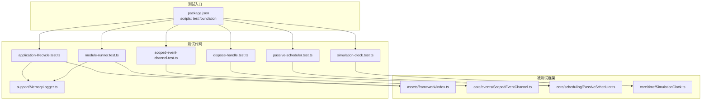
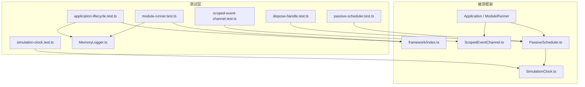
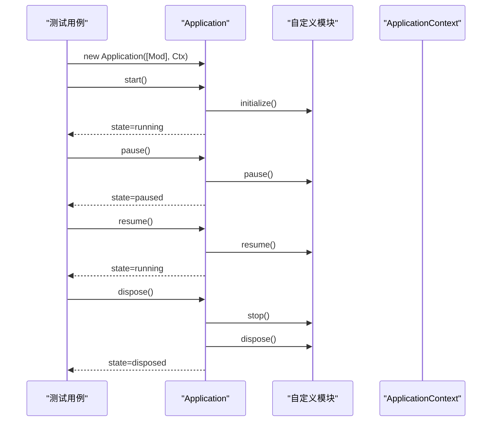
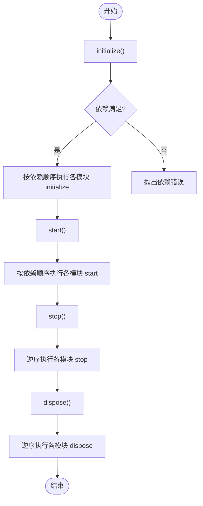
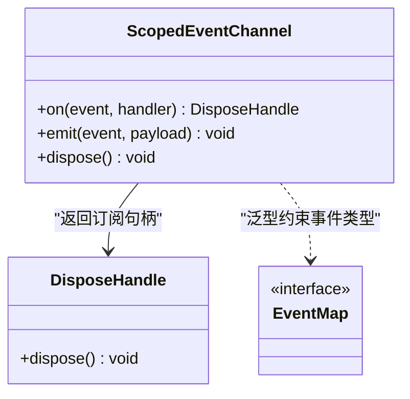
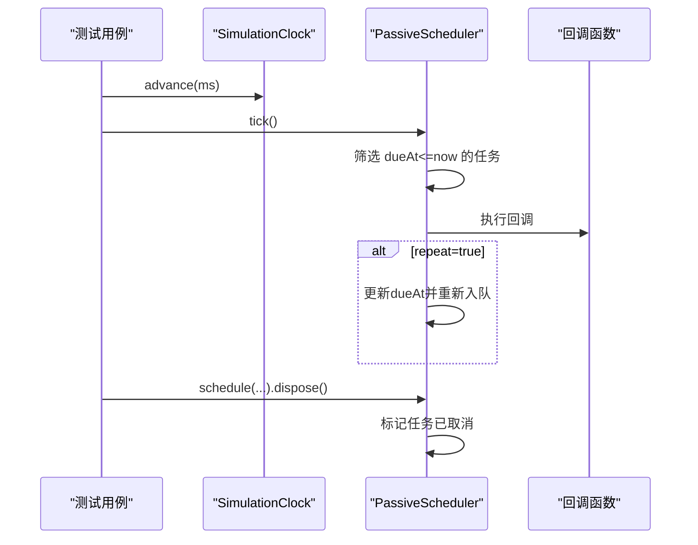
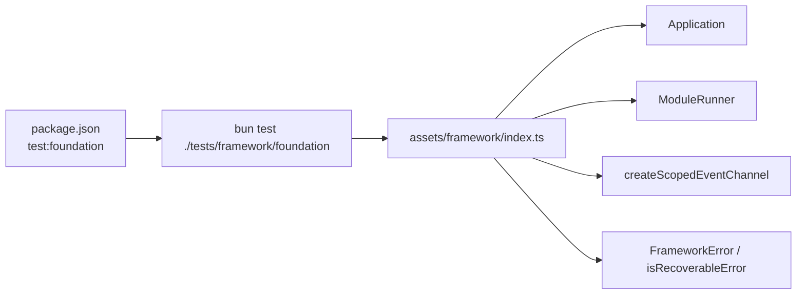

# 单元测试模式

<cite>
**本文引用的文件**
- [package.json](file://package.json)
- [tsconfig.json](file://tsconfig.json)
- [tests/framework/foundation/application-lifecycle.test.ts](file://tests/framework/foundation/application-lifecycle.test.ts)
- [tests/framework/foundation/module-runner.test.ts](file://tests/framework/foundation/module-runner.test.ts)
- [tests/framework/foundation/scoped-event-channel.test.ts](file://tests/framework/foundation/scoped-event-channel.test.ts)
- [tests/framework/foundation/dispose-handle.test.ts](file://tests/framework/foundation/dispose-handle.test.ts)
- [tests/framework/foundation/passive-scheduler.test.ts](file://tests/framework/foundation/passive-scheduler.test.ts)
- [tests/framework/foundation/simulation-clock.test.ts](file://tests/framework/foundation/simulation-clock.test.ts)
- [tests/framework/support/MemoryLogger.ts](file://tests/framework/support/MemoryLogger.ts)
- [assets/framework/index.ts](file://assets/framework/index.ts)
- [assets/framework/core/events/ScopedEventChannel.ts](file://assets/framework/core/events/ScopedEventChannel.ts)
- [assets/framework/core/scheduling/PassiveScheduler.ts](file://assets/framework/core/scheduling/PassiveScheduler.ts)
- [assets/framework/core/time/SimulationClock.ts](file://assets/framework/core/time/SimulationClock.ts)
</cite>

## 目录
1. [简介](#简介)
2. [项目结构](#项目结构)
3. [核心组件](#核心组件)
4. [架构总览](#架构总览)
5. [详细组件分析](#详细组件分析)
6. [依赖分析](#依赖分析)
7. [性能考虑](#性能考虑)
8. [故障排查指南](#故障排查指南)
9. [结论](#结论)
10. [附录](#附录)

## 简介
本文件面向使用 Bun Test 框架的开发者，系统化阐述在本项目中如何编写高质量的单元测试。内容覆盖测试用例组织、断言风格、测试数据与 Mock 对象准备、应用生命周期与模块运行器的测试方法、事件系统（作用域事件通道）的验证策略、异步与错误处理、边界条件、隔离性最佳实践，以及性能与压力测试的指导。所有示例均基于仓库中已有的测试实现进行提炼与归纳，帮助读者快速掌握可复用的测试模式。

## 项目结构
本项目采用“按功能域+分层”的组织方式：
- assets/framework：框架核心能力（应用、模块、事件、调度、时间源等）
- tests/framework/foundation：针对框架基础能力的单元测试集合
- tests/framework/support：测试支撑（如内存日志记录器）
- package.json：脚本入口，统一通过 bun test 执行

图表来源
- [package.json:7-10](file://package.json#L7-L10)
- [assets/framework/index.ts:1-44](file://assets/framework/index.ts#L1-L44)
- [assets/framework/core/events/ScopedEventChannel.ts:1-129](file://assets/framework/core/events/ScopedEventChannel.ts#L1-L129)
- [assets/framework/core/scheduling/PassiveScheduler.ts:1-116](file://assets/framework/core/scheduling/PassiveScheduler.ts#L1-L116)
- [assets/framework/core/time/SimulationClock.ts:1-63](file://assets/framework/core/time/SimulationClock.ts#L1-L63)

章节来源
- [package.json:7-10](file://package.json#L7-L10)
- [tsconfig.json:1-10](file://tsconfig.json#L1-L10)

## 核心组件
围绕以下三类核心组件构建测试体系：
- 应用与模块生命周期：Application、ModuleRunner、Module
- 事件系统：ScopedEventChannel（类型化、作用域隔离、订阅句柄释放）
- 调度与时间：PassiveScheduler、SimulationClock、DisposeHandle

关键测试要点：
- 动态导入被测模块，避免运行时耦合；构造最小上下文（ApplicationContext）注入 Logger
- 使用内存日志记录器 MemoryLogger 收集输出，便于断言
- 使用 SimulationClock 驱动被动调度器，确保时间可控、可重复
- 对事件通道进行类型约束、异常隔离、作用域关闭与内存释放验证

章节来源
- [tests/framework/foundation/application-lifecycle.test.ts:1-162](file://tests/framework/foundation/application-lifecycle.test.ts#L1-L162)
- [tests/framework/foundation/module-runner.test.ts:1-171](file://tests/framework/foundation/module-runner.test.ts#L1-L171)
- [tests/framework/foundation/scoped-event-channel.test.ts:1-249](file://tests/framework/foundation/scoped-event-channel.test.ts#L1-L249)
- [tests/framework/foundation/dispose-handle.test.ts:1-180](file://tests/framework/foundation/dispose-handle.test.ts#L1-L180)
- [tests/framework/foundation/passive-scheduler.test.ts:1-206](file://tests/framework/foundation/passive-scheduler.test.ts#L1-L206)
- [tests/framework/foundation/simulation-clock.test.ts:1-142](file://tests/framework/foundation/simulation-clock.test.ts#L1-L142)
- [tests/framework/support/MemoryLogger.ts:1-44](file://tests/framework/support/MemoryLogger.ts#L1-L44)
- [assets/framework/index.ts:1-44](file://assets/framework/index.ts#L1-L44)

## 架构总览
下图展示了测试层与被测组件之间的交互关系，体现“测试驱动时间、注入上下文、断言状态与副作用”的整体流程。

图表来源
- [assets/framework/index.ts:1-44](file://assets/framework/index.ts#L1-L44)
- [assets/framework/core/events/ScopedEventChannel.ts:1-129](file://assets/framework/core/events/ScopedEventChannel.ts#L1-L129)
- [assets/framework/core/scheduling/PassiveScheduler.ts:1-116](file://assets/framework/core/scheduling/PassiveScheduler.ts#L1-L116)
- [assets/framework/core/time/SimulationClock.ts:1-63](file://assets/framework/core/time/SimulationClock.ts#L1-L63)

## 详细组件分析

### 应用生命周期测试（Application）
- 目标：验证应用从创建到启动、暂停、恢复、停止、销毁的全链路状态迁移与模块钩子调用顺序
- 方法：
  - 动态导入 Application 构造函数
  - 构造最小 ApplicationContext（注入 MemoryLogger）
  - 构造自定义 Module 以记录 initialize/start/pause/resume/stop/dispose 调用序列
  - 断言应用状态与模块钩子调用顺序一致
- 关键点：
  - 无模块场景下的空跑路径
  - 上下文不可变性校验（传递给模块钩子的 context 不应被修改）

图表来源
- [tests/framework/foundation/application-lifecycle.test.ts:70-119](file://tests/framework/foundation/application-lifecycle.test.ts#L70-L119)
- [assets/framework/index.ts:41-44](file://assets/framework/index.ts#L41-L44)

章节来源
- [tests/framework/foundation/application-lifecycle.test.ts:1-162](file://tests/framework/foundation/application-lifecycle.test.ts#L1-L162)

### 模块运行器测试（ModuleRunner）
- 目标：验证模块按依赖拓扑初始化、启动、停止、销毁的顺序与幂等性
- 方法：
  - 构造具有依赖关系的多个模块（logging -> inventory -> gameplay）
  - 依次调用 initialize/start/stop/dispose，断言调用顺序与运行时状态
  - 重复调用同一阶段不触发重复执行
- 关键点：
  - 反向依赖顺序停止与销毁
  - 幂等性保障（多次调用相同阶段不重复执行）

图表来源
- [tests/framework/foundation/module-runner.test.ts:68-145](file://tests/framework/foundation/module-runner.test.ts#L68-L145)

章节来源
- [tests/framework/foundation/module-runner.test.ts:1-171](file://tests/framework/foundation/module-runner.test.ts#L1-L171)

### 事件系统测试（ScopedEventChannel）
- 目标：验证类型化发布/订阅、异常隔离、作用域关闭、订阅句柄释放与内存回收
- 方法：
  - 定义事件映射类型，确保 on/emit 的类型安全
  - 验证单个事件仅投递给对应订阅者
  - 验证订阅句柄 dispose 后不再接收事件，且重复 dispose 安全
  - 验证 emit 过程中某个处理器抛错不影响其他处理器
  - 验证 channel.dispose 后 emit 静默忽略，再次 on 抛错
  - 验证在 emit 期间新增或移除订阅的行为
  - 验证 WeakRef 确认闭包引用释放，避免内存泄漏
  - 验证多实例间隔离，无全局单例暴露

图表来源
- [assets/framework/core/events/ScopedEventChannel.ts:1-129](file://assets/framework/core/events/ScopedEventChannel.ts#L1-L129)

章节来源
- [tests/framework/foundation/scoped-event-channel.test.ts:1-249](file://tests/framework/foundation/scoped-event-channel.test.ts#L1-L249)

### 调度与时间测试（PassiveScheduler、SimulationClock、DisposeHandle）
- 目标：验证被动调度器基于时间源的 tick 驱动、任务取消、重复任务、暂停/恢复行为；验证模拟时钟的时间推进与速率缩放；验证 DisposeHandle 的幂等性与隔离性
- 方法：
  - 使用 SimulationClock 控制时间推进，配合 PassiveScheduler.tick 驱动任务
  - 验证任务在 dueAt <= now 时执行，且只执行一次（非 repeat）
  - 验证 repeat=true 的任务在每个周期重新入队
  - 验证 clock.pause/resume 对任务执行的影响
  - 验证 schedule 参数合法性校验（负数、NaN、Infinity）
  - 验证 DisposeHandle.dispose 取消任务、scheduler.dispose 清空队列
  - 验证弱引用释放，确保回调闭包中的大对象可被 GC 回收

图表来源
- [assets/framework/core/scheduling/PassiveScheduler.ts:20-116](file://assets/framework/core/scheduling/PassiveScheduler.ts#L20-L116)
- [assets/framework/core/time/SimulationClock.ts:12-63](file://assets/framework/core/time/SimulationClock.ts#L12-L63)

章节来源
- [tests/framework/foundation/passive-scheduler.test.ts:1-206](file://tests/framework/foundation/passive-scheduler.test.ts#L1-L206)
- [tests/framework/foundation/simulation-clock.test.ts:1-142](file://tests/framework/foundation/simulation-clock.test.ts#L1-L142)
- [tests/framework/foundation/dispose-handle.test.ts:1-180](file://tests/framework/foundation/dispose-handle.test.ts#L1-L180)

### 测试数据与 Mock 对象
- MemoryLogger：实现 Logger 接口，内部委托 ScopedLogger，将日志记录存入内存数组，便于断言
- 自定义 Module：用于记录生命周期钩子调用顺序与状态变化
- 自定义 TimeSource：在部分测试中使用简单 stub 替代真实时间源

章节来源
- [tests/framework/support/MemoryLogger.ts:1-44](file://tests/framework/support/MemoryLogger.ts#L1-L44)
- [tests/framework/foundation/application-lifecycle.test.ts:46-68](file://tests/framework/foundation/application-lifecycle.test.ts#L46-L68)
- [tests/framework/foundation/passive-scheduler.test.ts:8-13](file://tests/framework/foundation/passive-scheduler.test.ts#L8-L13)

## 依赖分析
- 测试脚本入口：package.json 中 test:foundation 指向 bun test ./tests/framework/foundation
- 测试与源码解耦：测试通过动态 import 加载被测模块，避免编译期强耦合
- 公共导出：assets/framework/index.ts 集中导出类型与工厂函数，测试据此获取 Application、ModuleRunner、事件通道等

图表来源
- [package.json:7-10](file://package.json#L7-L10)
- [assets/framework/index.ts:1-44](file://assets/framework/index.ts#L1-L44)

章节来源
- [package.json:7-10](file://package.json#L7-L10)
- [assets/framework/index.ts:1-44](file://assets/framework/index.ts#L1-L44)

## 性能考虑
- 使用 SimulationClock 替代真实时间，避免 I/O 与系统时钟抖动，保证测试确定性
- 事件通道在 emit 过程中捕获处理器异常，避免阻塞后续处理器，提升鲁棒性
- 及时 dispose 订阅句柄与通道，减少内存占用；通过 WeakRef 验证闭包释放
- 调度器 tick 批量处理到期任务，排序后执行，降低频繁唤醒开销
- 建议的性能测试方向：
  - 大量事件并发 emit 的吞吐与延迟分布
  - 大规模任务调度（数千级）的内存与 CPU 占用
  - 长时间运行的稳定性（GC 压力、句柄泄漏检测）
- 压力测试建议：
  - 循环生成事件与订阅，观察 dispose 后的内存回收
  - 高频率 tick 驱动调度器，统计任务执行耗时分布
  - 结合 Bun.gc(true) 强制 GC 验证资源释放

[本节为通用指导，不直接分析具体文件]

## 故障排查指南
- 常见错误与定位：
  - 事件处理器抛错：检查 onHandlerError 回调是否被调用，确认未影响其他处理器
  - 任务未执行：确认 tick 是否被调用、clock 是否 paused、dueAt 是否正确计算
  - 订阅未释放：检查 handle.dispose 是否被调用，是否存在闭包引用导致无法 GC
  - 模块生命周期异常：检查依赖图与状态机转换，确认幂等调用不会重复执行
- 调试技巧：
  - 使用 MemoryLogger 收集日志，断言关键路径的输出
  - 使用 SimulationClock 精确推进时间，缩小问题范围
  - 在事件通道中设置 onHandlerError，捕获并打印异常堆栈

章节来源
- [assets/framework/core/events/ScopedEventChannel.ts:99-108](file://assets/framework/core/events/ScopedEventChannel.ts#L99-L108)
- [assets/framework/core/scheduling/PassiveScheduler.ts:98-102](file://assets/framework/core/scheduling/PassiveScheduler.ts#L98-L102)
- [tests/framework/foundation/scoped-event-channel.test.ts:65-85](file://tests/framework/foundation/scoped-event-channel.test.ts#L65-L85)
- [tests/framework/foundation/passive-scheduler.test.ts:122-155](file://tests/framework/foundation/passive-scheduler.test.ts#L122-L155)

## 结论
通过本项目的测试实践可以看出，Bun Test 框架能够很好地支持 TypeScript 环境下的模块化、异步与时间相关逻辑的测试。关键在于：
- 使用动态导入与最小上下文注入，保持测试与实现的松耦合
- 借助 SimulationClock 与 PassiveScheduler 实现确定性时间驱动
- 通过类型化的事件通道与句柄管理，确保事件系统的健壮性与内存安全
- 利用内存日志与 WeakRef 等手段，强化可观测性与资源释放验证

遵循上述模式，可在复杂游戏框架中建立稳定、可维护、可扩展的测试体系。

[本节为总结性内容，不直接分析具体文件]

## 附录
- 运行命令：
  - 执行基础测试：bun run test:foundation
  - 类型契约检查：bun run test:foundation:types
- 测试组织建议：
  - 按功能域划分测试文件，每个文件聚焦单一职责
  - 使用 describe/test 分组与命名，增强可读性
  - 将共享辅助类放入 support 目录，避免重复实现

章节来源
- [package.json:7-10](file://package.json#L7-L10)