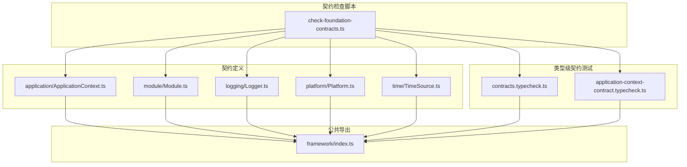
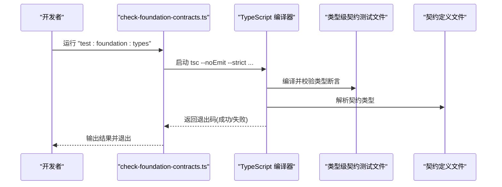
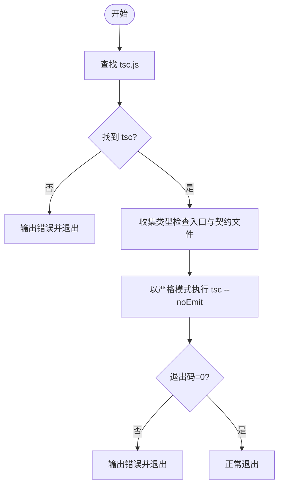
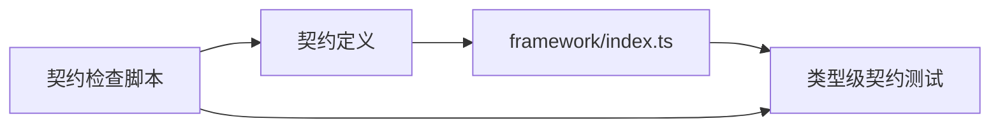

# 契约测试

<cite>
**本文引用的文件**
- [tests/framework/foundation/contracts.typecheck.ts](file://tests/framework/foundation/contracts.typecheck.ts)
- [tests/framework/foundation/application-context-contract.typecheck.ts](file://tests/framework/foundation/application-context-contract.typecheck.ts)
- [tests/scripts/check-foundation-contracts.ts](file://tests/scripts/check-foundation-contracts.ts)
- [assets/framework/index.ts](file://assets/framework/index.ts)
- [assets/framework/contracts/application/ApplicationContext.ts](file://assets/framework/contracts/application/ApplicationContext.ts)
- [assets/framework/contracts/module/Module.ts](file://assets/framework/contracts/module/Module.ts)
- [assets/framework/contracts/logging/Logger.ts](file://assets/framework/contracts/logging/Logger.ts)
- [assets/framework/contracts/platform/Platform.ts](file://assets/framework/contracts/platform/Platform.ts)
- [assets/framework/contracts/time/TimeSource.ts](file://assets/framework/contracts/time/TimeSource.ts)
- [package.json](file://package.json)
- [tsconfig.json](file://tsconfig.json)
- [tests/framework/foundation/module-contract.test.ts](file://tests/framework/foundation/module-contract.test.ts)
- [tests/framework/foundation/platform-contract.test.ts](file://tests/framework/foundation/platform-contract.test.ts)
</cite>

## 目录
1. [简介](#简介)
2. [项目结构](#项目结构)
3. [核心组件](#核心组件)
4. [架构总览](#架构总览)
5. [详细组件分析](#详细组件分析)
6. [依赖关系分析](#依赖关系分析)
7. [性能考虑](#性能考虑)
8. [故障排查指南](#故障排查指南)
9. [结论](#结论)
10. [附录](#附录)

## 简介
本文件面向 TypeScript 类型系统的契约测试，系统性说明如何通过“类型级断言”与“运行时契约校验脚本”共同保障框架接口契约的正确性、稳定性与向后兼容性。重点覆盖：
- 类型级别的契约测试机制与编写方法
- Application Context、Module、Logger、Platform、TimeSource 等关键契约的类型验证
- 自动化执行与持续集成配置策略
- 类型迁移与版本升级时的契约验证策略

## 项目结构
该仓库将契约定义集中于 assets/framework/contracts 目录，并通过 assets/framework/index.ts 统一导出类型；类型级契约测试位于 tests/framework/foundation/*.typecheck.ts；契约检查脚本位于 tests/scripts/check-foundation-contracts.ts；包脚本在 package.json 中暴露。

图表来源
- [assets/framework/index.ts:1-44](file://assets/framework/index.ts#L1-L44)
- [assets/framework/contracts/application/ApplicationContext.ts:1-18](file://assets/framework/contracts/application/ApplicationContext.ts#L1-L18)
- [assets/framework/contracts/module/Module.ts:1-30](file://assets/framework/contracts/module/Module.ts#L1-L30)
- [assets/framework/contracts/logging/Logger.ts:1-21](file://assets/framework/contracts/logging/Logger.ts#L1-L21)
- [assets/framework/contracts/platform/Platform.ts:1-22](file://assets/framework/contracts/platform/Platform.ts#L1-L22)
- [assets/framework/contracts/time/TimeSource.ts:1-4](file://assets/framework/contracts/time/TimeSource.ts#L1-L4)
- [tests/framework/foundation/contracts.typecheck.ts:1-230](file://tests/framework/foundation/contracts.typecheck.ts#L1-L230)
- [tests/framework/foundation/application-context-contract.typecheck.ts:1-58](file://tests/framework/foundation/application-context-contract.typecheck.ts#L1-L58)
- [tests/scripts/check-foundation-contracts.ts:1-90](file://tests/scripts/check-foundation-contracts.ts#L1-L90)

章节来源
- [assets/framework/index.ts:1-44](file://assets/framework/index.ts#L1-L44)
- [package.json:1-12](file://package.json#L1-L12)

## 核心组件
- 应用上下文与应用生命周期
  - ApplicationContext 仅暴露 logger 与只读 state，禁止注入服务定位器或应用身份字段，确保最小化且稳定的上下文契约。
- 模块契约
  - Module 使用字符串 id 与只读依赖数组，生命周期钩子可选且可同步或异步，避免基类/单例模式，保持纯类型契约。
- 日志契约
  - Logger 提供 debug/info/warn/error/child，LogRecord/LogLevel/LogContext 为不可变记录与上下文。
- 平台契约
  - ApplicationVisibility、PlatformStorage、DeviceInfo 均为纯接口，不依赖引擎或应用层实现。
- 时间源契约
  - TimeSource.now() 返回 number，用于解耦时间与调度。

章节来源
- [assets/framework/contracts/application/ApplicationContext.ts:1-18](file://assets/framework/contracts/application/ApplicationContext.ts#L1-L18)
- [assets/framework/contracts/module/Module.ts:1-30](file://assets/framework/contracts/module/Module.ts#L1-L30)
- [assets/framework/contracts/logging/Logger.ts:1-21](file://assets/framework/contracts/logging/Logger.ts#L1-L21)
- [assets/framework/contracts/platform/Platform.ts:1-22](file://assets/framework/contracts/platform/Platform.ts#L1-L22)
- [assets/framework/contracts/time/TimeSource.ts:1-4](file://assets/framework/contracts/time/TimeSource.ts#L1-L4)

## 架构总览
类型级契约测试通过“类型相等断言 + 键存在性/可选性/只读性断言”来约束契约的形态与行为；契约检查脚本则负责以严格模式编译所有契约与测试文件，确保类型变更不会破坏现有消费者。

图表来源
- [tests/scripts/check-foundation-contracts.ts:1-90](file://tests/scripts/check-foundation-contracts.ts#L1-L90)
- [tests/framework/foundation/contracts.typecheck.ts:1-230](file://tests/framework/foundation/contracts.typecheck.ts#L1-L230)
- [assets/framework/index.ts:1-44](file://assets/framework/index.ts#L1-L44)

## 详细组件分析

### Application Context 契约测试
- 目标
  - 验证 ApplicationContext 仅包含 logger 与只读 state
  - 禁止 token/serviceLocator/generic get 等扩展字段
  - 验证 ApplicationLifecycle.state 只读
- 方法
  - 使用 Equal/Expect/IsReadonlyKey/NeverKey 等类型工具进行形状与属性约束
- 效果
  - 任何对 ApplicationContext 的增删改都会导致类型检查失败，从而阻止破坏性变更

章节来源
- [tests/framework/foundation/application-context-contract.typecheck.ts:1-58](file://tests/framework/foundation/application-context-contract.typecheck.ts#L1-L58)
- [assets/framework/contracts/application/ApplicationContext.ts:1-18](file://assets/framework/contracts/application/ApplicationContext.ts#L1-L18)

### 全局契约类型断言
- 目标
  - 校验 Application/ApplicationState/ApplicationLifecycle 的形状与只读性
  - 校验 Module.ModulePhase/ModuleRuntimeState 的闭联合集
  - 校验 Logger/Platform/TimeSource 的方法签名与返回值
  - 校验 ScopedEventChannel 的事件映射与 DisposeHandle 返回
- 方法
  - 集中式 contracts.typecheck.ts 使用类型工具断言 key 集合、可选性、只读性与函数签名
- 效果
  - 一次编译即可覆盖多领域契约，降低回归风险

章节来源
- [tests/framework/foundation/contracts.typecheck.ts:1-230](file://tests/framework/foundation/contracts.typecheck.ts#L1-L230)
- [assets/framework/index.ts:1-44](file://assets/framework/index.ts#L1-L44)

### Module 契约测试（运行时）
- 目标
  - 确认 Module 以组合契约形式暴露，非基类/单例
  - 生命周期钩子全部可选，支持同步/异步
  - 契约目录在运行时被完全擦除
  - 仅以 type-only import 引用 ApplicationContext
- 方法
  - 读取源码并进行正则匹配与 Transpiler 扫描，断言导出、导入与运行时产物
- 效果
  - 防止契约污染运行时，保证契约稳定与轻量

章节来源
- [tests/framework/foundation/module-contract.test.ts:1-221](file://tests/framework/foundation/module-contract.test.ts#L1-L221)
- [assets/framework/contracts/module/Module.ts:1-30](file://assets/framework/contracts/module/Module.ts#L1-L30)

### Platform 契约测试（运行时）
- 目标
  - 确认 ApplicationVisibility/PlatformStorage/DeviceInfo/TimeSource 存在且签名正确
  - 确保平台契约独立于运行时与应用层
- 方法
  - 读取契约文件并断言接口与方法签名，同时排除对引擎/应用层的引用
- 效果
  - 平台抽象保持稳定，便于替换实现

章节来源
- [tests/framework/foundation/platform-contract.test.ts:1-50](file://tests/framework/foundation/platform-contract.test.ts#L1-L50)
- [assets/framework/contracts/platform/Platform.ts:1-22](file://assets/framework/contracts/platform/Platform.ts#L1-L22)
- [assets/framework/contracts/time/TimeSource.ts:1-4](file://assets/framework/contracts/time/TimeSource.ts#L1-L4)

### 类型级断言工具与模式
- Equal/Expect：用于精确类型相等断言
- IsReadonlyKey/IsOptionalKey：用于属性修饰符断言
- NeverKey：用于禁止特定键存在
- 典型用法
  - 断言 key 集合等于期望值
  - 断言某属性为只读
  - 断言某方法签名为 Promise<void>
  - 断言事件映射与回调参数一致

章节来源
- [tests/framework/foundation/contracts.typecheck.ts:26-46](file://tests/framework/foundation/contracts.typecheck.ts#L26-L46)
- [tests/framework/foundation/application-context-contract.typecheck.ts:8-25](file://tests/framework/foundation/application-context-contract.typecheck.ts#L8-L25)

### 契约检查脚本与执行流程
- 功能
  - 收集类型检查入口与框架契约文件
  - 定位 Cocos Creator 内置 tsc.js
  - 以 --noEmit --strict 模式执行类型检查
  - 过滤 adapters/cocos 目录以避免平台实现干扰
- 执行路径
  - 优先环境变量 COCOS_TSC，其次尝试常见安装路径
  - 若未找到 tsc，输出错误并退出
- 集成
  - 通过 npm script test:foundation:types 调用

图表来源
- [tests/scripts/check-foundation-contracts.ts:1-90](file://tests/scripts/check-foundation-contracts.ts#L1-L90)

章节来源
- [tests/scripts/check-foundation-contracts.ts:1-90](file://tests/scripts/check-foundation-contracts.ts#L1-L90)
- [package.json:1-12](file://package.json#L1-L12)

## 依赖关系分析
- 契约定义之间相互独立，仅通过 index.ts 统一导出类型
- 类型级测试依赖契约定义与公共导出，但不引入运行时实现
- 契约检查脚本依赖 tsc 与 Node 文件系统 API，不依赖业务代码

图表来源
- [assets/framework/index.ts:1-44](file://assets/framework/index.ts#L1-L44)
- [tests/framework/foundation/contracts.typecheck.ts:1-230](file://tests/framework/foundation/contracts.typecheck.ts#L1-L230)
- [tests/scripts/check-foundation-contracts.ts:1-90](file://tests/scripts/check-foundation-contracts.ts#L1-L90)

章节来源
- [assets/framework/index.ts:1-44](file://assets/framework/index.ts#L1-L44)

## 性能考虑
- 类型检查为编译期操作，无运行时开销
- 使用 --skipLibCheck 减少第三方库类型检查成本
- 仅扫描必要目录，避免无关文件参与类型检查
- 建议将类型检查纳入 CI 的早期阶段，快速反馈

## 故障排查指南
- 找不到 tsc.js
  - 设置环境变量 COCOS_TSC 指向 tsc.js 绝对路径
  - 或确保 Cocos Creator 安装路径可被脚本自动发现
- 类型检查失败
  - 检查 contracts.typecheck.ts 与 application-context-contract.typecheck.ts 中的断言是否仍符合最新契约
  - 检查契约定义是否意外引入了运行时依赖或改变了 key 集合
- 平台契约污染
  - 确保 platform/time 契约不包含 cc 或应用层引用
- 模块契约运行时残留
  - 确认契约目录在构建时被完全擦除，且仅使用 type-only import

章节来源
- [tests/scripts/check-foundation-contracts.ts:35-58](file://tests/scripts/check-foundation-contracts.ts#L35-L58)
- [tests/framework/foundation/platform-contract.test.ts:41-49](file://tests/framework/foundation/platform-contract.test.ts#L41-L49)
- [tests/framework/foundation/module-contract.test.ts:135-144](file://tests/framework/foundation/module-contract.test.ts#L135-L144)

## 结论
通过将“类型级断言”和“契约检查脚本”结合，本项目实现了强类型的契约治理：
- 类型断言确保接口形状、只读性、可选性与方法签名稳定
- 脚本确保编译环境与契约文件的完整性
- 运行时测试进一步验证契约的语义与边界条件
这种分层策略有效降低了重构与升级的风险，并为持续集成提供了可靠的契约护栏。

## 附录

### 如何编写类型级别测试用例
- 使用 Equal/Expect 断言类型相等
- 使用 IsReadonlyKey/IsOptionalKey 断言属性修饰符
- 使用 NeverKey 禁止特定键存在
- 针对每个关键契约编写独立的 .typecheck.ts 文件，便于聚焦与复用

章节来源
- [tests/framework/foundation/contracts.typecheck.ts:26-46](file://tests/framework/foundation/contracts.typecheck.ts#L26-L46)
- [tests/framework/foundation/application-context-contract.typecheck.ts:8-25](file://tests/framework/foundation/application-context-contract.typecheck.ts#L8-L25)

### 自动化执行与持续集成配置
- 本地执行
  - 运行 "bun test ./tests/framework/foundation" 执行运行时契约测试
  - 运行 "bun ./tests/scripts/check-foundation-contracts.ts" 执行类型契约检查
- CI 建议
  - 在 PR 构建前执行类型检查与运行时测试
  - 缓存 tsc 与依赖，加速构建
  - 将失败视为阻断合并的条件

章节来源
- [package.json:7-10](file://package.json#L7-L10)
- [tests/scripts/check-foundation-contracts.ts:60-77](file://tests/scripts/check-foundation-contracts.ts#L60-L77)

### 类型迁移与版本升级的契约验证策略
- 增量变更
  - 先修改契约定义，再更新类型级断言，最后修复消费者
- 向后兼容
  - 新增字段时保持可选，避免破坏已有消费者
  - 对废弃字段保留一段时间并提供迁移提示
- 回归保障
  - 每次变更都需通过类型检查与运行时契约测试
  - 对关键路径补充快照或基线测试

章节来源
- [tests/framework/foundation/contracts.typecheck.ts:100-147](file://tests/framework/foundation/contracts.typecheck.ts#L100-L147)
- [tests/framework/foundation/module-contract.test.ts:146-153](file://tests/framework/foundation/module-contract.test.ts#L146-L153)