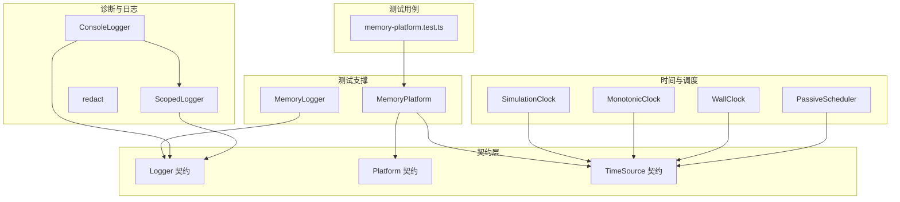
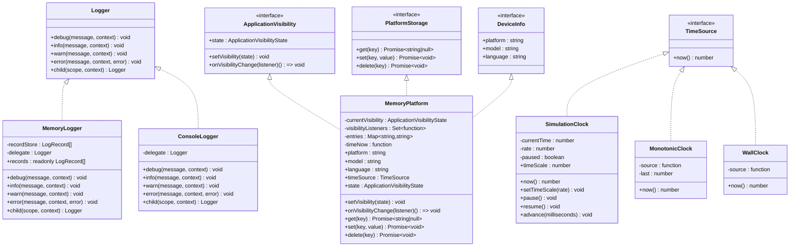
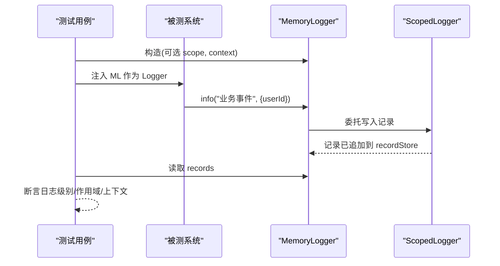
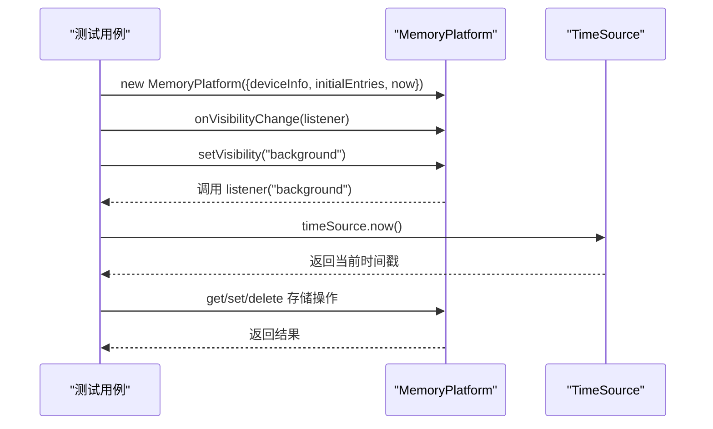
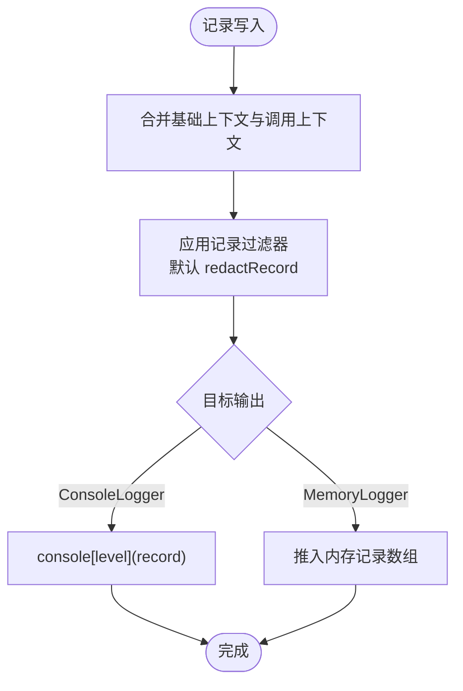
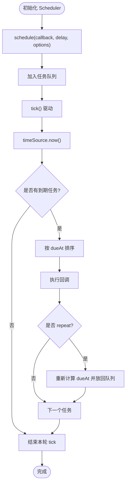
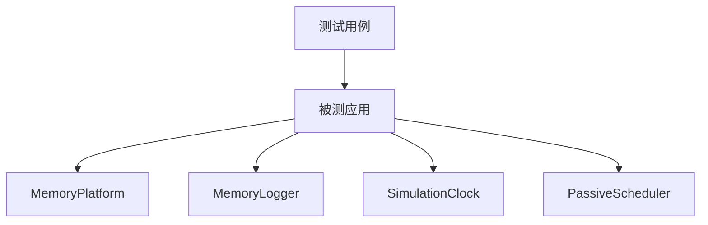
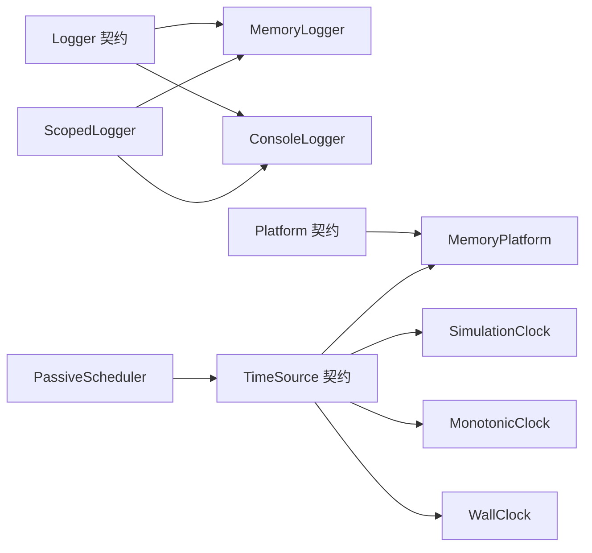

# 测试工具和实用程序

<cite>
**本文引用的文件**
- [MemoryLogger.ts](file://tests/framework/support/MemoryLogger.ts)
- [MemoryPlatform.ts](file://assets/framework/adapters/memory/MemoryPlatform.ts)
- [Logger.ts](file://assets/framework/contracts/logging/Logger.ts)
- [Platform.ts](file://assets/framework/contracts/platform/Platform.ts)
- [ConsoleLogger.ts](file://assets/framework/diagnostics/logging/ConsoleLogger.ts)
- [ScopedLogger.ts](file://assets/framework/diagnostics/logging/ScopedLogger.ts)
- [redact.ts](file://assets/framework/diagnostics/logging/redact.ts)
- [TimeSource.ts](file://assets/framework/contracts/time/TimeSource.ts)
- [SimulationClock.ts](file://assets/framework/core/time/SimulationClock.ts)
- [MonotonicClock.ts](file://assets/framework/core/time/MonotonicClock.ts)
- [WallClock.ts](file://assets/framework/core/time/WallClock.ts)
- [PassiveScheduler.ts](file://assets/framework/core/scheduling/PassiveScheduler.ts)
- [memory-platform.test.ts](file://tests/framework/foundation/memory-platform.test.ts)
</cite>

## 目录
1. [简介](#简介)
2. [项目结构](#项目结构)
3. [核心组件](#核心组件)
4. [架构总览](#架构总览)
5. [详细组件分析](#详细组件分析)
6. [依赖关系分析](#依赖关系分析)
7. [性能考量](#性能考量)
8. [故障排查指南](#故障排查指南)
9. [结论](#结论)
10. [附录](#附录)

## 简介
本文件聚焦于项目的测试工具与实用程序，系统性介绍 MemoryLogger、MemoryPlatform 等测试专用工具的使用方法与设计思路，并给出创建自定义测试工具类与辅助函数的最佳实践。内容涵盖：
- 日志记录器在测试中的内存化实现与断言方式
- 平台抽象的内存实现（可见性、存储、设备信息、时间源）
- 时间模拟与调度器在可确定性测试中的应用
- 测试数据生成器、模拟对象工厂与测试环境设置模式
- 内存管理与资源清理在测试中的重要性及实践建议

## 项目结构
测试相关代码主要分布在以下位置：
- tests/framework/support：测试支撑工具（如 MemoryLogger）
- assets/framework/adapters/memory：平台适配器的内存实现（MemoryPlatform）
- assets/framework/contracts：接口契约（Logger、Platform、TimeSource）
- assets/framework/diagnostics/logging：诊断与日志实现（ConsoleLogger、ScopedLogger、redact）
- assets/framework/core/time：时间源实现（SimulationClock、MonotonicClock、WallClock）
- assets/framework/core/scheduling：被动调度器（PassiveScheduler）
- tests/framework/foundation：针对具体能力的测试用例（如 memory-platform.test.ts）

图表来源
- [MemoryLogger.ts:1-44](file://tests/framework/support/MemoryLogger.ts#L1-L44)
- [MemoryPlatform.ts:1-94](file://assets/framework/adapters/memory/MemoryPlatform.ts#L1-L94)
- [Logger.ts:1-21](file://assets/framework/contracts/logging/Logger.ts#L1-L21)
- [Platform.ts:1-22](file://assets/framework/contracts/platform/Platform.ts#L1-L22)
- [ConsoleLogger.ts:1-56](file://assets/framework/diagnostics/logging/ConsoleLogger.ts#L1-L56)
- [ScopedLogger.ts:1-63](file://assets/framework/diagnostics/logging/ScopedLogger.ts#L1-L63)
- [redact.ts:1-76](file://assets/framework/diagnostics/logging/redact.ts#L1-L76)
- [TimeSource.ts:1-4](file://assets/framework/contracts/time/TimeSource.ts#L1-L4)
- [SimulationClock.ts:1-63](file://assets/framework/core/time/SimulationClock.ts#L1-L63)
- [MonotonicClock.ts:1-21](file://assets/framework/core/time/MonotonicClock.ts#L1-L21)
- [WallClock.ts:1-14](file://assets/framework/core/time/WallClock.ts#L1-L14)
- [PassiveScheduler.ts:1-116](file://assets/framework/core/scheduling/PassiveScheduler.ts#L1-L116)
- [memory-platform.test.ts:1-156](file://tests/framework/foundation/memory-platform.test.ts#L1-L156)

章节来源
- [MemoryLogger.ts:1-44](file://tests/framework/support/MemoryLogger.ts#L1-L44)
- [MemoryPlatform.ts:1-94](file://assets/framework/adapters/memory/MemoryPlatform.ts#L1-L94)
- [memory-platform.test.ts:1-156](file://tests/framework/foundation/memory-platform.test.ts#L1-L156)

## 核心组件
本节概述关键测试工具的职责与使用要点：
- MemoryLogger：基于内存的 Logger 实现，用于捕获日志记录以便断言；支持作用域与上下文合并；通过 child() 派生子日志器。
- MemoryPlatform：基于内存的平台实现，提供应用可见性状态管理、键值存储、设备信息与可注入的时间源；适合无外部依赖的单元测试。
- ConsoleLogger：将日志输出到控制台，配合 redact 过滤敏感信息；可作为生产或调试时的默认 Logger。
- ScopedLogger：日志作用域与上下文合并的核心实现，被 MemoryLogger 与 ConsoleLogger 复用。
- TimeSource 系列：WallClock（真实墙钟）、MonotonicClock（单调递增时钟）、SimulationClock（可暂停/加速/推进的模拟时钟）。
- PassiveScheduler：被动式任务调度器，基于 TimeSource 驱动 tick 执行到期任务，支持重复任务与错误隔离回调。

章节来源
- [MemoryLogger.ts:1-44](file://tests/framework/support/MemoryLogger.ts#L1-L44)
- [MemoryPlatform.ts:1-94](file://assets/framework/adapters/memory/MemoryPlatform.ts#L1-L94)
- [ConsoleLogger.ts:1-56](file://assets/framework/diagnostics/logging/ConsoleLogger.ts#L1-L56)
- [ScopedLogger.ts:1-63](file://assets/framework/diagnostics/logging/ScopedLogger.ts#L1-L63)
- [TimeSource.ts:1-4](file://assets/framework/contracts/time/TimeSource.ts#L1-L4)
- [SimulationClock.ts:1-63](file://assets/framework/core/time/SimulationClock.ts#L1-L63)
- [MonotonicClock.ts:1-21](file://assets/framework/core/time/MonotonicClock.ts#L1-L21)
- [WallClock.ts:1-14](file://assets/framework/core/time/WallClock.ts#L1-L14)
- [PassiveScheduler.ts:1-116](file://assets/framework/core/scheduling/PassiveScheduler.ts#L1-L116)

## 架构总览
下图展示了测试工具与契约之间的依赖关系，以及它们在测试场景中的协作方式。

图表来源
- [Logger.ts:1-21](file://assets/framework/contracts/logging/Logger.ts#L1-L21)
- [MemoryLogger.ts:1-44](file://tests/framework/support/MemoryLogger.ts#L1-L44)
- [ConsoleLogger.ts:1-56](file://assets/framework/diagnostics/logging/ConsoleLogger.ts#L1-L56)
- [Platform.ts:1-22](file://assets/framework/contracts/platform/Platform.ts#L1-L22)
- [MemoryPlatform.ts:1-94](file://assets/framework/adapters/memory/MemoryPlatform.ts#L1-L94)
- [TimeSource.ts:1-4](file://assets/framework/contracts/time/TimeSource.ts#L1-L4)
- [SimulationClock.ts:1-63](file://assets/framework/core/time/SimulationClock.ts#L1-L63)
- [MonotonicClock.ts:1-21](file://assets/framework/core/time/MonotonicClock.ts#L1-L21)
- [WallClock.ts:1-14](file://assets/framework/core/time/WallClock.ts#L1-L14)

## 详细组件分析

### MemoryLogger：内存化日志记录器
- 设计要点
  - 内部维护一个只读的日志记录数组，便于测试中按级别、作用域、上下文进行断言。
  - 通过 createScopedLogger 委托实际写入逻辑，统一处理作用域拼接与上下文合并。
  - 暴露 child() 以构建层级化的日志器，便于模块级隔离与命名空间组织。
- 使用建议
  - 在测试初始化时构造 MemoryLogger，并在被测模块中注入该实例作为 Logger。
  - 使用 records 属性获取所有日志条目，结合 level、scope、context 字段进行断言。
  - 对需要隔离上下文的子模块，使用 child() 创建子日志器，避免污染全局上下文。
- 注意事项
  - 由于记录存储在内存中，应避免在大量并发测试中共享同一实例，防止交叉污染。
  - 若需保留原始错误对象，确保 error 参数正确传入。

图表来源
- [MemoryLogger.ts:1-44](file://tests/framework/support/MemoryLogger.ts#L1-L44)
- [ScopedLogger.ts:1-63](file://assets/framework/diagnostics/logging/ScopedLogger.ts#L1-L63)

章节来源
- [MemoryLogger.ts:1-44](file://tests/framework/support/MemoryLogger.ts#L1-L44)
- [Logger.ts:1-21](file://assets/framework/contracts/logging/Logger.ts#L1-L21)
- [ScopedLogger.ts:1-63](file://assets/framework/diagnostics/logging/ScopedLogger.ts#L1-L63)

### MemoryPlatform：内存化平台实现
- 设计要点
  - 实现 ApplicationVisibility、PlatformStorage、DeviceInfo 三个契约，提供无外部依赖的测试平台。
  - 支持初始可见性、初始存储条目、设备信息注入与可替换的时间源。
  - 可见性变更会通知所有监听器，且失败监听器不会影响其他监听器执行。
- 使用建议
  - 在测试中通过 options 注入 deviceInfo、initialEntries、now 等，以获得确定性的运行环境。
  - 使用 timeSource.now() 替代直接调用 Date.now()，使时间相关逻辑可预测。
  - 通过 onVisibilityChange 注册监听器，并在测试结束后调用返回的注销函数释放资源。
- 注意事项
  - initialEntries 会在构造时复制，避免外部引用影响平台内部状态。
  - setVisibility 相同状态不会触发监听器，减少不必要的副作用。

图表来源
- [MemoryPlatform.ts:1-94](file://assets/framework/adapters/memory/MemoryPlatform.ts#L1-L94)
- [Platform.ts:1-22](file://assets/framework/contracts/platform/Platform.ts#L1-L22)
- [TimeSource.ts:1-4](file://assets/framework/contracts/time/TimeSource.ts#L1-L4)

章节来源
- [MemoryPlatform.ts:1-94](file://assets/framework/adapters/memory/MemoryPlatform.ts#L1-L94)
- [Platform.ts:1-22](file://assets/framework/contracts/platform/Platform.ts#L1-L22)
- [memory-platform.test.ts:1-156](file://tests/framework/foundation/memory-platform.test.ts#L1-L156)

### 日志子系统：ConsoleLogger、ScopedLogger 与 redact
- 设计要点
  - ConsoleLogger 将日志输出到控制台，并通过 redactRecord 过滤敏感上下文。
  - ScopedLogger 负责作用域拼接、上下文合并与记录过滤，是多种 Logger 实现的共同基础。
  - redact 模块根据键名模式识别敏感字段，并对循环引用进行标记，保证日志安全。
- 使用建议
  - 在生产或调试环境中使用 ConsoleLogger，并配置合适的 filter（默认 redactRecord）。
  - 在测试中使用 MemoryLogger 捕获记录，避免控制台输出干扰测试结果。
  - 自定义 filter 可实现更细粒度的脱敏策略（例如仅脱敏特定前缀的键）。

图表来源
- [ConsoleLogger.ts:1-56](file://assets/framework/diagnostics/logging/ConsoleLogger.ts#L1-L56)
- [ScopedLogger.ts:1-63](file://assets/framework/diagnostics/logging/ScopedLogger.ts#L1-L63)
- [redact.ts:1-76](file://assets/framework/diagnostics/logging/redact.ts#L1-L76)

章节来源
- [ConsoleLogger.ts:1-56](file://assets/framework/diagnostics/logging/ConsoleLogger.ts#L1-L56)
- [ScopedLogger.ts:1-63](file://assets/framework/diagnostics/logging/ScopedLogger.ts#L1-L63)
- [redact.ts:1-76](file://assets/framework/diagnostics/logging/redact.ts#L1-L76)

### 时间源与调度：SimulationClock、MonotonicClock、WallClock、PassiveScheduler
- 设计要点
  - TimeSource 抽象了时间获取，便于在不同实现间切换。
  - SimulationClock 支持暂停、恢复、时间缩放与手动推进，适合确定性测试。
  - MonotonicClock 保证单调递增，避免回拨问题。
  - WallClock 直接代理真实时间源。
  - PassiveScheduler 基于 TimeSource 驱动 tick，执行到期任务，支持重复任务与错误隔离回调。
- 使用建议
  - 在测试中将 SimulationClock 注入到依赖时间的组件，通过 advance() 控制时间推进。
  - 使用 PassiveScheduler 调度延迟任务，并在 tick() 中验证任务执行顺序与重复行为。
  - 对于需要单调时间的场景，使用 MonotonicClock 以避免时间回拨导致的边界问题。

图表来源
- [PassiveScheduler.ts:1-116](file://assets/framework/core/scheduling/PassiveScheduler.ts#L1-L116)
- [TimeSource.ts:1-4](file://assets/framework/contracts/time/TimeSource.ts#L1-L4)
- [SimulationClock.ts:1-63](file://assets/framework/core/time/SimulationClock.ts#L1-L63)

章节来源
- [SimulationClock.ts:1-63](file://assets/framework/core/time/SimulationClock.ts#L1-L63)
- [MonotonicClock.ts:1-21](file://assets/framework/core/time/MonotonicClock.ts#L1-L21)
- [WallClock.ts:1-14](file://assets/framework/core/time/WallClock.ts#L1-L14)
- [PassiveScheduler.ts:1-116](file://assets/framework/core/scheduling/PassiveScheduler.ts#L1-L116)

### 概念性概览：测试工具组合模式
在不绑定具体源码的前提下，常见的测试工具组合包括：
- 使用 MemoryPlatform 提供稳定的设备信息、存储与时间源
- 使用 MemoryLogger 捕获日志并进行断言
- 使用 SimulationClock 控制时间推进，配合 PassiveScheduler 验证定时逻辑
- 使用 ConsoleLogger 在开发阶段快速定位问题

[此图为概念性流程图，不映射具体源码，故不提供图表来源]

## 依赖关系分析
- 耦合与内聚
  - MemoryLogger 与 ConsoleLogger 均依赖 ScopedLogger，形成高内聚的日志子系统。
  - MemoryPlatform 聚合多个契约（ApplicationVisibility、PlatformStorage、DeviceInfo），并提供 TimeSource 抽象，降低对外部平台的耦合。
- 外部依赖与集成点
  - 时间源通过 TimeSource 接口解耦，便于替换为模拟或真实实现。
  - 日志输出通过 sink 函数注入，便于在测试中替换为内存存储。
- 潜在循环依赖
  - 当前结构未出现循环导入；日志子系统与平台适配器相互独立，通过契约解耦。

图表来源
- [Logger.ts:1-21](file://assets/framework/contracts/logging/Logger.ts#L1-L21)
- [MemoryLogger.ts:1-44](file://tests/framework/support/MemoryLogger.ts#L1-L44)
- [ConsoleLogger.ts:1-56](file://assets/framework/diagnostics/logging/ConsoleLogger.ts#L1-L56)
- [ScopedLogger.ts:1-63](file://assets/framework/diagnostics/logging/ScopedLogger.ts#L1-L63)
- [Platform.ts:1-22](file://assets/framework/contracts/platform/Platform.ts#L1-L22)
- [MemoryPlatform.ts:1-94](file://assets/framework/adapters/memory/MemoryPlatform.ts#L1-L94)
- [TimeSource.ts:1-4](file://assets/framework/contracts/time/TimeSource.ts#L1-L4)
- [SimulationClock.ts:1-63](file://assets/framework/core/time/SimulationClock.ts#L1-L63)
- [MonotonicClock.ts:1-21](file://assets/framework/core/time/MonotonicClock.ts#L1-L21)
- [WallClock.ts:1-14](file://assets/framework/core/time/WallClock.ts#L1-L14)
- [PassiveScheduler.ts:1-116](file://assets/framework/core/scheduling/PassiveScheduler.ts#L1-L116)

章节来源
- [Logger.ts:1-21](file://assets/framework/contracts/logging/Logger.ts#L1-L21)
- [Platform.ts:1-22](file://assets/framework/contracts/platform/Platform.ts#L1-L22)
- [TimeSource.ts:1-4](file://assets/framework/contracts/time/TimeSource.ts#L1-L4)

## 性能考量
- 日志记录
  - MemoryLogger 使用数组存储记录，频繁写入可能带来内存增长；建议在测试完成后及时重置或销毁实例。
  - redact 会对上下文进行递归遍历，复杂对象可能导致额外开销；可在测试中精简上下文以减少成本。
- 平台存储
  - MemoryPlatform 使用 Map 存储键值对，查找与更新均为 O(1)；但大量键值会增加内存占用。
- 时间源与调度
  - SimulationClock 的 advance() 与 PassiveScheduler 的 tick() 复杂度与任务数量线性相关；应合理拆分任务与批量推进时间。
  - MonotonicClock 的 now() 保持常数时间，避免时间回拨带来的额外判断。

[本节为通用指导，不直接分析具体文件]

## 故障排查指南
- 日志相关问题
  - 若日志未出现在预期作用域，检查 child() 的 scope 拼接是否正确。
  - 若上下文未脱敏，确认 filter 是否为 redactRecord，或自定义 filter 是否正确实现。
- 平台状态问题
  - 若可见性监听器未被调用，检查 setVisibility 是否改变了状态（相同状态不会触发）。
  - 若监听器抛出异常，确认其他监听器仍被执行（框架已做异常隔离）。
- 时间相关问题
  - 若时间未按预期推进，检查 SimulationClock 是否处于 paused 状态。
  - 若时间回拨导致逻辑异常，改用 MonotonicClock 保证单调递增。
- 调度器问题
  - 若任务未执行，检查 tick() 是否被调用，以及 timeSource.now() 是否大于等于 dueAt。
  - 若任务重复执行不符合预期，确认 schedule 的 repeat 选项是否正确设置。

章节来源
- [ConsoleLogger.ts:1-56](file://assets/framework/diagnostics/logging/ConsoleLogger.ts#L1-L56)
- [ScopedLogger.ts:1-63](file://assets/framework/diagnostics/logging/ScopedLogger.ts#L1-L63)
- [redact.ts:1-76](file://assets/framework/diagnostics/logging/redact.ts#L1-L76)
- [MemoryPlatform.ts:1-94](file://assets/framework/adapters/memory/MemoryPlatform.ts#L1-L94)
- [SimulationClock.ts:1-63](file://assets/framework/core/time/SimulationClock.ts#L1-L63)
- [MonotonicClock.ts:1-21](file://assets/framework/core/time/MonotonicClock.ts#L1-L21)
- [PassiveScheduler.ts:1-116](file://assets/framework/core/scheduling/PassiveScheduler.ts#L1-L116)

## 结论
本项目提供了完善的测试工具与实用程序，覆盖日志、平台、时间与调度等关键维度。通过契约抽象与内存化实现，开发者可以在无外部依赖的环境下编写稳定、可重复的测试。遵循本文的最佳实践，可以显著提升测试代码的可重用性与可维护性，同时确保内存管理与资源清理的正确性。

[本节为总结性内容，不直接分析具体文件]

## 附录
- 测试数据生成器与模拟对象工厂
  - 为不同测试场景定义统一的工厂函数，集中生成设备信息、初始存储条目与时间源配置。
  - 使用闭包或模板方法封装常见初始化流程，减少重复代码。
- 测试环境设置最佳实践
  - 每个测试用例独立构造 MemoryPlatform 与 MemoryLogger，避免状态泄漏。
  - 在测试结束时显式调用注销函数与 dispose()，确保资源释放。
- 内存管理与资源清理的重要性
  - 测试过程中频繁创建对象易造成内存压力，应在必要时重置或销毁实例。
  - 使用 DisposeHandle 管理任务生命周期，防止悬挂回调引发内存泄漏。

[本节为通用指导，不直接分析具体文件]