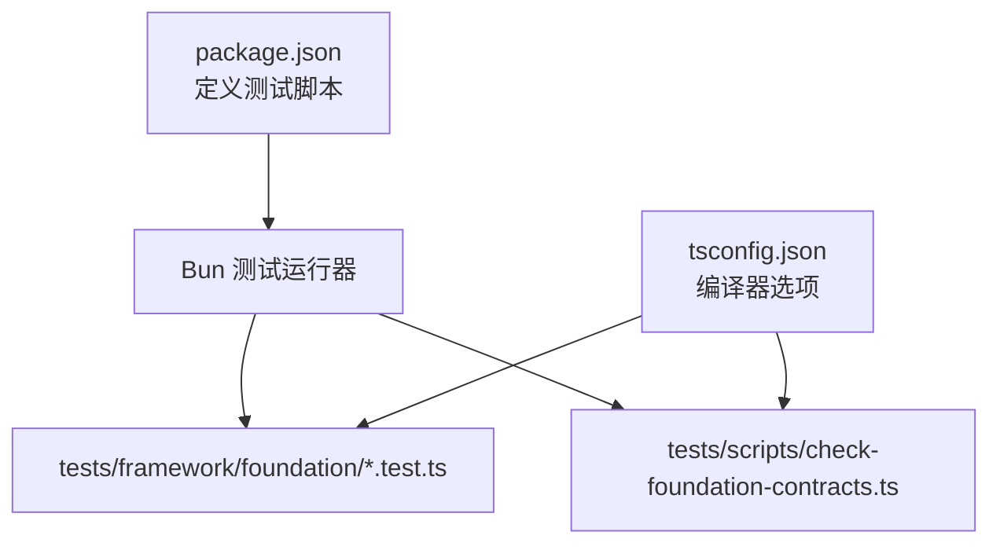
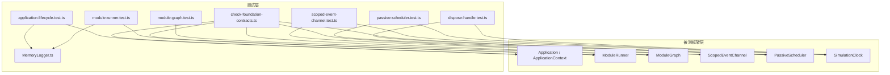
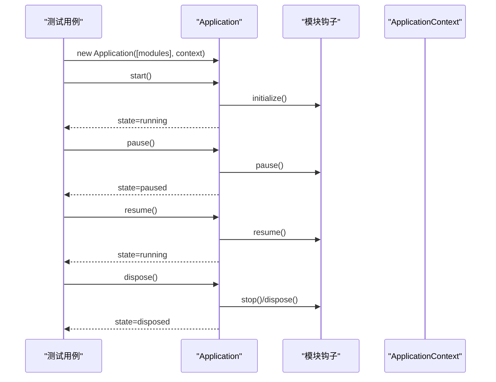
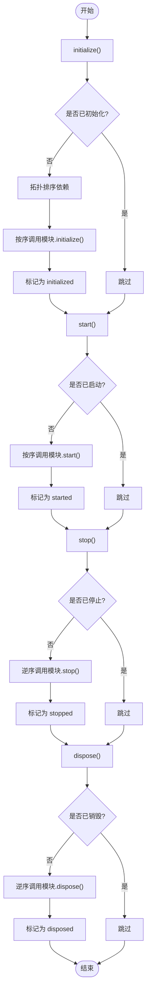
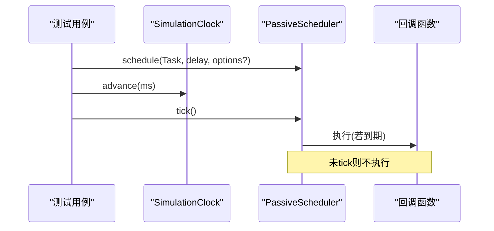
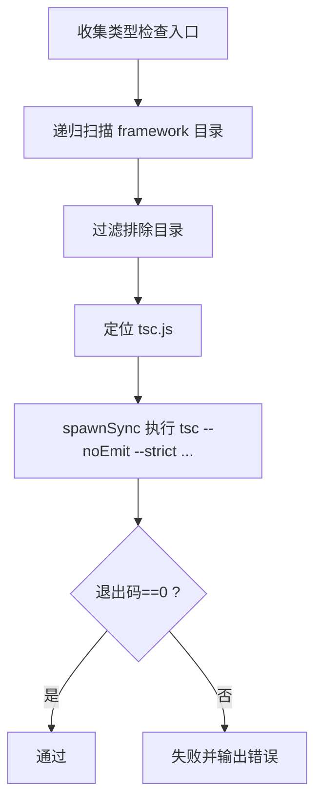
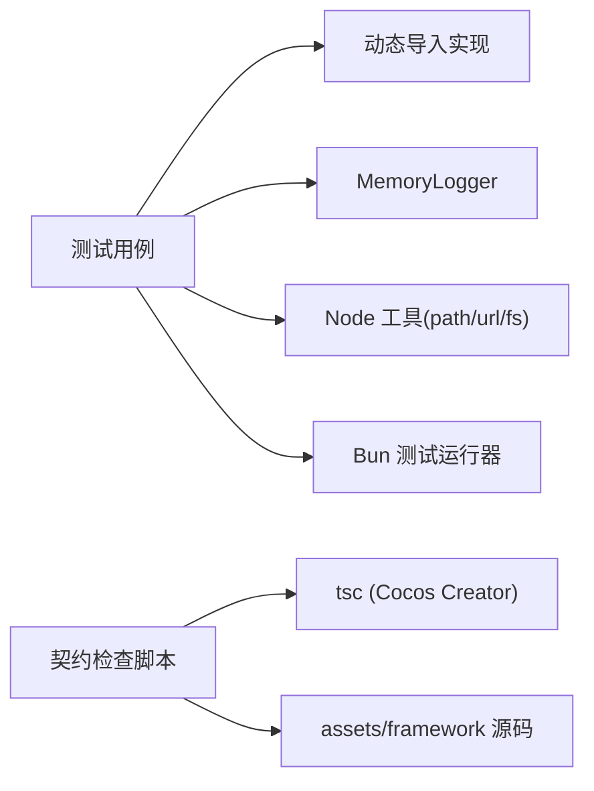

# 测试指南

<cite>
**本文引用的文件**   
- [package.json](file://package.json)
- [tsconfig.json](file://tsconfig.json)
- [tests/framework/foundation/application-lifecycle.test.ts](file://tests/framework/foundation/application-lifecycle.test.ts)
- [tests/framework/foundation/module-runner.test.ts](file://tests/framework/foundation/module-runner.test.ts)
- [tests/framework/foundation/scoped-event-channel.test.ts](file://tests/framework/foundation/scoped-event-channel.test.ts)
- [tests/framework/support/MemoryLogger.ts](file://tests/framework/support/MemoryLogger.ts)
- [tests/scripts/check-foundation-contracts.ts](file://tests/scripts/check-foundation-contracts.ts)
- [tests/framework/foundation/baseline.test.ts](file://tests/framework/foundation/baseline.test.ts)
- [tests/framework/foundation/module-graph.test.ts](file://tests/framework/foundation/module-graph.test.ts)
- [tests/framework/foundation/dispose-handle.test.ts](file://tests/framework/foundation/dispose-handle.test.ts)
- [tests/framework/foundation/passive-scheduler.test.ts](file://tests/framework/foundation/passive-scheduler.test.ts)
</cite>

## 目录
1. [简介](#简介)
2. [项目结构](#项目结构)
3. [核心组件](#核心组件)
4. [架构总览](#架构总览)
5. [详细组件分析](#详细组件分析)
6. [依赖分析](#依赖分析)
7. [性能考虑](#性能考虑)
8. [故障排查指南](#故障排查指南)
9. [结论](#结论)
10. [附录](#附录)

## 简介
本测试指南面向初学者与高级用户，系统化讲解本项目中基于 Bun 的测试框架使用方法、测试最佳实践与工程化配置。内容覆盖：
- 单元测试、集成测试与契约测试的编写方法
- 测试环境搭建、测试数据准备与测试工具使用
- 应用生命周期、模块系统与事件系统的测试示例
- Mock 对象创建、异步测试处理与测试覆盖率要求
- 测试驱动开发（TDD）实践与持续集成配置建议

本项目采用 Bun 作为运行时与测试执行器，测试用例集中于 tests/framework/foundation，契约类型检查通过自定义脚本完成。

## 项目结构
- 测试入口与脚本
  - package.json 定义了测试脚本 test:foundation 与类型契约检查脚本 test:foundation:types
- 测试组织
  - tests/framework/foundation：按能力域划分的单元测试与集成测试
  - tests/framework/support：测试支撑（如内存日志记录器）
  - tests/scripts：契约类型检查脚本
- 构建与类型
  - tsconfig.json 继承 Cocos Creator 生成的基础配置，并开启宽松模式以兼容现有代码



**图表来源** 
- [package.json:7-10](file://package.json#L7-L10)
- [tsconfig.json:6-8](file://tsconfig.json#L6-L8)

**章节来源**
- [package.json:7-10](file://package.json#L7-L10)
- [tsconfig.json:6-8](file://tsconfig.json#L6-L8)

## 核心组件
- 测试运行器与断言
  - 使用 bun:test 提供的 describe/test/expect 进行用例组织与断言
- 动态加载被测模块
  - 通过 import.meta.url + pathToFileURL 动态导入 assets/framework 下的实现类，避免在测试中硬编码路径
- 测试支撑
  - MemoryLogger：实现 Logger 接口，将日志写入内存数组，便于断言输出
- 契约类型检查
  - check-foundation-contracts.ts：扫描 assets/framework 下 TypeScript 文件，调用 tsc --noEmit 严格校验类型契约

**章节来源**
- [tests/framework/foundation/application-lifecycle.test.ts:1-10](file://tests/framework/foundation/application-lifecycle.test.ts#L1-L10)
- [tests/framework/foundation/module-runner.test.ts:1-12](file://tests/framework/foundation/module-runner.test.ts#L1-L12)
- [tests/framework/support/MemoryLogger.ts:1-18](file://tests/framework/support/MemoryLogger.ts#L1-L18)
- [tests/scripts/check-foundation-contracts.ts:1-14](file://tests/scripts/check-foundation-contracts.ts#L1-L14)

## 架构总览
下图展示了测试层与被测框架层的交互关系：测试用例通过动态导入获取 Application、ModuleRunner、ModuleGraph 等实现；使用 MemoryLogger 替代真实日志输出；通过 SimulationClock/PassiveScheduler 控制时间推进，验证调度与取消行为；事件通道 ScopedEventChannel 用于解耦模块间通信。



**图表来源** 
- [tests/framework/foundation/application-lifecycle.test.ts:29-40](file://tests/framework/foundation/application-lifecycle.test.ts#L29-L40)
- [tests/framework/foundation/module-runner.test.ts:30-39](file://tests/framework/foundation/module-runner.test.ts#L30-L39)
- [tests/framework/foundation/scoped-event-channel.test.ts:1-10](file://tests/framework/foundation/scoped-event-channel.test.ts#L1-L10)
- [tests/framework/foundation/passive-scheduler.test.ts:1-6](file://tests/framework/foundation/passive-scheduler.test.ts#L1-L6)
- [tests/framework/foundation/dispose-handle.test.ts:1-6](file://tests/framework/foundation/dispose-handle.test.ts#L1-L6)
- [tests/framework/foundation/module-graph.test.ts:20-25](file://tests/framework/foundation/module-graph.test.ts#L20-L25)
- [tests/framework/support/MemoryLogger.ts:1-18](file://tests/framework/support/MemoryLogger.ts#L1-L18)
- [tests/scripts/check-foundation-contracts.ts:35-77](file://tests/scripts/check-foundation-contracts.ts#L35-L77)

## 详细组件分析

### 应用生命周期测试
- 目标
  - 验证 Application 初始状态、完整生命周期顺序、无模块场景、上下文传递不污染
- 关键要点
  - 动态导入 Application 构造函数
  - 构造最小 Module 钩子以观测 initialize/start/pause/resume/stop/dispose 调用序列
  - 断言状态机转换与模块钩子调用顺序一致
- 适用场景
  - 任何需要验证启动、暂停、恢复、停止、销毁流程的子系统



**图表来源** 
- [tests/framework/foundation/application-lifecycle.test.ts:70-119](file://tests/framework/foundation/application-lifecycle.test.ts#L70-L119)

**章节来源**
- [tests/framework/foundation/application-lifecycle.test.ts:1-162](file://tests/framework/foundation/application-lifecycle.test.ts#L1-L162)

### 模块系统（ModuleRunner）测试
- 目标
  - 验证依赖顺序初始化与启动、反向停止与销毁、幂等性（重复阶段不重复执行）
- 关键要点
  - 构造有依赖关系的模块集合
  - 断言 getState 返回各模块生命周期状态
  - 验证 stop/dispose 的反向顺序
- 适用场景
  - 模块注册、依赖解析、生命周期编排



**图表来源** 
- [tests/framework/foundation/module-runner.test.ts:68-145](file://tests/framework/foundation/module-runner.test.ts#L68-L145)

**章节来源**
- [tests/framework/foundation/module-runner.test.ts:1-171](file://tests/framework/foundation/module-runner.test.ts#L1-L171)

### 事件系统（ScopedEventChannel）测试
- 目标
  - 类型化发布/订阅、句柄释放隔离、作用域关闭、失败隔离、边界隔离
- 关键要点
  - 使用泛型约束事件名与载荷类型
  - on 返回 DisposeHandle，支持单次或批量释放
  - 处理器异常不影响同批次其他处理器
  - 禁止全局单例与字符串键泄漏
- 适用场景
  - 模块间解耦通信、跨层级事件广播

```mermaid
classDiagram
class ScopedEventChannel~TEvents~ {
+on(event, handler) DisposeHandle
+emit(event, payload) void
+dispose() void
}
class DisposeHandle {
+dispose() void
}
class GameEvents {
+scoreChanged : { score : number }
+levelUp : { level : number }
}
ScopedEventChannel --> DisposeHandle : "返回句柄"
ScopedEventChannel ..> GameEvents : "类型约束"
```

**图表来源** 
- [tests/framework/foundation/scoped-event-channel.test.ts:11-14](file://tests/framework/foundation/scoped-event-channel.test.ts#L11-L14)
- [tests/framework/foundation/scoped-event-channel.test.ts:16-31](file://tests/framework/foundation/scoped-event-channel.test.ts#L16-L31)

**章节来源**
- [tests/framework/foundation/scoped-event-channel.test.ts:1-249](file://tests/framework/foundation/scoped-event-channel.test.ts#L1-L249)

### 调度器与时间源（PassiveScheduler 与 SimulationClock）测试
- 目标
  - 绑定时间源、精确触发、重复任务、多任务顺序、暂停/恢复、显式 tick 驱动
- 关键要点
  - 使用 SimulationClock 控制时间推进，确保确定性
  - PassiveScheduler 仅在 tick 时执行到期任务
  - 支持 repeat 参数与一次性任务
- 适用场景
  - 游戏循环、定时任务、延迟回调



**图表来源** 
- [tests/framework/foundation/passive-scheduler.test.ts:8-27](file://tests/framework/foundation/passive-scheduler.test.ts#L8-L27)
- [tests/framework/foundation/dispose-handle.test.ts:9-23](file://tests/framework/foundation/dispose-handle.test.ts#L9-L23)

**章节来源**
- [tests/framework/foundation/passive-scheduler.test.ts:1-206](file://tests/framework/foundation/passive-scheduler.test.ts#L1-L206)
- [tests/framework/foundation/dispose-handle.test.ts:1-180](file://tests/framework/foundation/dispose-handle.test.ts#L1-L180)

### 模块图（ModuleGraph）稳定性测试
- 目标
  - 空集合、单模块、依赖链、分支依赖、独立模块注册顺序保持
- 关键要点
  - 拓扑排序需稳定且可预测
  - 独立模块保持注册顺序
- 适用场景
  - 模块依赖解析、启动顺序保证

**章节来源**
- [tests/framework/foundation/module-graph.test.ts:1-114](file://tests/framework/foundation/module-graph.test.ts#L1-L114)

### 契约类型检查（Foundation Contracts）
- 目标
  - 对 assets/framework 下所有 TypeScript 文件进行严格类型检查
- 关键要点
  - 自动发现 tsc.js 路径（环境变量或固定路径）
  - 排除特定目录（如 adapters/cocos）
  - 使用 --strict --target ES2015 --module ES2015 等参数
- 适用场景
  - 保障框架 API 契约稳定、防止破坏性变更



**图表来源** 
- [tests/scripts/check-foundation-contracts.ts:15-33](file://tests/scripts/check-foundation-contracts.ts#L15-L33)
- [tests/scripts/check-foundation-contracts.ts:35-77](file://tests/scripts/check-foundation-contracts.ts#L35-L77)

**章节来源**
- [tests/scripts/check-foundation-contracts.ts:1-90](file://tests/scripts/check-foundation-contracts.ts#L1-L90)

## 依赖分析
- 测试到实现的依赖
  - 测试通过动态导入直接依赖 assets/framework 中的具体实现
  - 使用 MemoryLogger 替换 Logger 实现，降低外部耦合
- 运行时依赖
  - Bun 提供测试运行器与断言库
  - Node 文件系统与路径工具用于动态路径解析
- 类型契约依赖
  - 自定义脚本依赖 Cocos Creator 内置 tsc.js 进行严格类型检查



**图表来源** 
- [tests/framework/foundation/application-lifecycle.test.ts:29-40](file://tests/framework/foundation/application-lifecycle.test.ts#L29-L40)
- [tests/framework/foundation/module-runner.test.ts:30-39](file://tests/framework/foundation/module-runner.test.ts#L30-L39)
- [tests/scripts/check-foundation-contracts.ts:35-77](file://tests/scripts/check-foundation-contracts.ts#L35-L77)

**章节来源**
- [tests/framework/foundation/application-lifecycle.test.ts:29-40](file://tests/framework/foundation/application-lifecycle.test.ts#L29-L40)
- [tests/framework/foundation/module-runner.test.ts:30-39](file://tests/framework/foundation/module-runner.test.ts#L30-L39)
- [tests/scripts/check-foundation-contracts.ts:35-77](file://tests/scripts/check-foundation-contracts.ts#L35-L77)

## 性能考虑
- 确定性时间源
  - 使用 SimulationClock 避免真实时间波动，提升测试稳定性与速度
- 显式驱动
  - PassiveScheduler 需要显式 tick，避免隐式执行带来的不确定性
- 资源释放
  - 及时 dispose 句柄与调度器，防止内存泄漏与悬挂回调
- 并发与重入
  - 事件通道在同一批次内隔离处理器异常，避免级联失败

[本节为通用指导，无需引用具体文件]

## 故障排查指南
- 常见问题
  - 找不到 tsc.js：设置 COCOS_TSC 环境变量或确认 Cocos Creator 安装路径
  - 动态导入失败：确认路径正确且导出存在
  - 事件未触发：检查 channel.dispose 是否过早调用
  - 调度器未执行：确认 tick 调用时机与 clock.advance 是否正确
- 诊断手段
  - 使用 MemoryLogger 捕获日志，断言输出内容与级别
  - 在契约检查脚本中查看 tsc 输出，定位类型错误
  - 针对事件与调度器，增加中间断言与顺序观察

**章节来源**
- [tests/scripts/check-foundation-contracts.ts:51-58](file://tests/scripts/check-foundation-contracts.ts#L51-L58)
- [tests/framework/support/MemoryLogger.ts:20-42](file://tests/framework/support/MemoryLogger.ts#L20-L42)

## 结论
本项目测试体系围绕 Bun 与 bun:test 构建，结合动态导入、内存日志、模拟时钟与调度器，形成高内聚、低耦合、可确定性复现的测试方案。通过契约类型检查保障 API 稳定性，通过模块化与事件解耦提升可测试性。遵循本指南的实践，可有效提升代码质量与交付效率。

[本节为总结性内容，无需引用具体文件]

## 附录

### 测试环境搭建
- 安装 Bun 并确保可用
- 运行基础测试：npm run test:foundation
- 运行契约类型检查：npm run test:foundation:types

**章节来源**
- [package.json:7-10](file://package.json#L7-L10)

### 测试数据准备与 Mock 策略
- 使用 MemoryLogger 替代真实日志输出，便于断言
- 构造最小 Module 对象，仅实现必要钩子，减少副作用
- 使用 SimulationClock 控制时间，避免真实时间依赖

**章节来源**
- [tests/framework/support/MemoryLogger.ts:1-18](file://tests/framework/support/MemoryLogger.ts#L1-L18)
- [tests/framework/foundation/application-lifecycle.test.ts:46-68](file://tests/framework/foundation/application-lifecycle.test.ts#L46-L68)

### 异步测试处理
- 使用 async/await 管理 Promise 生命周期
- 显式 tick 驱动调度器，确保任务执行时机可控
- 对事件通道，注意批处理语义与句柄释放时机

**章节来源**
- [tests/framework/foundation/passive-scheduler.test.ts:156-184](file://tests/framework/foundation/passive-scheduler.test.ts#L156-L184)
- [tests/framework/foundation/scoped-event-channel.test.ts:134-146](file://tests/framework/foundation/scoped-event-channel.test.ts#L134-L146)

### 测试覆盖率要求
- 当前仓库未配置覆盖率统计，建议在 CI 中引入覆盖率工具（如 c8/v8）并设定阈值
- 优先覆盖关键路径：生命周期、依赖排序、事件分发、调度器与句柄释放

[本节为通用指导，无需引用具体文件]

### 测试驱动开发（TDD）实践
- 先写失败的测试用例，再实现最小功能
- 逐步完善实现并通过测试，重构时保持测试通过
- 对复杂逻辑（如拓扑排序、事件批处理）优先用测试描述预期行为

[本节为通用指导，无需引用具体文件]

### 持续集成（CI）配置建议
- 在 CI 中安装 Bun 与 Cocos Creator（或提供 tsc.js 路径）
- 执行 npm run test:foundation 与 npm run test:foundation:types
- 可选：生成覆盖率报告并上传至平台

**章节来源**
- [tests/scripts/check-foundation-contracts.ts:35-77](file://tests/scripts/check-foundation-contracts.ts#L35-L77)

### 快速上手示例
- 基线测试：baseline.test.ts 验证运行环境
- 应用生命周期：application-lifecycle.test.ts 验证状态机与模块钩子
- 模块系统：module-runner.test.ts 验证依赖顺序与生命周期编排
- 事件系统：scoped-event-channel.test.ts 验证类型化事件与句柄释放
- 调度器：passive-scheduler.test.ts 与 dispose-handle.test.ts 验证时间与任务管理

**章节来源**
- [tests/framework/foundation/baseline.test.ts:1-8](file://tests/framework/foundation/baseline.test.ts#L1-L8)
- [tests/framework/foundation/application-lifecycle.test.ts:70-119](file://tests/framework/foundation/application-lifecycle.test.ts#L70-L119)
- [tests/framework/foundation/module-runner.test.ts:68-145](file://tests/framework/foundation/module-runner.test.ts#L68-L145)
- [tests/framework/foundation/scoped-event-channel.test.ts:16-31](file://tests/framework/foundation/scoped-event-channel.test.ts#L16-L31)
- [tests/framework/foundation/passive-scheduler.test.ts:8-27](file://tests/framework/foundation/passive-scheduler.test.ts#L8-L27)
- [tests/framework/foundation/dispose-handle.test.ts:9-23](file://tests/framework/foundation/dispose-handle.test.ts#L9-L23)