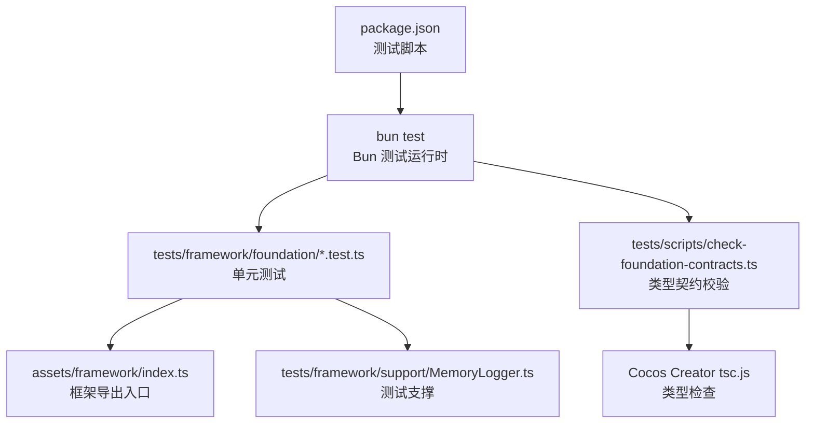
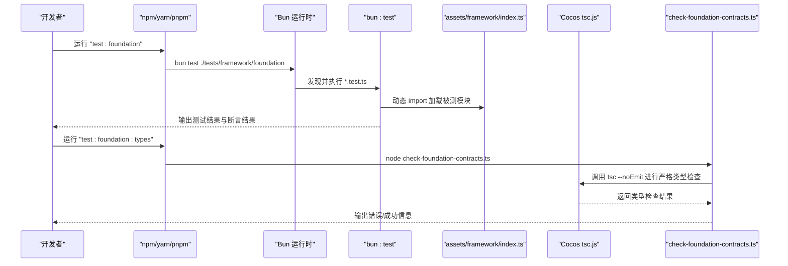
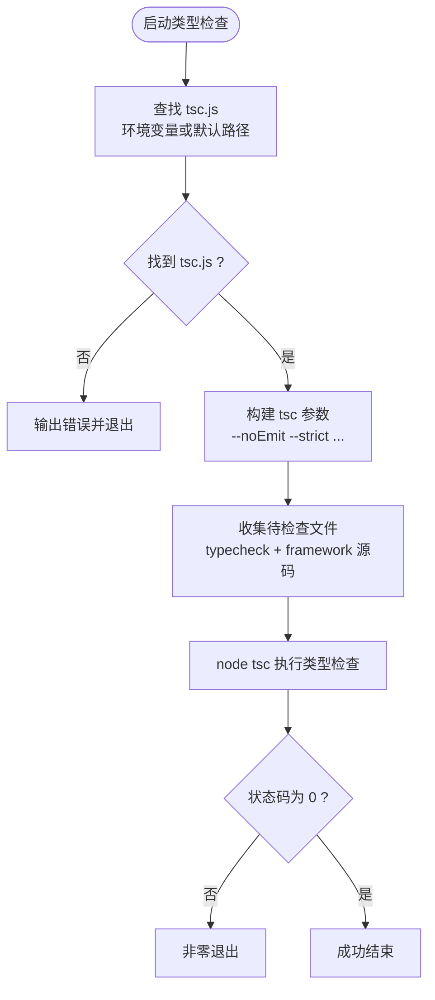
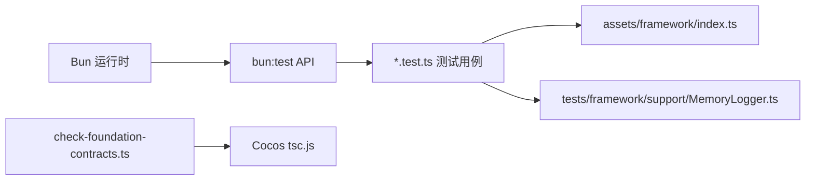

# 测试环境搭建

<cite>
**本文引用的文件**   
- [package.json](file://package.json)
- [tsconfig.json](file://tsconfig.json)
- [tests/scripts/check-foundation-contracts.ts](file://tests/scripts/check-foundation-contracts.ts)
- [tests/framework/foundation/baseline.test.ts](file://tests/framework/foundation/baseline.test.ts)
- [tests/framework/foundation/application-lifecycle.test.ts](file://tests/framework/foundation/application-lifecycle.test.ts)
- [tests/framework/foundation/module-runner.test.ts](file://tests/framework/foundation/module-runner.test.ts)
- [tests/framework/support/MemoryLogger.ts](file://tests/framework/support/MemoryLogger.ts)
- [assets/framework/index.ts](file://assets/framework/index.ts)
</cite>

## 目录
1. [简介](#简介)
2. [项目结构](#项目结构)
3. [核心组件](#核心组件)
4. [架构总览](#架构总览)
5. [详细组件分析](#详细组件分析)
6. [依赖分析](#依赖分析)
7. [性能考虑](#性能考虑)
8. [故障排查指南](#故障排查指南)
9. [结论](#结论)
10. [附录](#附录)

## 简介
本文件面向开发者，提供在本仓库中快速搭建完整测试环境的步骤与说明。内容涵盖：
- 使用 Bun 作为测试运行时
- TypeScript 编译选项与类型检查流程
- 测试目录结构与组织方式
- 测试框架、Mock 工具的使用方式
- 覆盖率工具的集成建议（可选）
- 具体命令与配置说明
- 环境验证方法与常见问题解决方案

目标是让开发者在最小成本下完成环境搭建并立即开始编写测试用例。

## 项目结构
测试相关的关键位置与职责如下：
- package.json：定义测试脚本入口，统一通过 bun test 运行测试
- tsconfig.json：继承 Cocos Creator 生成的 tsconfig，并允许自定义编译器选项
- tests/：测试代码根目录
  - framework/foundation：框架基础能力测试（应用生命周期、模块运行器、日志、平台适配等）
  - framework/support：测试支撑（如内存日志记录器）
  - scripts：辅助脚本（如类型契约校验）
- assets/framework：被测框架源码，测试通过动态 import 加载

图示来源 
- [package.json:7-10](file://package.json#L7-L10)
- [tests/scripts/check-foundation-contracts.ts:35-77](file://tests/scripts/check-foundation-contracts.ts#L35-L77)
- [assets/framework/index.ts:1-44](file://assets/framework/index.ts#L1-L44)

章节来源
- [package.json:7-10](file://package.json#L7-L10)
- [tsconfig.json:1-10](file://tsconfig.json#L1-L10)

## 核心组件
- 测试运行时：Bun（内置测试框架与断言）
- 测试框架与 API：bun:test（describe/test/expect/mock）
- 类型检查：Cocos Creator 自带的 TypeScript 编译器（tsc），由脚本驱动
- 测试支撑：MemoryLogger（内存日志收集，用于断言日志输出）
- 被测入口：assets/framework/index.ts（对外暴露的类型与实现）

章节来源
- [tests/framework/foundation/baseline.test.ts:1-8](file://tests/framework/foundation/baseline.test.ts#L1-L8)
- [tests/framework/foundation/application-lifecycle.test.ts:1-162](file://tests/framework/foundation/application-lifecycle.test.ts#L1-L162)
- [tests/framework/foundation/module-runner.test.ts:1-171](file://tests/framework/foundation/module-runner.test.ts#L1-L171)
- [tests/framework/support/MemoryLogger.ts:1-44](file://tests/framework/support/MemoryLogger.ts#L1-L44)
- [assets/framework/index.ts:1-44](file://assets/framework/index.ts#L1-L44)

## 架构总览
下图展示了测试执行的整体流程：从 npm 脚本到 Bun 运行测试，再到动态加载被测模块与类型检查脚本。

图示来源 
- [package.json:7-10](file://package.json#L7-L10)
- [tests/scripts/check-foundation-contracts.ts:60-77](file://tests/scripts/check-foundation-contracts.ts#L60-L77)
- [assets/framework/index.ts:1-44](file://assets/framework/index.ts#L1-L44)

## 详细组件分析

### 测试运行时与脚本入口（Bun + bun:test）
- 通过 package.json 的 scripts 字段定义两个命令：
  - test:foundation：使用 bun test 执行 tests/framework/foundation 下的所有测试
  - test:foundation:types：执行 tests/scripts/check-foundation-contracts.ts 进行类型契约校验
- 测试用例统一采用 bun:test 提供的 describe/test/expect/mock API

章节来源
- [package.json:7-10](file://package.json#L7-L10)
- [tests/framework/foundation/baseline.test.ts:1-8](file://tests/framework/foundation/baseline.test.ts#L1-L8)

### TypeScript 编译与类型检查
- tsconfig.json 继承自 Cocos Creator 生成的配置文件，并在 compilerOptions 中关闭了 strict，便于与现有代码兼容
- 类型契约校验脚本会：
  - 自动定位 Cocos Creator 的 tsc.js（支持环境变量 COCOS_TSC 或默认路径）
  - 以 --noEmit --strict --target ES2015 --module ES2015 --moduleResolution node --skipLibCheck 参数调用 tsc
  - 对 tests 中的 typecheck 文件与 assets/framework 下的 .ts 文件进行类型检查

图示来源 
- [tests/scripts/check-foundation-contracts.ts:35-77](file://tests/scripts/check-foundation-contracts.ts#L35-L77)
- [tests/scripts/check-foundation-contracts.ts:60-77](file://tests/scripts/check-foundation-contracts.ts#L60-L77)

章节来源
- [tsconfig.json:1-10](file://tsconfig.json#L1-L10)
- [tests/scripts/check-foundation-contracts.ts:35-77](file://tests/scripts/check-foundation-contracts.ts#L35-L77)

### 测试目录结构与组织
- tests/framework/foundation：按功能域组织测试文件，命名以 .test.ts 结尾
- tests/framework/support：共享测试支撑（如 MemoryLogger）
- tests/scripts：自动化脚本（类型契约校验）

章节来源
- [tests/framework/foundation/application-lifecycle.test.ts:1-162](file://tests/framework/foundation/application-lifecycle.test.ts#L1-L162)
- [tests/framework/foundation/module-runner.test.ts:1-171](file://tests/framework/foundation/module-runner.test.ts#L1-L171)
- [tests/framework/support/MemoryLogger.ts:1-44](file://tests/framework/support/MemoryLogger.ts#L1-L44)

### 测试框架与 Mock 工具
- 测试框架：bun:test（describe/test/expect）
- Mock 工具：bun:test 内置 mock，支持 mock.module 与 mock(async () => ...)
- 典型用法：
  - 使用 mock.module("cc", ...) 模拟第三方模块
  - 使用 mock(async () => {...}) 构造异步方法桩

章节来源
- [tests/framework/foundation/cocos-adapter.test.ts:3-10](file://tests/framework/foundation/cocos-adapter.test.ts#L3-L10)
- [tests/framework/foundation/approot-composition.test.ts:1-10](file://tests/framework/foundation/approot-composition.test.ts#L1-L10)

### 被测入口与动态加载
- 测试通过 pathToFileURL 将本地路径转换为 URL，并使用动态 import 加载 assets/framework/index.ts
- 该入口集中导出框架所需的类型与实现，便于测试按需获取

章节来源
- [tests/framework/foundation/application-lifecycle.test.ts:29-40](file://tests/framework/foundation/application-lifecycle.test.ts#L29-L40)
- [tests/framework/foundation/module-runner.test.ts:30-66](file://tests/framework/foundation/module-runner.test.ts#L30-L66)
- [assets/framework/index.ts:1-44](file://assets/framework/index.ts#L1-L44)

### 测试支撑：内存日志记录器
- MemoryLogger 实现了 Logger 接口，内部委托 createScopedLogger，并将日志记录存入内存数组
- 测试可通过 records 属性断言日志输出内容与顺序

章节来源
- [tests/framework/support/MemoryLogger.ts:1-44](file://tests/framework/support/MemoryLogger.ts#L1-L44)

## 依赖分析
- 运行时依赖：Bun（包含测试框架与断言）
- 类型检查依赖：Cocos Creator 的 TypeScript 编译器（tsc.js）
- 被测依赖：assets/framework/index.ts 导出的类型与实现
- 测试支撑：tests/framework/support/MemoryLogger.ts

图示来源 
- [package.json:7-10](file://package.json#L7-L10)
- [tests/scripts/check-foundation-contracts.ts:35-77](file://tests/scripts/check-foundation-contracts.ts#L35-L77)
- [assets/framework/index.ts:1-44](file://assets/framework/index.ts#L1-L44)
- [tests/framework/support/MemoryLogger.ts:1-44](file://tests/framework/support/MemoryLogger.ts#L1-L44)

章节来源
- [package.json:7-10](file://package.json#L7-L10)
- [tests/scripts/check-foundation-contracts.ts:35-77](file://tests/scripts/check-foundation-contracts.ts#L35-L77)

## 性能考虑
- 使用 Bun 原生测试运行时，避免额外打包与转译开销
- 类型检查仅做静态分析（--noEmit），不生成产物，减少磁盘 I/O
- 动态 import 按需加载被测模块，避免一次性加载全部代码
- 建议在 CI 中并行执行测试与类型检查，缩短反馈时间

## 故障排查指南
- 找不到 Cocos Creator 的 tsc.js
  - 现象：类型检查脚本报错提示无法定位 tsc.js
  - 解决：设置环境变量 COCOS_TSC 指向正确的 tsc.js 绝对路径
- 测试未执行或无输出
  - 现象：运行 test:foundation 后无结果
  - 解决：确认 bun 已安装且可用；确认 tests/framework/foundation 目录下存在 .test.ts 文件
- 类型检查失败
  - 现象：check-foundation-contracts.ts 返回非零状态码
  - 解决：根据 tsc 输出的错误信息修复类型问题；必要时调整 tsconfig 的 strict 选项
- 动态导入失败
  - 现象：import(pathToFileURL(...)) 抛出错误
  - 解决：确认目标文件路径正确且可被 Node/Bun 解析；确保相对路径计算无误

章节来源
- [tests/scripts/check-foundation-contracts.ts:51-58](file://tests/scripts/check-foundation-contracts.ts#L51-L58)
- [tests/scripts/check-foundation-contracts.ts:60-77](file://tests/scripts/check-foundation-contracts.ts#L60-L77)
- [tests/framework/foundation/application-lifecycle.test.ts:29-40](file://tests/framework/foundation/application-lifecycle.test.ts#L29-L40)
- [tests/framework/foundation/module-runner.test.ts:30-66](file://tests/framework/foundation/module-runner.test.ts#L30-L66)

## 结论
通过 Bun 与 bun:test 的组合，本项目提供了轻量、快速的测试运行时与丰富的测试能力；结合 Cocos Creator 的 TypeScript 编译器，可实现严格的类型契约校验。按照本文的步骤，开发者可在最短时间内完成环境搭建并开始编写高质量测试用例。

## 附录

### 环境与依赖准备
- 安装 Bun（参考官方文档）
- 确保 Cocos Creator 3.8.8 已安装，以便类型检查脚本能找到 tsc.js（或通过环境变量指定）

### 常用命令
- 运行测试套件：npm run test:foundation
- 运行类型契约校验：npm run test:foundation:types

### 覆盖率工具（可选）
- 若需覆盖率统计，可在 CI 或本地环境中引入 c8 或 istanbul 等工具，配合 bun 的测试输出进行统计
- 注意：当前仓库未内置覆盖率配置，可按需添加

### 验证测试环境是否就绪
- 执行 npm run test:foundation，应看到 baseline 测试通过
- 执行 npm run test:foundation:types，应顺利完成类型检查并返回成功状态

章节来源
- [package.json:7-10](file://package.json#L7-L10)
- [tests/framework/foundation/baseline.test.ts:1-8](file://tests/framework/foundation/baseline.test.ts#L1-L8)
- [tests/scripts/check-foundation-contracts.ts:35-77](file://tests/scripts/check-foundation-contracts.ts#L35-L77)