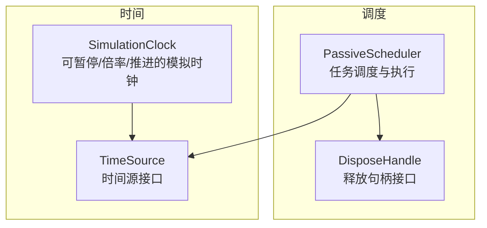
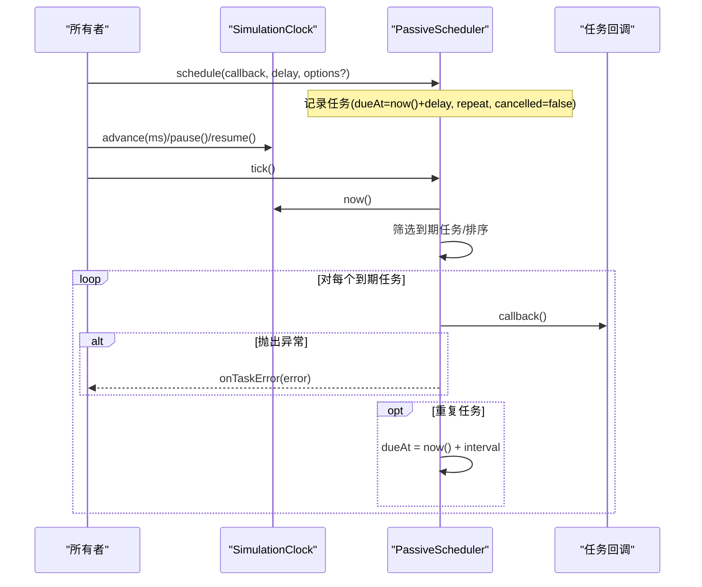
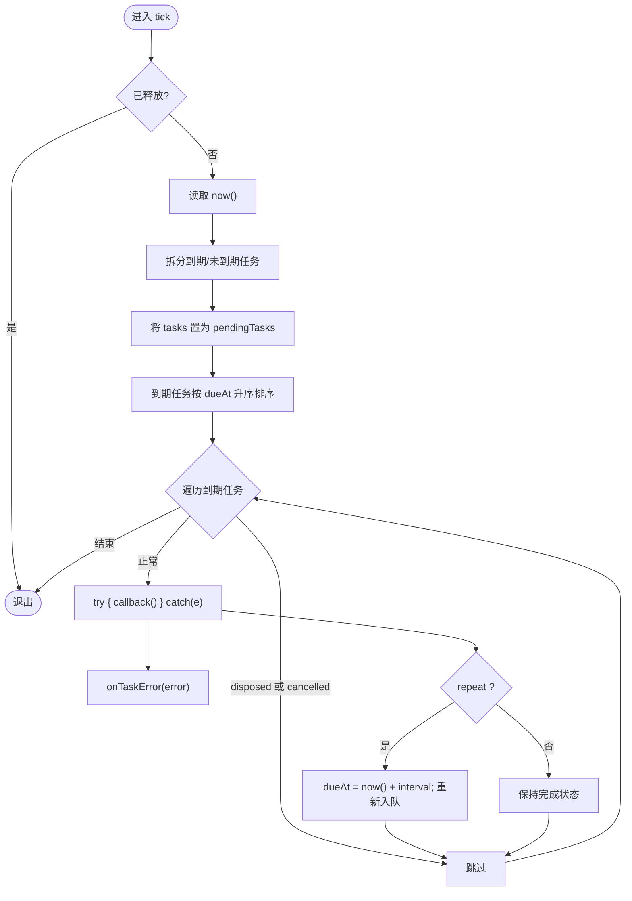
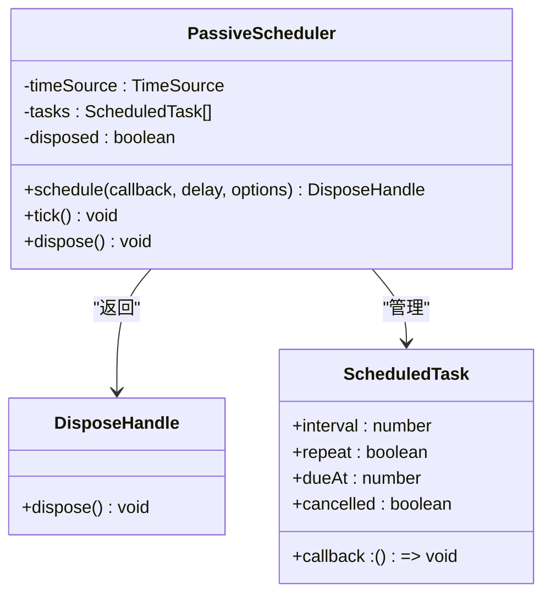
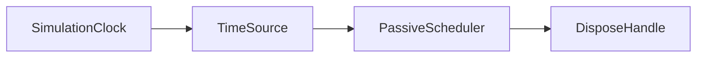

# 调度系统

<cite>
**本文引用的文件**   
- [PassiveScheduler.ts](file://assets/framework/core/scheduling/PassiveScheduler.ts)
- [DisposeHandle.ts](file://assets/framework/core/scheduling/DisposeHandle.ts)
- [TimeSource.ts](file://assets/framework/contracts/time/TimeSource.ts)
- [SimulationClock.ts](file://assets/framework/core/time/SimulationClock.ts)
- [passive-scheduler.test.ts](file://tests/framework/foundation/passive-scheduler.test.ts)
- [dispose-handle.test.ts](file://tests/framework/foundation/dispose-handle.test.ts)
- [scheduler-failure-isolation.test.ts](file://tests/framework/foundation/scheduler-failure-isolation.test.ts)
- [scheduler-reentrancy.test.ts](file://tests/framework/foundation/scheduler-reentrancy.test.ts)
- [scheduler-boundary.test.ts](file://tests/framework/foundation/scheduler-boundary.test.ts)
- [spec.md](file://openspec/specs/platform-time-scheduling/spec.md)
</cite>

## 目录
1. [简介](#简介)
2. [项目结构](#项目结构)
3. [核心组件](#核心组件)
4. [架构总览](#架构总览)
5. [详细组件分析](#详细组件分析)
6. [依赖关系分析](#依赖关系分析)
7. [性能考量](#性能考量)
8. [故障排查指南](#故障排查指南)
9. [结论](#结论)
10. [附录：使用示例与最佳实践](#附录使用示例与最佳实践)

## 简介
本文件围绕框架中的被动式调度器 PassiveScheduler 进行系统化说明，涵盖任务调度机制、执行时机控制、资源管理与生命周期清理。重点解释任务队列管理、到期排序、重复任务策略、异常隔离与重入安全，并给出基于测试用例的使用示例与最佳实践，帮助初学者快速上手，同时为高级用户提供实现细节与优化建议。

## 项目结构
调度相关代码位于 framework 的 core/scheduling 与 core/time 目录，契约定义在 contracts/time。测试覆盖行为边界、失败隔离、重入与释放语义。

图表来源 
- [PassiveScheduler.ts:1-116](file://assets/framework/core/scheduling/PassiveScheduler.ts#L1-L116)
- [DisposeHandle.ts:1-4](file://assets/framework/core/scheduling/DisposeHandle.ts#L1-L4)
- [TimeSource.ts:1-4](file://assets/framework/contracts/time/TimeSource.ts#L1-L4)
- [SimulationClock.ts:1-63](file://assets/framework/core/time/SimulationClock.ts#L1-L63)

章节来源
- [PassiveScheduler.ts:1-116](file://assets/framework/core/scheduling/PassiveScheduler.ts#L1-L116)
- [TimeSource.ts:1-4](file://assets/framework/contracts/time/TimeSource.ts#L1-L4)
- [SimulationClock.ts:1-63](file://assets/framework/core/time/SimulationClock.ts#L1-L63)

## 核心组件
- PassiveScheduler：被动驱动的任务调度器，绑定 TimeSource，通过显式 tick() 推进执行；支持一次性与重复任务；提供 onTaskError 错误上报钩子。
- DisposeHandle：释放句柄接口，用于取消单个任务或释放调度器以停止所有待执行任务。
- TimeSource：时间源抽象，仅暴露 now() 方法，便于替换不同时间语义（墙钟、单调钟、模拟钟）。
- SimulationClock：可暂停、恢复、设置倍率的模拟时钟，支持 advance(ms) 推进时间，供测试与确定性驱动。

章节来源
- [PassiveScheduler.ts:20-115](file://assets/framework/core/scheduling/PassiveScheduler.ts#L20-L115)
- [DisposeHandle.ts:1-4](file://assets/framework/core/scheduling/DisposeHandle.ts#L1-L4)
- [TimeSource.ts:1-4](file://assets/framework/contracts/time/TimeSource.ts#L1-L4)
- [SimulationClock.ts:12-62](file://assets/framework/core/time/SimulationClock.ts#L12-L62)

## 架构总览
调度系统采用“被动驱动 + 时间源绑定”的设计：业务侧注册任务并持有释放句柄；上层循环调用 scheduler.tick()，调度器根据绑定时钟的 now() 判断到期任务，按 dueAt 升序执行，并在回调抛出异常时通过 onTaskError 上报，不阻断其他任务。

图表来源 
- [PassiveScheduler.ts:34-109](file://assets/framework/core/scheduling/PassiveScheduler.ts#L34-L109)
- [SimulationClock.ts:27-61](file://assets/framework/core/time/SimulationClock.ts#L27-L61)

章节来源
- [spec.md:53-84](file://openspec/specs/platform-time-scheduling/spec.md#L53-L84)

## 详细组件分析

### PassiveScheduler 设计与实现
- 任务模型：内部维护 ScheduledTask 数组，包含回调、间隔、是否重复、到期时间 dueAt、是否已取消 cancelled。
- 调度入口 schedule：校验参数（延迟必须有限且非负），计算 dueAt，推入队列，返回 DisposeHandle。
- 驱动入口 tick：获取当前时间，分离到期与未到期任务，重置任务列表为 pendingTasks；对到期任务按 dueAt 升序执行；每次执行包裹 try/catch，异常走 onTaskError；若 repeat 则更新 dueAt 并重新入队。
- 释放 dispose：标记 disposed 并清空任务队列；后续 schedule 抛错，tick 直接返回。

图表来源 
- [PassiveScheduler.ts:64-109](file://assets/framework/core/scheduling/PassiveScheduler.ts#L64-L109)

章节来源
- [PassiveScheduler.ts:20-115](file://assets/framework/core/scheduling/PassiveScheduler.ts#L20-L115)

### DisposeHandle 与任务清理
- 任务级释放：schedule 返回的 handle.dispose() 将对应任务的 cancelled 置为 true，tick 中遇到 cancelled 的任务直接跳过。
- 调度器级释放：scheduler.dispose() 标记 disposed 并清空任务队列，后续 tick 立即返回，不再执行任何任务。
- 幂等性：多次调用 dispose 不会产生副作用。

图表来源 
- [PassiveScheduler.ts:12-62](file://assets/framework/core/scheduling/PassiveScheduler.ts#L12-L62)
- [DisposeHandle.ts:1-4](file://assets/framework/core/scheduling/DisposeHandle.ts#L1-L4)

章节来源
- [dispose-handle.test.ts:9-136](file://tests/framework/foundation/dispose-handle.test.ts#L9-L136)

### 时间源与模拟时钟
- TimeSource：统一 now() 接口，屏蔽平台差异。
- SimulationClock：支持 initialTime、timeScale、pause/resume、advance(ms)，用于测试与确定性驱动。

章节来源
- [TimeSource.ts:1-4](file://assets/framework/contracts/time/TimeSource.ts#L1-L4)
- [SimulationClock.ts:12-62](file://assets/framework/core/time/SimulationClock.ts#L12-L62)

### 任务队列管理与优先级处理
- 到期判定：task.dueAt <= now() 即到期。
- 优先级：到期任务按 dueAt 升序执行，保证先到期先执行。
- 重复任务：repeat=true 时，每次执行后重新计算 dueAt 并再次入队，避免错过大跨度推进导致的“多次触发”。

章节来源
- [passive-scheduler.test.ts:101-120](file://tests/framework/foundation/passive-scheduler.test.ts#L101-L120)
- [scheduler-reentrancy.test.ts:120-158](file://tests/framework/foundation/scheduler-reentrancy.test.ts#L120-L158)

### 异常隔离与错误上报
- 单任务异常不会阻塞同批其他任务执行。
- 默认错误上报到 console.error；可通过 onTaskError 自定义处理。
- 失败的一次性任务仍会被移除；失败的重复任务会在下一次到期继续执行。

章节来源
- [scheduler-failure-isolation.test.ts:11-125](file://tests/framework/foundation/scheduler-failure-isolation.test.ts#L11-L125)
- [scheduler-reentrancy.test.ts:77-94](file://tests/framework/foundation/scheduler-reentrancy.test.ts#L77-L94)

### 重入安全与边界条件
- 回调内调用 tick 不会导致同一批任务重复执行，也不会形成无限循环。
- 回调中可安全注册新任务，新任务将在后续 tick 生效。
- 回调中释放调度器会终止同批剩余任务执行。
- 对已到期但未驱动的任务，提前 dispose 仍可阻止执行。

章节来源
- [scheduler-reentrancy.test.ts:7-75](file://tests/framework/foundation/scheduler-reentrancy.test.ts#L7-L75)
- [dispose-handle.test.ts:138-169](file://tests/framework/foundation/dispose-handle.test.ts#L138-L169)

## 依赖关系分析
- PassiveScheduler 依赖 TimeSource 抽象，解耦具体时间实现。
- 测试中使用 SimulationClock 作为 TimeSource 的具体实现，确保可预测性与可控性。
- 对外暴露 DisposeHandle 接口，使任务生命周期由调用方掌控。

图表来源 
- [TimeSource.ts:1-4](file://assets/framework/contracts/time/TimeSource.ts#L1-L4)
- [SimulationClock.ts:1-63](file://assets/framework/core/time/SimulationClock.ts#L1-L63)
- [PassiveScheduler.ts:1-33](file://assets/framework/core/scheduling/PassiveScheduler.ts#L1-L33)
- [DisposeHandle.ts:1-4](file://assets/framework/core/scheduling/DisposeHandle.ts#L1-L4)

章节来源
- [spec.md:21-36](file://openspec/specs/platform-time-scheduling/spec.md#L21-L36)

## 性能考量
- 时间复杂度：每帧 tick 需遍历全部任务 O(N)，到期任务排序 O(K log K)，K 为到期任务数。N 较大时可考虑优先队列或分桶策略降低排序开销。
- 内存占用：任务对象较小，但大量重复任务累积可能增长内存；应在业务层及时释放不再需要的任务。
- 批量执行：尽量在同一 tick 内合并逻辑，减少频繁调度带来的上下文切换。
- 错误上报：onTaskError 应避免昂贵操作，必要时异步落盘或采样上报。

[本节为通用指导，不直接分析具体文件]

## 故障排查指南
- 任务未按预期执行
  - 检查是否调用了 tick()；调度器是被动驱动的，不调用 tick 不会执行。
  - 确认绑定的 TimeSource.now() 是否推进；SimulationClock.pause() 期间不会推进。
- 任务被意外取消
  - 检查是否调用了 handle.dispose() 或 scheduler.dispose()。
- 回调抛出异常
  - 查看 onTaskError 或默认 console.error 输出；确认异常不影响其他任务。
- 重复任务未按期望频率执行
  - 确认 repeat=true；检查 dueAt 更新逻辑与 tick 调用频率。

章节来源
- [passive-scheduler.test.ts:157-184](file://tests/framework/foundation/passive-scheduler.test.ts#L157-L184)
- [scheduler-failure-isolation.test.ts:32-50](file://tests/framework/foundation/scheduler-failure-isolation.test.ts#L32-L50)

## 结论
PassiveScheduler 以简洁、确定性的方式实现了跨平台的时间驱动任务调度。通过显式 tick 驱动、TimeSource 抽象、DisposeHandle 生命周期管理与异常隔离，既满足基础需求，又具备良好的可测试性与可扩展性。配合 SimulationClock，可在无外部依赖环境下进行完整的行为验证。

[本节为总结，不直接分析具体文件]

## 附录：使用示例与最佳实践

### 基本用法（一次性任务）
- 创建调度器并绑定时间源（如 SimulationClock）。
- 调用 schedule 注册一次性任务，获得 handle。
- 推进时间并调用 tick 执行任务。
- 需要时调用 handle.dispose() 取消任务。

参考用例路径
- [passive-scheduler.test.ts:29-57](file://tests/framework/foundation/passive-scheduler.test.ts#L29-L57)
- [dispose-handle.test.ts:9-23](file://tests/framework/foundation/dispose-handle.test.ts#L9-L23)

### 重复任务
- 在 options 中设置 repeat=true，任务会在每次到期后自动重新安排。
- 大跨度推进不会导致重复触发多次，而是对齐相位。

参考用例路径
- [passive-scheduler.test.ts:78-99](file://tests/framework/foundation/passive-scheduler.test.ts#L78-L99)
- [scheduler-reentrancy.test.ts:120-158](file://tests/framework/foundation/scheduler-reentrancy.test.ts#L120-L158)

### 错误处理与隔离
- 配置 onTaskError 收集或上报异常，避免默认 console.error。
- 单个任务失败不会影响同批其他任务执行。

参考用例路径
- [scheduler-failure-isolation.test.ts:32-79](file://tests/framework/foundation/scheduler-failure-isolation.test.ts#L32-L79)
- [scheduler-reentrancy.test.ts:77-94](file://tests/framework/foundation/scheduler-reentrancy.test.ts#L77-L94)

### 生命周期与释放
- 任务级释放：handle.dispose() 取消任务。
- 调度器级释放：scheduler.dispose() 停止所有待执行任务。
- 释放具有幂等性，重复调用安全。

参考用例路径
- [dispose-handle.test.ts:61-136](file://tests/framework/foundation/dispose-handle.test.ts#L61-L136)
- [scheduler-boundary.test.ts:27-50](file://tests/framework/foundation/scheduler-boundary.test.ts#L27-L50)

### 最佳实践
- 始终显式调用 tick()，避免隐式全局状态。
- 为长生命周期任务建立统一的释放策略（如模块销毁时批量释放）。
- 使用 SimulationClock 编写确定性测试，覆盖暂停、倍率、大跨度推进等场景。
- 合理设置 repeat 与 interval，避免高频任务造成性能压力。
- 在 onTaskError 中集中处理日志、监控与降级策略。

[本节为通用指导，不直接分析具体文件]