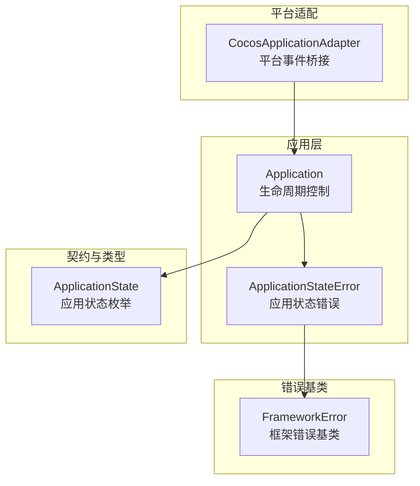
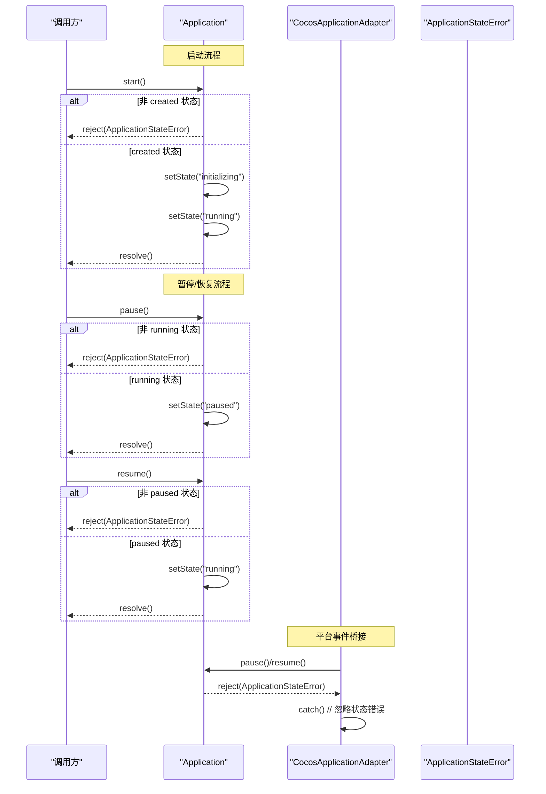
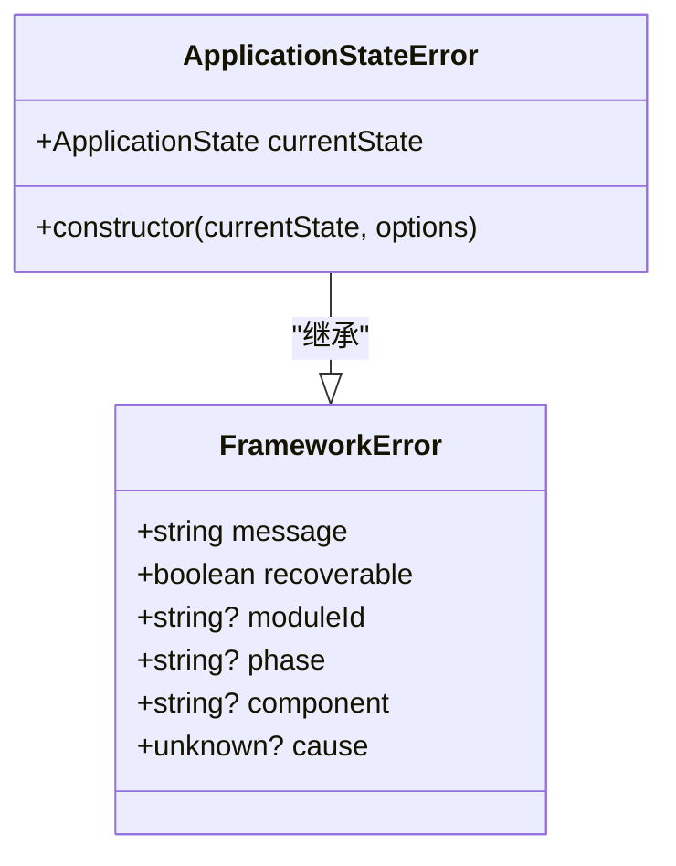
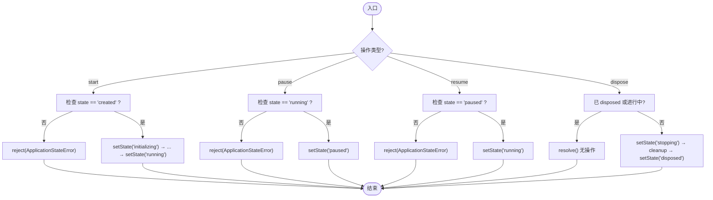
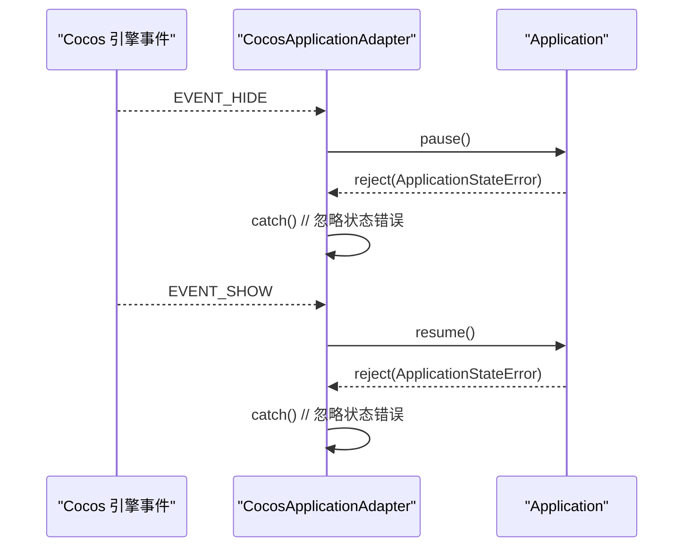
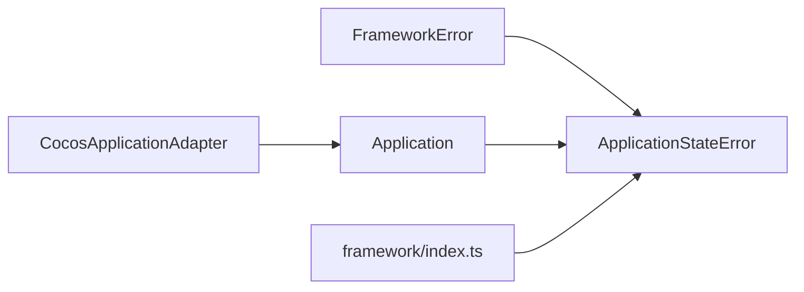

# ApplicationStateError 应用状态错误

<cite>
**本文引用的文件**
- [ApplicationStateError.ts](file://assets/framework/application/ApplicationStateError.ts)
- [FrameworkError.ts](file://assets/framework/core/errors/FrameworkError.ts)
- [Application.ts](file://assets/framework/application/Application.ts)
- [ApplicationContext.ts](file://assets/framework/contracts/application/ApplicationContext.ts)
- [CocosApplicationAdapter.ts](file://assets/framework/adapters/cocos/application/CocosApplicationAdapter.ts)
- [index.ts](file://assets/framework/index.ts)
- [application-operation-guards.test.ts](file://tests/framework/foundation/application-operation-guards.test.ts)
- [application-pause-resume.test.ts](file://tests/framework/foundation/application-pause-resume.test.ts)
- [framework-error.test.ts](file://tests/framework/foundation/framework-error.test.ts)
</cite>

## 目录
1. [简介](#简介)
2. [项目结构](#项目结构)
3. [核心组件](#核心组件)
4. [架构总览](#架构总览)
5. [详细组件分析](#详细组件分析)
6. [依赖关系分析](#依赖关系分析)
7. [性能与行为特性](#性能与行为特性)
8. [故障排除指南](#故障排除指南)
9. [结论](#结论)
10. [附录：使用示例与最佳实践](#附录使用示例与最佳实践)

## 简介
本文件围绕 ApplicationStateError（应用状态错误）进行系统化说明，覆盖其触发场景、处理机制、继承关系、消息格式与上下文传递，以及在各生命周期阶段（启动、暂停、恢复、销毁）的抛错与捕获策略。同时提供调试定位技巧与最佳实践，帮助初学者理解状态管理概念，并为高级用户提供深入的错误处理与恢复策略。

## 项目结构
ApplicationStateError 位于框架的应用层错误体系中，作为 FrameworkError 的子类，用于表达“当前应用状态不允许执行某操作”的错误。它被 Application 在非法状态调用时抛出，并在平台适配器中通过静默捕获避免中断系统事件流。

图表来源
- [ApplicationStateError.ts:5-13](file://assets/framework/application/ApplicationStateError.ts#L5-L13)
- [FrameworkError.ts:16-31](file://assets/framework/core/errors/FrameworkError.ts#L16-L31)
- [Application.ts:28-97](file://assets/framework/application/Application.ts#L28-L97)
- [ApplicationContext.ts:3-9](file://assets/framework/contracts/application/ApplicationContext.ts#L3-L9)
- [CocosApplicationAdapter.ts:39-51](file://assets/framework/adapters/cocos/application/CocosApplicationAdapter.ts#L39-L51)

章节来源
- [ApplicationStateError.ts:1-15](file://assets/framework/application/ApplicationStateError.ts#L1-L15)
- [FrameworkError.ts:1-42](file://assets/framework/core/errors/FrameworkError.ts#L1-L42)
- [Application.ts:1-168](file://assets/framework/application/Application.ts#L1-L168)
- [ApplicationContext.ts:1-18](file://assets/framework/contracts/application/ApplicationContext.ts#L1-L18)
- [CocosApplicationAdapter.ts:1-53](file://assets/framework/adapters/cocos/application/CocosApplicationAdapter.ts#L1-L53)

## 核心组件
- ApplicationStateError：表示应用处于某一状态时，执行了不被允许的操作。携带当前状态信息，并支持可选的 cause 等扩展上下文。
- FrameworkError：框架错误基类，统一错误语义，支持 recoverable 分类、moduleId/phase/component 上下文、cause 链。
- Application：应用生命周期控制器，负责状态转换与操作守卫，在非法状态下抛出 ApplicationStateError。
- ApplicationState：应用状态枚举，定义 created、initializing、running、paused、stopping、disposed 等状态。
- CocosApplicationAdapter：平台事件桥接，将引擎的生命周期事件映射为应用的 pause/resume，并对状态不匹配错误做静默处理。

章节来源
- [ApplicationStateError.ts:1-15](file://assets/framework/application/ApplicationStateError.ts#L1-L15)
- [FrameworkError.ts:1-42](file://assets/framework/core/errors/FrameworkError.ts#L1-L42)
- [Application.ts:1-168](file://assets/framework/application/Application.ts#L1-L168)
- [ApplicationContext.ts:1-18](file://assets/framework/contracts/application/ApplicationContext.ts#L1-L18)
- [CocosApplicationAdapter.ts:1-53](file://assets/framework/adapters/cocos/application/CocosApplicationAdapter.ts#L1-L53)

## 架构总览
下图展示了 Application 在生命周期各阶段的错误抛出点，以及 CocosApplicationAdapter 对状态错误的处理方式。

图表来源
- [Application.ts:28-97](file://assets/framework/application/Application.ts#L28-L97)
- [CocosApplicationAdapter.ts:39-51](file://assets/framework/adapters/cocos/application/CocosApplicationAdapter.ts#L39-L51)

章节来源
- [Application.ts:28-97](file://assets/framework/application/Application.ts#L28-L97)
- [CocosApplicationAdapter.ts:39-51](file://assets/framework/adapters/cocos/application/CocosApplicationAdapter.ts#L39-L51)

## 详细组件分析

### ApplicationStateError 类与继承关系
- 继承自 FrameworkError，名称固定为 "ApplicationStateError"。
- 构造函数接收 currentState（ApplicationState）与可选 options（FrameworkErrorOptions），options 支持 cause、recoverable、moduleId、phase、component 等上下文字段。
- 错误消息由基类格式化，包含当前状态信息；子类仅设置 name 与 currentState。

图表来源
- [FrameworkError.ts:16-31](file://assets/framework/core/errors/FrameworkError.ts#L16-L31)
- [ApplicationStateError.ts:5-13](file://assets/framework/application/ApplicationStateError.ts#L5-L13)

章节来源
- [ApplicationStateError.ts:1-15](file://assets/framework/application/ApplicationStateError.ts#L1-L15)
- [FrameworkError.ts:1-42](file://assets/framework/core/errors/FrameworkError.ts#L1-L42)

### Application 中的状态守卫与错误抛出点
- start()：仅在 created 状态允许进入初始化流程；否则拒绝并抛出 ApplicationStateError。
- pause()：仅在 running 状态允许暂停；否则拒绝并抛出 ApplicationStateError。
- resume()：仅在 paused 状态允许恢复；否则拒绝并抛出 ApplicationStateError。
- dispose()：已 disposed 或正在清理时返回无操作或复用同一 Promise；其他状态可正常进入 stopping→disposed。

图表来源
- [Application.ts:28-132](file://assets/framework/application/Application.ts#L28-L132)

章节来源
- [Application.ts:28-132](file://assets/framework/application/Application.ts#L28-L132)

### 平台适配器中的错误处理
CocosApplicationAdapter 监听引擎的隐藏/显示事件，分别调用应用的 pause/resume。当状态不匹配导致 ApplicationStateError 时，适配器选择 catch 并忽略，避免中断平台事件流。

图表来源
- [CocosApplicationAdapter.ts:39-51](file://assets/framework/adapters/cocos/application/CocosApplicationAdapter.ts#L39-L51)

章节来源
- [CocosApplicationAdapter.ts:39-51](file://assets/framework/adapters/cocos/application/CocosApplicationAdapter.ts#L39-L51)

### 应用状态枚举与上下文
ApplicationState 定义了应用生命周期的所有合法状态，包括 created、initializing、running、paused、stopping、disposed。ApplicationContext 暴露 logger 与 state 只读属性，便于诊断与日志记录。

章节来源
- [ApplicationContext.ts:1-18](file://assets/framework/contracts/application/ApplicationContext.ts#L1-L18)

## 依赖关系分析
- ApplicationStateError 依赖 FrameworkError 提供的错误基类能力（name、cause、recoverable、moduleId、phase、component）。
- Application 依赖 ApplicationStateError 进行状态守卫，并在非法状态调用时抛出该错误。
- CocosApplicationAdapter 依赖 Application 的 pause/resume，并对可能的 ApplicationStateError 做静默处理。
- index.ts 统一导出 ApplicationStateError，供上层模块使用。

图表来源
- [FrameworkError.ts:16-31](file://assets/framework/core/errors/FrameworkError.ts#L16-L31)
- [ApplicationStateError.ts:5-13](file://assets/framework/application/ApplicationStateError.ts#L5-L13)
- [Application.ts:6-9](file://assets/framework/application/Application.ts#L6-L9)
- [CocosApplicationAdapter.ts:1-10](file://assets/framework/adapters/cocos/application/CocosApplicationAdapter.ts#L1-L10)
- [index.ts:41-43](file://assets/framework/index.ts#L41-L43)

章节来源
- [index.ts:1-44](file://assets/framework/index.ts#L1-L44)

## 性能与行为特性
- 并发安全：多次 start() 会返回同一个 Promise（single-flight），避免重复初始化；多次 dispose() 也会复用清理任务。
- 队列化执行：内部通过 enqueue 串行化生命周期操作，确保状态转换顺序一致。
- 错误隔离：在启动失败时回滚模块清理，并将清理异常收集上报，不影响主流程的状态判断逻辑。
- 平台事件解耦：适配器对状态错误静默处理，避免阻塞引擎事件循环。

章节来源
- [Application.ts:28-168](file://assets/framework/application/Application.ts#L28-L168)
- [CocosApplicationAdapter.ts:39-51](file://assets/framework/adapters/cocos/application/CocosApplicationAdapter.ts#L39-L51)

## 故障排除指南
- 常见错误识别
  - 在非 created 状态调用 start() 会抛出 ApplicationStateError，当前状态会在错误对象上暴露。
  - 在非 running 状态调用 pause() 或在非 paused 状态调用 resume() 同样抛出 ApplicationStateError。
- 堆栈分析与定位
  - 利用 FrameworkError 的 cause 链追踪底层原因；可通过 isRecoverableError 判断是否可恢复。
  - 借助 moduleId、phase、component 等上下文字段快速定位问题模块与阶段。
- 调试建议
  - 在测试中使用 isApplicationStateError 断言错误类型与 currentState 值，验证状态守卫是否正确。
  - 在平台适配器中，若出现频繁的状态错误，检查引擎事件触发时机与应用状态是否匹配。

章节来源
- [application-operation-guards.test.ts:85-110](file://tests/framework/foundation/application-operation-guards.test.ts#L85-L110)
- [application-pause-resume.test.ts:118-164](file://tests/framework/foundation/application-pause-resume.test.ts#L118-L164)
- [framework-error.test.ts:115-131](file://tests/framework/foundation/framework-error.test.ts#L115-L131)

## 结论
ApplicationStateError 以清晰、强类型的错误模型约束应用生命周期操作，确保状态转换的正确性与一致性。结合 FrameworkError 的上下文与可恢复性标记，开发者可以在不同层级实施精细的错误处理与恢复策略。平台适配器的静默处理进一步提升了系统的鲁棒性。

## 附录：使用示例与最佳实践

### 生命周期各阶段的错误抛出与捕获
- 启动阶段
  - 在 created 之外调用 start() 将抛出 ApplicationStateError；调用方应捕获并提示用户或降级处理。
- 暂停/恢复阶段
  - 在非 running 状态调用 pause() 或非 paused 状态调用 resume() 将抛出 ApplicationStateError；建议在 UI 层禁用对应按钮或给出提示。
- 销毁阶段
  - dispose() 在已 disposed 或进行中时返回无操作；其他状态进入 stopping→disposed 流程。

章节来源
- [Application.ts:28-132](file://assets/framework/application/Application.ts#L28-L132)
- [application-operation-guards.test.ts:85-110](file://tests/framework/foundation/application-operation-guards.test.ts#L85-L110)
- [application-pause-resume.test.ts:118-164](file://tests/framework/foundation/application-pause-resume.test.ts#L118-L164)

### 错误消息格式化与上下文传递
- 错误消息：由 FrameworkError 构造，包含当前状态描述；ApplicationStateError 仅设置 name 与 currentState。
- 上下文：通过 options.cause、moduleId、phase、component 传递更丰富的诊断信息，便于日志与监控。

章节来源
- [ApplicationStateError.ts:5-13](file://assets/framework/application/ApplicationStateError.ts#L5-L13)
- [FrameworkError.ts:16-31](file://assets/framework/core/errors/FrameworkError.ts#L16-L31)

### 状态恢复策略
- 对于可恢复错误（recoverable: true），可在上层实现重试或降级逻辑；不可恢复错误应记录并终止相关流程。
- 使用 isRecoverableError 判断错误是否可恢复，并结合 cause 链定位根因。

章节来源
- [FrameworkError.ts:39-42](file://assets/framework/core/errors/FrameworkError.ts#L39-L42)
- [framework-error.test.ts:43-81](file://tests/framework/foundation/framework-error.test.ts#L43-L81)

### 最佳实践
- 错误消息清晰：明确告知当前状态与不允许的操作，便于用户理解与反馈。
- 前置条件检查：在调用生命周期方法前，先读取 app.state 进行预判，减少不必要的异常。
- 用户友好提示：在 UI 层根据错误类型展示友好提示，如“应用尚未启动，请先启动”。
- 日志与监控：记录错误上下文（moduleId、phase、component）与 cause 链，便于问题定位。

章节来源
- [Application.ts:28-132](file://assets/framework/application/Application.ts#L28-L132)
- [CocosApplicationAdapter.ts:39-51](file://assets/framework/adapters/cocos/application/CocosApplicationAdapter.ts#L39-L51)
- [framework-error.test.ts:95-113](file://tests/framework/foundation/framework-error.test.ts#L95-L113)