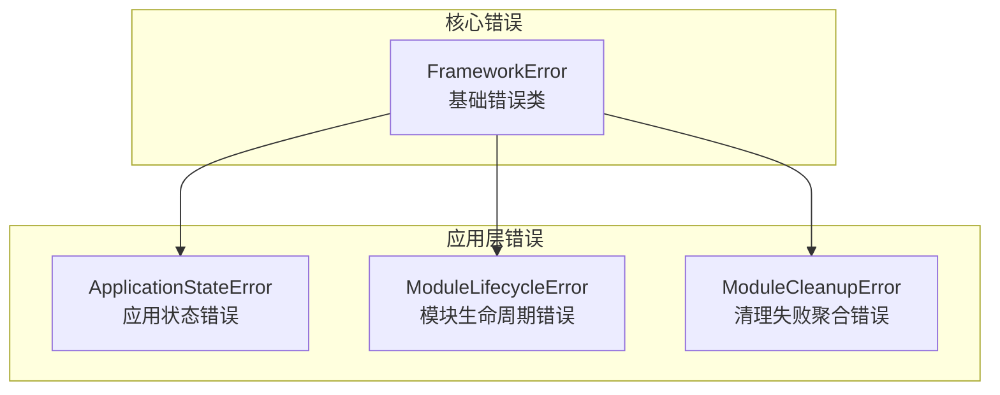
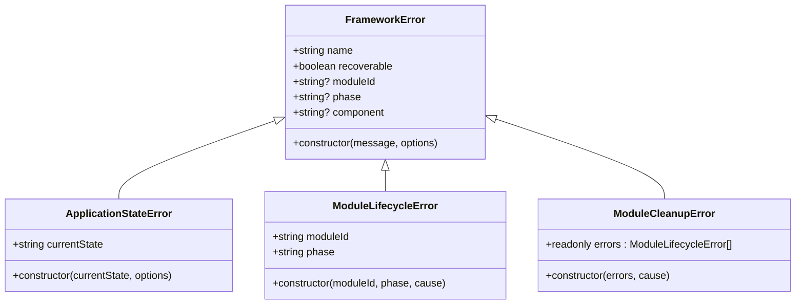
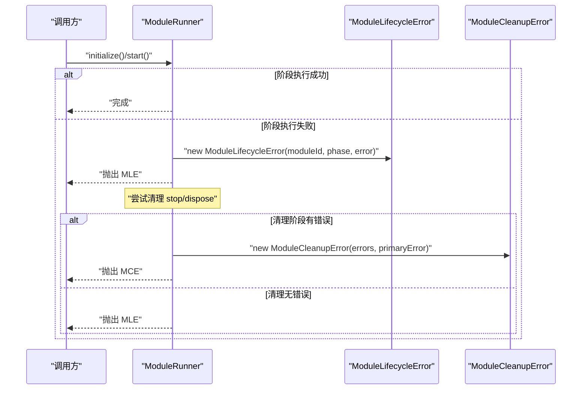

# FrameworkError 基类

<cite>
**本文引用的文件**
- [FrameworkError.ts](file://assets/framework/core/errors/FrameworkError.ts)
- [ModuleLifecycleError.ts](file://assets/framework/application/ModuleLifecycleError.ts)
- [ApplicationStateError.ts](file://assets/framework/application/ApplicationStateError.ts)
- [ModuleRunner.ts](file://assets/framework/application/ModuleRunner.ts)
- [index.ts](file://assets/framework/index.ts)
- [framework-error.test.ts](file://tests/framework/foundation/framework-error.test.ts)
</cite>

## 目录
1. [简介](#简介)
2. [项目结构](#项目结构)
3. [核心组件](#核心组件)
4. [架构总览](#架构总览)
5. [详细组件分析](#详细组件分析)
6. [依赖关系分析](#依赖关系分析)
7. [性能与可维护性考量](#性能与可维护性考量)
8. [故障排查指南](#故障排查指南)
9. [结论](#结论)
10. [附录：最佳实践与示例指引](#附录最佳实践与示例指引)

## 简介
FrameworkError 是框架的错误基类，用于统一错误语义、上下文信息与恢复策略。它通过可选的“原因链”（cause）保留原始错误，并通过 moduleId、phase、component 等选项提供定位失败的上下文。recoverable 标志位用于区分“可恢复”和“不可恢复”错误，从而驱动上层错误处理策略（重试、降级、终止等）。

本文件将深入解析 FrameworkError 的设计动机、接口属性、继承体系、构造函数参数与属性设置机制，并结合测试与使用场景给出可操作的指导。

## 项目结构
FrameworkError 位于 core/errors 目录，作为框架内所有业务错误的根类型；应用层错误 ApplicationStateError 与 ModuleLifecycleError 均继承自该基类。模块运行器 ModuleRunner 在生命周期阶段抛出结构化错误，便于统一捕获与上报。

图表来源
- [FrameworkError.ts:16-31](file://assets/framework/core/errors/FrameworkError.ts#L16-L31)
- [ApplicationStateError.ts:5-13](file://assets/framework/application/ApplicationStateError.ts#L5-L13)
- [ModuleLifecycleError.ts:4-21](file://assets/framework/application/ModuleLifecycleError.ts#L4-L21)
- [ModuleRunner.ts:12-24](file://assets/framework/application/ModuleRunner.ts#L12-L24)

章节来源
- [FrameworkError.ts:1-42](file://assets/framework/core/errors/FrameworkError.ts#L1-L42)
- [index.ts:31-32](file://assets/framework/index.ts#L31-L32)

## 核心组件
- FrameworkErrorOptions 接口：定义错误构造时的可选上下文信息，包括 cause、moduleId、phase、component、recoverable。
- FrameworkError 类：扩展原生 Error，支持 cause 链，并暴露 recoverable、moduleId、phase、component 等只读属性。
- isRecoverableError 函数：判断一个未知对象是否为“可恢复”的 FrameworkError。

关键要点
- 默认 recoverable 为 false，显式传入 true 才视为可恢复。
- cause 通过原生 Error 的 cause 语义传递，保持完整的原因链。
- name 被设置为 FrameworkError，子类应覆盖 name 以保留自身标识。

章节来源
- [FrameworkError.ts:1-7](file://assets/framework/core/errors/FrameworkError.ts#L1-L7)
- [FrameworkError.ts:16-31](file://assets/framework/core/errors/FrameworkError.ts#L16-L31)
- [FrameworkError.ts:39-41](file://assets/framework/core/errors/FrameworkError.ts#L39-L41)

## 架构总览
FrameworkError 作为统一的错误抽象，向上游提供：
- 结构化上下文：moduleId、phase、component 帮助快速定位问题域与阶段。
- 可恢复性分类：recoverable 标志驱动重试或回退策略。
- 原因链：cause 保留底层异常，便于诊断。

下游具体错误类型（如 ApplicationStateError、ModuleLifecycleError）在此基础上增加领域语义字段，并保持 name 一致性，便于日志与监控识别。

图表来源
- [FrameworkError.ts:16-31](file://assets/framework/core/errors/FrameworkError.ts#L16-L31)
- [ApplicationStateError.ts:5-13](file://assets/framework/application/ApplicationStateError.ts#L5-L13)
- [ModuleLifecycleError.ts:4-21](file://assets/framework/application/ModuleLifecycleError.ts#L4-L21)
- [ModuleRunner.ts:12-24](file://assets/framework/application/ModuleRunner.ts#L12-L24)

## 详细组件分析

### FrameworkErrorOptions 接口
- cause?: unknown
  - 作用：记录导致当前错误的原始原因，形成原因链。
  - 使用场景：当包装第三方异常或底层 I/O 错误时，保留原始堆栈与消息。
- moduleId?: string
  - 作用：标识出错的模块 ID，便于按模块维度统计与定位。
  - 使用场景：模块生命周期阶段抛错时，标注是哪个模块失败。
- phase?: string
  - 作用：标识出错的生命周期阶段（如 initialize、start、stop、dispose）。
  - 使用场景：结合 moduleId，精确定位到“哪个模块在哪个阶段”失败。
- component?: string
  - 作用：标识更细粒度的组件（如 resource-loader、event-bus）。
  - 使用场景：同一模块内多个子组件协作时，进一步缩小范围。
- recoverable?: boolean
  - 作用：标记错误是否可恢复。
  - 使用场景：网络抖动、资源暂时不可用等可重试场景设为 true；数据损坏、非法状态等不可恢复场景设为 false。

章节来源
- [FrameworkError.ts:1-7](file://assets/framework/core/errors/FrameworkError.ts#L1-L7)

### FrameworkError 类
- 继承结构
  - 基于原生 Error，并通过类型断言兼容带 cause 的构造签名。
  - 构造函数接收 message 与 options，调用父类构造时将 options.cause 透传。
- 属性设置机制
  - name 固定为 "FrameworkError"，子类需覆盖 name 以保留自身类型名。
  - recoverable 默认 false，可从 options.recoverable 覆盖。
  - moduleId、phase、component 从 options 直接赋值，均为可选只读属性。
- 设计要点
  - 不枚举 cause，遵循原生 Error 的 cause 语义，避免污染普通遍历。
  - 通过 isRecoverableError 进行“顶层”可恢复性判定，不自动解包 cause。

章节来源
- [FrameworkError.ts:9-14](file://assets/framework/core/errors/FrameworkError.ts#L9-L14)
- [FrameworkError.ts:16-31](file://assets/framework/core/errors/FrameworkError.ts#L16-L31)
- [FrameworkError.ts:39-41](file://assets/framework/core/errors/FrameworkError.ts#L39-L41)

### isRecoverableError 函数
- 功能：仅对“顶层”错误进行判断，若为 FrameworkError 且 recoverable 为 true，则返回 true。
- 注意事项：不会自动解包 cause，调用方如需判断嵌套原因的可恢复性，需自行 unwrap cause。

章节来源
- [FrameworkError.ts:39-41](file://assets/framework/core/errors/FrameworkError.ts#L39-L41)

### 子类：ApplicationStateError
- 新增字段：currentState，表示应用当前状态。
- 行为：构造时生成描述性消息，覆盖 name 为 "ApplicationStateError"。
- 适用场景：应用状态转换非法或不允许的操作。

章节来源
- [ApplicationStateError.ts:5-13](file://assets/framework/application/ApplicationStateError.ts#L5-L13)

### 子类：ModuleLifecycleError
- 新增字段：moduleId、phase（强类型 ModulePhase）。
- 行为：构造时携带 cause、moduleId、phase，覆盖 name 为 "ModuleLifecycleError"。
- 适用场景：模块生命周期各阶段抛错时统一封装。

章节来源
- [ModuleLifecycleError.ts:4-21](file://assets/framework/application/ModuleLifecycleError.ts#L4-L21)

### 内部错误：ModuleCleanupError
- 新增字段：errors（冻结数组），保存清理阶段的多个 ModuleLifecycleError。
- 行为：构造时携带 cause（首个错误），覆盖 name 为 "ModuleCleanupError"。
- 适用场景：模块停止/销毁阶段出现多个错误时聚合上报。

章节来源
- [ModuleRunner.ts:12-24](file://assets/framework/application/ModuleRunner.ts#L12-L24)

## 依赖关系分析
- 导出边界
  - 框架对外导出 FrameworkError、isRecoverableError 以及 FrameworkErrorOptions 类型，供上层使用。
- 使用位置
  - ModuleRunner 在生命周期阶段抛错时统一使用 ModuleLifecycleError，并在清理失败时聚合为 ModuleCleanupError。
  - Application 在状态校验失败时抛出 ApplicationStateError。

图表来源
- [ModuleRunner.ts:47-105](file://assets/framework/application/ModuleRunner.ts#L47-L105)
- [ModuleRunner.ts:155-186](file://assets/framework/application/ModuleRunner.ts#L155-L186)
- [ModuleRunner.ts:213-241](file://assets/framework/application/ModuleRunner.ts#L213-L241)

章节来源
- [index.ts:31-32](file://assets/framework/index.ts#L31-L32)
- [ModuleRunner.ts:47-105](file://assets/framework/application/ModuleRunner.ts#L47-L105)
- [ModuleRunner.ts:155-186](file://assets/framework/application/ModuleRunner.ts#L155-L186)
- [ModuleRunner.ts:213-241](file://assets/framework/application/ModuleRunner.ts#L213-L241)

## 性能与可维护性考量
- 错误对象创建开销：错误对象通常只在异常路径创建，对正常路径性能影响极小。
- cause 链长度：过深的 cause 链会增加序列化与日志体积，建议仅在必要时保留必要层级。
- 可恢复性判定：isRecoverableError 仅检查顶层对象，避免不必要的解包成本。
- 名称覆盖：子类必须覆盖 name，保证日志与监控系统能正确识别错误类型。

[本节为通用指导，不直接分析具体文件]

## 故障排查指南
- 如何快速定位问题
  - 查看 moduleId 与 phase 组合，确认是哪个模块在哪个阶段失败。
  - 查看 component 字段，进一步缩小到子组件。
  - 查看 cause 链，定位最底层原因（如 I/O、网络、第三方库异常）。
- 可恢复错误处理
  - 使用 isRecoverableError 判断是否可重试或降级。
  - 对于可恢复错误，可在上层实现指数退避重试或切换备用资源。
- 常见陷阱
  - 不要依赖 isRecoverableError 去判断嵌套 cause 的可恢复性，需自行 unwrap。
  - 忘记覆盖 name 会导致日志中无法区分具体错误类型。

章节来源
- [framework-error.test.ts:12-41](file://tests/framework/foundation/framework-error.test.ts#L12-L41)
- [framework-error.test.ts:43-81](file://tests/framework/foundation/framework-error.test.ts#L43-L81)
- [framework-error.test.ts:83-93](file://tests/framework/foundation/framework-error.test.ts#L83-L93)
- [framework-error.test.ts:95-113](file://tests/framework/foundation/framework-error.test.ts#L95-L113)
- [framework-error.test.ts:115-131](file://tests/framework/foundation/framework-error.test.ts#L115-L131)

## 结论
FrameworkError 提供了统一的错误抽象，通过结构化上下文与可恢复性分类，使上层能够实施一致的错误处理策略。其简洁的设计使得子类易于扩展，同时保持日志与监控的一致性。正确使用 recoverable 标志与 cause 链，可以显著提升系统的可观测性与自愈能力。

[本节为总结，不直接分析具体文件]

## 附录：最佳实践与示例指引

- 自定义错误类型的步骤
  - 继承 FrameworkError，并在构造函数中调用 super(message, options)。
  - 覆盖 name 为子类名，确保日志与监控可识别。
  - 根据需要添加领域字段（如 currentState、moduleId、phase）。
  - 在需要时可设置 recoverable 为 true 以启用重试逻辑。

- 使用错误选项传递上下文
  - moduleId：始终标注模块 ID，便于按模块维度统计失败率。
  - phase：标注生命周期阶段，便于定位问题发生点。
  - component：在复杂模块中标注子组件，提高定位精度。
  - cause：保留原始错误，构建清晰的原因链。

- 可恢复错误的处理逻辑
  - 使用 isRecoverableError 判断是否可恢复。
  - 对可恢复错误实现重试、降级、熔断等策略。
  - 对不可恢复错误尽快失败并上报，避免级联故障。

- 错误分类与层次结构
  - 顶层：FrameworkError（通用基类）
  - 应用层：ApplicationStateError（应用状态相关）
  - 模块层：ModuleLifecycleError（模块生命周期相关）
  - 清理聚合：ModuleCleanupError（清理阶段多错误聚合）

- 参考示例路径
  - 自定义错误示例：参见 [ApplicationStateError.ts:5-13](file://assets/framework/application/ApplicationStateError.ts#L5-L13)、[ModuleLifecycleError.ts:4-21](file://assets/framework/application/ModuleLifecycleError.ts#L4-L21)
  - 可恢复性判断示例：参见 [FrameworkError.ts:39-41](file://assets/framework/core/errors/FrameworkError.ts#L39-L41)
  - 上下文传递示例：参见 [ModuleRunner.ts:155-186](file://assets/framework/application/ModuleRunner.ts#L155-L186)
  - 测试用例参考：参见 [framework-error.test.ts:12-131](file://tests/framework/foundation/framework-error.test.ts#L12-L131)

章节来源
- [ApplicationStateError.ts:5-13](file://assets/framework/application/ApplicationStateError.ts#L5-L13)
- [ModuleLifecycleError.ts:4-21](file://assets/framework/application/ModuleLifecycleError.ts#L4-L21)
- [FrameworkError.ts:39-41](file://assets/framework/core/errors/FrameworkError.ts#L39-L41)
- [ModuleRunner.ts:155-186](file://assets/framework/application/ModuleRunner.ts#L155-L186)
- [framework-error.test.ts:12-131](file://tests/framework/foundation/framework-error.test.ts#L12-L131)