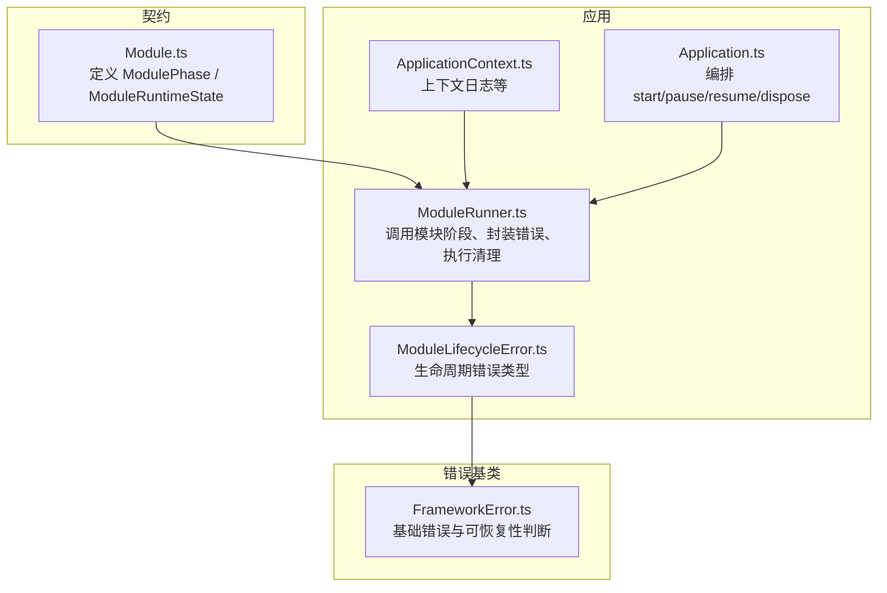
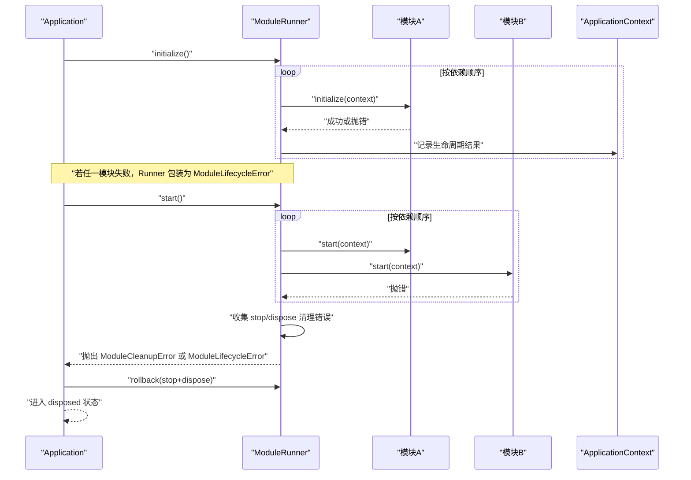
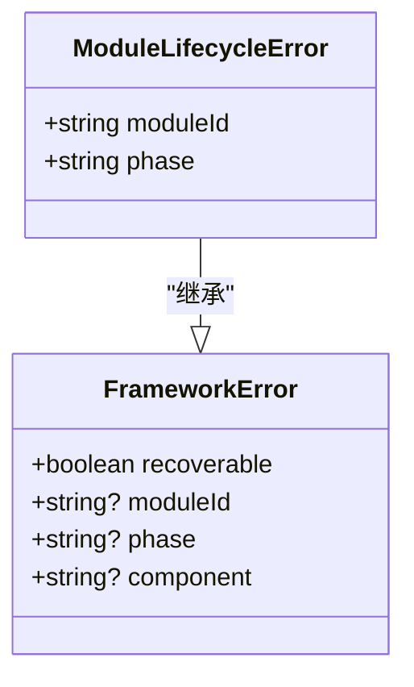
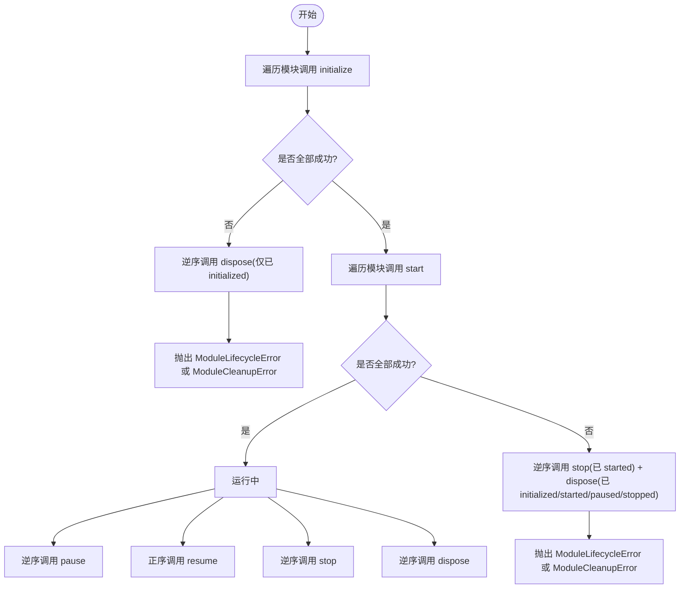
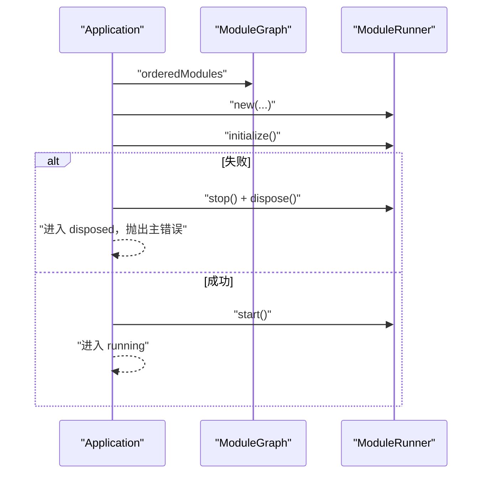
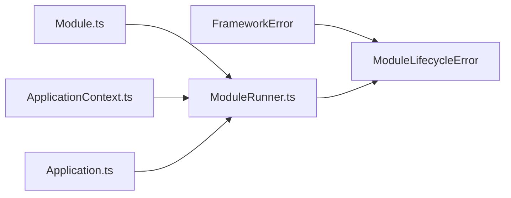

# ModuleLifecycleError 模块生命周期错误

<cite>
**本文引用的文件**   
- [ModuleLifecycleError.ts](file://assets/framework/application/ModuleLifecycleError.ts)
- [FrameworkError.ts](file://assets/framework/core/errors/FrameworkError.ts)
- [ModuleRunner.ts](file://assets/framework/application/ModuleRunner.ts)
- [Module.ts](file://assets/framework/contracts/module/Module.ts)
- [Application.ts](file://assets/framework/application/Application.ts)
- [ApplicationContext.ts](file://assets/framework/application/ApplicationContext.ts)
- [module-lifecycle-error.test.ts](file://tests/framework/foundation/module-lifecycle-error.test.ts)
- [module-runner-initialize-failure.test.ts](file://tests/framework/foundation/module-runner-initialize-failure.test.ts)
- [module-runner-start-failure.test.ts](file://tests/framework/foundation/module-runner-start-failure.test.ts)
- [module-runner-cleanup-failure.test.ts](file://tests/framework/foundation/module-runner-cleanup-failure.test.ts)
- [framework-error.test.ts](file://tests/framework/foundation/framework-error.test.ts)
</cite>

## 目录
1. [简介](#简介)
2. [项目结构](#项目结构)
3. [核心组件](#核心组件)
4. [架构总览](#架构总览)
5. [详细组件分析](#详细组件分析)
6. [依赖关系分析](#依赖关系分析)
7. [性能与可靠性考量](#性能与可靠性考量)
8. [故障排除指南](#故障排除指南)
9. [结论](#结论)
10. [附录：使用示例与最佳实践](#附录使用示例与最佳实践)

## 简介
本文件围绕 ModuleLifecycleError（模块生命周期错误）展开，系统阐述其在模块初始化、启动、暂停、恢复、停止、销毁等阶段的触发场景、传播机制与处理策略。文档同时覆盖其继承体系、错误分类、清理失败聚合、以及如何在模块方法中正确抛出与捕获异常，并给出调试与排障建议与最佳实践。

## 项目结构
与 ModuleLifecycleError 相关的代码主要分布在应用层与契约层：
- 契约层定义模块生命周期阶段与运行时状态
- 应用层负责编排模块生命周期、统一包装错误、执行清理与回滚
- 错误基类提供可恢复性标记与 cause 链支持
- 测试用例验证各阶段失败路径与清理行为

图表来源 
- [Module.ts:1-30](file://assets/framework/contracts/module/Module.ts#L1-L30)
- [Application.ts:1-168](file://assets/framework/application/Application.ts#L1-L168)
- [ModuleRunner.ts:1-242](file://assets/framework/application/ModuleRunner.ts#L1-L242)
- [ModuleLifecycleError.ts:1-22](file://assets/framework/application/ModuleLifecycleError.ts#L1-L22)
- [FrameworkError.ts:1-42](file://assets/framework/core/errors/FrameworkError.ts#L1-L42)
- [ApplicationContext.ts:1-14](file://assets/framework/application/ApplicationContext.ts#L1-L14)

章节来源
- [Module.ts:1-30](file://assets/framework/contracts/module/Module.ts#L1-L30)
- [Application.ts:1-168](file://assets/framework/application/Application.ts#L1-L168)
- [ModuleRunner.ts:1-242](file://assets/framework/application/ModuleRunner.ts#L1-L242)
- [ModuleLifecycleError.ts:1-22](file://assets/framework/application/ModuleLifecycleError.ts#L1-L22)
- [FrameworkError.ts:1-42](file://assets/framework/core/errors/FrameworkError.ts#L1-L42)
- [ApplicationContext.ts:1-14](file://assets/framework/application/ApplicationContext.ts#L1-L14)

## 核心组件
- ModuleLifecycleError：模块生命周期错误的专用类型，携带 moduleId、phase 与原始 cause，用于在 initialize/start 等阶段失败时向上层传递结构化信息。
- FrameworkError：框架级错误基类，提供 recoverable 标志、moduleId/phase/component 上下文字段，以及 isRecoverableError 判定工具。
- ModuleRunner：模块运行器，负责按顺序调用模块生命周期方法，捕获异常并包装为 ModuleLifecycleError；在失败时执行反向清理（stop/dispose），并将多个清理错误聚合成 ModuleCleanupError。
- Application：应用入口，协调 ModuleGraph 排序与 ModuleRunner 执行，并在启动失败时进行全局回滚（stop + dispose）。
- Module 契约：定义模块的 id、dependencies 与各生命周期钩子（initialize/start/pause/resume/stop/dispose）。

章节来源
- [ModuleLifecycleError.ts:1-22](file://assets/framework/application/ModuleLifecycleError.ts#L1-L22)
- [FrameworkError.ts:1-42](file://assets/framework/core/errors/FrameworkError.ts#L1-L42)
- [ModuleRunner.ts:1-242](file://assets/framework/application/ModuleRunner.ts#L1-L242)
- [Application.ts:1-168](file://assets/framework/application/Application.ts#L1-L168)
- [Module.ts:1-30](file://assets/framework/contracts/module/Module.ts#L1-L30)

## 架构总览
下图展示了从 Application 到 ModuleRunner 再到具体模块的生命周期调用与错误传播路径。

图表来源 
- [Application.ts:28-67](file://assets/framework/application/Application.ts#L28-L67)
- [ModuleRunner.ts:47-105](file://assets/framework/application/ModuleRunner.ts#L47-L105)
- [ModuleRunner.ts:155-186](file://assets/framework/application/ModuleRunner.ts#L155-L186)
- [ModuleRunner.ts:188-211](file://assets/framework/application/ModuleRunner.ts#L188-L211)
- [ModuleRunner.ts:223-240](file://assets/framework/application/ModuleRunner.ts#L223-L240)

## 详细组件分析

### ModuleLifecycleError：继承关系与语义
- 继承自 FrameworkError，保留 Error.cause 原生语义（不可枚举），并设置 name 为 "ModuleLifecycleError"。
- 新增字段：moduleId、phase，用于定位失败模块与阶段。
- 通过 isRecoverableError 判定：默认不可恢复，除非显式设置 recoverable=true（ModuleLifecycleError 未设置，故默认不可恢复）。

图表来源 
- [FrameworkError.ts:16-31](file://assets/framework/core/errors/FrameworkError.ts#L16-L31)
- [ModuleLifecycleError.ts:4-21](file://assets/framework/application/ModuleLifecycleError.ts#L4-L21)

章节来源
- [ModuleLifecycleError.ts:1-22](file://assets/framework/application/ModuleLifecycleError.ts#L1-L22)
- [FrameworkError.ts:1-42](file://assets/framework/core/errors/FrameworkError.ts#L1-L42)
- [framework-error.test.ts:83-93](file://tests/framework/foundation/framework-error.test.ts#L83-L93)
- [framework-error.test.ts:95-113](file://tests/framework/foundation/framework-error.test.ts#L95-L113)
- [framework-error.test.ts:43-81](file://tests/framework/foundation/framework-error.test.ts#L43-L81)
- [module-lifecycle-error.test.ts:7-23](file://tests/framework/foundation/module-lifecycle-error.test.ts#L7-L23)

### ModuleRunner：生命周期编排与错误包装
- 调用流程：
  - initialize：按注册顺序调用模块 initialize，成功后置状态为 initialized。
  - start：对已 initialized 的模块调用 start，成功后置状态为 started。
  - pause/resume：对已 started 的模块逆序调用 pause，对 paused 的模块调用 resume。
  - stop/dispose：按条件过滤已处于相应状态的模块，逆序调用以保障资源释放。
- 错误包装：
  - invokePhase 捕获任意异常并包装为 ModuleLifecycleError，附带 moduleId、phase、cause。
  - 失败后执行 cleanup（stop/dispose），收集所有清理错误。
  - 若存在清理错误，抛出 ModuleCleanupError（包含 errors 数组与 cause），否则抛出原始 ModuleLifecycleError。
- 状态机：registered → initialized → started → paused → stopped → disposed。

图表来源 
- [ModuleRunner.ts:47-105](file://assets/framework/application/ModuleRunner.ts#L47-L105)
- [ModuleRunner.ts:107-129](file://assets/framework/application/ModuleRunner.ts#L107-L129)
- [ModuleRunner.ts:131-153](file://assets/framework/application/ModuleRunner.ts#L131-L153)
- [ModuleRunner.ts:155-186](file://assets/framework/application/ModuleRunner.ts#L155-L186)
- [ModuleRunner.ts:188-211](file://assets/framework/application/ModuleRunner.ts#L188-L211)
- [ModuleRunner.ts:213-240](file://assets/framework/application/ModuleRunner.ts#L213-L240)

章节来源
- [ModuleRunner.ts:1-242](file://assets/framework/application/ModuleRunner.ts#L1-L242)
- [module-runner-initialize-failure.test.ts:57-97](file://tests/framework/foundation/module-runner-initialize-failure.test.ts#L57-L97)
- [module-runner-start-failure.test.ts:60-109](file://tests/framework/foundation/module-runner-start-failure.test.ts#L60-L109)
- [module-runner-cleanup-failure.test.ts:134-302](file://tests/framework/foundation/module-runner-cleanup-failure.test.ts#L134-L302)

### Application：启动编排与回滚
- start：构建有序模块列表，创建 ModuleRunner，依次执行 initialize/start；任一阶段失败则进入 stopping，执行 rollback（stop + dispose），最终进入 disposed 并抛出主错误。
- pause/resume：仅在 running/paused 状态下允许切换，内部委托给 runner。
- dispose：串行执行 stop 与 dispose，收集清理错误并上报，最后进入 disposed。

图表来源 
- [Application.ts:28-67](file://assets/framework/application/Application.ts#L28-L67)
- [Application.ts:99-132](file://assets/framework/application/Application.ts#L99-L132)
- [Application.ts:134-156](file://assets/framework/application/Application.ts#L134-L156)

章节来源
- [Application.ts:1-168](file://assets/framework/application/Application.ts#L1-L168)

### ApplicationContext：上下文与日志
- 提供 logger 与只读 state 访问，供 ModuleRunner 在生命周期阶段记录成功/失败信息。

章节来源
- [ApplicationContext.ts:1-14](file://assets/framework/application/ApplicationContext.ts#L1-L14)

## 依赖关系分析
- ModuleLifecycleError 依赖 FrameworkError，复用 cause 链与 recoverable 语义。
- ModuleRunner 依赖 Module 契约与 ApplicationContext，负责调用与错误包装。
- Application 依赖 ModuleGraph（由 modules 构造）与 ModuleRunner，负责整体编排与回滚。
- 测试用例覆盖 initialize/start 失败路径、清理失败聚合、cause 链保持与名称保留。

图表来源 
- [FrameworkError.ts:16-31](file://assets/framework/core/errors/FrameworkError.ts#L16-L31)
- [ModuleLifecycleError.ts:4-21](file://assets/framework/application/ModuleLifecycleError.ts#L4-L21)
- [Module.ts:1-30](file://assets/framework/contracts/module/Module.ts#L1-L30)
- [ModuleRunner.ts:1-242](file://assets/framework/application/ModuleRunner.ts#L1-L242)
- [Application.ts:1-168](file://assets/framework/application/Application.ts#L1-L168)

章节来源
- [Module.ts:1-30](file://assets/framework/contracts/module/Module.ts#L1-L30)
- [ModuleRunner.ts:1-242](file://assets/framework/application/ModuleRunner.ts#L1-L242)
- [Application.ts:1-168](file://assets/framework/application/Application.ts#L1-L168)
- [FrameworkError.ts:1-42](file://assets/framework/core/errors/FrameworkError.ts#L1-L42)
- [ModuleLifecycleError.ts:1-22](file://assets/framework/application/ModuleLifecycleError.ts#L1-L22)

## 性能与可靠性考量
- 清理阶段采用逆序调用，确保依赖释放顺序正确，避免资源泄漏。
- 清理失败不会中断其他模块的清理，保证最大程度的资源回收。
- 错误包装集中化，减少上层分支判断复杂度，便于统一日志与监控。
- 使用 Promise 队列与状态守卫，避免重复启动与非法状态转换。

[本节为通用指导，不直接分析具体文件]

## 故障排除指南
- 模块加载失败诊断
  - 检查 initialize/start 抛出的 ModuleLifecycleError 的 moduleId 与 phase，定位失败模块与阶段。
  - 查看 cause 链，找到最底层根因（如网络、IO、配置解析错误）。
- 依赖解析错误定位
  - 确认 Module.dependencies 声明是否正确，是否存在循环依赖导致 ModuleGraph 排序异常。
- 模块间通信异常排查
  - 在 ApplicationContext.logger 中检索“Module lifecycle failed”与“Module cleanup failed”日志，结合 moduleId/phase 筛选。
- 清理失败聚合
  - 当出现 ModuleCleanupError 时，检查 errors 数组中的每个 ModuleLifecycleError，逐一修复对应模块的 stop/dispose 实现。
- 可恢复性判断
  - 如需重试，应在业务层根据 isRecoverableError 或自定义策略决定是否重试；ModuleLifecycleError 默认不可恢复。

章节来源
- [ModuleRunner.ts:155-186](file://assets/framework/application/ModuleRunner.ts#L155-L186)
- [ModuleRunner.ts:188-211](file://assets/framework/application/ModuleRunner.ts#L188-L211)
- [ModuleRunner.ts:223-240](file://assets/framework/application/ModuleRunner.ts#L223-L240)
- [framework-error.test.ts:43-81](file://tests/framework/foundation/framework-error.test.ts#L43-L81)

## 结论
ModuleLifecycleError 将模块生命周期各阶段的异常统一抽象为结构化错误，配合 ModuleRunner 的清理策略与 Application 的回滚机制，形成健壮的错误传播与恢复路径。通过 cause 链、recoverable 标记与上下文字段，开发者可以精准定位问题、制定恢复策略，并在复杂依赖下保证资源安全释放。

[本节为总结性内容，不直接分析具体文件]

## 附录：使用示例与最佳实践

### 在模块生命周期方法中抛出适当的生命周期错误
- 在 initialize/start 中遇到不可恢复错误时，直接抛出 Error（会被 ModuleRunner 包装为 ModuleLifecycleError）。
- 对于可重试场景，可在业务层捕获并转换为可恢复错误（例如基于 isRecoverableError 的策略）。

章节来源
- [module-runner-initialize-failure.test.ts:63-72](file://tests/framework/foundation/module-runner-initialize-failure.test.ts#L63-L72)
- [module-runner-start-failure.test.ts:66-76](file://tests/framework/foundation/module-runner-start-failure.test.ts#L66-L76)

### 捕获和处理模块级异常
- 在 Application.start 外层捕获主错误，必要时记录上下文并决定退出或降级。
- 在 dispose 阶段捕获清理错误，汇总上报但不阻塞最终状态迁移。

章节来源
- [Application.ts:49-54](file://assets/framework/application/Application.ts#L49-L54)
- [Application.ts:113-122](file://assets/framework/application/Application.ts#L113-L122)

### 实现模块级别的错误恢复
- 依据 isRecoverableError 判断是否重试；对非可恢复错误应快速失败并清理资源。
- 在 stop/dispose 中尽量幂等，确保多次调用也不会产生副作用。

章节来源
- [FrameworkError.ts:39-41](file://assets/framework/core/errors/FrameworkError.ts#L39-L41)
- [module-runner-cleanup-failure.test.ts:134-168](file://tests/framework/foundation/module-runner-cleanup-failure.test.ts#L134-L168)

### 最佳实践清单
- 错误时机选择
  - 初始化失败尽早返回，避免部分初始化导致的半可用状态。
  - 启动失败立即触发反向清理，保证依赖释放顺序。
- 依赖关系检查
  - 明确 dependencies，避免隐式耦合；在 initialize 中校验必要资源可用性。
- 资源清理策略
  - stop 优先于 dispose；逆序清理；清理函数幂等且短小。
- 日志与可观测性
  - 利用 ApplicationContext.logger 输出结构化日志，包含 moduleId、phase、result。
- 可恢复性与重试
  - 仅在确定可恢复时重试；重试需具备退避与上限策略。

章节来源
- [ModuleRunner.ts:188-211](file://assets/framework/application/ModuleRunner.ts#L188-L211)
- [ModuleRunner.ts:223-240](file://assets/framework/application/ModuleRunner.ts#L223-L240)
- [framework-error.test.ts:95-113](file://tests/framework/foundation/framework-error.test.ts#L95-L113)