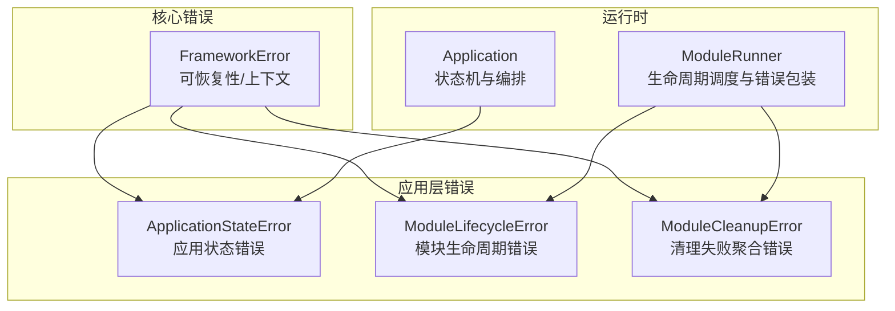
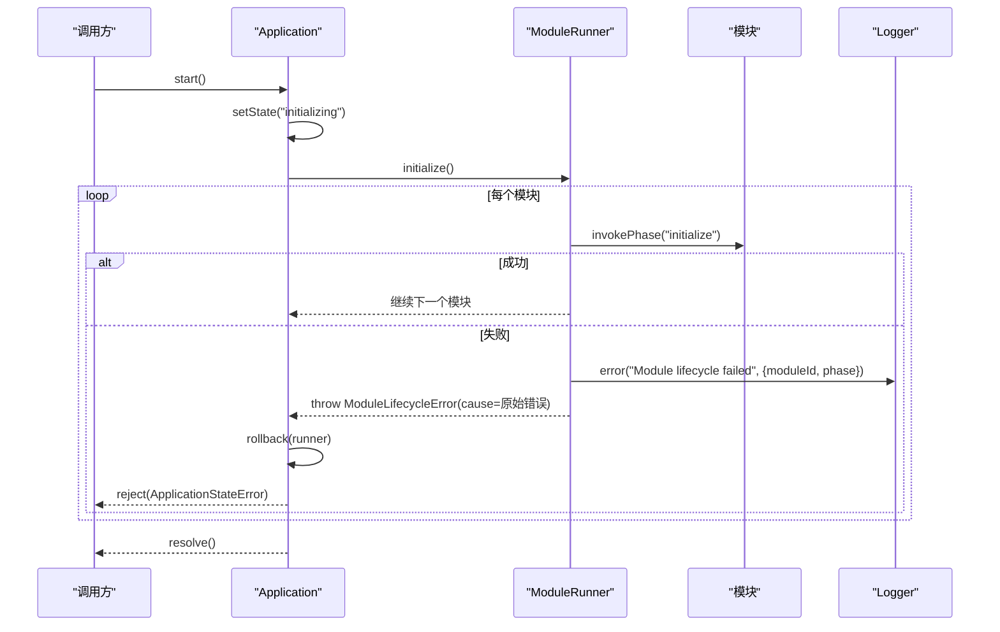
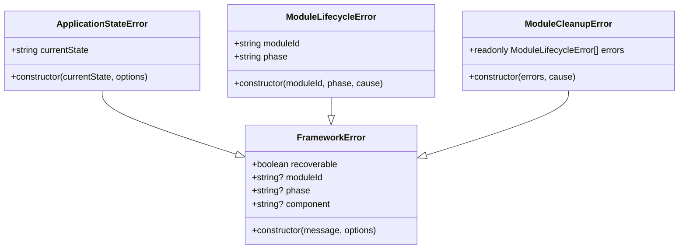
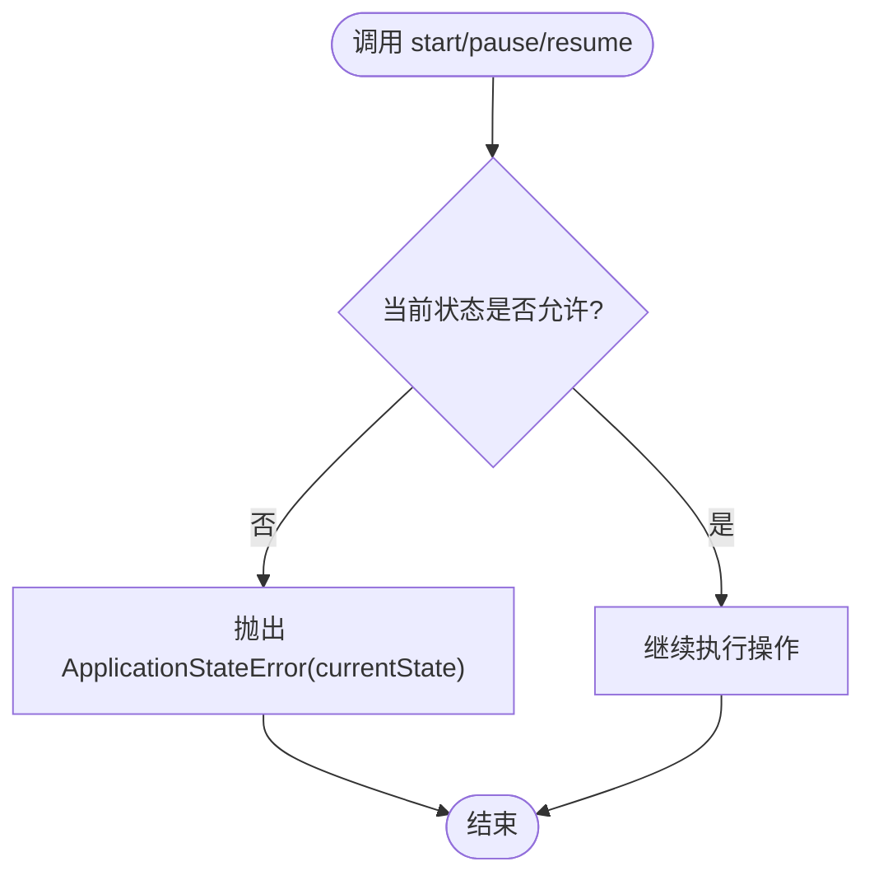
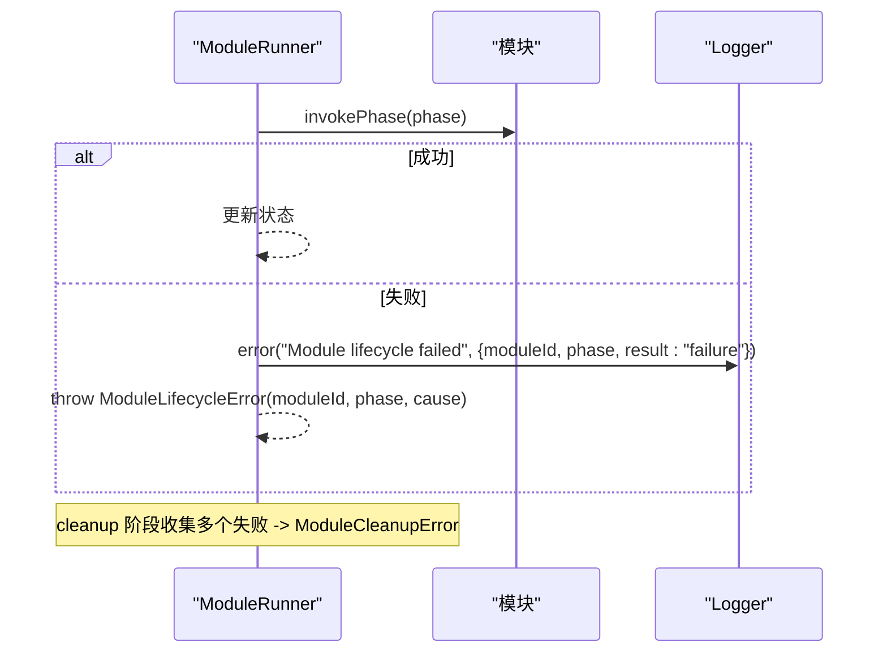
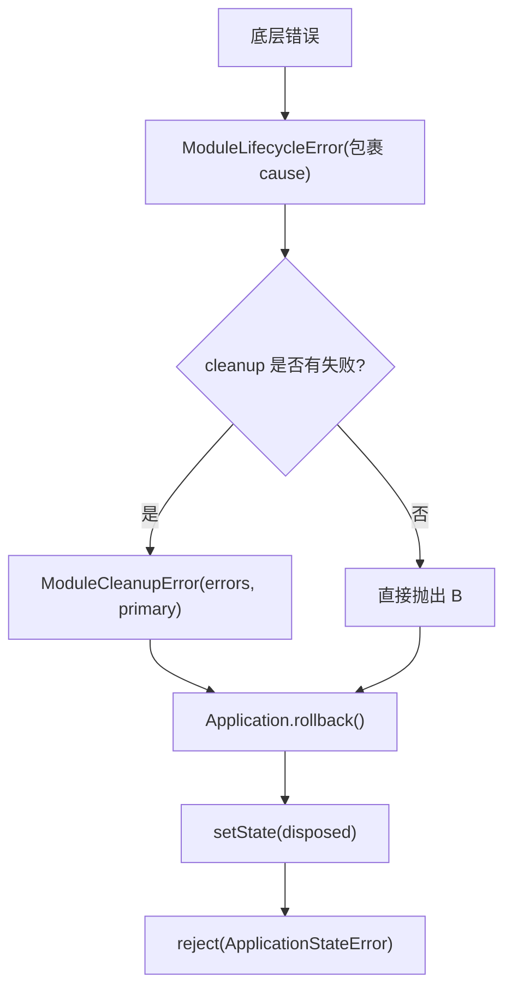
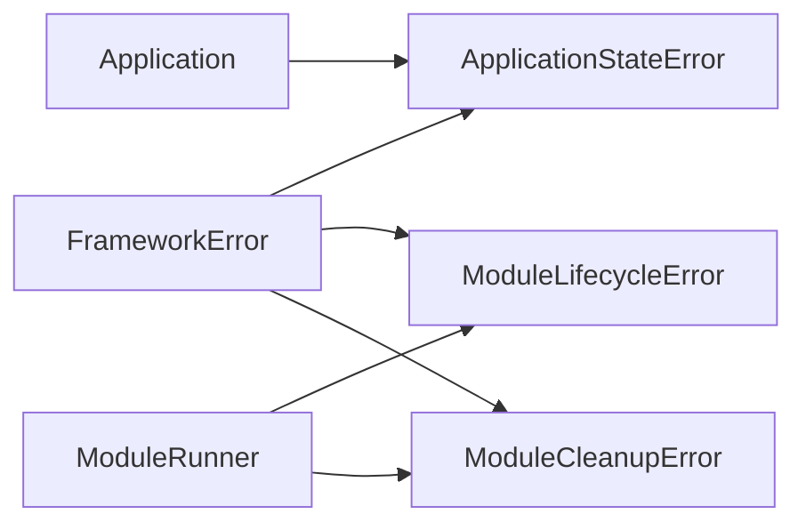

# 错误处理

<cite>
**本文引用的文件**   
- [FrameworkError.ts](file://assets/framework/core/errors/FrameworkError.ts)
- [ApplicationStateError.ts](file://assets/framework/application/ApplicationStateError.ts)
- [ModuleLifecycleError.ts](file://assets/framework/application/ModuleLifecycleError.ts)
- [ModuleRunner.ts](file://assets/framework/application/ModuleRunner.ts)
- [Application.ts](file://assets/framework/application/Application.ts)
- [framework-error.test.ts](file://tests/framework/foundation/framework-error.test.ts)
- [module-lifecycle-error.test.ts](file://tests/framework/foundation/module-lifecycle-error.test.ts)
- [ADR-007-typed-errors-and-scoped-events.md](file://doc/decisions/ADR-007-typed-errors-and-scoped-events.md)
</cite>

## 目录
1. [简介](#简介)
2. [项目结构](#项目结构)
3. [核心组件](#核心组件)
4. [架构总览](#架构总览)
5. [详细组件分析](#详细组件分析)
6. [依赖关系分析](#依赖关系分析)
7. [性能与可观测性](#性能与可观测性)
8. [故障排除指南](#故障排除指南)
9. [结论](#结论)
10. [附录：最佳实践与示例](#附录最佳实践与示例)

## 简介
本文件系统化阐述框架的错误处理体系，围绕 FrameworkError 基类及其专用子类（ApplicationStateError、ModuleLifecycleError）的设计与使用展开。内容涵盖错误分类体系、消息格式化、错误传播机制、恢复策略、日志记录与用户提示，以及调试定位技巧。文档既适合初学者理解基本概念，也为高级用户提供实现细节与扩展建议。

## 项目结构
错误处理相关代码主要分布在以下位置：
- core/errors：统一错误基类与工具函数
- application：应用状态与模块生命周期相关的错误类型及运行器
- tests：覆盖错误行为与语义的测试用例
- doc/decisions：错误体系的架构决策说明

**图表来源** 
- [FrameworkError.ts:1-36](file://assets/framework/core/errors/FrameworkError.ts#L1-L36)
- [ApplicationStateError.ts:1-15](file://assets/framework/application/ApplicationStateError.ts#L1-L15)
- [ModuleLifecycleError.ts:1-22](file://assets/framework/application/ModuleLifecycleError.ts#L1-L22)
- [ModuleRunner.ts:1-242](file://assets/framework/application/ModuleRunner.ts#L1-L242)
- [Application.ts:1-168](file://assets/framework/application/Application.ts#L1-L168)

**章节来源**
- [FrameworkError.ts:1-36](file://assets/framework/core/errors/FrameworkError.ts#L1-L36)
- [ApplicationStateError.ts:1-15](file://assets/framework/application/ApplicationStateError.ts#L1-L15)
- [ModuleLifecycleError.ts:1-22](file://assets/framework/application/ModuleLifecycleError.ts#L1-L22)
- [ModuleRunner.ts:1-242](file://assets/framework/application/ModuleRunner.ts#L1-L242)
- [Application.ts:1-168](file://assets/framework/application/Application.ts#L1-L168)

## 核心组件
- FrameworkError：统一错误基类，承载 cause、moduleId/phase/component 上下文与 recoverable 标记；提供 isRecoverableError 工具函数用于可恢复性判断。
- ApplicationStateError：应用状态不合法时抛出，携带当前状态信息，便于上层根据状态进行提示或回退。
- ModuleLifecycleError：模块生命周期阶段执行失败时抛出，携带 moduleId 与 phase，并保留原始 cause。
- ModuleCleanupError：模块清理阶段出现多个失败时的聚合错误，包含 errors 列表与 primary cause。

关键设计要点：
- 使用原生 Error.cause 语义，避免将 cause 暴露为可枚举属性，保证堆栈与序列化安全。
- 可恢复性通过显式标志而非类型推断，确保同一异常在不同上下文中可正确区分。
- 错误名保持子类自身 name，便于识别与过滤。

**章节来源**
- [FrameworkError.ts:1-36](file://assets/framework/core/errors/FrameworkError.ts#L1-L36)
- [ApplicationStateError.ts:1-15](file://assets/framework/application/ApplicationStateError.ts#L1-L15)
- [ModuleLifecycleError.ts:1-22](file://assets/framework/application/ModuleLifecycleError.ts#L1-L22)
- [ModuleRunner.ts:12-24](file://assets/framework/application/ModuleRunner.ts#L12-L24)

## 架构总览
错误在应用启动、模块生命周期与清理流程中按“捕获—包装—传播”路径流转，最终由调用方依据 recoverable 决定重试或终止。

**图表来源** 
- [Application.ts:28-67](file://assets/framework/application/Application.ts#L28-L67)
- [ModuleRunner.ts:47-71](file://assets/framework/application/ModuleRunner.ts#L47-L71)
- [ModuleRunner.ts:155-186](file://assets/framework/application/ModuleRunner.ts#L155-L186)

**章节来源**
- [Application.ts:28-67](file://assets/framework/application/Application.ts#L28-L67)
- [ModuleRunner.ts:47-71](file://assets/framework/application/ModuleRunner.ts#L47-L71)
- [ModuleRunner.ts:155-186](file://assets/framework/application/ModuleRunner.ts#L155-L186)

## 详细组件分析

### FrameworkError 基类
- 功能：统一错误模型，支持 cause、moduleId/phase/component 上下文、recoverable 标记。
- 复杂度：构造 O(1)，属性访问 O(1)。
- 依赖链：被 ApplicationStateError、ModuleLifecycleError、ModuleCleanupError 继承。
- 优化点：避免不必要的对象创建；在高层统一记录日志与敏感字段脱敏。
- 错误处理：isRecoverableError 提供稳定判定入口，避免 instanceof 链脆弱性。

**图表来源** 
- [FrameworkError.ts:16-31](file://assets/framework/core/errors/FrameworkError.ts#L16-L31)
- [ApplicationStateError.ts:5-14](file://assets/framework/application/ApplicationStateError.ts#L5-L14)
- [ModuleLifecycleError.ts:4-21](file://assets/framework/application/ModuleLifecycleError.ts#L4-L21)
- [ModuleRunner.ts:12-24](file://assets/framework/application/ModuleRunner.ts#L12-L24)

**章节来源**
- [FrameworkError.ts:1-36](file://assets/framework/core/errors/FrameworkError.ts#L1-L36)

### ApplicationStateError 使用场景
- 触发时机：在非预期应用状态下执行操作（如非 created 状态调用 start、非 running 状态调用 pause/resume）。
- 携带信息：currentState，便于上层根据状态给出明确提示或引导。
- 传播方式：作为 Promise.reject 返回，调用方可捕获并展示友好提示。

**图表来源** 
- [Application.ts:28-36](file://assets/framework/application/Application.ts#L28-L36)
- [Application.ts:69-97](file://assets/framework/application/Application.ts#L69-L97)

**章节来源**
- [Application.ts:28-36](file://assets/framework/application/Application.ts#L28-L36)
- [Application.ts:69-97](file://assets/framework/application/Application.ts#L69-L97)

### ModuleLifecycleError 与 ModuleCleanupError
- 触发时机：模块生命周期阶段（initialize/start/pause/resume/stop/dispose）执行失败。
- 携带信息：moduleId、phase、cause（原始错误），便于定位问题模块与阶段。
- 清理失败聚合：当 stop/dispose 阶段出现多个失败时，抛出 ModuleCleanupError，包含 errors 列表与 primary cause。
- 日志记录：invokePhase 失败时记录结构化日志，包含 moduleId、phase、result=failure。

**图表来源** 
- [ModuleRunner.ts:155-186](file://assets/framework/application/ModuleRunner.ts#L155-L186)
- [ModuleRunner.ts:188-211](file://assets/framework/application/ModuleRunner.ts#L188-L211)
- [ModuleRunner.ts:223-232](file://assets/framework/application/ModuleRunner.ts#L223-L232)

**章节来源**
- [ModuleRunner.ts:155-186](file://assets/framework/application/ModuleRunner.ts#L155-L186)
- [ModuleRunner.ts:188-211](file://assets/framework/application/ModuleRunner.ts#L188-L211)
- [ModuleRunner.ts:223-232](file://assets/framework/application/ModuleRunner.ts#L223-L232)

### 错误传播与恢复策略
- 传播路径：底层错误 → ModuleLifecycleError → ModuleCleanupError（如有）→ Application 状态回滚 → 调用方捕获。
- 恢复策略：基于 isRecoverableError 判断是否可重试；不可恢复错误直接向上抛出，避免污染状态。
- 状态一致性：Application.start 失败后执行 rollback（stop/dispose），确保进入 disposed 状态。

**图表来源** 
- [ModuleRunner.ts:223-232](file://assets/framework/application/ModuleRunner.ts#L223-L232)
- [Application.ts:49-54](file://assets/framework/application/Application.ts#L49-L54)

**章节来源**
- [ModuleRunner.ts:223-232](file://assets/framework/application/ModuleRunner.ts#L223-L232)
- [Application.ts:49-54](file://assets/framework/application/Application.ts#L49-L54)

## 依赖关系分析
- 耦合度：Application 与 ModuleRunner 强耦合于错误类型，但通过统一基类降低具体类型的侵入性。
- 内聚性：错误类型职责单一，仅负责携带上下文与分类信息。
- 外部依赖：Logger 用于诊断输出；isRecoverableError 提供稳定的可恢复性判定。

**图表来源** 
- [FrameworkError.ts:1-36](file://assets/framework/core/errors/FrameworkError.ts#L1-L36)
- [ApplicationStateError.ts:1-15](file://assets/framework/application/ApplicationStateError.ts#L1-L15)
- [ModuleLifecycleError.ts:1-22](file://assets/framework/application/ModuleLifecycleError.ts#L1-L22)
- [ModuleRunner.ts:1-242](file://assets/framework/application/ModuleRunner.ts#L1-L242)
- [Application.ts:1-168](file://assets/framework/application/Application.ts#L1-L168)

**章节来源**
- [FrameworkError.ts:1-36](file://assets/framework/core/errors/FrameworkError.ts#L1-L36)
- [ModuleRunner.ts:1-242](file://assets/framework/application/ModuleRunner.ts#L1-L242)
- [Application.ts:1-168](file://assets/framework/application/Application.ts#L1-L168)

## 性能与可观测性
- 性能：错误构造与传播为 O(1)，不影响正常路径性能；仅在失败分支产生额外开销。
- 可观测性：invokePhase 失败时记录结构化日志，包含 moduleId、phase、result；cleanup 失败集中报告。
- 安全性：cause 非枚举，避免意外序列化泄露；敏感字段过滤在日志写入点收敛。

[本节为通用指导，无需特定文件引用]

## 故障排除指南
- 快速定位：查看 ModuleLifecycleError 的 moduleId 与 phase，结合日志中的 result 字段确认失败阶段。
- 原因追溯：检查 cause 链，从最外层错误逐步下探至根因。
- 可恢复性：使用 isRecoverableError 判断是否可重试；不可恢复错误需修复业务逻辑或资源。
- 状态回滚：Application.start 失败后应处于 disposed 状态，若未回滚，检查 rollback 逻辑与清理错误。

**章节来源**
- [ModuleRunner.ts:155-186](file://assets/framework/application/ModuleRunner.ts#L155-L186)
- [Application.ts:134-143](file://assets/framework/application/Application.ts#L134-L143)

## 结论
该错误处理体系以统一的 FrameworkError 基类为核心，结合显式可恢复性分类与结构化上下文，实现了清晰、可追踪、可扩展的错误处理机制。ApplicationStateError 与 ModuleLifecycleError 分别覆盖应用状态与模块生命周期的典型失败场景，配合 ModuleCleanupError 的聚合能力，确保复杂清理过程的可观测性与可靠性。通过 isRecoverableError 与日志记录，上层可制定合理的恢复策略与用户提示。

[本节为总结，无需特定文件引用]

## 附录：最佳实践与示例

### 错误分类体系
- 可恢复性：通过 FrameworkError.recoverable 与 isRecoverableError 显式声明，避免类型推断歧义。
- 上下文：优先携带 moduleId、phase、component，便于定位与归因。
- 名称：子类保持独立 name，便于识别与过滤。

**章节来源**
- [FrameworkError.ts:16-31](file://assets/framework/core/errors/FrameworkError.ts#L16-L31)
- [ADR-007-typed-errors-and-scoped-events.md:17-23](file://doc/decisions/ADR-007-typed-errors-and-scoped-events.md#L17-L23)

### 错误消息格式化
- 人类可读：message 简洁明了，指向问题本质。
- 机器可读：通过字段（moduleId、phase、component、currentState）提供结构化信息。
- 日志安全：避免在 message 中泄露敏感数据，敏感字段在日志写入点过滤。

**章节来源**
- [ApplicationStateError.ts:8-13](file://assets/framework/application/ApplicationStateError.ts#L8-L13)
- [ModuleLifecycleError.ts:8-21](file://assets/framework/application/ModuleLifecycleError.ts#L8-L21)

### 错误传播机制
- 捕获与包装：在边界处捕获原始错误，包装为领域错误（如 ModuleLifecycleError）。
- 聚合与上报：清理阶段收集多个失败，聚合为 ModuleCleanupError 并上报。
- 状态一致性：失败后执行回滚，确保应用状态一致。

**章节来源**
- [ModuleRunner.ts:155-186](file://assets/framework/application/ModuleRunner.ts#L155-L186)
- [ModuleRunner.ts:223-232](file://assets/framework/application/ModuleRunner.ts#L223-L232)
- [Application.ts:49-54](file://assets/framework/application/Application.ts#L49-L54)

### 使用示例（路径指引）
- 抛出与应用状态错误：参见 Application 中对 start/pause/resume 的状态校验与拒绝路径。
- 模块生命周期失败：参见 ModuleRunner.invokePhase 的失败包装与日志记录。
- 清理失败聚合：参见 ModuleRunner.cleanup 与 throwLifecycleFailure 的实现。
- 可恢复性判断：参见 isRecoverableError 的使用与测试用例。

**章节来源**
- [Application.ts:28-36](file://assets/framework/application/Application.ts#L28-L36)
- [ModuleRunner.ts:155-186](file://assets/framework/application/ModuleRunner.ts#L155-L186)
- [ModuleRunner.ts:223-232](file://assets/framework/application/ModuleRunner.ts#L223-L232)
- [framework-error.test.ts:60-81](file://tests/framework/foundation/framework-error.test.ts#L60-L81)

### 自定义错误类型
- 继承 FrameworkError：为新领域错误提供统一上下文与可恢复性标记。
- 保持兼容：遵循现有构造签名与字段约定，确保迁移平滑。
- 命名规范：设置独立的 name，便于识别与过滤。

**章节来源**
- [FrameworkError.ts:16-31](file://assets/framework/core/errors/FrameworkError.ts#L16-L31)
- [ADR-007-typed-errors-and-scoped-events.md:17-23](file://doc/decisions/ADR-007-typed-errors-and-scoped-events.md#L17-L23)

### 调试与故障排除技巧
- 堆栈分析：利用 cause 链逐层下探，定位根因。
- 日志关联：通过 moduleId、phase、component 关联日志与错误。
- 状态验证：检查 Application 状态机转换是否符合预期，必要时添加断言。

**章节来源**
- [module-lifecycle-error.test.ts:8-23](file://tests/framework/foundation/module-lifecycle-error.test.ts#L8-L23)
- [framework-error.test.ts:13-41](file://tests/framework/foundation/framework-error.test.ts#L13-L41)