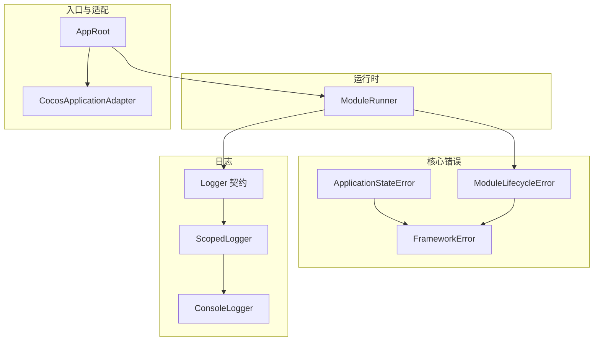
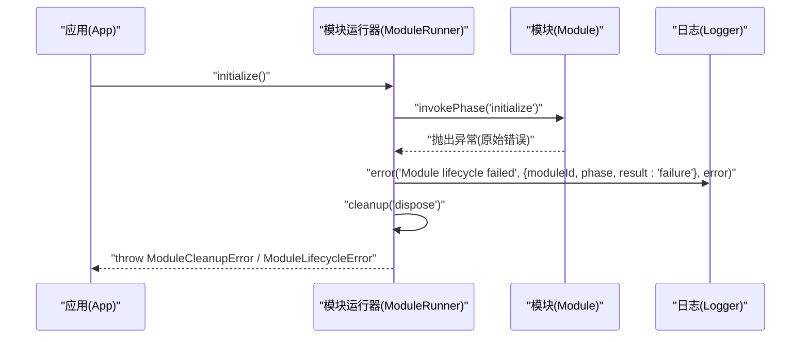
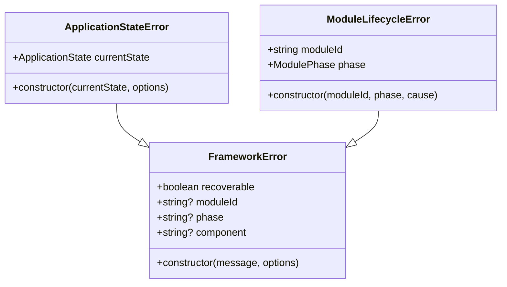
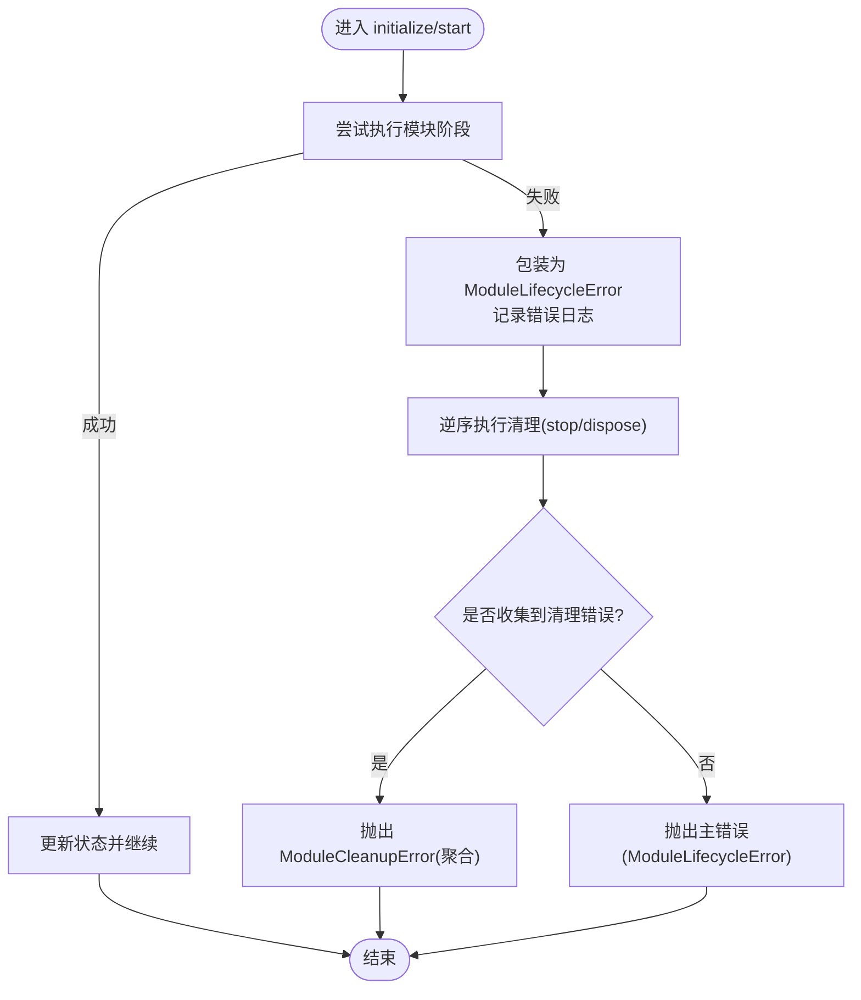
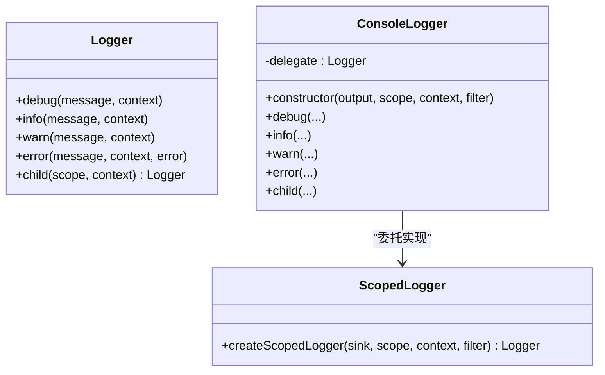
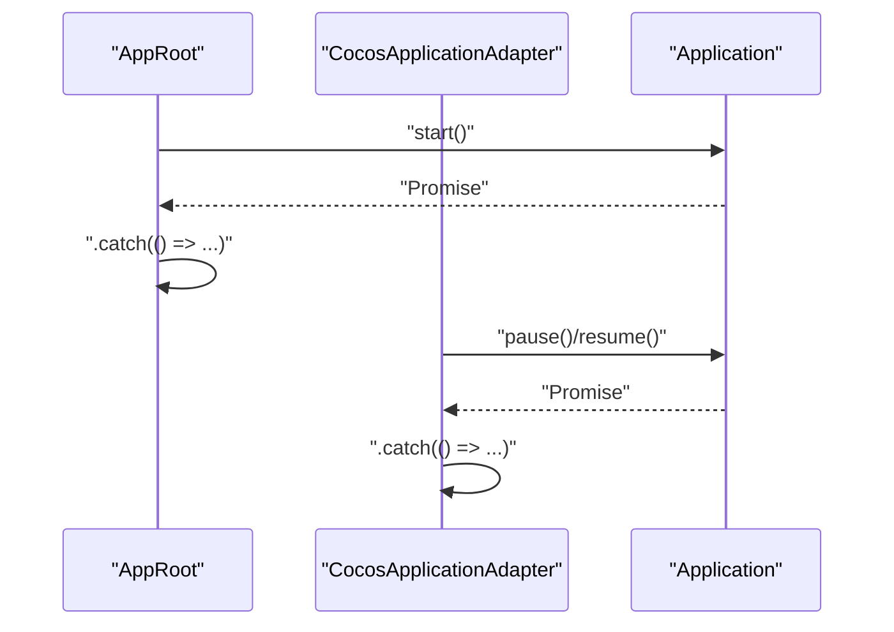
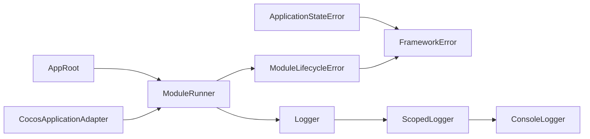

# 错误处理策略

<cite>
**本文引用的文件**   
- [FrameworkError.ts](file://assets/framework/core/errors/FrameworkError.ts)
- [ApplicationStateError.ts](file://assets/framework/application/ApplicationStateError.ts)
- [ModuleLifecycleError.ts](file://assets/framework/application/ModuleLifecycleError.ts)
- [ModuleRunner.ts](file://assets/framework/application/ModuleRunner.ts)
- [Logger.ts](file://assets/framework/contracts/logging/Logger.ts)
- [ConsoleLogger.ts](file://assets/framework/diagnostics/logging/ConsoleLogger.ts)
- [ScopedLogger.ts](file://assets/framework/diagnostics/logging/ScopedLogger.ts)
- [AppRoot.ts](file://assets/boot/AppRoot.ts)
- [CocosApplicationAdapter.ts](file://assets/framework/adapters/cocos/application/CocosApplicationAdapter.ts)
- [framework-error.test.ts](file://tests/framework/foundation/framework-error.test.ts)
- [module-lifecycle-error.test.ts](file://tests/framework/foundation/module-lifecycle-error.test.ts)
</cite>

## 目录
1. [引言](#引言)
2. [项目结构](#项目结构)
3. [核心组件](#核心组件)
4. [架构总览](#架构总览)
5. [详细组件分析](#详细组件分析)
6. [依赖关系分析](#依赖关系分析)
7. [性能考量](#性能考量)
8. [故障排查指南](#故障排查指南)
9. [结论](#结论)
10. [附录](#附录)

## 引言
本文件系统化阐述框架的错误处理策略，覆盖错误分类体系、传播机制与恢复策略，明确可恢复与不可恢复错误的边界，设计层次化的错误边界，并提供统一的捕获与处理流程、日志与监控集成、最佳实践以及调试与排障指导。内容兼顾初学者入门与高级用户的架构优化需求。

## 项目结构
错误处理相关代码主要分布在以下位置：
- 核心错误类型与分类：core/errors
- 应用状态与模块生命周期错误：application
- 运行时编排与清理：application（模块运行器）
- 日志契约与实现：contracts/logging、diagnostics/logging
- 顶层入口与平台适配器中的兜底捕获：boot、adapters

图表来源 
- [FrameworkError.ts:1-42](file://assets/framework/core/errors/FrameworkError.ts#L1-L42)
- [ApplicationStateError.ts:1-15](file://assets/framework/application/ApplicationStateError.ts#L1-L15)
- [ModuleLifecycleError.ts:1-22](file://assets/framework/application/ModuleLifecycleError.ts#L1-L22)
- [ModuleRunner.ts:1-242](file://assets/framework/application/ModuleRunner.ts#L1-L242)
- [Logger.ts:1-21](file://assets/framework/contracts/logging/Logger.ts#L1-L21)
- [ScopedLogger.ts:1-63](file://assets/framework/diagnostics/logging/ScopedLogger.ts#L1-L63)
- [ConsoleLogger.ts:1-56](file://assets/framework/diagnostics/logging/ConsoleLogger.ts#L1-L56)
- [AppRoot.ts:1-60](file://assets/boot/AppRoot.ts#L1-L60)
- [CocosApplicationAdapter.ts:1-60](file://assets/framework/adapters/cocos/application/CocosApplicationAdapter.ts#L1-L60)

章节来源
- [FrameworkError.ts:1-42](file://assets/framework/core/errors/FrameworkError.ts#L1-L42)
- [ModuleRunner.ts:1-242](file://assets/framework/application/ModuleRunner.ts#L1-L242)
- [Logger.ts:1-21](file://assets/framework/contracts/logging/Logger.ts#L1-L21)

## 核心组件
- FrameworkError：统一错误基类，支持 cause 链、可恢复标记 recoverable、以及 moduleId/phase/component 等上下文字段；提供 isRecoverableError 判断工具。
- ApplicationStateError：应用状态非法操作错误，携带当前状态。
- ModuleLifecycleError：模块生命周期阶段失败错误，携带 moduleId、phase 与 cause。
- ModuleRunner：模块生命周期编排器，负责调用 initialize/start/pause/resume/stop/dispose，并在失败时执行反向清理，聚合清理错误并抛出组合错误。
- Logger 契约与实现：定义日志级别、记录结构与输出接口；ConsoleLogger 基于 ScopedLogger 实现结构化日志输出，支持作用域与上下文合并、过滤与脱敏。

章节来源
- [FrameworkError.ts:1-42](file://assets/framework/core/errors/FrameworkError.ts#L1-L42)
- [ApplicationStateError.ts:1-15](file://assets/framework/application/ApplicationStateError.ts#L1-L15)
- [ModuleLifecycleError.ts:1-22](file://assets/framework/application/ModuleLifecycleError.ts#L1-L22)
- [ModuleRunner.ts:1-242](file://assets/framework/application/ModuleRunner.ts#L1-L242)
- [Logger.ts:1-21](file://assets/framework/contracts/logging/Logger.ts#L1-L21)
- [ConsoleLogger.ts:1-56](file://assets/framework/diagnostics/logging/ConsoleLogger.ts#L1-L56)
- [ScopedLogger.ts:1-63](file://assets/framework/diagnostics/logging/ScopedLogger.ts#L1-L63)

## 架构总览
错误处理贯穿“异常产生—包装—传播—清理—上报”的全链路。关键要点：
- 错误分类：通过 FrameworkError.recoverable 区分可恢复与不可恢复错误；isRecoverableError 仅检查顶层错误对象。
- 错误传播：使用原生 Error.cause 语义保持完整原因链；业务层将原始错误包装为领域错误（如 ModuleLifecycleError）。
- 错误恢复：在初始化/启动阶段失败时，按逆序执行 stop/dispose 清理，收集所有清理错误并以组合错误抛出。
- 错误边界：顶层入口（AppRoot）与平台适配器（CocosApplicationAdapter）对关键生命周期进行 catch 兜底，避免崩溃扩散。
- 日志与监控：所有生命周期失败均通过 Logger.error 输出结构化记录，包含时间戳、作用域、上下文与错误对象。

图表来源 
- [ModuleRunner.ts:47-71](file://assets/framework/application/ModuleRunner.ts#L47-L71)
- [ModuleRunner.ts:155-186](file://assets/framework/application/ModuleRunner.ts#L155-L186)
- [ModuleRunner.ts:188-211](file://assets/framework/application/ModuleRunner.ts#L188-L211)
- [ModuleRunner.ts:223-232](file://assets/framework/application/ModuleRunner.ts#L223-L232)
- [Logger.ts:14-21](file://assets/framework/contracts/logging/Logger.ts#L14-L21)

## 详细组件分析

### 错误分类与可恢复性
- FrameworkError 提供 recoverable 标志位，默认不可恢复；isRecoverableError 仅对顶层 FrameworkError 且 recoverable=true 返回 true。
- 子类（如 ApplicationStateError、ModuleLifecycleError）继承 FrameworkError，保留自身 name 与上下文字段。
- 测试覆盖了 cause 链保留、非枚举 cause、recoverable 默认值与显式设置、子类名称保留、上下文字段等。

图表来源 
- [FrameworkError.ts:16-31](file://assets/framework/core/errors/FrameworkError.ts#L16-L31)
- [ApplicationStateError.ts:5-14](file://assets/framework/application/ApplicationStateError.ts#L5-L14)
- [ModuleLifecycleError.ts:4-21](file://assets/framework/application/ModuleLifecycleError.ts#L4-L21)

章节来源
- [FrameworkError.ts:1-42](file://assets/framework/core/errors/FrameworkError.ts#L1-L42)
- [framework-error.test.ts:1-132](file://tests/framework/foundation/framework-error.test.ts#L1-L132)

### 模块生命周期错误与清理聚合
- ModuleRunner 在每个生命周期阶段调用 invokePhase，捕获异常后包装为 ModuleLifecycleError 并记录日志。
- 失败路径会执行 cleanup（逆序），收集所有清理阶段的 ModuleLifecycleError，若存在则抛出 ModuleCleanupError（组合错误），否则抛出主错误。
- 该设计确保即使清理也失败，也能将全部问题暴露给上层决策。

图表来源 
- [ModuleRunner.ts:47-71](file://assets/framework/application/ModuleRunner.ts#L47-L71)
- [ModuleRunner.ts:73-105](file://assets/framework/application/ModuleRunner.ts#L73-L105)
- [ModuleRunner.ts:155-186](file://assets/framework/application/ModuleRunner.ts#L155-L186)
- [ModuleRunner.ts:188-211](file://assets/framework/application/ModuleRunner.ts#L188-L211)
- [ModuleRunner.ts:223-232](file://assets/framework/application/ModuleRunner.ts#L223-L232)

章节来源
- [ModuleRunner.ts:1-242](file://assets/framework/application/ModuleRunner.ts#L1-L242)
- [module-lifecycle-error.test.ts:1-24](file://tests/framework/foundation/module-lifecycle-error.test.ts#L1-L24)

### 日志与监控集成
- Logger 契约定义了 debug/info/warn/error 与 child 方法，记录包含 level、message、timestamp、scope、context、error。
- ConsoleLogger 基于 createScopedLogger 实现，支持作用域拼接、上下文合并、过滤器（如 redactRecord）与输出到 console。
- 在模块生命周期失败时，ModuleRunner 通过 context.logger.error 输出结构化日志，便于集中采集与分析。

图表来源 
- [Logger.ts:1-21](file://assets/framework/contracts/logging/Logger.ts#L1-L21)
- [ConsoleLogger.ts:1-56](file://assets/framework/diagnostics/logging/ConsoleLogger.ts#L1-L56)
- [ScopedLogger.ts:1-63](file://assets/framework/diagnostics/logging/ScopedLogger.ts#L1-L63)

章节来源
- [Logger.ts:1-21](file://assets/framework/contracts/logging/Logger.ts#L1-L21)
- [ConsoleLogger.ts:1-56](file://assets/framework/diagnostics/logging/ConsoleLogger.ts#L1-L56)
- [ScopedLogger.ts:1-63](file://assets/framework/diagnostics/logging/ScopedLogger.ts#L1-L63)

### 错误边界与顶层兜底
- AppRoot 在应用 start/dispose 等关键路径上采用 .catch(() => ...) 的兜底策略，防止未捕获异常导致进程退出。
- CocosApplicationAdapter 在 pause/resume 等平台回调中同样进行 .catch 兜底，保证引擎事件循环稳定。

图表来源 
- [AppRoot.ts:43-50](file://assets/boot/AppRoot.ts#L43-L50)
- [CocosApplicationAdapter.ts:40-47](file://assets/framework/adapters/cocos/application/CocosApplicationAdapter.ts#L40-L47)

章节来源
- [AppRoot.ts:43-50](file://assets/boot/AppRoot.ts#L43-L50)
- [CocosApplicationAdapter.ts:40-47](file://assets/framework/adapters/cocos/application/CocosApplicationAdapter.ts#L40-L47)

## 依赖关系分析
- 错误类型依赖：ApplicationStateError 与 ModuleLifecycleError 均依赖 FrameworkError。
- 运行时依赖：ModuleRunner 依赖 ApplicationContext（含 logger）、Module 契约，并通过 ModuleLifecycleError 表达失败。
- 日志依赖：ConsoleLogger 依赖 ScopedLogger 与 Logger 契约。
- 入口依赖：AppRoot 与 CocosApplicationAdapter 作为外部边界，对内部 Promise 进行兜底捕获。

图表来源 
- [FrameworkError.ts:16-31](file://assets/framework/core/errors/FrameworkError.ts#L16-L31)
- [ApplicationStateError.ts:5-14](file://assets/framework/application/ApplicationStateError.ts#L5-L14)
- [ModuleLifecycleError.ts:4-21](file://assets/framework/application/ModuleLifecycleError.ts#L4-L21)
- [ModuleRunner.ts:1-242](file://assets/framework/application/ModuleRunner.ts#L1-L242)
- [Logger.ts:1-21](file://assets/framework/contracts/logging/Logger.ts#L1-L21)
- [ScopedLogger.ts:1-63](file://assets/framework/diagnostics/logging/ScopedLogger.ts#L1-L63)
- [ConsoleLogger.ts:1-56](file://assets/framework/diagnostics/logging/ConsoleLogger.ts#L1-L56)
- [AppRoot.ts:43-50](file://assets/boot/AppRoot.ts#L43-L50)
- [CocosApplicationAdapter.ts:40-47](file://assets/framework/adapters/cocos/application/CocosApplicationAdapter.ts#L40-L47)

章节来源
- [ModuleRunner.ts:1-242](file://assets/framework/application/ModuleRunner.ts#L1-L242)
- [Logger.ts:1-21](file://assets/framework/contracts/logging/Logger.ts#L1-L21)

## 性能考量
- 错误包装与 cause 链：使用原生 Error.cause 语义，避免额外序列化开销；仅在必要时展开 cause 进行分析。
- 清理聚合：逆序清理可能多次异步 I/O，需控制并发度与超时，避免长尾阻塞影响整体回收。
- 日志输出：Structured logging 应配合采样与过滤（如 redactRecord），在高吞吐场景下降低 IO 压力。
- 错误分类判断：isRecoverableError 仅检查顶层对象，避免遍历 cause 链带来的性能损耗。

[本节为通用建议，不直接分析具体文件]

## 故障排查指南
- 错误堆栈分析
  - 优先查看 ModuleLifecycleError 的 moduleId 与 phase，快速定位失败模块与阶段。
  - 通过 Error.cause 链追溯根因，注意 isRecoverableError 仅对顶层生效，如需判断嵌套可恢复性需自行解包。
- 日志与监控
  - 使用 Logger.error 输出的结构化记录（level、scope、context、error）进行集中采集与告警。
  - 结合 ScopedLogger 的作用域与上下文，区分不同子系统与请求维度。
- 性能影响评估
  - 关注清理阶段的耗时与失败率，必要时增加超时与重试上限。
  - 在高负载下开启日志采样，避免日志风暴。
- 内存泄漏检测
  - 确保 dispose 阶段释放资源；若清理失败，ModuleCleanupError 会聚合所有错误，便于定位未释放的资源。
- 常见模式
  - 在入口与平台适配器中使用 .catch 兜底，避免未捕获异常导致进程退出。
  - 对可恢复错误（recoverable=true）实现重试或降级逻辑；不可恢复错误应尽快失败并通知运维。

章节来源
- [ModuleRunner.ts:155-186](file://assets/framework/application/ModuleRunner.ts#L155-L186)
- [ModuleRunner.ts:188-211](file://assets/framework/application/ModuleRunner.ts#L188-L211)
- [ModuleRunner.ts:223-232](file://assets/framework/application/ModuleRunner.ts#L223-L232)
- [Logger.ts:1-21](file://assets/framework/contracts/logging/Logger.ts#L1-L21)
- [AppRoot.ts:43-50](file://assets/boot/AppRoot.ts#L43-L50)
- [CocosApplicationAdapter.ts:40-47](file://assets/framework/adapters/cocos/application/CocosApplicationAdapter.ts#L40-L47)

## 结论
本框架通过统一的错误基类、清晰的分类与传播机制、严格的清理聚合与顶层兜底，构建了稳健的错误处理体系。结合结构化日志与监控，可实现从开发到生产的全链路可观测性与可恢复性。遵循本文的最佳实践与排障指南，可在保障系统稳定性的同时提升问题定位效率。

## 附录
- 最佳实践清单
  - 使用 FrameworkError 及其子类表达领域错误，避免裸抛 Error。
  - 对可恢复错误设置 recoverable=true，并在上层实现重试/降级。
  - 在生命周期失败时始终执行清理，并聚合所有清理错误。
  - 通过 Logger.error 输出结构化记录，包含必要上下文与错误对象。
  - 在入口与平台回调中进行 .catch 兜底，防止未捕获异常扩散。
  - 对 cause 链进行有界展开分析，避免无限递归与性能问题。
  - 在高吞吐场景启用日志采样与敏感信息脱敏。
- 示例参考（以源码路径代替代码片段）
  - 统一错误捕获与处理：参见 [ModuleRunner.ts:155-186](file://assets/framework/application/ModuleRunner.ts#L155-L186)
  - 错误恢复流程（清理聚合）：参见 [ModuleRunner.ts:188-211](file://assets/framework/application/ModuleRunner.ts#L188-L211)
  - 日志记录与监控集成：参见 [ConsoleLogger.ts:1-56](file://assets/framework/diagnostics/logging/ConsoleLogger.ts#L1-L56)、[ScopedLogger.ts:1-63](file://assets/framework/diagnostics/logging/ScopedLogger.ts#L1-L63)
  - 顶层错误边界：参见 [AppRoot.ts:43-50](file://assets/boot/AppRoot.ts#L43-L50)、[CocosApplicationAdapter.ts:40-47](file://assets/framework/adapters/cocos/application/CocosApplicationAdapter.ts#L40-L47)