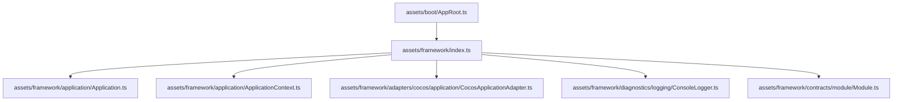
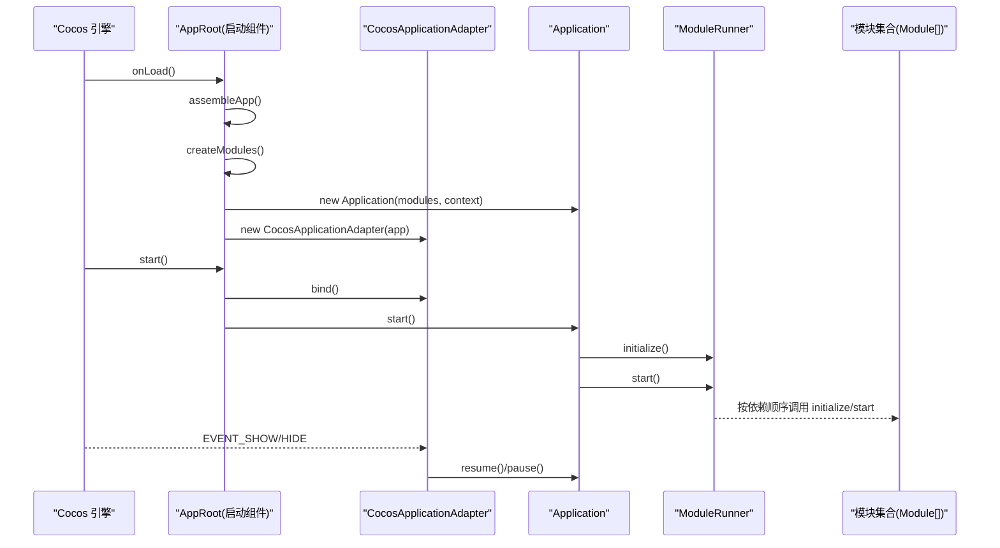
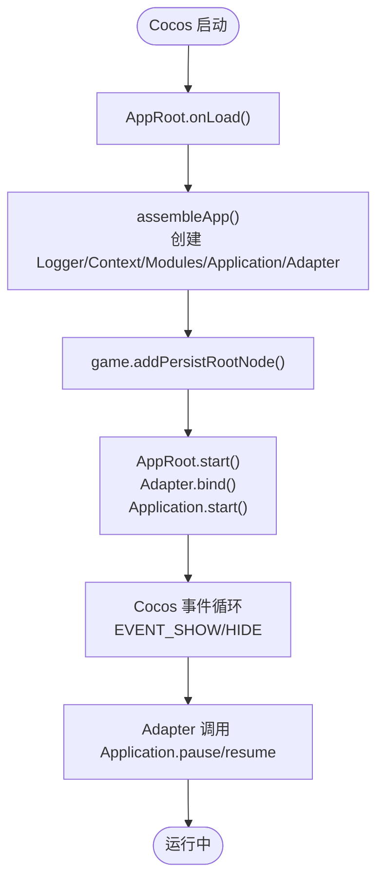
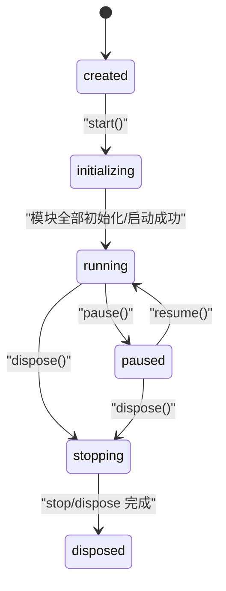
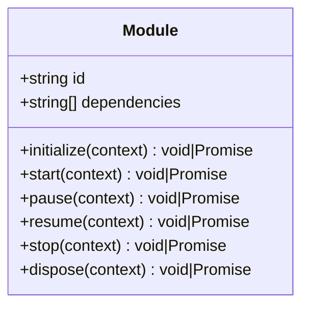
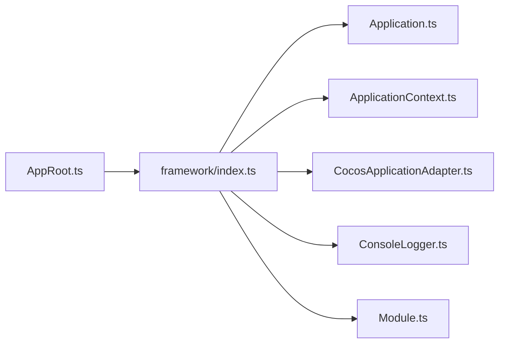

# 快速开始

<cite>
**本文引用的文件**   
- [package.json](file://package.json)
- [tsconfig.json](file://tsconfig.json)
- [AppRoot.ts](file://assets/boot/AppRoot.ts)
- [index.ts](file://assets/framework/index.ts)
- [Application.ts](file://assets/framework/application/Application.ts)
- [ApplicationContext.ts](file://assets/framework/application/ApplicationContext.ts)
- [CocosApplicationAdapter.ts](file://assets/framework/adapters/cocos/application/CocosApplicationAdapter.ts)
- [ConsoleLogger.ts](file://assets/framework/diagnostics/logging/ConsoleLogger.ts)
- [Module.ts](file://assets/framework/contracts/module/Module.ts)
- [baseline.test.ts](file://tests/framework/foundation/baseline.test.ts)
- [module-runner.test.ts](file://tests/framework/foundation/module-runner.test.ts)
</cite>

## 目录
1. [简介](#简介)
2. [项目结构](#项目结构)
3. [核心组件](#核心组件)
4. [架构总览](#架构总览)
5. [详细组件分析](#详细组件分析)
6. [依赖关系分析](#依赖关系分析)
7. [性能注意事项](#性能注意事项)
8. [故障排除指南](#故障排除指南)
9. [结论](#结论)
10. [附录：学习路径与示例](#附录学习路径与示例)

## 简介
本快速开始指南面向首次接触 AI Game Kit 的开发者，目标是帮助你在最短时间内完成环境搭建、项目初始化、依赖配置，并运行第一个可交互的应用实例。你将了解 Cocos Creator 版本要求、如何创建模块与应用实例、框架的核心用法，以及常见问题排查方法。

## 项目结构
AI Game Kit 基于 Cocos Creator 3.x（当前为 3.8.8），采用“应用 + 模块”的架构：
- assets/boot：启动入口，负责装配 Application、适配器与日志器，并在 Cocos 生命周期中启动/销毁应用。
- assets/framework：框架核心，包含应用上下文、模块契约、调度与事件、诊断日志等。
- tests：使用 Bun 运行的单元测试，覆盖基础能力与模块生命周期。

图表来源 
- [AppRoot.ts:1-55](file://assets/boot/AppRoot.ts#L1-L55)
- [index.ts:1-44](file://assets/framework/index.ts#L1-L44)
- [Application.ts:1-168](file://assets/framework/application/Application.ts#L1-L168)
- [ApplicationContext.ts:1-14](file://assets/framework/application/ApplicationContext.ts#L1-L14)
- [CocosApplicationAdapter.ts:1-53](file://assets/framework/adapters/cocos/application/CocosApplicationAdapter.ts#L1-L53)
- [ConsoleLogger.ts:1-56](file://assets/framework/diagnostics/logging/ConsoleLogger.ts#L1-L56)
- [Module.ts:1-30](file://assets/framework/contracts/module/Module.ts#L1-L30)

章节来源
- [package.json:1-12](file://package.json#L1-L12)
- [tsconfig.json:1-10](file://tsconfig.json#L1-L10)

## 核心组件
- Application：应用主控制器，管理模块图、生命周期（创建→初始化→运行→暂停/恢复→停止→销毁）与错误回滚。
- Module：模块契约，定义 id、dependencies 及生命周期钩子（initialize/start/pause/resume/stop/dispose）。
- ApplicationContext：应用上下文，注入 Logger 等运行时能力。
- CocosApplicationAdapter：将 Cocos 引擎的生命周期事件（显示/隐藏）映射到应用的 pause/resume。
- ConsoleLogger：控制台日志实现，支持作用域与过滤。

章节来源
- [Application.ts:1-168](file://assets/framework/application/Application.ts#L1-L168)
- [Module.ts:1-30](file://assets/framework/contracts/module/Module.ts#L1-L30)
- [ApplicationContext.ts:1-14](file://assets/framework/application/ApplicationContext.ts#L1-L14)
- [CocosApplicationAdapter.ts:1-53](file://assets/framework/adapters/cocos/application/CocosApplicationAdapter.ts#L1-L53)
- [ConsoleLogger.ts:1-56](file://assets/framework/diagnostics/logging/ConsoleLogger.ts#L1-L56)

## 架构总览
下图展示了从 Cocos 启动到应用运行、再到模块调度的关键流程。

图表来源 
- [AppRoot.ts:1-55](file://assets/boot/AppRoot.ts#L1-L55)
- [Application.ts:1-168](file://assets/framework/application/Application.ts#L1-L168)
- [CocosApplicationAdapter.ts:1-53](file://assets/framework/adapters/cocos/application/CocosApplicationAdapter.ts#L1-L53)
- [module-runner.test.ts:68-171](file://tests/framework/foundation/module-runner.test.ts#L68-L171)

## 详细组件分析

### 启动装配与 Cocos 集成
- AppRoot 在 onLoad 中装配 Application、Adapter 与 Logger，并将节点设为持久根；在 start 中绑定 Adapter 并启动 Application；在 onDestroy 中解绑并销毁 Application。
- CocosApplicationAdapter 监听 Cocos 的显示/隐藏事件，调用 Application 的 resume/pause。

图表来源 
- [AppRoot.ts:1-55](file://assets/boot/AppRoot.ts#L1-L55)
- [CocosApplicationAdapter.ts:1-53](file://assets/framework/adapters/cocos/application/CocosApplicationAdapter.ts#L1-L53)

章节来源
- [AppRoot.ts:1-55](file://assets/boot/AppRoot.ts#L1-L55)
- [CocosApplicationAdapter.ts:1-53](file://assets/framework/adapters/cocos/application/CocosApplicationAdapter.ts#L1-L53)

### Application 生命周期与状态机
- 状态流转：created → initializing → running → paused → running → stopping → disposed。
- 关键行为：
  - start：构建模块图、初始化并启动模块；失败时执行回滚并进入 disposed。
  - pause/resume：仅在允许状态下切换，否则抛出状态错误。
  - dispose：按逆序 stop/dispose 模块，收集清理错误并通过 logger 上报。

图表来源 
- [Application.ts:1-168](file://assets/framework/application/Application.ts#L1-L168)

章节来源
- [Application.ts:1-168](file://assets/framework/application/Application.ts#L1-L168)

### 模块契约与运行顺序
- Module 接口要求提供 id、dependencies 与可选的生命周期钩子。
- ModuleRunner 保证：
  - initialize/start 按依赖拓扑顺序执行。
  - stop/dispose 按反向依赖顺序执行。
  - 重复调用已完成的阶段不会重复执行。

图表来源 
- [Module.ts:1-30](file://assets/framework/contracts/module/Module.ts#L1-L30)

章节来源
- [module-runner.test.ts:68-171](file://tests/framework/foundation/module-runner.test.ts#L68-L171)
- [Module.ts:1-30](file://assets/framework/contracts/module/Module.ts#L1-L30)

### 应用上下文与日志
- ApplicationContext 提供 logger 与只读状态。
- ConsoleLogger 通过 ScopedLogger 输出结构化日志，支持 child 作用域与记录过滤。

章节来源
- [ApplicationContext.ts:1-14](file://assets/framework/application/ApplicationContext.ts#L1-L14)
- [ConsoleLogger.ts:1-56](file://assets/framework/diagnostics/logging/ConsoleLogger.ts#L1-L56)

## 依赖关系分析
- 入口层：AppRoot 依赖 framework 导出类型与类，组装 Application 与 CocosApplicationAdapter。
- 框架层：Application 依赖 ModuleGraph/ModuleRunner、ApplicationContext、Module 契约。
- 适配层：CocosApplicationAdapter 依赖 Cocos 引擎事件。
- 诊断层：ConsoleLogger 作为默认日志实现。

图表来源 
- [AppRoot.ts:1-55](file://assets/boot/AppRoot.ts#L1-L55)
- [index.ts:1-44](file://assets/framework/index.ts#L1-L44)
- [Application.ts:1-168](file://assets/framework/application/Application.ts#L1-L168)
- [ApplicationContext.ts:1-14](file://assets/framework/application/ApplicationContext.ts#L1-L14)
- [CocosApplicationAdapter.ts:1-53](file://assets/framework/adapters/cocos/application/CocosApplicationAdapter.ts#L1-L53)
- [ConsoleLogger.ts:1-56](file://assets/framework/diagnostics/logging/ConsoleLogger.ts#L1-L56)
- [Module.ts:1-30](file://assets/framework/contracts/module/Module.ts#L1-L30)

章节来源
- [index.ts:1-44](file://assets/framework/index.ts#L1-L44)

## 性能注意事项
- 模块初始化与启动应尽量避免阻塞操作，必要时使用异步或调度器。
- 日志输出在高频率场景下建议按需过滤或使用更高效的输出目标。
- 避免在频繁回调中创建大量对象，优先复用资源。

## 故障排除指南
- 无法启动或状态异常
  - 检查 Application 的状态是否处于允许的操作区间（如非 running 调用 pause/resume 会抛错）。
  - 查看日志输出，确认模块初始化/启动是否报错。
- 模块未执行或顺序不对
  - 确认每个 Module 的 id 唯一且 dependencies 正确指向其他模块 id。
  - 参考测试用例中的依赖顺序断言进行对照。
- 平台事件不生效
  - 确保在 Cocos 生命周期中调用了 Adapter.bind()，并在退出时 unbind()。
- 测试无法运行
  - 确认运行环境为 Bun，并使用提供的脚本命令执行测试。

章节来源
- [Application.ts:1-168](file://assets/framework/application/Application.ts#L1-L168)
- [module-runner.test.ts:68-171](file://tests/framework/foundation/module-runner.test.ts#L68-L171)
- [baseline.test.ts:1-8](file://tests/framework/foundation/baseline.test.ts#L1-L8)

## 结论
通过 AppRoot 装配 Application 与 Cocos 适配器，结合 Module 契约与统一的日志/上下文，AI Game Kit 提供了清晰、可扩展的游戏应用骨架。按照本指南的步骤，你可以在几分钟内跑通首个示例，并在此基础上扩展自己的业务模块。

## 附录：学习路径与示例

### 环境准备
- 安装 Cocos Creator 3.8.8（项目声明的版本）。
- 安装 Node.js 与包管理器（推荐使用 Bun）。
- 打开项目工程，确保 tsconfig 继承 Cocos 模板配置。

章节来源
- [package.json:1-12](file://package.json#L1-L12)
- [tsconfig.json:1-10](file://tsconfig.json#L1-L10)

### 运行第一个示例
- 在 Cocos Creator 编辑器中打开项目。
- 确保启动场景为 assets/boot/startup.scene（若需自定义，请保持 AppRoot 组件挂载在场景根节点）。
- 点击预览/发布，观察控制台日志输出。

预期输出
- 控制台出现由 ConsoleLogger 输出的结构化日志。
- 应用进入 running 状态，无报错信息。

章节来源
- [AppRoot.ts:1-55](file://assets/boot/AppRoot.ts#L1-L55)
- [ConsoleLogger.ts:1-56](file://assets/framework/diagnostics/logging/ConsoleLogger.ts#L1-L56)

### 创建你的第一个模块
- 在 assets/game 或合适目录下新建一个 TypeScript 文件，实现 Module 接口：
  - 提供唯一的 id。
  - 声明 dependencies（可为空数组）。
  - 实现需要的生命周期钩子（如 initialize/start）。
- 在 assets/boot/AppRoot.ts 的 createModules 函数中返回该模块实例。
- 重新运行项目，观察模块生命周期被按依赖顺序调用。

章节来源
- [Module.ts:1-30](file://assets/framework/contracts/module/Module.ts#L1-L30)
- [AppRoot.ts:1-55](file://assets/boot/AppRoot.ts#L1-L55)

### 运行测试
- 使用 Bun 运行基础测试与框架测试：
  - 基础测试：bun test ./tests/framework/foundation
  - 类型契约检查：bun ./tests/scripts/check-foundation-contracts.ts

章节来源
- [package.json:1-12](file://package.json#L1-L12)
- [baseline.test.ts:1-8](file://tests/framework/foundation/baseline.test.ts#L1-L8)

### 后续学习建议
- 深入理解 Application 状态机与错误回滚机制。
- 阅读模块运行顺序与生命周期断言，掌握依赖编排最佳实践。
- 探索日志作用域与过滤策略，完善诊断能力。
- 根据业务需要扩展 Platform/TimeSource 等契约实现。