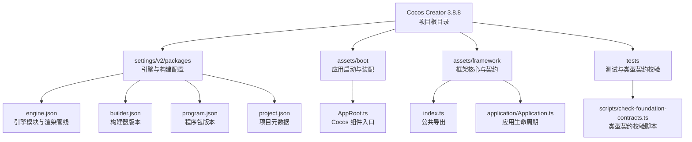
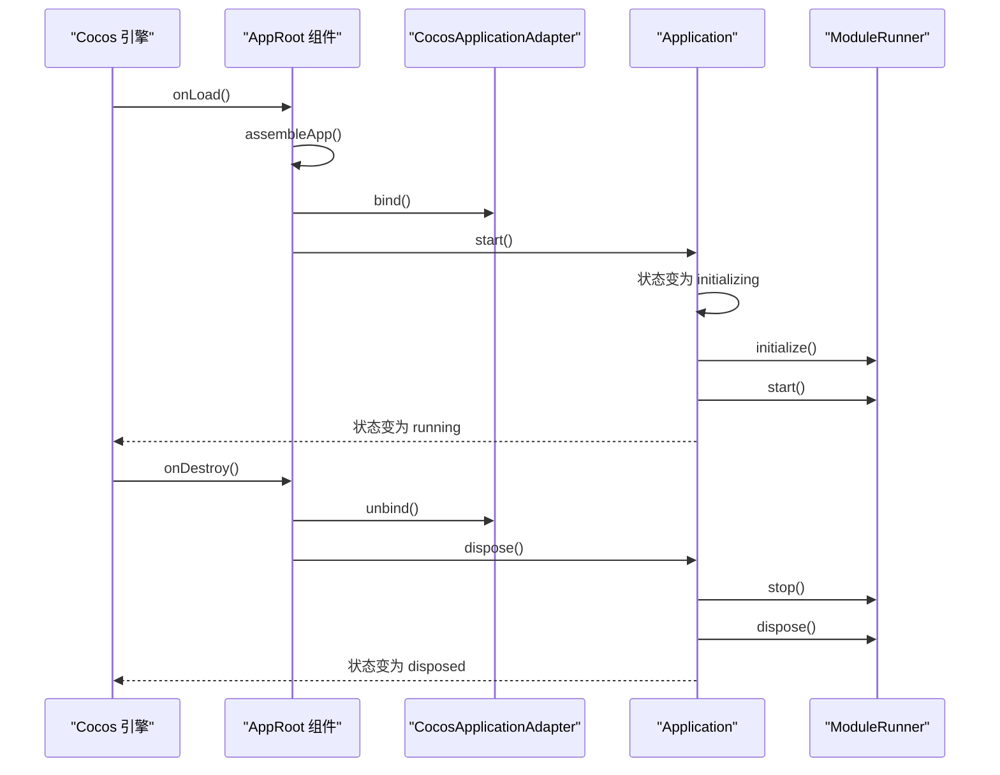
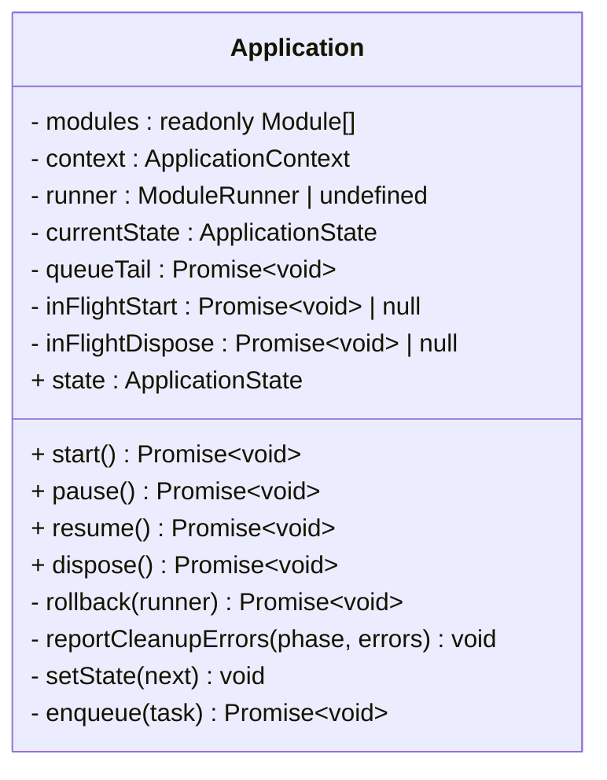
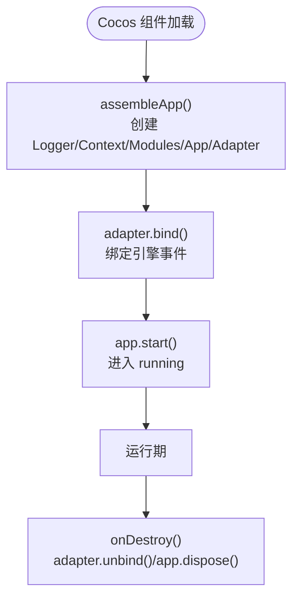
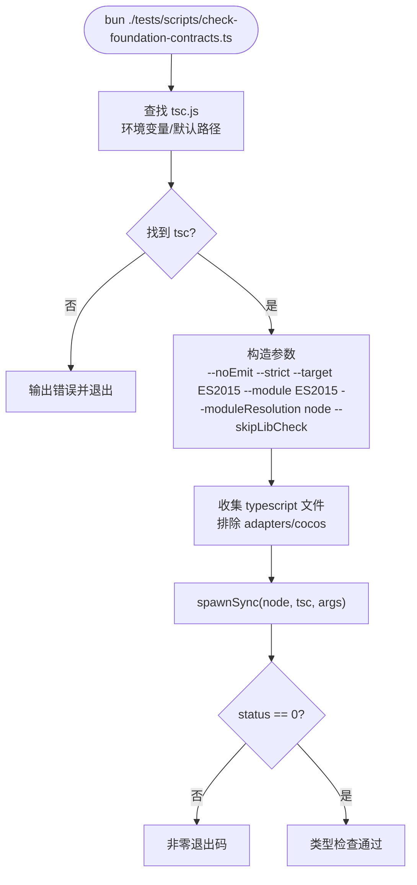
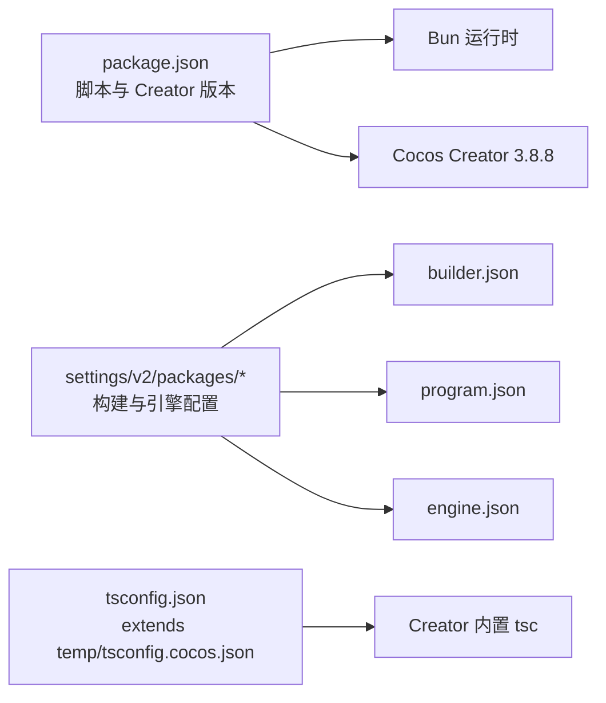

# 技术栈

<cite>
**本文引用的文件**   
- [package.json](file://package.json)
- [tsconfig.json](file://tsconfig.json)
- [engine.json](file://settings/v2/packages/engine.json)
- [builder.json](file://settings/v2/packages/builder.json)
- [program.json](file://settings/v2/packages/program.json)
- [project.json](file://settings/v2/packages/project.json)
- [index.ts](file://assets/framework/index.ts)
- [Application.ts](file://assets/framework/application/Application.ts)
- [AppRoot.ts](file://assets/boot/AppRoot.ts)
- [check-foundation-contracts.ts](file://tests/scripts/check-foundation-contracts.ts)
</cite>

## 目录
1. [简介](#简介)
2. [项目结构](#项目结构)
3. [核心组件](#核心组件)
4. [架构总览](#架构总览)
5. [详细组件分析](#详细组件分析)
6. [依赖分析](#依赖分析)
7. [性能考虑](#性能考虑)
8. [故障排查指南](#故障排查指南)
9. [结论](#结论)
10. [附录](#附录)

## 简介
本技术栈文档面向 AI Game Kit 项目，系统梳理并解释当前使用的核心技术、工具链与配置策略。项目基于 Cocos Creator 3.8.8 构建，使用 TypeScript 进行类型化开发，通过 Bun 执行测试脚本；框架层以 Application 为核心，结合模块图与生命周期管理，提供可插拔的模块体系与平台适配能力。本文同时给出环境搭建要求、版本兼容性说明、开发工具链配置要点以及最佳实践建议，帮助开发者快速上手并稳定迭代。

## 项目结构
- 引擎与构建配置集中于 settings/v2/packages 下，包含引擎模块裁剪、构建器与程序包信息。
- 应用启动入口位于 assets/boot，负责装配 Application、Logger、Platform Adapter 等基础组件。
- 框架核心位于 assets/framework，暴露统一 API 与契约（日志、应用上下文、模块、平台、时间源、事件通道等）。
- 测试与类型契约校验位于 tests，配合 scripts 完成类型检查与单元测试。

**图表来源** 
- [engine.json:1-230](file://settings/v2/packages/engine.json#L1-L230)
- [builder.json:1-4](file://settings/v2/packages/builder.json#L1-L4)
- [program.json:1-4](file://settings/v2/packages/program.json#L1-L4)
- [project.json:1-4](file://settings/v2/packages/project.json#L1-L4)
- [AppRoot.ts:1-55](file://assets/boot/AppRoot.ts#L1-L55)
- [index.ts:1-44](file://assets/framework/index.ts#L1-L44)
- [Application.ts:1-168](file://assets/framework/application/Application.ts#L1-L168)
- [check-foundation-contracts.ts:1-90](file://tests/scripts/check-foundation-contracts.ts#L1-L90)

**章节来源**
- [engine.json:1-230](file://settings/v2/packages/engine.json#L1-L230)
- [builder.json:1-4](file://settings/v2/packages/builder.json#L1-L4)
- [program.json:1-4](file://settings/v2/packages/program.json#L1-L4)
- [project.json:1-4](file://settings/v2/packages/project.json#L1-L4)
- [AppRoot.ts:1-55](file://assets/boot/AppRoot.ts#L1-L55)
- [index.ts:1-44](file://assets/framework/index.ts#L1-L44)
- [Application.ts:1-168](file://assets/framework/application/Application.ts#L1-L168)
- [check-foundation-contracts.ts:1-90](file://tests/scripts/check-foundation-contracts.ts#L1-L90)

## 核心组件
- 运行时与包管理：Bun 作为测试与脚本运行器，提供高性能命令执行。
- 类型系统与编译：TypeScript 通过 Cocos Creator 内置编译器进行类型检查与编译，tsconfig 继承自 Creator 生成的临时配置。
- 游戏引擎：Cocos Creator 3.8.8，启用 2D、UI、动画、音频、视频、WebGL/WebGPU、Spine、Tiled Map、Tween、WebSocket、WebView 等模块。
- 框架核心：Application 类管理模块生命周期、状态机、错误回滚与清理；通过 ModuleGraph 与 ModuleRunner 编排模块初始化与启停。
- 平台适配：CocosApplicationAdapter 将框架与应用生命周期绑定到 Cocos 引擎事件。
- 诊断与日志：ConsoleLogger 输出结构化日志，支持上下文与脱敏。
- 测试与契约：Bun test 执行单元测试；自定义脚本调用 Creator 的 tsc 对框架代码与契约进行严格类型检查。

**章节来源**
- [package.json:1-12](file://package.json#L1-L12)
- [tsconfig.json:1-10](file://tsconfig.json#L1-L10)
- [engine.json:1-230](file://settings/v2/packages/engine.json#L1-L230)
- [Application.ts:1-168](file://assets/framework/application/Application.ts#L1-L168)
- [AppRoot.ts:1-55](file://assets/boot/AppRoot.ts#L1-L55)
- [index.ts:1-44](file://assets/framework/index.ts#L1-L44)
- [check-foundation-contracts.ts:1-90](file://tests/scripts/check-foundation-contracts.ts#L1-L90)

## 架构总览
下图展示从 Cocos 组件入口到框架 Application 的生命周期绑定与模块编排流程。

**图表来源** 
- [AppRoot.ts:1-55](file://assets/boot/AppRoot.ts#L1-L55)
- [Application.ts:1-168](file://assets/framework/application/Application.ts#L1-L168)

## 详细组件分析

### Application 组件分析
Application 是框架的核心控制器，负责模块图的拓扑排序、生命周期状态机、异步任务队列与错误回滚。关键特性包括：
- 状态机：created → initializing → running → paused → stopped → disposed，非法状态转换抛出 ApplicationStateError。
- 模块编排：通过 ModuleGraph 计算有序模块列表，再由 ModuleRunner 依次执行 initialize/start/stop/dispose。
- 错误隔离与回滚：在初始化失败时触发 rollback，确保资源释放与状态一致性。
- 并发安全：内部使用 Promise 队列串行化操作，避免重复启动或并发冲突。

**图表来源** 
- [Application.ts:1-168](file://assets/framework/application/Application.ts#L1-L168)

**章节来源**
- [Application.ts:1-168](file://assets/framework/application/Application.ts#L1-L168)

### 启动装配与平台适配
AppRoot 作为 Cocos 组件，负责装配 Logger、ApplicationContext、Application 与 CocosApplicationAdapter，并将框架生命周期绑定到引擎事件。

**图表来源** 
- [AppRoot.ts:1-55](file://assets/boot/AppRoot.ts#L1-L55)

**章节来源**
- [AppRoot.ts:1-55](file://assets/boot/AppRoot.ts#L1-L55)

### 类型契约与测试集成
- 测试运行：通过 package.json 中的脚本使用 bun test 执行 tests/framework/foundation 下的测试用例。
- 类型契约校验：tests/scripts/check-foundation-contracts.ts 动态定位 Cocos Creator 的 tsc 路径，使用严格模式对 framework 源码与契约文件进行类型检查，排除平台适配器目录以避免平台相关类型问题。

**图表来源** 
- [check-foundation-contracts.ts:1-90](file://tests/scripts/check-foundation-contracts.ts#L1-L90)

**章节来源**
- [package.json:1-12](file://package.json#L1-L12)
- [check-foundation-contracts.ts:1-90](file://tests/scripts/check-foundation-contracts.ts#L1-L90)

## 依赖分析
- 运行时依赖：Bun 用于测试与脚本执行；Cocos Creator 3.8.8 提供引擎与 TypeScript 编译器。
- 构建依赖：Creator 的 builder 与 program 包版本由 settings 管理；引擎模块按 engine.json 裁剪。
- 类型依赖：tsconfig 继承 Creator 生成的临时配置，允许覆盖 strict 等选项。

**图表来源** 
- [package.json:1-12](file://package.json#L1-L12)
- [builder.json:1-4](file://settings/v2/packages/builder.json#L1-L4)
- [program.json:1-4](file://settings/v2/packages/program.json#L1-L4)
- [engine.json:1-230](file://settings/v2/packages/engine.json#L1-L230)
- [tsconfig.json:1-10](file://tsconfig.json#L1-L10)

**章节来源**
- [package.json:1-12](file://package.json#L1-L12)
- [builder.json:1-4](file://settings/v2/packages/builder.json#L1-L4)
- [program.json:1-4](file://settings/v2/packages/program.json#L1-L4)
- [engine.json:1-230](file://settings/v2/packages/engine.json#L1-L230)
- [tsconfig.json:1-10](file://tsconfig.json#L1-L10)

## 性能考虑
- 引擎模块裁剪：按需启用 2D、UI、动画、音频、视频、WebGL/WebGPU、Spine、Tiled Map、Tween、WebSocket、WebView 等，减少打包体积与运行时开销。
- 渲染管线：使用 custom-pipeline，有利于后续优化与定制。
- 类型检查：使用严格模式与目标 ES2015，提升代码质量与兼容性。
- 测试与脚本：Bun 提供更快的测试执行与脚本运行体验。

[本节为通用指导，不直接分析具体文件]

## 故障排查指南
- 找不到 Cocos Creator 的 tsc.js：
  - 设置环境变量 COCOS_TSC 指向绝对路径，或确保 COCOS_CREATOR_HOME 正确配置。
  - 脚本会尝试多个默认路径，若均失败则输出错误并退出。
- 类型检查失败：
  - 检查 framework 源码与契约文件的类型定义是否一致。
  - 确认排除规则未误删必要文件（adapters/cocos 被排除）。
- 应用生命周期异常：
  - 关注 ApplicationStateError 抛出的非法状态转换。
  - 查看日志输出，确认模块初始化/停止/销毁阶段是否有异常。

**章节来源**
- [check-foundation-contracts.ts:1-90](file://tests/scripts/check-foundation-contracts.ts#L1-L90)
- [Application.ts:1-168](file://assets/framework/application/Application.ts#L1-L168)

## 结论
AI Game Kit 采用 Cocos Creator 3.8.8 + TypeScript + Bun 的现代前端/游戏开发生态，结合自研框架的 Application 生命周期管理与模块编排，形成高内聚、低耦合的可扩展架构。通过严格的类型契约校验与分层测试策略，保障代码质量与稳定性。建议在后续迭代中持续优化引擎模块裁剪、渲染管线与性能监控，保持技术栈的先进性与可维护性。

[本节为总结性内容，不直接分析具体文件]

## 附录
- 环境搭建要求：
  - 安装 Cocos Creator 3.8.8，确保 COCOS_CREATOR_HOME 或 COCOS_TSC 可被脚本定位。
  - 安装 Bun 作为测试与脚本运行器。
- 版本兼容性：
  - Creator 3.8.8 与 tsconfig 继承的临时配置保持一致。
  - engine.json 指定启用的模块与渲染管线，需与目标平台兼容。
- 开发最佳实践：
  - 使用框架导出的契约与类型，避免直接依赖平台实现。
  - 在模块初始化中处理异常，确保资源释放与状态一致性。
  - 通过 tests 与类型契约校验保证变更质量。

[本节为补充信息，不直接分析具体文件]