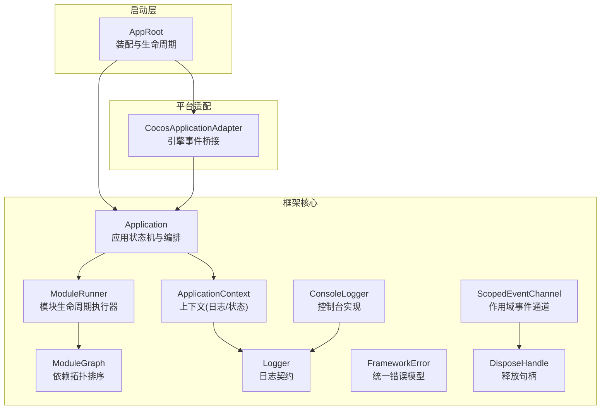
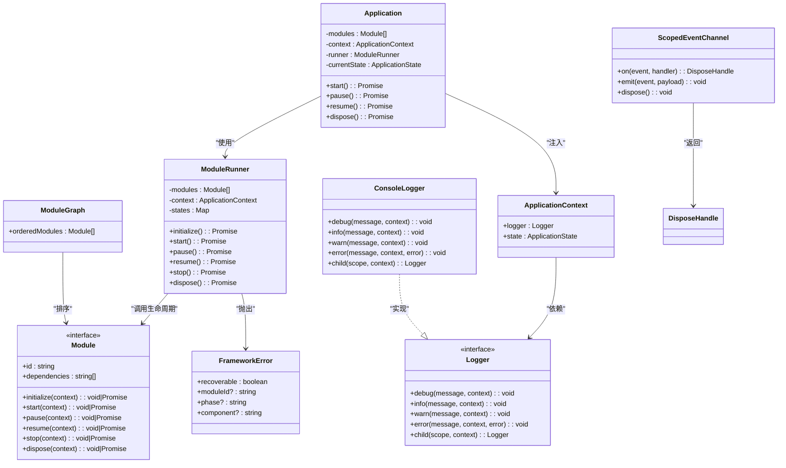
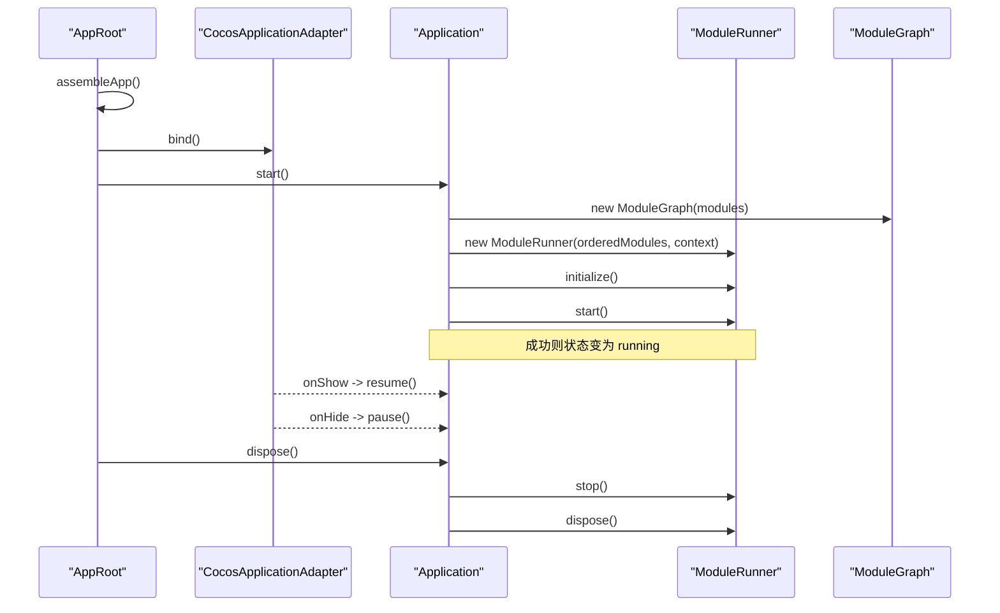
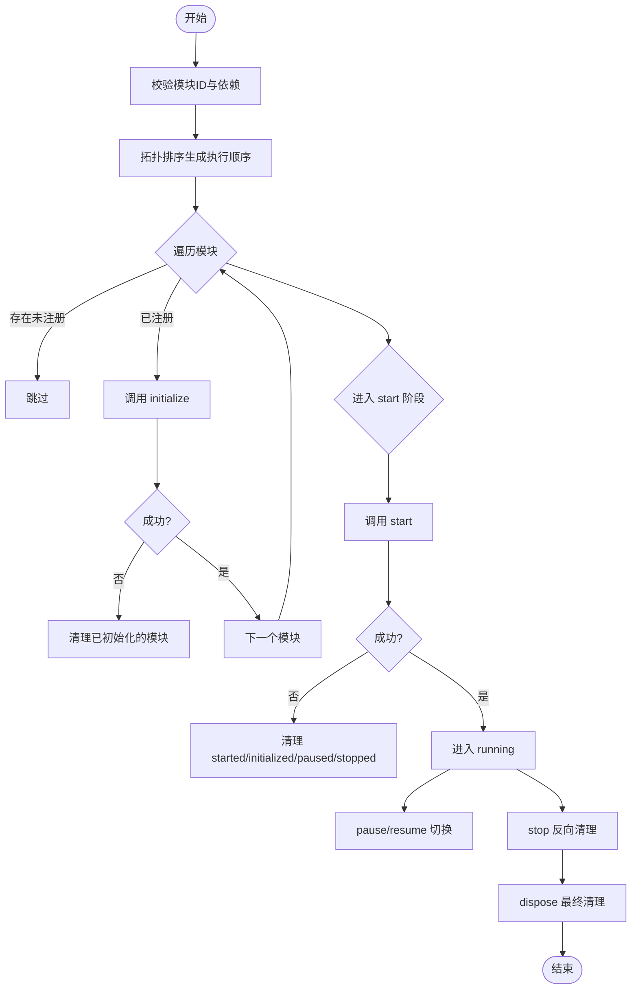
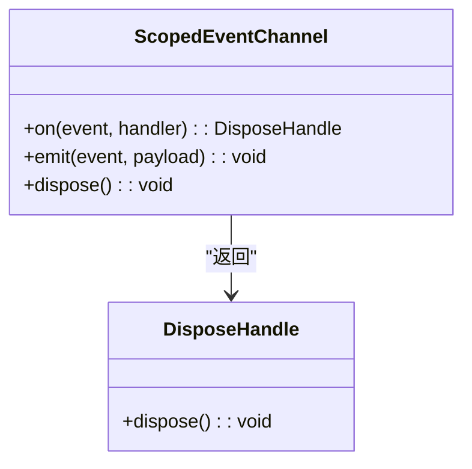
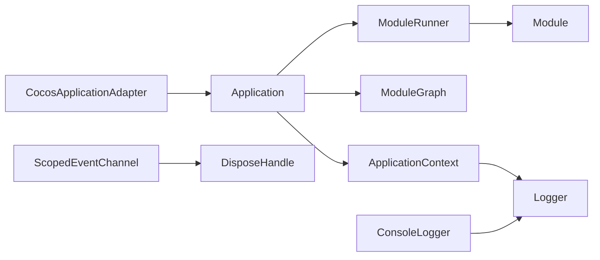

# 架构概览

<cite>
**本文引用的文件**   
- [assets/boot/AppRoot.ts](file://assets/boot/AppRoot.ts)
- [assets/framework/index.ts](file://assets/framework/index.ts)
- [assets/framework/application/Application.ts](file://assets/framework/application/Application.ts)
- [assets/framework/application/ApplicationContext.ts](file://assets/framework/application/ApplicationContext.ts)
- [assets/framework/application/ModuleGraph.ts](file://assets/framework/application/ModuleGraph.ts)
- [assets/framework/application/ModuleRunner.ts](file://assets/framework/application/ModuleRunner.ts)
- [assets/framework/adapters/cocos/application/CocosApplicationAdapter.ts](file://assets/framework/adapters/cocos/application/CocosApplicationAdapter.ts)
- [assets/framework/core/events/ScopedEventChannel.ts](file://assets/framework/core/events/ScopedEventChannel.ts)
- [assets/framework/core/errors/FrameworkError.ts](file://assets/framework/core/errors/FrameworkError.ts)
- [assets/framework/core/scheduling/DisposeHandle.ts](file://assets/framework/core/scheduling/DisposeHandle.ts)
- [assets/framework/contracts/application/ApplicationContext.ts](file://assets/framework/contracts/application/ApplicationContext.ts)
- [assets/framework/contracts/module/Module.ts](file://assets/framework/contracts/module/Module.ts)
- [assets/framework/contracts/logging/Logger.ts](file://assets/framework/contracts/logging/Logger.ts)
- [assets/framework/diagnostics/logging/ConsoleLogger.ts](file://assets/framework/diagnostics/logging/ConsoleLogger.ts)
- [doc/decisions/ADR-003-hybrid-architecture.md](file://doc/decisions/ADR-003-hybrid-architecture.md)
</cite>

## 目录
1. [引言](#引言)
2. [项目结构](#项目结构)
3. [核心组件](#核心组件)
4. [架构总览](#架构总览)
5. [详细组件分析](#详细组件分析)
6. [依赖关系分析](#依赖关系分析)
7. [性能考量](#性能考量)
8. [故障排查指南](#故障排查指南)
9. [结论](#结论)
10. [附录](#附录)

## 引言
本文件为 AI Game Kit 的架构概览，面向初学者与有经验的开发者。文档从整体设计理念出发，阐述分层架构、模块化设计、依赖注入、事件驱动等核心概念，解释各组件之间的关系与数据流向，并给出扩展点与自定义机制说明。同时提供架构图与组件关系图，帮助快速理解框架全貌与技术细节。

## 项目结构
AI Game Kit 采用“引擎无关的核心 + 平台适配器”的分层组织方式：
- 启动层（boot）：负责在 Cocos Creator 中装配应用、绑定生命周期。
- 框架核心（framework）：定义契约、应用容器、模块生命周期、调度与时间源、错误模型、事件通道、诊断日志等。
- 平台适配（adapters）：将框架能力桥接到具体引擎（如 Cocos）。
- 业务与资源（game/resources）：留给游戏逻辑与资源管理。

图表来源
- [assets/boot/AppRoot.ts:19-27](file://assets/boot/AppRoot.ts#L19-L27)
- [assets/framework/application/Application.ts:10-22](file://assets/framework/application/Application.ts#L10-L22)
- [assets/framework/application/ModuleRunner.ts:26-41](file://assets/framework/application/ModuleRunner.ts#L26-L41)
- [assets/framework/application/ModuleGraph.ts:3-8](file://assets/framework/application/ModuleGraph.ts#L3-L8)
- [assets/framework/application/ApplicationContext.ts:4-13](file://assets/framework/application/ApplicationContext.ts#L4-L13)
- [assets/framework/contracts/logging/Logger.ts:14-20](file://assets/framework/contracts/logging/Logger.ts#L14-L20)
- [assets/framework/diagnostics/logging/ConsoleLogger.ts:19-34](file://assets/framework/diagnostics/logging/ConsoleLogger.ts#L19-L34)
- [assets/framework/core/events/ScopedEventChannel.ts:28-36](file://assets/framework/core/events/ScopedEventChannel.ts#L28-L36)
- [assets/framework/core/errors/FrameworkError.ts:16-31](file://assets/framework/core/errors/FrameworkError.ts#L16-L31)
- [assets/framework/core/scheduling/DisposeHandle.ts:1-4](file://assets/framework/core/scheduling/DisposeHandle.ts#L1-L4)
- [assets/framework/adapters/cocos/application/CocosApplicationAdapter.ts:9-17](file://assets/framework/adapters/cocos/application/CocosApplicationAdapter.ts#L9-L17)

章节来源
- [assets/framework/index.ts:1-44](file://assets/framework/index.ts#L1-L44)
- [assets/boot/AppRoot.ts:1-55](file://assets/boot/AppRoot.ts#L1-L55)

## 核心组件
- Application：应用级状态机与生命周期编排，负责模块初始化、启动、暂停/恢复、停止与销毁，保证操作串行化与失败回滚。
- ModuleRunner：按依赖顺序执行模块的生命周期阶段，维护模块运行态，处理异常与清理。
- ModuleGraph：对模块依赖进行拓扑排序与环检测，确保可执行的稳定顺序。
- ApplicationContext：向模块暴露日志与上下文信息，作为依赖注入的载体。
- Logger/ConsoleLogger：统一的日志契约与控制台实现，支持作用域与上下文。
- ScopedEventChannel：类型安全的作用域事件通道，支持订阅、发射与自动清理。
- FrameworkError：统一错误模型，支持可恢复标记与元数据。
- CocosApplicationAdapter：将引擎可见性事件映射到应用的 pause/resume。

章节来源
- [assets/framework/application/Application.ts:10-168](file://assets/framework/application/Application.ts#L10-L168)
- [assets/framework/application/ModuleRunner.ts:26-242](file://assets/framework/application/ModuleRunner.ts#L26-L242)
- [assets/framework/application/ModuleGraph.ts:3-86](file://assets/framework/application/ModuleGraph.ts#L3-L86)
- [assets/framework/application/ApplicationContext.ts:4-13](file://assets/framework/application/ApplicationContext.ts#L4-L13)
- [assets/framework/contracts/logging/Logger.ts:14-20](file://assets/framework/contracts/logging/Logger.ts#L14-L20)
- [assets/framework/diagnostics/logging/ConsoleLogger.ts:19-56](file://assets/framework/diagnostics/logging/ConsoleLogger.ts#L19-L56)
- [assets/framework/core/events/ScopedEventChannel.ts:28-129](file://assets/framework/core/events/ScopedEventChannel.ts#L28-L129)
- [assets/framework/core/errors/FrameworkError.ts:16-42](file://assets/framework/core/errors/FrameworkError.ts#L16-L42)
- [assets/framework/adapters/cocos/application/CocosApplicationAdapter.ts:9-53](file://assets/framework/adapters/cocos/application/CocosApplicationAdapter.ts#L9-L53)

## 架构总览
框架采用分层与模块化结合的设计：
- 分层架构：启动层负责装配；框架核心提供抽象与通用能力；平台适配屏蔽引擎差异；业务层按需扩展。
- 模块化设计：通过 Module 契约与依赖声明，由 ModuleGraph 计算执行顺序，ModuleRunner 驱动生命周期。
- 依赖注入：ApplicationContext 作为注入容器，向模块提供 Logger 等能力。
- 事件驱动：ScopedEventChannel 提供类型安全的发布/订阅，避免全局耦合。
- 错误与诊断：FrameworkError 统一错误语义；Logger 贯穿各层记录上下文。

图表来源
- [assets/framework/application/Application.ts:10-168](file://assets/framework/application/Application.ts#L10-L168)
- [assets/framework/application/ModuleRunner.ts:26-242](file://assets/framework/application/ModuleRunner.ts#L26-L242)
- [assets/framework/application/ModuleGraph.ts:3-86](file://assets/framework/application/ModuleGraph.ts#L3-L86)
- [assets/framework/contracts/module/Module.ts:19-30](file://assets/framework/contracts/module/Module.ts#L19-L30)
- [assets/framework/contracts/application/ApplicationContext.ts:15-18](file://assets/framework/contracts/application/ApplicationContext.ts#L15-L18)
- [assets/framework/contracts/logging/Logger.ts:14-20](file://assets/framework/contracts/logging/Logger.ts#L14-L20)
- [assets/framework/diagnostics/logging/ConsoleLogger.ts:19-56](file://assets/framework/diagnostics/logging/ConsoleLogger.ts#L19-L56)
- [assets/framework/core/events/ScopedEventChannel.ts:28-129](file://assets/framework/core/events/ScopedEventChannel.ts#L28-L129)
- [assets/framework/core/errors/FrameworkError.ts:16-42](file://assets/framework/core/errors/FrameworkError.ts#L16-L42)

## 详细组件分析

### 应用与应用装配
- AppRoot 在 Cocos 场景中创建 Logger、ApplicationContext、模块列表与 Application，并构造 CocosApplicationAdapter 绑定引擎事件。
- Application.start() 会构建 ModuleGraph，实例化 ModuleRunner，依次执行 initialize/start，失败时回滚 stop/dispose 并进入 disposed。
- Application.pause/resume/dispose 均通过内部队列串行执行，避免并发状态冲突。

图表来源
- [assets/boot/AppRoot.ts:19-55](file://assets/boot/AppRoot.ts#L19-L55)
- [assets/framework/application/Application.ts:28-67](file://assets/framework/application/Application.ts#L28-L67)
- [assets/framework/application/ModuleRunner.ts:47-105](file://assets/framework/application/ModuleRunner.ts#L47-L105)
- [assets/framework/application/ModuleGraph.ts:6-84](file://assets/framework/application/ModuleGraph.ts#L6-L84)
- [assets/framework/adapters/cocos/application/CocosApplicationAdapter.ts:19-53](file://assets/framework/adapters/cocos/application/CocosApplicationAdapter.ts#L19-L53)

章节来源
- [assets/boot/AppRoot.ts:1-55](file://assets/boot/AppRoot.ts#L1-L55)
- [assets/framework/application/Application.ts:10-168](file://assets/framework/application/Application.ts#L10-L168)

### 模块系统与生命周期
- Module 接口定义了 id、dependencies 与六个生命周期阶段。
- ModuleGraph 进行依赖校验与拓扑排序，检测循环依赖与缺失依赖。
- ModuleRunner 维护每个模块的运行状态，按序执行生命周期，并在失败时执行反向清理。

图表来源
- [assets/framework/application/ModuleGraph.ts:6-84](file://assets/framework/application/ModuleGraph.ts#L6-L84)
- [assets/framework/application/ModuleRunner.ts:47-153](file://assets/framework/application/ModuleRunner.ts#L47-L153)
- [assets/framework/contracts/module/Module.ts:19-30](file://assets/framework/contracts/module/Module.ts#L19-L30)

章节来源
- [assets/framework/application/ModuleGraph.ts:1-86](file://assets/framework/application/ModuleGraph.ts#L1-L86)
- [assets/framework/application/ModuleRunner.ts:1-242](file://assets/framework/application/ModuleRunner.ts#L1-L242)
- [assets/framework/contracts/module/Module.ts:1-30](file://assets/framework/contracts/module/Module.ts#L1-L30)

### 事件系统与作用域
- ScopedEventChannel 提供类型安全的 on/emit，支持 onHandlerError 回调与自动清理。
- 订阅返回 DisposeHandle，用于取消订阅或随作用域释放。
- emit 过程中对处理器异常进行隔离，避免单个处理器影响其他处理器。

图表来源
- [assets/framework/core/events/ScopedEventChannel.ts:28-129](file://assets/framework/core/events/ScopedEventChannel.ts#L28-L129)
- [assets/framework/core/scheduling/DisposeHandle.ts:1-4](file://assets/framework/core/scheduling/DisposeHandle.ts#L1-L4)

章节来源
- [assets/framework/core/events/ScopedEventChannel.ts:1-129](file://assets/framework/core/events/ScopedEventChannel.ts#L1-L129)
- [assets/framework/core/scheduling/DisposeHandle.ts:1-4](file://assets/framework/core/scheduling/DisposeHandle.ts#L1-L4)

### 日志与诊断
- Logger 契约定义 debug/info/warn/error/child，便于分层与上下文记录。
- ConsoleLogger 基于 createScopedLogger 输出到控制台，支持过滤与脱敏。
- 框架内关键路径（模块生命周期、清理失败）均通过 logger.error 上报。

章节来源
- [assets/framework/contracts/logging/Logger.ts:1-21](file://assets/framework/contracts/logging/Logger.ts#L1-L21)
- [assets/framework/diagnostics/logging/ConsoleLogger.ts:1-56](file://assets/framework/diagnostics/logging/ConsoleLogger.ts#L1-L56)
- [assets/framework/application/ModuleRunner.ts:155-186](file://assets/framework/application/ModuleRunner.ts#L155-L186)

### 错误模型
- FrameworkError 提供 recoverable、moduleId、phase、component 等元数据，便于上层分类处理。
- isRecoverableError 用于判断是否可恢复。
- ModuleLifecycleError 与 ModuleCleanupError 组合使用，保留主错误与清理错误集合。

章节来源
- [assets/framework/core/errors/FrameworkError.ts:1-42](file://assets/framework/core/errors/FrameworkError.ts#L1-L42)
- [assets/framework/application/ModuleRunner.ts:12-24](file://assets/framework/application/ModuleRunner.ts#L12-L24)

### 平台适配
- CocosApplicationAdapter 监听引擎的显示/隐藏事件，调用 Application.resume/pause。
- 状态不匹配的错误由 Application 内部管理，适配器不做额外处理。

章节来源
- [assets/framework/adapters/cocos/application/CocosApplicationAdapter.ts:1-53](file://assets/framework/adapters/cocos/application/CocosApplicationAdapter.ts#L1-L53)
- [assets/framework/application/Application.ts:69-97](file://assets/framework/application/Application.ts#L69-L97)

## 依赖关系分析
- Application 依赖 ModuleRunner、ModuleGraph、ApplicationContext。
- ModuleRunner 依赖 Module 契约与 ApplicationContext。
- ModuleGraph 仅依赖 Module 契约。
- ConsoleLogger 实现 Logger 契约。
- ScopedEventChannel 依赖 DisposeHandle。
- CocosApplicationAdapter 依赖 Application 与引擎实例。

图表来源
- [assets/framework/application/Application.ts:10-22](file://assets/framework/application/Application.ts#L10-L22)
- [assets/framework/application/ModuleRunner.ts:26-41](file://assets/framework/application/ModuleRunner.ts#L26-L41)
- [assets/framework/application/ModuleGraph.ts:3-8](file://assets/framework/application/ModuleGraph.ts#L3-L8)
- [assets/framework/contracts/module/Module.ts:19-30](file://assets/framework/contracts/module/Module.ts#L19-L30)
- [assets/framework/contracts/application/ApplicationContext.ts:15-18](file://assets/framework/contracts/application/ApplicationContext.ts#L15-L18)
- [assets/framework/contracts/logging/Logger.ts:14-20](file://assets/framework/contracts/logging/Logger.ts#L14-L20)
- [assets/framework/diagnostics/logging/ConsoleLogger.ts:19-34](file://assets/framework/diagnostics/logging/ConsoleLogger.ts#L19-L34)
- [assets/framework/core/events/ScopedEventChannel.ts:28-36](file://assets/framework/core/events/ScopedEventChannel.ts#L28-L36)
- [assets/framework/core/scheduling/DisposeHandle.ts:1-4](file://assets/framework/core/scheduling/DisposeHandle.ts#L1-L4)
- [assets/framework/adapters/cocos/application/CocosApplicationAdapter.ts:9-17](file://assets/framework/adapters/cocos/application/CocosApplicationAdapter.ts#L9-L17)

章节来源
- [assets/framework/index.ts:1-44](file://assets/framework/index.ts#L1-L44)

## 性能考量
- 模块生命周期执行顺序由拓扑排序决定，避免重复计算与循环依赖导致的死锁。
- Application 内部使用 Promise 队列串行化操作，减少竞态条件与状态抖动。
- 事件通道在 emit 后清理已取消的订阅，降低内存占用。
- 日志输出可通过过滤器与脱敏策略控制开销。

[本节为通用指导，无需引用具体文件]

## 故障排查指南
- 模块初始化/启动失败：查看 ModuleRunner 抛出的 ModuleLifecycleError，确认模块依赖与生命周期实现是否正确。
- 清理失败：ModuleCleanupError 包含多个清理阶段的错误集合，逐一检查 stop/dispose 中的资源释放。
- 应用状态错误：ApplicationStateError 表示当前状态不允许该操作，检查调用时机。
- 事件处理器异常：ScopedEventChannel 的 onHandlerError 可用于捕获并定位问题。
- 日志定位：通过 Logger.child 划分作用域，结合上下文字段快速定位问题模块与阶段。

章节来源
- [assets/framework/application/ModuleRunner.ts:155-242](file://assets/framework/application/ModuleRunner.ts#L155-L242)
- [assets/framework/application/Application.ts:28-67](file://assets/framework/application/Application.ts#L28-L67)
- [assets/framework/core/events/ScopedEventChannel.ts:28-129](file://assets/framework/core/events/ScopedEventChannel.ts#L28-L129)
- [assets/framework/contracts/logging/Logger.ts:14-20](file://assets/framework/contracts/logging/Logger.ts#L14-L20)

## 结论
AI Game Kit 以分层与模块化为核心，通过清晰的契约与依赖注入机制，实现了可扩展、可测试、可观测的游戏框架。其混合架构决策允许不同玩法选择合适范式，同时保持底层一致性与稳定性。借助事件驱动与统一错误模型，开发者可以构建健壮且易于维护的游戏系统。

[本节为总结性内容，无需引用具体文件]

## 附录
- 架构决策背景：Hybrid Gameplay Architecture 强调根据特性选择 OOP/ECS/状态机/命令/行为树等模式，框架不强制统一模型，提升灵活性。

章节来源
- [doc/decisions/ADR-003-hybrid-architecture.md:1-75](file://doc/decisions/ADR-003-hybrid-architecture.md#L1-L75)