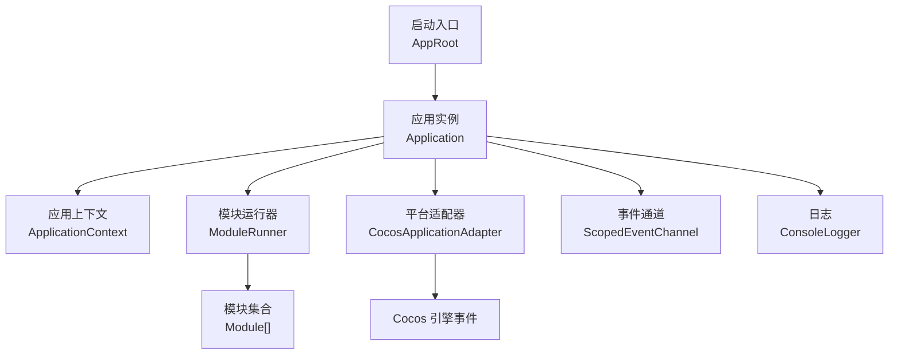
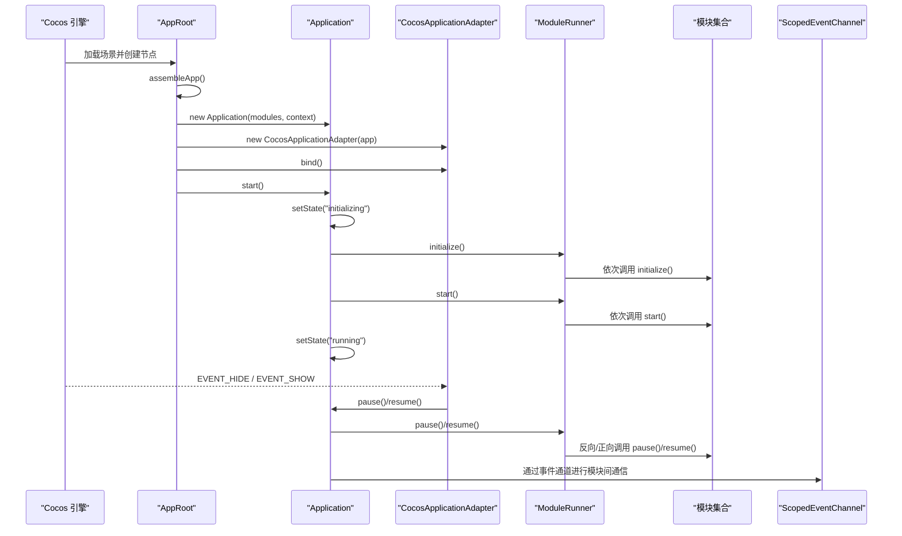
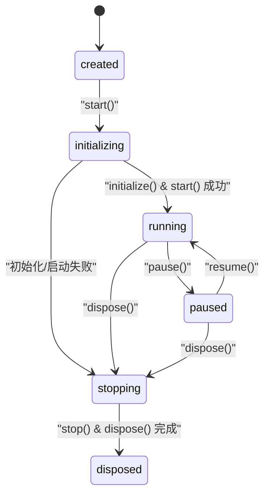
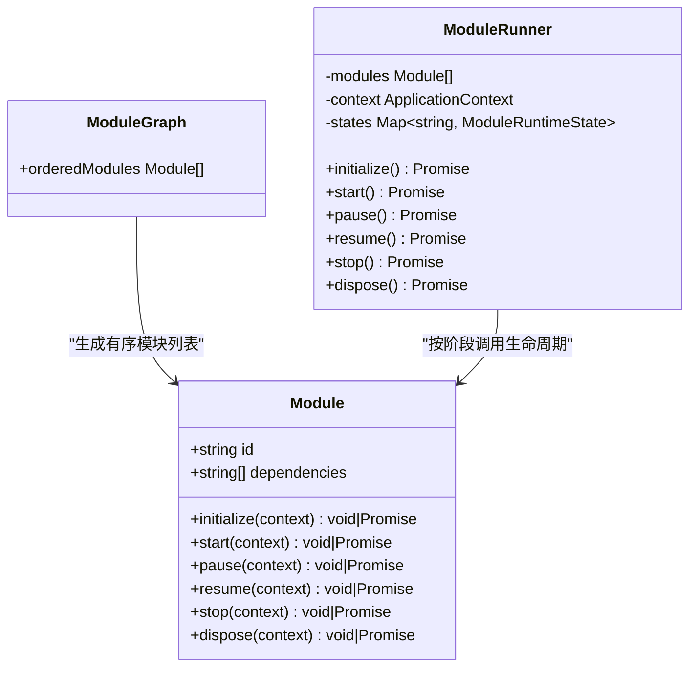
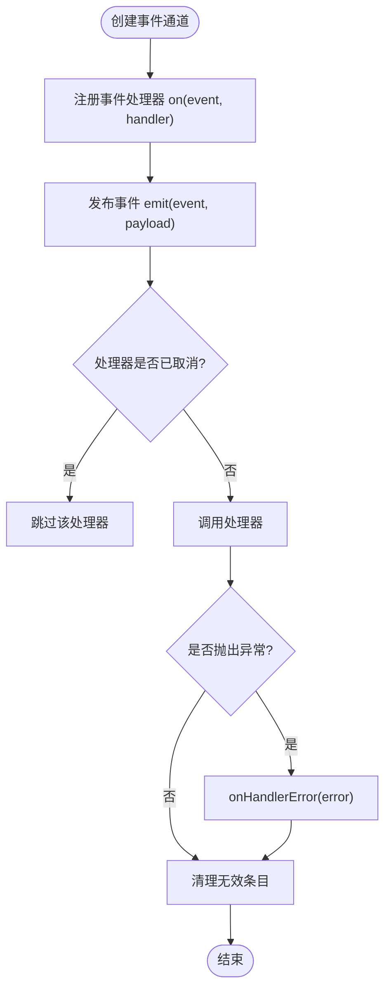
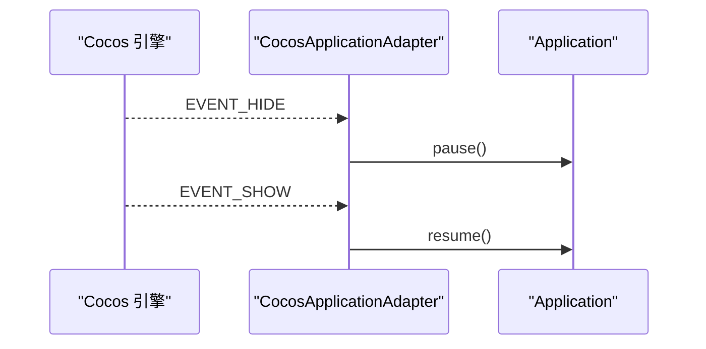
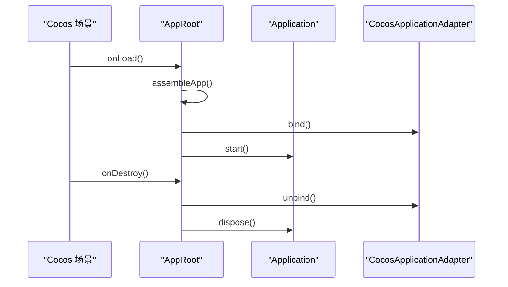
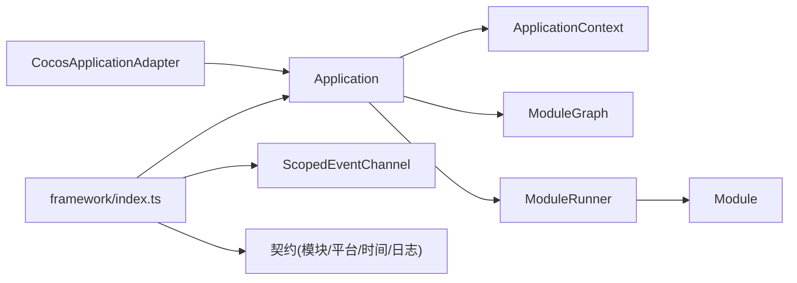

# 项目介绍

<cite>
**本文引用的文件**   
- [package.json](file://package.json)
- [assets/framework/index.ts](file://assets/framework/index.ts)
- [assets/boot/AppRoot.ts](file://assets/boot/AppRoot.ts)
- [assets/framework/application/Application.ts](file://assets/framework/application/Application.ts)
- [assets/framework/application/ApplicationContext.ts](file://assets/framework/application/ApplicationContext.ts)
- [assets/framework/application/ModuleGraph.ts](file://assets/framework/application/ModuleGraph.ts)
- [assets/framework/application/ModuleRunner.ts](file://assets/framework/application/ModuleRunner.ts)
- [assets/framework/contracts/module/Module.ts](file://assets/framework/contracts/module/Module.ts)
- [assets/framework/core/events/ScopedEventChannel.ts](file://assets/framework/core/events/ScopedEventChannel.ts)
- [assets/framework/adapters/cocos/application/CocosApplicationAdapter.ts](file://assets/framework/adapters/cocos/application/CocosApplicationAdapter.ts)
- [doc/decisions/ADR-005-framework-game-boundary.md](file://doc/decisions/ADR-005-framework-game-boundary.md)
</cite>

## 目录
1. [简介](#简介)
2. [项目结构](#项目结构)
3. [核心组件](#核心组件)
4. [架构总览](#架构总览)
5. [详细组件分析](#详细组件分析)
6. [依赖关系分析](#依赖关系分析)
7. [性能考量](#性能考量)
8. [故障排查指南](#故障排查指南)
9. [结论](#结论)
10. [附录](#附录)

## 简介
AI Game Kit 是一个基于 Cocos Creator 3.8.8 构建的现代化游戏框架，旨在为跨平台游戏提供稳定、可扩展且可测试的基础设施。其核心目标是以“应用生命周期 + 模块化 + 事件驱动”的方式组织代码，使框架能力与具体游戏逻辑清晰解耦，从而提升开发效率、降低维护成本并增强可移植性。

设计理念要点：
- 以 Application 为中心的生命周期管理，确保模块按序初始化、启动、暂停/恢复、停止与销毁。
- 通过 Module 契约与依赖图，实现高内聚、低耦合的模块化架构。
- 使用 ScopedEventChannel 进行类型安全、作用域可控的事件通信。
- 借助适配器模式隔离引擎差异，面向 Platform 抽象进行跨平台适配。
- 严格区分 Framework 与 Game 边界，保证框架稳定、业务灵活演进。

适用场景：
- 需要快速搭建多端一致体验的游戏或交互式应用。
- 希望以模块化方式组织复杂系统（UI、资源、存档、配置、日志等）。
- 追求可测试性与可观测性的工程化团队。

主要优势：
- 清晰的启动与清理流程，错误隔离与回滚保障。
- 强类型事件通道与结构化日志，便于调试与诊断。
- 平台无关的抽象层，减少引擎绑定带来的迁移成本。
- 与 Cocos Creator 无缝集成，同时保持框架独立性。

与其他框架的区别与独特价值：
- 将“应用状态机 + 模块生命周期 + 事件总线”统一在轻量契约之上，避免过度封装。
- 通过 ADR 明确 Framework/Game 边界，避免框架被具体游戏逻辑污染。
- 内置时间源与调度抽象，便于模拟与测试。

## 项目结构
- assets/boot：Cocos 入口组件，负责装配 Application、Logger、Adapter 并触发生命周期。
- assets/framework：框架核心，包含应用上下文、模块契约、事件通道、错误模型、时间源、调度器等。
- assets/framework/adapters：平台适配器（如 CocosApplicationAdapter），桥接引擎事件到框架应用。
- doc/decisions：架构决策记录（ADR），定义边界与约束。
- tests：单元测试与契约校验，覆盖生命周期、事件、调度、错误处理等。

图表来源
- [assets/boot/AppRoot.ts:1-55](file://assets/boot/AppRoot.ts#L1-L55)
- [assets/framework/application/Application.ts:1-168](file://assets/framework/application/Application.ts#L1-L168)
- [assets/framework/application/ApplicationContext.ts:1-14](file://assets/framework/application/ApplicationContext.ts#L1-L14)
- [assets/framework/application/ModuleRunner.ts:1-242](file://assets/framework/application/ModuleRunner.ts#L1-L242)
- [assets/framework/core/events/ScopedEventChannel.ts:1-129](file://assets/framework/core/events/ScopedEventChannel.ts#L1-L129)
- [assets/framework/adapters/cocos/application/CocosApplicationAdapter.ts:1-53](file://assets/framework/adapters/cocos/application/CocosApplicationAdapter.ts#L1-L53)

章节来源
- [package.json:1-12](file://package.json#L1-L12)
- [assets/framework/index.ts:1-44](file://assets/framework/index.ts#L1-L44)

## 核心组件
- Application：应用主控制器，维护状态机（created/initializing/running/paused/stopping/disposed），编排模块生命周期，保证启动失败时的回滚与清理。
- ApplicationContext：注入式上下文，提供 logger 与当前状态访问点。
- Module：模块契约，声明 id、dependencies 以及 initialize/start/pause/resume/stop/dispose 可选钩子。
- ModuleGraph：对模块依赖进行拓扑排序，检测缺失依赖与循环依赖。
- ModuleRunner：按阶段顺序执行模块生命周期，收集并上报清理错误，支持反向清理。
- ScopedEventChannel：类型安全的有作用域事件通道，支持订阅句柄与自动清理。
- CocosApplicationAdapter：将 Cocos 引擎的显示/隐藏事件映射到应用的 pause/resume。

章节来源
- [assets/framework/application/Application.ts:10-168](file://assets/framework/application/Application.ts#L10-L168)
- [assets/framework/application/ApplicationContext.ts:1-14](file://assets/framework/application/ApplicationContext.ts#L1-L14)
- [assets/framework/contracts/module/Module.ts:1-30](file://assets/framework/contracts/module/Module.ts#L1-L30)
- [assets/framework/application/ModuleGraph.ts:1-86](file://assets/framework/application/ModuleGraph.ts#L1-L86)
- [assets/framework/application/ModuleRunner.ts:1-242](file://assets/framework/application/ModuleRunner.ts#L1-L242)
- [assets/framework/core/events/ScopedEventChannel.ts:1-129](file://assets/framework/core/events/ScopedEventChannel.ts#L1-L129)
- [assets/framework/adapters/cocos/application/CocosApplicationAdapter.ts:1-53](file://assets/framework/adapters/cocos/application/CocosApplicationAdapter.ts#L1-L53)

## 架构总览
下图展示了从 Cocos 启动到框架运行的关键调用链，以及平台适配与事件通道的交互。

图表来源
- [assets/boot/AppRoot.ts:1-55](file://assets/boot/AppRoot.ts#L1-L55)
- [assets/framework/application/Application.ts:1-168](file://assets/framework/application/Application.ts#L1-L168)
- [assets/framework/application/ModuleRunner.ts:1-242](file://assets/framework/application/ModuleRunner.ts#L1-L242)
- [assets/framework/adapters/cocos/application/CocosApplicationAdapter.ts:1-53](file://assets/framework/adapters/cocos/application/CocosApplicationAdapter.ts#L1-L53)
- [assets/framework/core/events/ScopedEventChannel.ts:1-129](file://assets/framework/core/events/ScopedEventChannel.ts#L1-L129)

## 详细组件分析

### 应用生命周期与状态机
- Application 维护严格的内部状态，所有操作通过队列串行执行，避免竞态条件。
- start() 会先初始化模块，再启动模块；若任一阶段失败，进入 stopping 并执行回滚清理，最终置为 disposed。
- pause()/resume() 仅在合法状态下切换，否则抛出状态错误。
- dispose() 统一调用 stop() 与 dispose() 清理，并汇总清理错误。

图表来源
- [assets/framework/application/Application.ts:1-168](file://assets/framework/application/Application.ts#L1-L168)

章节来源
- [assets/framework/application/Application.ts:1-168](file://assets/framework/application/Application.ts#L1-L168)

### 模块契约与依赖图
- Module 接口定义了模块标识、依赖列表与生命周期钩子。
- ModuleGraph 对依赖进行拓扑排序，检测缺失依赖与循环依赖，保证稳定的执行顺序。
- ModuleRunner 按阶段遍历模块，维护每个模块的运行期状态，并在失败时进行反向清理。

图表来源
- [assets/framework/contracts/module/Module.ts:1-30](file://assets/framework/contracts/module/Module.ts#L1-L30)
- [assets/framework/application/ModuleGraph.ts:1-86](file://assets/framework/application/ModuleGraph.ts#L1-L86)
- [assets/framework/application/ModuleRunner.ts:1-242](file://assets/framework/application/ModuleRunner.ts#L1-L242)

章节来源
- [assets/framework/contracts/module/Module.ts:1-30](file://assets/framework/contracts/module/Module.ts#L1-L30)
- [assets/framework/application/ModuleGraph.ts:1-86](file://assets/framework/application/ModuleGraph.ts#L1-L86)
- [assets/framework/application/ModuleRunner.ts:1-242](file://assets/framework/application/ModuleRunner.ts#L1-L242)

### 事件驱动编程
- ScopedEventChannel 提供类型化的事件订阅与发布，支持 onHandlerError 自定义错误上报。
- 订阅返回 DisposeHandle，可在合适时机取消订阅，避免内存泄漏。
- emit 会在已销毁的通道上静默忽略，保证健壮性。

图表来源
- [assets/framework/core/events/ScopedEventChannel.ts:1-129](file://assets/framework/core/events/ScopedEventChannel.ts#L1-L129)

章节来源
- [assets/framework/core/events/ScopedEventChannel.ts:1-129](file://assets/framework/core/events/ScopedEventChannel.ts#L1-L129)

### 跨平台适配
- CocosApplicationAdapter 将 Cocos 的显示/隐藏事件映射到应用的 pause/resume，屏蔽平台差异。
- 通过构造函数注入 gameInstance，便于测试与替换。

图表来源
- [assets/framework/adapters/cocos/application/CocosApplicationAdapter.ts:1-53](file://assets/framework/adapters/cocos/application/CocosApplicationAdapter.ts#L1-L53)
- [assets/framework/application/Application.ts:1-168](file://assets/framework/application/Application.ts#L1-L168)

章节来源
- [assets/framework/adapters/cocos/application/CocosApplicationAdapter.ts:1-53](file://assets/framework/adapters/cocos/application/CocosApplicationAdapter.ts#L1-L53)

### 启动装配与入口
- AppRoot 在 onLoad 中组装 Application、Logger、Context、Adapter，并将节点设为持久根节点。
- start 阶段绑定适配器并启动 Application；onDestroy 阶段解绑并释放资源。

图表来源
- [assets/boot/AppRoot.ts:1-55](file://assets/boot/AppRoot.ts#L1-L55)

章节来源
- [assets/boot/AppRoot.ts:1-55](file://assets/boot/AppRoot.ts#L1-L55)

## 依赖关系分析
- Application 依赖 ApplicationContext、ModuleGraph、ModuleRunner。
- ModuleRunner 依赖 Module 契约与 ApplicationContext。
- ScopedEventChannel 依赖 DisposeHandle（用于订阅句柄）。
- CocosApplicationAdapter 依赖 Application 与 Cocos 引擎事件。
- 框架对外通过 index.ts 暴露类型与公共 API，保持边界清晰。

图表来源
- [assets/framework/index.ts:1-44](file://assets/framework/index.ts#L1-L44)
- [assets/framework/application/Application.ts:1-168](file://assets/framework/application/Application.ts#L1-L168)
- [assets/framework/application/ModuleRunner.ts:1-242](file://assets/framework/application/ModuleRunner.ts#L1-L242)
- [assets/framework/core/events/ScopedEventChannel.ts:1-129](file://assets/framework/core/events/ScopedEventChannel.ts#L1-L129)
- [assets/framework/adapters/cocos/application/CocosApplicationAdapter.ts:1-53](file://assets/framework/adapters/cocos/application/CocosApplicationAdapter.ts#L1-L53)

章节来源
- [assets/framework/index.ts:1-44](file://assets/framework/index.ts#L1-L44)

## 性能考量
- 生命周期阶段采用串行队列，避免并发竞争导致的额外开销与不确定性。
- 模块依赖图一次构建，后续阶段复用有序列表，减少重复计算。
- 事件通道在 emit 后清理无效条目，降低长期运行下的内存占用。
- 平台适配器仅做事件转发，不引入额外同步阻塞。

[本节为通用指导，无需特定文件引用]

## 故障排查指南
- 启动失败：检查 ModuleGraph 是否检测到循环依赖或缺失依赖；查看 ModuleRunner 的 initialize/start 阶段日志。
- 清理失败：关注 ModuleCleanupError 中的 errors 数组，定位具体模块与阶段。
- 事件异常：通过 ScopedEventChannel 的 onHandlerError 捕获处理器抛出的异常，避免中断其他处理器。
- 状态错误：确认 Application 当前状态是否符合预期（如非 running 调用 pause 会报错）。

章节来源
- [assets/framework/application/ModuleRunner.ts:1-242](file://assets/framework/application/ModuleRunner.ts#L1-L242)
- [assets/framework/core/events/ScopedEventChannel.ts:1-129](file://assets/framework/core/events/ScopedEventChannel.ts#L1-L129)
- [assets/framework/application/Application.ts:1-168](file://assets/framework/application/Application.ts#L1-L168)

## 结论
AI Game Kit 以简洁而严谨的架构，为 Cocos Creator 项目提供了强大的基础能力：稳定的应用生命周期、清晰的模块边界、类型安全的事件通信与跨平台适配。通过严格的 Framework/Game 边界与完善的错误处理机制，开发者可以在保证框架稳定性的前提下，快速迭代游戏功能，获得更好的可测试性与可维护性。

[本节为总结性内容，无需特定文件引用]

## 附录
- 版本信息：项目基于 Cocos Creator 3.8.8，脚本命令支持 foundation 测试与契约校验。
- 架构决策：详见 ADR-005，明确 Framework 与 Game 的职责边界与依赖方向。

章节来源
- [package.json:1-12](file://package.json#L1-L12)
- [doc/decisions/ADR-005-framework-game-boundary.md:1-61](file://doc/decisions/ADR-005-framework-game-boundary.md#L1-L61)