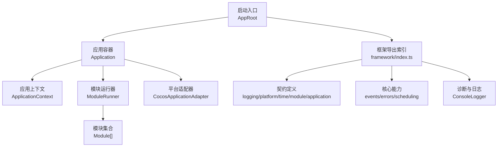
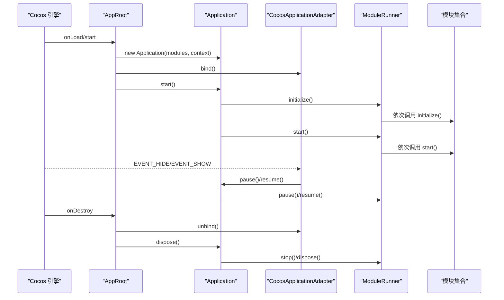
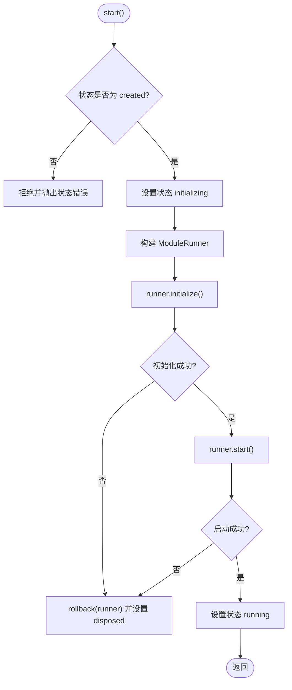
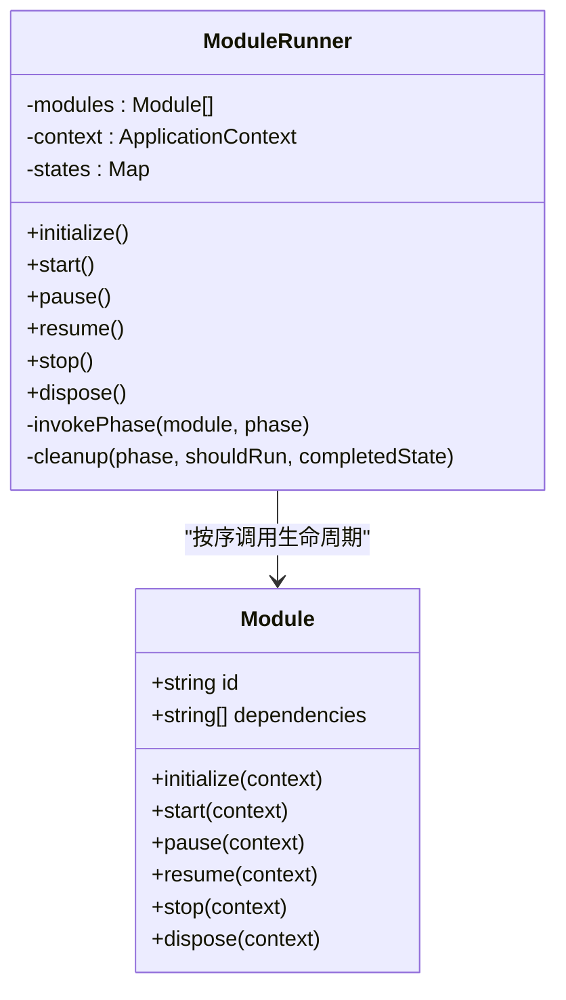
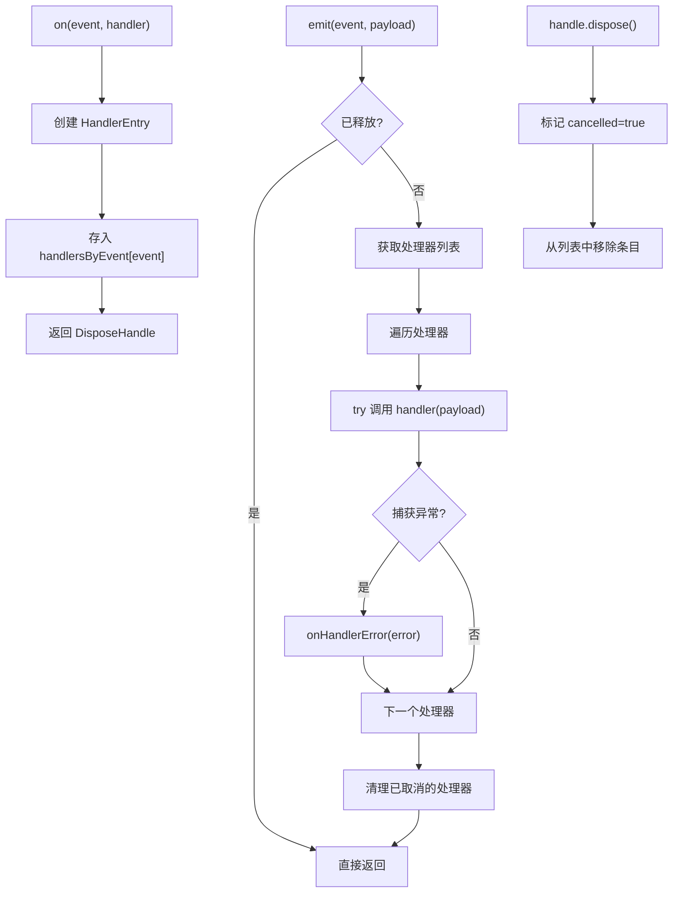
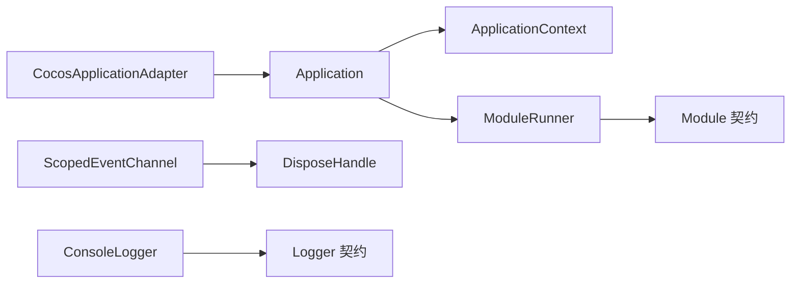

# 项目概述

<cite>
**本文引用的文件**
- [package.json](file://package.json)
- [assets/boot/AppRoot.ts](file://assets/boot/AppRoot.ts)
- [assets/framework/index.ts](file://assets/framework/index.ts)
- [assets/framework/application/Application.ts](file://assets/framework/application/Application.ts)
- [assets/framework/application/ApplicationContext.ts](file://assets/framework/application/ApplicationContext.ts)
- [assets/framework/contracts/application/ApplicationContext.ts](file://assets/framework/contracts/application/ApplicationContext.ts)
- [assets/framework/contracts/module/Module.ts](file://assets/framework/contracts/module/Module.ts)
- [assets/framework/application/ModuleRunner.ts](file://assets/framework/application/ModuleRunner.ts)
- [assets/framework/adapters/cocos/application/CocosApplicationAdapter.ts](file://assets/framework/adapters/cocos/application/CocosApplicationAdapter.ts)
- [assets/framework/core/events/ScopedEventChannel.ts](file://assets/framework/core/events/ScopedEventChannel.ts)
- [assets/framework/core/errors/FrameworkError.ts](file://assets/framework/core/errors/FrameworkError.ts)
- [assets/framework/diagnostics/logging/ConsoleLogger.ts](file://assets/framework/diagnostics/logging/ConsoleLogger.ts)
- [assets/framework/contracts/logging/Logger.ts](file://assets/framework/contracts/logging/Logger.ts)
- [assets/framework/core/scheduling/DisposeHandle.ts](file://assets/framework/core/scheduling/DisposeHandle.ts)
</cite>

## 目录
1. [简介](#简介)
2. [项目结构](#项目结构)
3. [核心组件](#核心组件)
4. [架构总览](#架构总览)
5. [详细组件分析](#详细组件分析)
6. [依赖关系分析](#依赖关系分析)
7. [性能考量](#性能考量)
8. [故障排查指南](#故障排查指南)
9. [结论](#结论)
10. [附录：快速开始](#附录快速开始)

## 简介
AI Game Kit 是一个基于 Cocos Creator 3.8.8 构建的现代化游戏框架，旨在为游戏应用提供稳定、可测试、可扩展的基础设施。其核心目标包括：
- 模块化架构与清晰的模块生命周期管理
- 通过依赖注入与契约接口解耦平台差异
- 事件驱动编程与类型安全的事件通道
- 统一的错误模型与可恢复性标记
- 面向测试的时间源与调度抽象

该框架将“引擎无关”的核心能力与“Cocos 适配层”分离，既保证跨平台扩展性，又能在 Cocos Creator 中无缝集成。相比传统以场景/节点为中心的组织方式，本框架强调“应用上下文 + 模块图 + 生命周期编排”，更适合大型项目的长期演进与团队协作。

## 项目结构
- assets/boot：应用启动入口（AppRoot），负责装配 Application、适配器与模块集合
- assets/framework：框架核心
  - application：应用容器、上下文、模块图与运行器
  - contracts：契约定义（日志、平台、时间、模块、应用上下文）
  - core：事件通道、错误模型、调度句柄等基础能力
  - adapters：平台适配（当前提供 Cocos 适配）
  - diagnostics：诊断与日志实现（控制台日志）
- tests：单元测试与契约校验脚本
- settings：Cocos Creator 工程配置
- openspec/doc：架构决策与设计规范

**图示来源**
- [assets/boot/AppRoot.ts:19-27](file://assets/boot/AppRoot.ts#L19-L27)
- [assets/framework/index.ts:1-44](file://assets/framework/index.ts#L1-L44)
- [assets/framework/application/Application.ts:10-22](file://assets/framework/application/Application.ts#L10-L22)
- [assets/framework/application/ApplicationContext.ts:11-25](file://assets/framework/application/ApplicationContext.ts#L11-L25)
- [assets/framework/application/ModuleRunner.ts:32-47](file://assets/framework/application/ModuleRunner.ts#L32-L47)
- [assets/framework/adapters/cocos/application/CocosApplicationAdapter.ts:9-17](file://assets/framework/adapters/cocos/application/CocosApplicationAdapter.ts#L9-L17)

**章节来源**
- [package.json:1-12](file://package.json#L1-L12)
- [assets/framework/index.ts:1-44](file://assets/framework/index.ts#L1-L44)

## 核心组件
- 应用容器 Application：维护应用状态机、编排模块初始化/启动/暂停/恢复/停止/销毁流程，保障幂等与回滚清理
- 应用上下文 ApplicationContext：对外暴露 Logger 与应用状态，内部提供状态设置能力
- 模块契约 Module：声明 id、dependencies 与生命周期钩子，由运行器按依赖顺序执行
- 模块运行器 ModuleRunner：遍历模块并调用生命周期方法，捕获异常并执行反向清理，聚合清理失败
- 事件通道 ScopedEventChannel：类型安全的发布订阅，支持作用域内订阅句柄与自动清理
- 错误模型 FrameworkError：统一错误类型，支持 cause、moduleId、phase、component 与 recoverable 标记
- 日志 ConsoleLogger：基于 ScopedLogger 的分层日志输出，支持上下文与过滤
- 平台适配器 CocosApplicationAdapter：桥接 Cocos 引擎的生命周期事件到应用 pause/resume

**章节来源**
- [assets/framework/application/Application.ts:10-167](file://assets/framework/application/Application.ts#L10-L167)
- [assets/framework/application/ApplicationContext.ts:11-25](file://assets/framework/application/ApplicationContext.ts#L11-L25)
- [assets/framework/contracts/module/Module.ts:19-29](file://assets/framework/contracts/module/Module.ts#L19-L29)
- [assets/framework/application/ModuleRunner.ts:32-247](file://assets/framework/application/ModuleRunner.ts#L32-L247)
- [assets/framework/core/events/ScopedEventChannel.ts:28-128](file://assets/framework/core/events/ScopedEventChannel.ts#L28-L128)
- [assets/framework/core/errors/FrameworkError.ts:16-35](file://assets/framework/core/errors/FrameworkError.ts#L16-L35)
- [assets/framework/diagnostics/logging/ConsoleLogger.ts:19-55](file://assets/framework/diagnostics/logging/ConsoleLogger.ts#L19-L55)
- [assets/framework/adapters/cocos/application/CocosApplicationAdapter.ts:9-52](file://assets/framework/adapters/cocos/application/CocosApplicationAdapter.ts#L9-L52)

## 架构总览
框架采用“应用容器 + 模块图 + 运行器”的三层结构，结合契约与适配器实现平台解耦。启动时由 AppRoot 组装 Application、Context、模块列表与 Cocos 适配器；Application 通过 ModuleGraph 排序模块后交由 ModuleRunner 执行生命周期；事件系统通过 ScopedEventChannel 提供类型安全通信；错误与日志贯穿全链路。

**图示来源**
- [assets/boot/AppRoot.ts:34-53](file://assets/boot/AppRoot.ts#L34-L53)
- [assets/framework/application/Application.ts:28-67](file://assets/framework/application/Application.ts#L28-L67)
- [assets/framework/application/ModuleRunner.ts:53-111](file://assets/framework/application/ModuleRunner.ts#L53-L111)
- [assets/framework/adapters/cocos/application/CocosApplicationAdapter.ts:19-51](file://assets/framework/adapters/cocos/application/CocosApplicationAdapter.ts#L19-L51)

## 详细组件分析

### 应用容器 Application
- 职责：维护应用状态机（created/initializing/running/paused/stopping/disposed），串行化操作队列，确保幂等与并发安全
- 关键行为：
  - start：校验状态、创建运行器、执行 initialize/start，失败则回滚并进入 disposed
  - pause/resume：在 running/paused 之间切换，委托给运行器
  - dispose：调用 stop/dispose，收集清理错误并上报
- 复杂度：状态检查 O(1)，队列任务链式 Promise 串联，整体线性于模块数量

**图示来源**
- [assets/framework/application/Application.ts:28-67](file://assets/framework/application/Application.ts#L28-L67)
- [assets/framework/application/Application.ts:134-156](file://assets/framework/application/Application.ts#L134-L156)

**章节来源**
- [assets/framework/application/Application.ts:10-167](file://assets/framework/application/Application.ts#L10-L167)

### 模块契约与运行器 ModuleRunner
- 职责：按依赖顺序执行模块生命周期，捕获异常并执行反向清理，聚合清理失败
- 关键行为：
  - initialize/start：正向执行，失败后根据已执行阶段进行清理
  - pause/resume：逆序/正序执行对应钩子
  - stop/dispose：按状态条件反向清理，收集错误并抛出聚合错误
- 复杂度：每个阶段遍历模块 O(n)，清理阶段同样 O(n)

**图示来源**
- [assets/framework/contracts/module/Module.ts:19-29](file://assets/framework/contracts/module/Module.ts#L19-L29)
- [assets/framework/application/ModuleRunner.ts:32-247](file://assets/framework/application/ModuleRunner.ts#L32-L247)

**章节来源**
- [assets/framework/contracts/module/Module.ts:1-30](file://assets/framework/contracts/module/Module.ts#L1-L30)
- [assets/framework/application/ModuleRunner.ts:32-247](file://assets/framework/application/ModuleRunner.ts#L32-L247)

### 事件通道 ScopedEventChannel
- 职责：提供类型安全的事件发布订阅，支持 on/emit/dispose，避免内存泄漏
- 关键行为：
  - on：注册处理器，返回 DisposeHandle 用于取消订阅
  - emit：遍历处理器并调用，捕获异常并通过 onHandlerError 上报
  - dispose：清空所有处理器，禁止再次订阅
- 复杂度：on 为 O(1)，emit 为 O(k)（k 为该事件处理器数量）

**图示来源**
- [assets/framework/core/events/ScopedEventChannel.ts:28-128](file://assets/framework/core/events/ScopedEventChannel.ts#L28-L128)

**章节来源**
- [assets/framework/core/events/ScopedEventChannel.ts:1-129](file://assets/framework/core/events/ScopedEventChannel.ts#L1-L129)

### 平台适配器 CocosApplicationAdapter
- 职责：监听 Cocos 引擎的显示/隐藏事件，映射到应用的 pause/resume
- 关键行为：
  - bind/unbind：注册/注销事件监听
  - onHide/onShow：调用 app.pause()/app.resume()，忽略状态不匹配的错误

**章节来源**
- [assets/framework/adapters/cocos/application/CocosApplicationAdapter.ts:9-52](file://assets/framework/adapters/cocos/application/CocosApplicationAdapter.ts#L9-L52)

### 错误模型与日志
- FrameworkError：统一错误类型，包含 cause、moduleId、phase、component、recoverable 字段，便于上层判断是否可恢复
- ConsoleLogger：基于 ScopedLogger 的分层日志输出，支持上下文与敏感信息脱敏

**章节来源**
- [assets/framework/core/errors/FrameworkError.ts:1-36](file://assets/framework/core/errors/FrameworkError.ts#L1-L36)
- [assets/framework/diagnostics/logging/ConsoleLogger.ts:1-56](file://assets/framework/diagnostics/logging/ConsoleLogger.ts#L1-L56)
- [assets/framework/contracts/logging/Logger.ts:1-21](file://assets/framework/contracts/logging/Logger.ts#L1-L21)

## 依赖关系分析
- Application 依赖 ApplicationContext、ModuleRunner、ModuleGraph（通过 ModuleRunner 间接使用）
- ModuleRunner 依赖 ApplicationContext 与 Module 契约
- CocosApplicationAdapter 依赖 Application 与 Cocos 引擎实例
- ScopedEventChannel 依赖 DisposeHandle
- ConsoleLogger 依赖 Logger 契约与 ScopedLogger

**图示来源**
- [assets/framework/application/Application.ts:10-22](file://assets/framework/application/Application.ts#L10-L22)
- [assets/framework/application/ModuleRunner.ts:32-47](file://assets/framework/application/ModuleRunner.ts#L32-L47)
- [assets/framework/adapters/cocos/application/CocosApplicationAdapter.ts:9-17](file://assets/framework/adapters/cocos/application/CocosApplicationAdapter.ts#L9-L17)
- [assets/framework/core/events/ScopedEventChannel.ts:1-21](file://assets/framework/core/events/ScopedEventChannel.ts#L1-L21)
- [assets/framework/diagnostics/logging/ConsoleLogger.ts:1-10](file://assets/framework/diagnostics/logging/ConsoleLogger.ts#L1-L10)

**章节来源**
- [assets/framework/index.ts:1-44](file://assets/framework/index.ts#L1-L44)

## 性能考量
- 应用状态机与队列：Application 使用 Promise 队列串行化操作，避免竞态条件，开销低
- 模块生命周期：每个阶段线性遍历模块，O(n)；清理阶段反向遍历，保证资源释放有序
- 事件通道：on 为 O(1)，emit 为 O(k)，建议合理拆分事件与作用域，避免热点事件过多处理器
- 日志输出：ConsoleLogger 基于委托模式，支持过滤与上下文，生产环境可替换为高性能日志后端

[本节为通用指导，不涉及具体文件分析]

## 故障排查指南
- 启动失败：Application.start 会记录失败原因并回滚清理；检查模块 initialize/start 抛出的异常与日志
- 清理失败：ModuleRunner 在 stop/dispose 阶段收集多个清理错误并抛出聚合错误；定位具体模块与阶段
- 事件处理器异常：ScopedEventChannel 的 onHandlerError 回调默认打印错误；可通过 options.onHandlerError 自定义处理
- 状态错误：Application 在非预期状态下调用 pause/resume 会抛出状态错误；确认调用时机与状态转换

**章节来源**
- [assets/framework/application/Application.ts:145-156](file://assets/framework/application/Application.ts#L145-L156)
- [assets/framework/application/ModuleRunner.ts:229-247](file://assets/framework/application/ModuleRunner.ts#L229-L247)
- [assets/framework/core/events/ScopedEventChannel.ts:31-33](file://assets/framework/core/events/ScopedEventChannel.ts#L31-L33)

## 结论
AI Game Kit 通过“应用容器 + 模块图 + 运行器”的架构，提供了清晰的生命周期管理与平台解耦能力；结合类型安全的事件通道、统一的错误模型与可扩展的日志体系，适合构建复杂且可维护的游戏应用。与传统的场景/节点组织方式相比，该框架更强调契约、依赖与可测试性，有助于团队协作与长期演进。

[本节为总结性内容，不涉及具体文件分析]

## 附录：快速开始
- 安装与运行
  - 使用 Cocos Creator 3.8.8 打开项目
  - 在启动场景中挂载 AppRoot 组件
  - 运行项目，AppRoot 会在 onLoad/start 中装配 Application 与适配器并启动
- 添加模块
  - 在 assets/boot/AppRoot.ts 的 createModules 中返回你的模块数组
  - 每个模块需实现 Module 契约（id、dependencies、生命周期钩子）
- 使用事件
  - 通过 createScopedEventChannel 创建类型安全的事件通道
  - 使用 on/emit 进行发布订阅，注意在合适时机调用 dispose
- 日志与错误
  - 使用 ConsoleLogger 或自定义 Logger 实现
  - 抛出 FrameworkError 以便上层识别与处理

**章节来源**
- [assets/boot/AppRoot.ts:10-27](file://assets/boot/AppRoot.ts#L10-L27)
- [assets/framework/index.ts:1-44](file://assets/framework/index.ts#L1-L44)
- [assets/framework/core/events/ScopedEventChannel.ts:28-128](file://assets/framework/core/events/ScopedEventChannel.ts#L28-L128)
- [assets/framework/diagnostics/logging/ConsoleLogger.ts:19-55](file://assets/framework/diagnostics/logging/ConsoleLogger.ts#L19-L55)