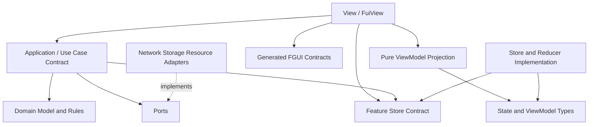

# 轻量 DDD、Store 数据流与 MVVM UI 架构

本文面向项目开发者与 AI agent，定义静态 FairyGUI 页面采用「轻量 DDD 模块化 + Store 单向数据流 + MVVM UI + FGUI 自动绑定」时必须遵守的职责、依赖、运行时与质量门禁。

本文是长期架构总览，不替代具体实现 ADR。既有决策以 [ADR-003](../decisions/ADR-003-hybrid-architecture.md)、[ADR-007](../decisions/ADR-007-typed-errors-and-scoped-events.md)、[ADR-019](../decisions/ADR-019-view-model-rendering-kernel-boundary-extension.md)、[ADR-027](../decisions/ADR-027-event-driven-presentation.md)、[ADR-029](../decisions/ADR-029-global-time-control-animation-time-source.md) 和 [ADR-032](../decisions/ADR-032-store-data-flow-fuiview-binding.md) 为准。

## 1. 目标与非目标

### 1.1 目标

- 按业务能力组织模块，保持依赖方向显式、领域规则与 IO 分离。
- 以 Feature Store 管理静态页面或功能作用域状态，通过单向数据流驱动 UI。
- 以纯 ViewModel 投影隔离业务状态与 UI 展示形状。
- 通过 FGUI 生成类型、装饰器元数据和 Adapter 接缝减少手写节点查找与字符串错误。
- 让 Domain、Use Case、reducer、投影和绑定链可分别测试。
- 为开发者与 AI 提供可机械检查的允许项、禁止项和完成清单。

### 1.2 非目标

- 不为全部玩法强制 Aggregate、Domain Event、Repository 等完整战术 DDD。
- 不引入全局 EventBus、字符串业务事件中心或 Service Locator。
- 不引入双向绑定、有状态 ViewModel 框架或第三方 Store 运行时依赖。
- 不生成 Domain、Use Case、Store、ViewModel 或业务 View 代码。
- 不强制迁移存量页面和动态实例页面。
- 不让 FGUI XML、发布产物或 Adapter 承载业务规则。

## 2. 术语

### 2.1 轻量 DDD

本文中的轻量 DDD 只要求：

- 按业务能力划分 Feature 边界。
- 领域模型与规则保持纯净，不依赖 UI、引擎和基础设施。
- 应用编排与领域规则分离。
- 外部能力通过窄端口注入。
- 复杂 Feature 可按需引入 Entity、Value Object 或 Domain Service，但不是统一模板要求。

玩法内部仍遵守 ADR-003 的 Hybrid Architecture，可根据真实需求选择 OOP、ECS、状态机、Command 或数据驱动模型。

### 2.2 Store

本文的 Store 指 `createStore(reducer, initialState)` 创建的 reducer 状态容器，提供 `getState`、`dispatch`、`subscribe` 和 `dispose`。

它不等同于 `LineupStore`、`IdleRewardsStore` 一类持久化仓储。持久化仓储属于 Adapter 或端口实现，应按具体语义命名为 Repository、Storage 或业务专名，避免与 Feature Store 混淆。

### 2.3 ViewModel

ViewModel 是 State 到 UI 所需数据的纯数据形状与纯投影函数：

- 不持有 FGUI 节点。
- 不持有 Store。
- 不访问网络、存储、时钟或随机数。
- 不保存业务状态。
- 不承担双向绑定。

元件名到能力接口的映射由 `gen-types` 产物与 `FuiViewHost` 管理，不属于 ViewModel 职责。

### 2.4 UI 状态与业务状态

- 业务可观察、需要在页面刷新间保持一致的功能状态进入 Feature Store，例如加载状态、选中项、提交结果和可恢复错误。
- 仅影响单个组件瞬时表现的状态留在 View 或动画器，例如 hover、按压态和逐帧动画进度。
- 动画中间帧不得写入 Store。

## 3. 分层与依赖方向

下图只表示静态代码依赖，箭头含义为“源端依赖目标端”；运行时状态流见第 5 节。



依赖约束：

- Domain 不依赖 Application、Store、View、FGUI、Cocos 或 Adapter。
- Application 可依赖 Domain、端口契约和 Feature Store 契约，不依赖 FGUI 节点。
- Store 不调用 View、Adapter 或 Use Case；reducer 不执行副作用。
- View 只经框架根入口消费稳定契约，不导入 `fairygui-cc` 或 `cc`。
- Adapter 实现端口并隔离外部技术类型，业务层不反向依赖 Adapter 实现。
- 组合根显式创建 Store、Use Case 和端口实现：端口实现只注入 Use Case，页面只接收 Store 与 Use Case/Application facade。页面依赖经类型安全的装配接缝注入，不通过 Context 或全局对象解析业务服务。当前绑定 Host 尚未提供该接缝，采用业务 Use Case 的新页面须先满足配套治理文档中的落地门禁。

## 4. 各层职责

### 4.1 Domain

负责：

- 领域模型、值对象和业务不变量。
- 确定性的业务计算与状态转换规则。
- 与技术实现无关的领域错误。

禁止：

- UI、Store、网络、存储和引擎 API。
- 全局可变状态。
- 读取真实时钟、随机数或环境变量；这些值必须作为参数或窄契约注入。

### 4.2 Application / Use Case

负责：

- 表达并编排一次用户意图或系统用例。
- 调用 Domain 与网络、存储、资源等端口。
- 管理异步、取消、竞态、重试边界和错误映射。
- 将执行结果转换为成功或失败 Action 并 dispatch。

禁止：

- 直接读写 FGUI 节点。
- 长期持有页面组件引用。
- 把应由 Domain 保证的业务规则写成过程式 UI 编排。
- 绕过 Store 直接把业务结果写入 View。

### 4.3 Feature Store

负责：

- 持有页面或功能作用域 State。
- 同步执行纯 reducer。
- 通过实例级 `subscribe` 通知订阅者。
- 随 Module 或页面作用域创建与释放。

禁止：

- IO、Promise reducer、网络、存储和资源加载。
- 在 reducer 中读取时钟、随机数或外部可变状态。
- 跨 Store 隐式修改或充当业务调用中心。
- 直接调用 View。

### 4.4 ViewModel

负责：

- 将 Store State 投影为 UI 直接可消费的字段。
- 格式化文案、显隐、进度和展示状态。
- 隐藏领域数据结构与 UI 展示结构之间的差异。

ViewModel 投影必须是纯函数，可独立快照或断言测试。

### 4.5 View / FuiView

负责：

- 显示 ViewModel。
- 读取用户输入并触发 UI 事件。
- 调用组合根注入的 Use Case。
- 控制局部 UI 状态和呈现意图。
- 建立和释放 Store 订阅、点击监听与动画器。

允许纯 UI 行为直接 dispatch 页面 Action，例如隐藏页面内部弹层、切换页签或更新本地输入状态。关闭导航栈中的页面会触发生命周期与资源释放，必须调用注入的导航或 Application 接缝。涉及领域规则、网络、存储、资源或跨模块协作的业务意图必须调用 Use Case。

禁止：

- 直接修改 Domain Model。
- 直接访问网络、存储或资源服务。
- 实现业务规则。
- 保存长期业务状态。
- 解析基础设施异常或执行双向绑定。

### 4.6 Adapter 与 FGUI

Adapter 负责实现网络、存储、资源和引擎端口。FGUI 只负责 UI 资源结构与视觉配置：

- FGUI XML 不承载业务规则、业务状态和网络行为。
- `fairygui-cc` 类型只存在于 Cocos Adapter 边界。
- `FuiViewHost` 创建真实组件、包装能力节点、注入字段并注册点击。
- 绑定缺失在开发期 fail-fast，不静默降级。

## 5. 单向数据流

### 5.1 纯 UI 交互

```text
@FClick / 输入读取
  -> dispatch(UiAction)
  -> reducer
  -> 新 State
  -> project(State)
  -> FuiView.onState(ViewModel)
  -> 写能力接口字段
```

### 5.2 业务用例

```text
@FClick / 输入读取
  -> Use Case
  -> Domain + Ports
  -> dispatch(SuccessAction | FailureAction)
  -> reducer
  -> 新 State
  -> project(State)
  -> FuiView.onState(ViewModel)
```

规则：

- `dispatch` 和 reducer 始终同步。
- `Store.subscribe` 是 Store 到 View 的唯一常规变化通知路径。
- `bindStore` 建立订阅后立即执行首次投影。
- 输入值仅在构造 UI Action 或 Use Case 参数时读取，不作为反向绑定数据源。
- MVP 默认每次投影全量写字段；出现真实性能问题后才能引入 VM 浅比较或字段 diff。
- 当前 Store 同步遍历订阅者，未定义队列化重入或处理器失败隔离；订阅者与 `onState` 必须保持无异常、不得在通知期间再次 dispatch。需要重入或隔离语义时必须通过独立 OpenSpec change 修改契约与测试。

## 6. 事件与跨模块通信

不设置独立 EventBus 负责 Store 到 View 通知，也不建立全局业务事件中心。

跨模块通信按以下顺序选择：

1. 显式调用 Use Case 或窄端口。
2. 通过 Store 表达需要持久观察的状态。
3. 只有真正的一次性广播才使用 `ScopedEventChannel`，并要求类型化、作用域化、可释放和处理器失败隔离。

事件不得复制 Store 状态，也不得用于隐藏模块依赖或串联业务工作流。

## 7. 异步、并发与错误

### 7.1 异步边界

- Promise、网络、存储和资源加载只存在于 Use Case 或 Adapter。
- Use Case 完成后以成功或失败 Action 收敛回 Store。
- 每个异步用例必须持有明确的请求代次或取消句柄；Adapter 返回的请求、资源或取消句柄由用例作用域释放，Adapter 实例由组合根或 Module 所有者释放。不可取消操作在完成时检查作用域与 `requestId` 是否仍有效。
- 页面关闭时先取消页面作用域异步，再释放 View；仅当 Store 归属该页面时才同时释放 Store。
- 页面关闭后返回的异步结果不得 dispatch 到已失效的页面作用域或已释放 Store。

### 7.2 默认并发策略

同一查询型用例默认采用 latest-wins：

- State 保存当前 `requestId`。
- Use Case 返回结果时携带 `requestId`。
- reducer 忽略过期响应，防止旧结果覆盖新状态。

需要队列、合并、幂等提交或不可取消写入的用例必须在用例契约中单独声明，不把并发策略隐藏在 View 中。

### 7.3 错误处理

- 预期业务失败使用领域结果、判别联合或失败 Action 表达。
- 框架和基础设施错误继承 `FrameworkError`，显式声明 recoverable 分类并保留 `cause`。
- Use Case 将底层错误映射为 UI 可理解的状态或错误码。
- View 只显示投影后的错误信息，不解析底层异常类型。
- 绑定节点缺失、重复组件注册和生成产物过期属于开发期错误，应 fail-fast。
- 当前 FUI 绑定错误仍有普通 `Error` 实现，这是 ADR-007 的已知缺口；新增或修改绑定错误时必须收敛到 `FrameworkError`，不得把现状当作新先例。

## 8. 生命周期

页面作用域 Store 的关闭顺序：

```text
创建页面 Store、Use Case 与异步作用域
  -> 创建并 attach FuiView
  -> bindStore 首次投影
  -> 页面运行
  -> 取消页面异步作用域
  -> FuiView.dispose
  -> Store.dispose
```

Module 作用域 Store 的顺序：

```text
Module.start 创建 Store 与 Use Case
  -> 页面打开时 attach FuiView 并订阅共享 Store
  -> 页面关闭时取消页面异步并 FuiView.dispose，不释放 Store
  -> Module.stop 内取消 Module 异步并 Store.dispose
```

要求：

- Store 不是全局单例，所有权在创建时固定为 Feature Module 或页面作用域；页面不得释放 Module 共享 Store。
- `FuiView.dispose` 必须幂等，并退订 Store、移除输入监听、停止动画器和执行关闭清理。
- GComponent 销毁必须级联释放绑定的 FuiView。
- 页面、FGUI package 和 Bundle 按所有权逆序释放。
- Use Case 的取消句柄和 Adapter 资源必须归属明确作用域。
- 清理必须逐项尝试并聚合或上报错误，单个退订、动画器或资源释放失败不得阻断后续项。当前 `FuiView.dispose` 和 Host 的 GComponent 级联销毁尚未完整隔离异常，业务页面不得注册会抛错的清理函数；框架级修复须走独立 OpenSpec change。

## 9. FGUI 绑定与工程治理

FGUI 自动绑定、生成物边界、推荐 Feature 目录、双轨共存、测试矩阵和开发检查清单见 [FGUI MVVM 绑定与质量门禁](./fgui-mvvm-binding-governance.md)。

核心约束不变：

- FGUI XML 只描述 UI 资源，生成器只生成外部契约，业务层不导入引擎类型。
- 新静态页使用 FuiView + Feature Store；动态实例页与存量页继续使用 `ViewModelRenderer`。
- 新增能力必须保持 Domain 纯净、Application 显式编排、Store 同步和 Adapter 隔离。
- 新架构决策走独立 OpenSpec change，并同步 ADR 与本架构文档。
