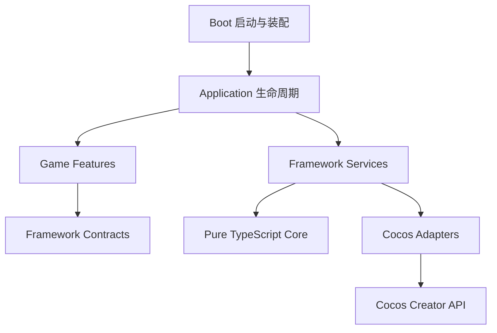

# 输入
你现在作为我的游戏架构导师和高级Cocos架构师。

请先不要写任何代码。

请分析当前Cocos工程：
1. 当前工程结构
2. Cocos版本和技术栈
3. 已有目录职责
4. 适合构建通用2D游戏框架的改造方案
5. 目前工程中不应该修改的部分

输出一份工程分析报告。

# Cocos 工程分析报告

## 一、结论摘要

当前工程是一个**刚初始化的 Cocos Creator 2D 项目骨架**：

- 使用 Cocos Creator **3.8.8**
- 仅有一个空白启动场景
- 没有 TypeScript 业务代码、Prefab、测试或第三方依赖
- `framework`、游戏业务、资源管理等架构尚未实现
- 已预留 `boot / framwork / game / resources` 目录
- 已接入 OpenSpec，但当前没有 proposal、spec 或 change
- 很适合在业务代码进入前建立通用 2D 框架

当前最大的优势是工程足够干净，可以低成本建立正确的依赖方向。

---

# 1. 当前工程结构

```text
D:\ai-work\ai-game-kit
├─ assets
│  ├─ boot
│  │  └─ startup.scene
│  ├─ framwork
│  ├─ game
│  └─ resources
├─ settings
│  └─ v2\packages
├─ profiles
│  └─ v2
├─ library
├─ temp
├─ doc
├─ openspec
├─ .creator
├─ .codex
├─ .cursor
├─ .qoder
├─ package.json
├─ tsconfig.json
├─ NOTE.md
└─ .gitignore
```

## 实际资源统计

| 类型 | 数量 |
|---|---:|
| TypeScript 脚本 | 0 |
| Prefab | 0 |
| Scene | 1 |
| 自定义脚本组件 | 0 |
| 第三方 npm 依赖 | 0 |
| OpenSpec change | 0 |

工程中唯一的有效资产内容是：

`D:\ai-work\ai-game-kit\assets\boot\startup.scene`

---

# 2. Cocos 版本和技术栈

## 2.1 Cocos Creator

版本由以下文件确认：

`D:\ai-work\ai-game-kit\package.json`

```text
Cocos Creator 3.8.8
```

本地编辑器路径为：

`D:\engine\cocos\Creator\3.8.8`

项目 UUID：

```text
19d7063b-ca20-465f-8dff-de141c0f4605
```

## 2.2 TypeScript 配置

配置文件：

`D:\ai-work\ai-game-kit\tsconfig.json`

当前特征：

- TypeScript
- ES2015 target
- ES2015 module
- Node module resolution
- 启用 decorators
- `isolatedModules: true`
- `noEmit: true`
- 类型声明由 Cocos 在 `temp` 中生成
- `strict: false`

需要特别注意：Cocos 生成的基础配置原本启用了 `strict: true`，但项目根配置将其覆盖为 `false`。

对于通用框架项目，建议在正式开发前恢复严格类型。越晚开启，迁移成本越高。

## 2.3 已启用引擎能力

配置来源：

`D:\ai-work\ai-game-kit\settings\v2\packages\engine.json`

### 核心 2D 能力

- 2D 渲染
- UI
- RichText
- Mask
- Graphics
- Tween
- Animation
- Particle 2D
- TiledMap
- 2D 相交检测
- 2D 物理

### 物理

当前选择：

```text
Box2D 2D Physics
```

编辑器日志确认运行时从 builtin 切换到了 Box2D。

### 骨骼动画

当前启用：

- Spine 3.8
- DragonBones

Spine 4.2 未启用。

### 渲染

- WebGL：启用
- WebGL2：启用
- WebGPU：关闭
- Custom Pipeline：启用
- Legacy Pipeline：关闭
- 3D 模块：关闭

### 其他已启用模块

- Audio
- Video
- WebView
- Profiler

### 当前没有启用

- 3D
- 3D Physics
- WebSocket
- XR
- Terrain
- Light Probe
- 3D Particle

目前模块配置明显偏向通用 2D 项目，但 `Video`、`WebView`、`Spine`、`DragonBones` 是否全部需要，仍应根据目标游戏决定。现在不建议为了减包而提前调整。

## 2.4 工具与工程化状态

当前不存在：

- npm scripts
- package lock
- lint 配置
- formatter 配置
- 单元测试框架
- 自动化构建脚本
- `extensions` 目录
- 原生工程
- 已输出的构建目录
- 明确的构建平台预设

因此目前还是“编辑器工程”，尚未形成完整工程化工具链。

---

# 3. 已有目录职责

## 3.1 `assets/boot`

路径：

`D:\ai-work\ai-game-kit\assets\boot`

当前包含唯一场景 `startup.scene`，应作为未来的启动层。

场景当前结构：

```text
startup
└─ Canvas
   └─ Camera
```

场景特征：

- Canvas：1280 × 720
- 自动适配屏幕
- 包含 Widget
- 使用正交 UI Camera
- 没有脚本组件
- 没有场景资源依赖
- 没有初始化、资源加载或场景切换逻辑

因此它目前只是**候选启动场景**，还不能视为已经实现的框架入口。

## 3.2 `assets/framwork`

路径：

`D:\ai-work\ai-game-kit\assets\framwork`

当前为空。

从命名判断，它是为通用框架预留的目录，但存在拼写错误：

```text
framwork
```

正确名称应为：

```text
framework
```

建议在加入脚本和资源之前，通过 Cocos Creator 资源管理器完成重命名。

## 3.3 `assets/game`

路径：

`D:\ai-work\ai-game-kit\assets\game`

当前为空。

适合承载：

- 具体游戏规则
- 玩法模块
- 游戏实体与数据
- 游戏流程
- 关卡逻辑
- 具体 UI 页面
- 业务配置

核心原则是：`framework` 不能反向依赖 `game`。

## 3.4 `assets/resources`

路径：

`D:\ai-work\ai-game-kit\assets\resources`

当前为空，但已被配置为 Asset Bundle：

```text
bundleName: resources
priority: 8
isBundle: true
```

这个目录同时具有 Cocos `resources` 特殊加载语义，容易逐渐演变成所有资源都往里面放的“公共垃圾桶”。

建议未来只保留极少量启动期资源，例如：

- 启动配置
- Bundle 清单
- 最小加载界面资源
- 必须同步获得的默认资源

大型 UI、音频、关卡和玩法资源应使用独立 Asset Bundle。

## 3.5 `settings`

路径：

`D:\ai-work\ai-game-kit\settings`

这是需要提交到 Git 的 Cocos 项目级设置，包括：

- 引擎模块
- 构建器设置
- 项目信息
- 设备设置
- Cocos 服务设置

它属于工程配置，不属于框架业务代码。

## 3.6 `profiles`

路径：

`D:\ai-work\ai-game-kit\profiles`

属于编辑器、本机或用户配置，已经被 `.gitignore` 排除。

不应把它作为团队共享配置或框架实现的一部分。

## 3.7 `library` 与 `temp`

路径：

- `D:\ai-work\ai-game-kit\library`
- `D:\ai-work\ai-game-kit\temp`

都是 Cocos 自动生成内容：

- 导入缓存
- 资源数据库
- 临时类型声明
- 编译缓存
- 编辑器运行状态
- 当前打开场景
- 日志

两者都已被 Git 忽略。

## 3.8 `openspec`

路径：

`D:\ai-work\ai-game-kit\openspec`

OpenSpec 已初始化，但当前：

- 没有 active change
- 没有 specs
- 没有已归档 change
- `config.yaml` 仍是默认模板

后续框架建设适合先形成 OpenSpec change，再逐步实现。

## 3.9 `.codex / .cursor / .qoder`

这些目录保存 OpenSpec 对不同 AI 工具的命令和 skill 集成。

它们属于 AI 开发工作流，不是游戏运行时的一部分，也不会进入 Cocos 构建产物。

---

# 4. 通用 2D 游戏框架改造方案

## 4.1 推荐依赖方向



约束：

1. `boot` 负责装配，不负责具体玩法。
2. `game` 可以依赖框架接口。
3. `framework` 不得导入 `game`。
4. 纯逻辑层不直接依赖 `cc`。
5. 所有全局生命周期由一个应用根节点统一管理。

## 4.2 推荐目录模型

```text
assets
├─ boot
│  ├─ scenes
│  └─ scripts
├─ framework
│  ├─ core
│  ├─ contracts
│  ├─ application
│  ├─ cocos
│  ├─ resource
│  ├─ scene
│  ├─ ui
│  ├─ audio
│  ├─ storage
│  ├─ platform
│  └─ diagnostics
├─ game
│  ├─ domain
│  ├─ features
│  ├─ flow
│  ├─ config
│  └─ presentation
└─ bundles
   ├─ common
   ├─ ui
   ├─ audio
   └─ game-content
```

不建议一开始就把每个目录都实现成大型系统，应根据第一个实际游戏需求逐步落地。

## 4.3 启动流程

建议将唯一启动场景保持得非常轻：

```text
startup.scene
    ↓
AppRoot
    ↓
初始化日志与运行环境
    ↓
初始化平台、存储和配置
    ↓
初始化资源、音频和 UI 服务
    ↓
加载游戏入口 Bundle
    ↓
进入具体游戏流程
```

`AppRoot` 可以作为唯一常驻节点。避免每个 Manager 都自行创建常驻节点和全局单例。

## 4.4 首批框架能力

### 第一优先级

- 应用生命周期
- 资源与 Asset Bundle 管理
- 场景切换
- UI 层级和页面栈
- 音频管理
- 配置读取
- 本地存档
- 日志与错误处理
- 平台抽象

### 第二优先级

- 类型化事件系统
- 对象池
- 计时和调度
- 状态机
- 加载进度与重试
- 多语言
- 调试面板

### 按游戏需要引入

- 网络层
- 热更新
- ECS
- 行为树
- 战斗数值框架
- 红点系统
- 复杂消息总线
- 数据绑定框架

不建议在没有真实用例时提前实现这些系统。

## 4.5 资源策略

建议采用 Bundle-first，而不是全部放进 `resources`：

| Bundle | 内容 |
|---|---|
| boot | 启动所需最小内容 |
| common | 通用图集、字体、材质 |
| ui | UI 页面和弹窗 |
| audio | 音效和音乐 |
| game-content | 关卡、角色、玩法资源 |

资源服务至少需要统一管理：

- Bundle 加载和卸载
- 资源引用关系
- 重复加载
- 生命周期
- 场景切换释放策略
- 加载失败和重试
- 预加载与按需加载

不要简单封装一个全局 `load()` 就称为资源管理器。

## 4.6 UI 架构

建议明确分层：

```text
Scene Layer
Normal UI Layer
Popup Layer
Guide Layer
Toast Layer
Loading Layer
System Layer
```

框架负责：

- 打开和关闭
- 层级
- 页面栈
- 遮罩
- 输入阻断
- 生命周期
- 资源释放

具体页面行为留在 `game`，避免框架知道“大厅”“战斗结算”等业务概念。

## 4.7 TypeScript 和质量基线

建议在业务开发前完成：

1. 将项目恢复为 strict TypeScript。
2. 纯逻辑层避免直接导入 `cc`。
3. 为纯逻辑层建立单元测试。
4. 保留少量 Cocos 集成冒烟测试。
5. 建立至少一个 Web 构建验证。
6. 确定首批目标平台后再裁剪引擎模块。

---

# 5. 当前工程中不应该修改的部分

## 5.1 禁止手工修改的生成目录

不要手工维护：

- `D:\ai-work\ai-game-kit\library`
- `D:\ai-work\ai-game-kit\temp`
- `D:\ai-work\ai-game-kit\profiles`

出现缓存问题时应让 Cocos 重新生成，而不是把对这些目录的修改当成正式修复。

## 5.2 不要直接编辑序列化场景

避免用文本编辑方式修改：

`D:\ai-work\ai-game-kit\assets\boot\startup.scene`

场景、Prefab 和组件引用应通过 Cocos Creator 编辑器操作，否则容易破坏 UUID 和序列化引用。

## 5.3 不要随意修改或重建 `.meta`

需要保护：

- `D:\ai-work\ai-game-kit\assets\boot.meta`
- `D:\ai-work\ai-game-kit\assets\framwork.meta`
- `D:\ai-work\ai-game-kit\assets\game.meta`
- `D:\ai-work\ai-game-kit\assets\resources.meta`
- `D:\ai-work\ai-game-kit\assets\boot\startup.scene.meta`

目录移动、重命名应优先在 Cocos Creator 中完成。不能随意删除 `.meta` 后重新生成，否则 UUID 变化会破坏引用。

## 5.4 不要修改项目身份字段

不应为了架构改造而修改：

`D:\ai-work\ai-game-kit\package.json`

其中的：

- 项目 UUID
- Creator 版本

Creator 升级应作为独立变更执行，不能和框架建设混在一起。

## 5.5 不要修改生成 tsconfig 的继承关系

`D:\ai-work\ai-game-kit\tsconfig.json` 中：

```text
extends: ./temp/tsconfig.cocos.json
```

该字段有明确的 Cocos 注释要求，不应修改。

可以有计划地修改项目自己的 `compilerOptions`，例如恢复 `strict`，但不要直接编辑：

`D:\ai-work\ai-game-kit\temp\tsconfig.cocos.json`

## 5.6 暂时不要裁剪引擎模块

当前不应马上关闭 Spine、DragonBones、Video、WebView 或 Physics 等模块。

应先确定：

- 目标游戏类型
- 发布平台
- 动画方案
- 物理需求
- 包体限制

再通过 Cocos 编辑器修改模块配置并执行完整构建验证。

## 5.7 不要将 AI 工具目录当成运行时框架

以下目录不应被游戏代码引用：

- `D:\ai-work\ai-game-kit\.codex`
- `D:\ai-work\ai-game-kit\.cursor`
- `D:\ai-work\ai-game-kit\.qoder`
- `D:\ai-work\ai-game-kit\openspec`

它们只服务于开发流程。

---

# 综合评价

当前工程处于非常早期的初始化阶段，尚不存在需要迁移的历史架构负担。推荐顺序是：

1. 确定目标平台和首个游戏类型。
2. 将 `framwork` 通过编辑器重命名为 `framework`。
3. 确定框架与游戏层的依赖规则。
4. 建立轻量启动链路。
5. 优先实现资源、场景、UI、音频和存档。
6. 将 `resources` 控制在最小范围，采用 Asset Bundle 分包。
7. 恢复 strict TypeScript。
8. 通过 OpenSpec 创建正式框架建设 proposal 后再进入编码。

本次为只读分析，没有修改任何文件。最终检查 Git 工作区为干净状态：`master` 分支，无未提交变更。